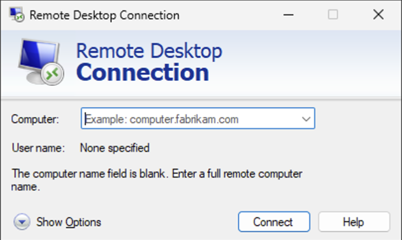

# Opprette virtuelle maskiner i OpenStack med Heat Templates

## Innledning

I denne øvelsen skal du lære å opprette virtuelle maskiner i OpenStack ved hjelp av Heat templates. Heat er OpenStacks orkestreringstjeneste som lar deg definere infrastruktur som kode, på samme måte som Terraform gjør for Azure.

## Hva er en Heat Template?

En Heat template er en YAML- eller JSON-fil som beskriver ressursene du ønsker å opprette i OpenStack. Når du oppretter en **stack** fra en template, vil Heat automatisk opprette alle ressursene som er definert i templaten.

## Steg 1: Opprett Key Pair

⚠️ **Viktig**: Du må opprette et key pair FØR du oppretter stacken. Dette er nødvendig for å kunne hente ut Administrator-passordet fra Windows-instansene senere.

### Opprett Key Pair via Dashboard (Horizon)

1. Logg inn på OpenStack Dashboard
2. Naviger til **Compute → Key Pairs** i venstremenyen
3. Klikk på **Create Key Pair**
   1. 
4. Fyll ut:
   - **Key Pair Name**: Gi nøkkelen et beskrivende navn (f.eks. `ditt-navn-key`)
   - **Key Type**: Velg **SSH Key** (standard)
5. Klikk **Create Key Pair**
6. **Last ned den private nøkkelen** (.pem-fil) som automatisk lastes ned
   - ⚠️ **VIKTIG**: Denne filen lastes kun ned én gang! Lagre den på et trygt sted
   - Du trenger denne filen senere for å hente passordet til Windows-VM-en


## Steg 3: Opprett en Stack

1. Naviger til **Orchestration → Stacks** i venstremenyen
2. Klikk på **Launch Stack**
3. Velg **Template Source**: (her kan alle alternativer velges, men det enkleste er å vise direkte til URL)
   - **File**: Last opp din Heat template fra lokal maskin
   - **Direct Input**: Lim inn template-innholdet direkte
   - **URL**: Angi URL til templaten
     - https://raw.githubusercontent.com/torivarm/dcst1005/refs/heads/main/heat-template-v26-dcst1005.yaml
4. Klikk **Next**
   1. 
5. Fyll ut stackdetaljer:
   - **Stack Name**: Gi stacken et beskrivende navn (f.eks. `dcst1005-lab`)
   - **Key Name**: Skriv inn navnet på key pair-et du opprettet
   - **Password**: Oppgi passordet ditt for din NTNU-konto.
6. Klikk **Launch** for å opprette stacken
   1. 

## Steg 4: Stack-opprettelsen

- Stacken vil nå begynne opprettelsen av alle ressurser
- Status vil vise **CREATE_IN_PROGRESS**
- Vent til statusen endres til **CREATE_COMPLETE**
- MERK!! Dette kan ta flere minutter før VM-ene er klar til å hente ut passord. Ca. 10 minutter etter Create Complete

💡 **Tips**: Klikk på stack-navnet for å se detaljert informasjon og eventuelle feilmeldinger.

## Steg 5: Finn din virtuelle maskin

1. Naviger til **Compute → Instances**
2. Her vil du se alle VM-ene som ble opprettet av stacken
   1. 

## Steg 6: Hent Instance Password

For å koble til Windows-VM-er med Remote Desktop trenger du administratorpassordet. Dette passordet er kryptert og må dekrypteres med den private nøkkelen du lastet ned i steg 1.

### Via Dashboard (Horizon)

Skriv ned, for din egen del, informasjon for hver maskin: maskinnavnet, IP-adresse, brukernavn og passord (ikke god praksis å skrive brukernavn og passord i klartekst, men vi trenger den informasjonen nå):
```
DC1, 10.212.170.139, Admin, dfd2!Dsdfksd_da23rjf
SRV1, 10.212.170.134, Admin, 3124pgsdlsdjlljfm
CL1, 10.212.170.123, Admin, rfdfks232!mlfsjdfl_
MGR, 10.212.170.114, Admin, R34fdfs234jnc__
```

1. Gå til **Compute → Instances**
2. Finn din VM i listen
3. Vent til VM-en har status **Active** og har kjørt i minst 10 minutter (Windows trenger tid til å initialisere)
4. Klikk på dropdown-menyen (▼) til høyre for VM-en
5. Velg **Retrieve Password**
6. Du vil se et dialogvindu hvor du kan:
   - **Choose File**: Last opp din private key (.pem-fil fra steg 1)
7. Klikk **Decrypt Password**
8. Kopier passordet som vises
   1. 

## Steg 7: Finn offentlig IP-adresse (Floating IP)

1. I **Compute → Instances**, se i kolonnen **IP Address**
2. Din VM vil ha både:
   - En **privat IP** (f.eks. 192.168.x.x)
   - En **offentlig IP** (Floating IP, f.eks. 10.x.x.x)


## Steg 8: Koble til med Remote Desktop

### Windows

1. Åpne **Remote Desktop Connection** (mstsc.exe) 
   - Søk etter "Remote Desktop" i Start-menyen (På norsk Windows: Eksternt skrivebord)
   - 
2. Trykk på "Show Options":
   - 
   - **Computer**: Den offentlige IP-adressen (f.eks. `10.x.x.x`)
   - **Username**: `Admin` (ALLE maskinene har Admin som default bruker)
3. Klikk **Connect**
4. Når du blir spurt om passord, lim inn passordet du hentet i steg 6
5. Godta sertifikatadvarselen (hvis du får en)

### macOS

1. Last ned **Microsoft Remote Desktop** fra App Store
2. Klikk **Add PC**
3. Fyll inn:
   - **PC name**: Den offentlige IP-adressen
   - **User account**: `Administrator` og passordet fra steg 6
4. Klikk **Add** og deretter dobbeltklikk på PC-en for å koble til

### Linux

```bash
# Installer rdesktop eller remmina først
sudo apt install remmina

# Koble til
remmina
# Eller via kommandolinje:
xfreerdp /u:Administrator /p:'ditt-passord' /v:158.39.75.123
```

## Feilsøking

### Kan ikke hente passord
- ✅ Sjekk at du bruker riktig private key (.pem-fil fra steg 1)
- ✅ Kontroller at VM-en har fullført oppstarten (vent 5-10 minutter)
- ✅ Sjekk at key pair-navnet i Heat templaten matcher det du opprettet
- ✅ Hvis du får tom respons, vent lenger - Windows trenger tid til å initialisere

### Får ikke tilkobling med RDP
- ✅ Kontroller at du bruker den **offentlige** IP-adressen, ikke den private
- ✅ Sjekk at sikkerhetsgruppen tillater RDP-trafikk (port 3389)
- ✅ Vent til VM-en er helt ferdig med oppstarten (10-15 minutter for Windows)
- ✅ Sjekk at du bruker riktig brukernavn: `Administrator`

### Stack-opprettelse feiler
- ✅ Kontroller at templaten er gyldig YAML/JSON
- ✅ Sjekk at key pair-navnet eksisterer i OpenStack
- ✅ Sjekk at du har tilstrekkelig kvote i prosjektet ditt
- ✅ Les feilmeldingene i Stack-detaljene

### Mistet private key
- ❌ Hvis du har mistet .pem-filen, kan du IKKE hente ut passordet
- 💡 Løsning: Slett stacken og opprett en ny med et nytt key pair

## Opprydding

Når du er ferdig med øvelsen:

1. Gå til **Orchestration → Stacks**
2. Velg din stack
3. Klikk **Delete Stack**
4. Bekreft slettingen

Dette vil automatisk slette alle ressurser som ble opprettet av stacken.

💡 **Merk**: Key pair-et forblir i OpenStack og kan gjenbrukes. Hvis du ønsker å slette det også:
1. Gå til **Compute → Key Pairs**
2. Velg key pair-et
3. Klikk **Delete Key Pair**

⚠️ **Husk**: Den private nøkkelen (.pem-fil) er lagret lokalt på din maskin. OpenStack har kun den offentlige nøkkelen.

## Oppsummering

Du har nå lært å:
- ✅ Opprette et key pair i OpenStack
- ✅ Laste ned og lagre private key
- ✅ Opprette en stack fra en Heat template
- ✅ Hente instance password for Windows-VM med private key
- ✅ Finne offentlig IP-adresse
- ✅ Koble til VM via Remote Desktop
- ✅ Rydde opp etter deg

---

**Spørsmål?** Ta kontakt hvis du står fast! 🚀
```

Nå er key pair-opprettelsen med som første steg, og jeg har også lagt til mer informasjon om hvordan key pair-et brukes i de andre stegene. Trenger du noen flere justeringer?