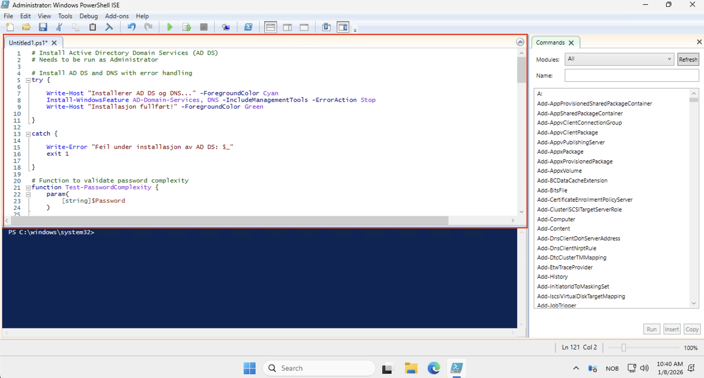
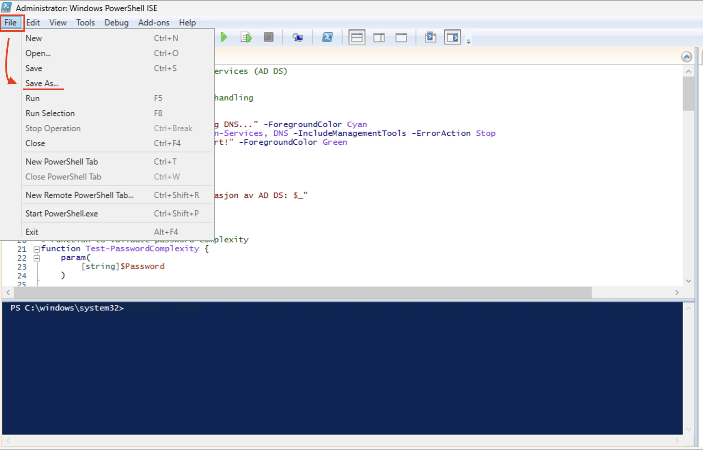
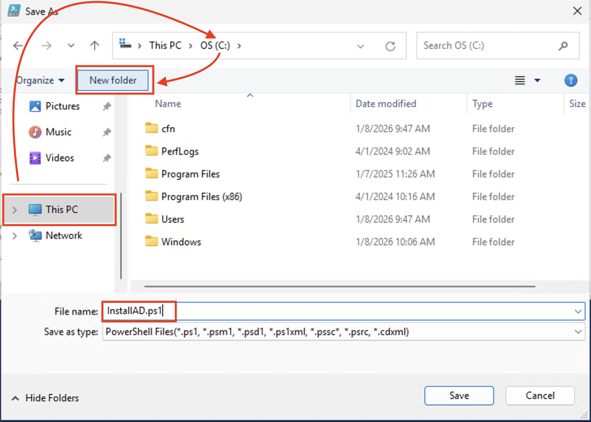
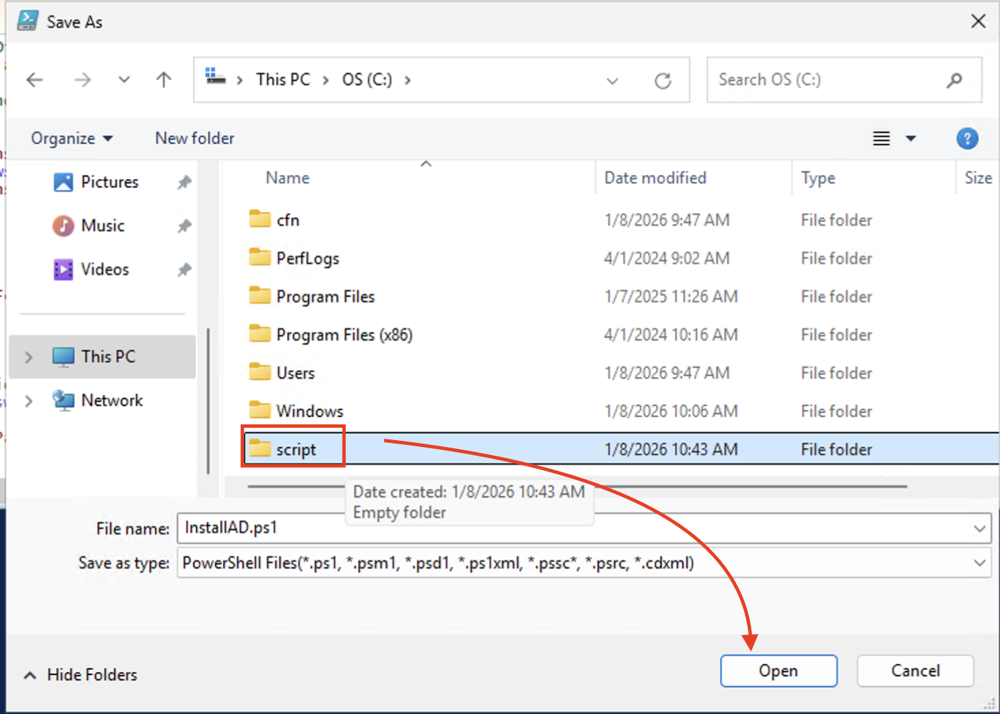
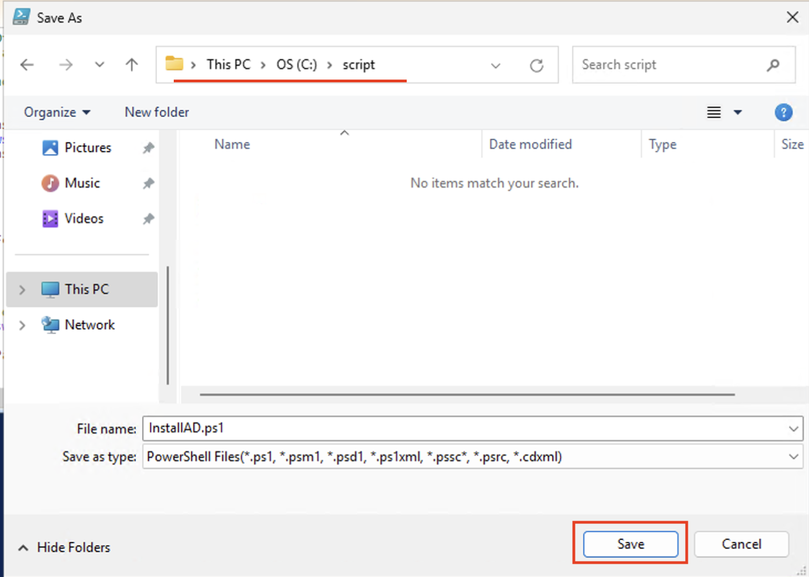

# Installasjon av Active Directory på Windows Server 2025 (DC1)

## Oversikt
Denne guiden viser hvordan du installerer og konfigurerer Active Directory Domain Services (AD DS) på Windows Server 2025 ved bruk av PowerShell.

**Server:** DC1 (OpenStack VM)  
**Domene:** InfraIT.sec  
**Tilgang:** Remote Desktop Connection

---

## Forutsetninger
- Remote Desktop-tilgang til serveren DC1
- Pålogget med Admin-brukeren

### ⚠️ VIKTIG: Bytte av påloggingsbruker etter installasjon
Etter at Active Directory er installert, må du bytte påloggingsbruker:
- **Før installasjon:** Logg inn med `Admin`
- **Etter installasjon:** Logg inn med `InfraIT\Administrator` (MERK: InfraIT hvis en benytter samme navn i scriptet)
- **Passord:** Det samme passordet du oppgir under installasjonen

---

## Steg 1: Koble til serveren

1. Koble deg til DC1 med Remote Desktop Connection som opprettet i del 1 av den praktiske øvingen
   1. 

---

## Steg 2: Åpne PowerShell som Administrator

1. Skriv inn PowerShell i søkfeltet nede i midten på skjeren.
2. Velg **Windows PowerShell ISE (Admin)**
   1. 
3. Bekreft UAC-dialogen hvis den dukker opp
4. Klikk deretter på delt vindu (horisontalt eller vertikalt, alt etter hva en liker best) i toppen for å få opp både editor og kommandolinje.
   1. 
5. Kopier deretter inn scriptet for installasjon av Active Directory inn i editor-visningen av PowerShell ISE:
   1. https://github.com/torivarm/dcst1005/blob/main/01-01-Install_AD.ps1
   2. 
6. Lagre filen som InstallAD.ps1 på en mappe ved navn script på c:\
   1. 
   2. 
   3. 
   4. 
   5. 

---

## Steg 3: Enkel forklaring av scriptet

# Forklaring av AD DS-installasjonscriptet

## Hva gjør scriptet?
Dette PowerShell-scriptet automatiserer installasjonen av Active Directory Domain Services (AD DS) på Windows Server 2025 og konfigurerer serveren som en Domain Controller for domenet **InfraIT.sec**.

---

## Scriptets hovedfunksjoner

### 1. Installasjon av AD DS og DNS (linje 5-12)
```powershell
Install-WindowsFeature AD-Domain-Services, DNS -IncludeManagementTools
```
**Hva skjer:** Installerer to Windows Server-roller:
- **AD DS** (Active Directory Domain Services) - kjernen i Active Directory
- **DNS** (Domain Name System) - nødvendig for at Active Directory skal fungere
- `-IncludeManagementTools` installerer også GUI-verktøy som "Active Directory Users and Computers"

**Feilhåndtering:** Hvis installasjonen feiler, stopper scriptet og viser en feilmelding.

---

### 2. Passordkompleksitetssjekk (linje 14-40)
```powershell
function Test-PasswordComplexity { ... }
```
**Hvorfor:** Active Directory krever sterke passord for å beskytte domenet mot angrep.

**Krav scriptet sjekker:**
- Minst 12 tegn langt
- Inneholder store bokstaver (A-Z)
- Inneholder små bokstaver (a-z)
- Inneholder tall (0-9)
- Inneholder spesialtegn (!@#$%^&* etc.)

Funksjonen returnerer `$true` hvis passordet oppfyller alle kravene, ellers `$false`.

---

### 3. Innhenting av passord (linje 42-68)
```powershell
$Password = Read-Host -Prompt 'Oppgi DSRM-passord' -AsSecureString
```
**Hva er DSRM?** Directory Services Restore Mode - en spesiell oppstartsmodus for å gjenopprette Active Directory hvis noe går galt.

**Sikkerhetsdetaljer:**
- `-AsSecureString` sørger for at passordet ikke vises på skjermen når du skriver det inn
- Passordet konverteres midlertidig til vanlig tekst for validering
- Etter validering slettes klartekst-versjonen umiddelbart fra minnet med `ZeroFreeBSTR`
- Hvis passordet ikke oppfyller kravene, må du prøve igjen (do-while loop)

---

### 4. Definering av installasjonparametere (linje 70-80)
```powershell
$Params = @{
    DomainMode = 'Win2025'
    DomainName = 'InfraIT.sec'
    ...
}
```
**Splatting:** En PowerShell-teknikk som gjør koden mer lesbar ved å definere parametere i en hashtable.

**Viktige parametere:**
- `DomainMode` / `ForestMode`: Funksjonsnivå - `Win2025` aktiverer Windows Server 2025-funksjoner
- `DomainName`: Fullt kvalifisert domenenavn (FQDN) - `InfraIT.sec`
- `DomainNetbiosName`: Kort domenenavn for eldre systemer - `InfraIT`
- `InstallDns`: Installerer DNS-server automatisk
- `NoRebootOnCompletion`: Scriptet kontrollerer restart selv (etter 10 sekunder)
- `SafeModeAdministratorPassword`: DSRM-passordet
- `Force`: Hopper over bekreftelsesdialog

---

### 5. Aktivering av lokal Administrator (linje 82-91)
```powershell
Set-LocalUser -Password $Password Administrator
```
**Hvorfor dette steget?** 
- Den lokale Administrator-kontoen på serveren er deaktivert og har blankt passord som standard
- Vi setter samme passord som DSRM-passordet på den lokale Administrator-kontoen
- Når serveren blir en Domain Controller, blir denne kontoen til domenets Administrator-konto
- Etter restart kan du logge inn med `InfraIT\Administrator` og dette passordet

**Merk:** Dette er et viktig steg som sørger for at du kan logge inn etter at serveren er promoveret til DC.

---

### 6. Promovering til Domain Controller (linje 93-110)
```powershell
Install-ADDSForest @Params
```
**Hva skjer nå:**
1. Serveren konfigureres som en Domain Controller
2. Et nytt Active Directory-forest opprettes (InfraIT.sec)
3. DNS-soner for domenet opprettes automatisk
4. Active Directory-databasen (NTDS.dit) opprettes
5. SYSVOL-mappen opprettes for Group Policy

**Tid:** Dette tar vanligvis 5-10 minutter.

**Etter fullført installasjon:**
- Scriptet venter 10 sekunder
- Serveren restarter automatisk
- Remote Desktop-forbindelsen din blir brutt

---

### 7. Restart og pålogging (linje 105-108)
```powershell
Restart-Computer -Force
```
**Etter restart:** (SE EGET STEG LENGRE NED)
- Etter restart må en logge inn med: `InfraIT\Administrator`
- Bruk passordet du oppga i scriptet
- Du er nå pålogget som domene-administrator, ikke lokal bruker
- Det kommer et eget steg senere for akkurat denne biten

---

## Viktige konsepter

### DSRM (Directory Services Restore Mode)
- Et sikkerhetspassord for å gjenopprette AD hvis databasen blir korrupt
- Brukes sjelden, men **må** dokumenteres og oppbevares sikkert
- I dette scriptet blir det også domene-administratorpassordet

### Forest vs Domain
- **Forest:** Toppnivå i AD-hierarkiet - kan inneholde flere domener
- **Domain:** En sikkerhetsboundary i AD - InfraIT.sec er både forest root og domene

### Functional Level (DomainMode/ForestMode)
- Bestemmer hvilke AD-funksjoner som er tilgjengelige
- `Win2025` aktiverer de nyeste funksjonene i Windows Server 2025
- Kan ikke nedgraderes etter at det er satt

### DNS og Active Directory
- AD er helt avhengig av DNS for å fungere
- DNS brukes til å finne Domain Controllers, services og ressurser
- Derfor installerer vi alltid DNS sammen med AD DS

---

## Feilhåndtering i scriptet

Scriptet bruker `try-catch` blokker tre steder:
1. **AD DS-installasjon:** Stopper hvis rolleinstallasjonen feiler
2. **Passordkonfigurasjon:** Stopper hvis vi ikke kan sette passord på Administrator
3. **DC-promovering:** Stopper hvis promoveringen feiler

Hvis noe går galt, viser scriptet en tydelig feilmelding og avslutter med `exit 1`.

---

## Steg 4: Kjør scriptet

Nå skal vi konfigurere serveren som en ny domain controller i et nytt forest.

### 4.1: Kjør oppgraderingskommandoen

```powershell
Install-ADDSForest -DomainName "InfraIT.sec" -InstallDns
```

**Domene:** InfraIT.sec (NetBIOS-navn blir automatisk "InfraIT")

### 4.2: Sett SafeModeAdministratorPassword

Etter at du har kjørt kommandoen over, vil du bli bedt om å oppgi et **Directory Services Restore Mode (DSRM)** passord.

**Passordkrav:**
- Minst 12 tegn
- Store bokstaver (A-Z)
- Små bokstaver (a-z)
- Tall (0-9)
- Spesialtegn (!@#$%^&* etc.)

**VIKTIG:** Dette passordet blir også brukt for å logge inn som `InfraIT\Administrator` etter installasjonen!

- Skriv inn et sterkt passord
- Bekreft passordet

### 4.3: Bekreft advarsler

Du vil se noen advarsler om DNS-delegering. Dette er normalt når du oppretter et nytt forest. Skriv **Y** og trykk Enter for å fortsette.

---

## Steg 5: Vent på installasjon og restart

- Installasjonen tar vanligvis 5-10 minutter
- Serveren vil automatisk restarte når installasjonen er fullført
- Remote Desktop-forbindelsen vil bli brutt under restart

---

## Steg 6: Koble til igjen etter restart

1. Vent 2-3 minutter etter at forbindelsen ble brutt
2. Åpne Remote Desktop Connection igjen
3. Koble til DC1
4. **Viktig - ny påloggingsinformasjon:**
   - **Brukernavn:** `InfraIT\Administrator`
   - **Passord:** Det samme passordet du oppga under installasjonen (DSRM-passordet)
   - **Merk:** Du logger ikke lenger inn med "Admin", men med domene-administrator-kontoen

---

## Steg 7: Verifiser installasjonen

Åpne PowerShell som administrator og kjør følgende kommandoer for å verifisere at Active Directory er korrekt installert:

### Sjekk domenekontroller-status
```powershell
Get-ADDomainController
```

### Sjekk domene-informasjon
```powershell
Get-ADDomain
```

### Sjekk forest-informasjon
```powershell
Get-ADForest
```

Hvis disse kommandoene returnerer informasjon om ditt domene, er installasjonen vellykket!

---

## Alternativ metode: Komplett installasjonscript

Du kan også bruke et ferdig script som inkluderer passordvalidering og alle innstillinger.

Last ned scriptet: `Install-ADDS.ps1`

**Scriptet inkluderer:**
- Automatisk installasjon av AD DS og DNS
- Passordkompleksitetssjekk (12+ tegn, store/små bokstaver, tall, spesialtegn)
- Promovering til Domain Controller
- Automatisk restart

**Kjør scriptet:**
```powershell
.\Install-ADDS.ps1
```

**Manuell versjon med alle parametere:**

```powershell
# Definer passord (erstatt med ditt eget sikre passord)
$SafeModePassword = ConvertTo-SecureString "MittSikre!Passord123" -AsPlainText -Force

# Installer AD DS og DNS
Install-WindowsFeature AD-Domain-Services, DNS -IncludeManagementTools

# Konfigurer domain controller
$Params = @{
    DomainMode = 'WinThreshold'
    DomainName = 'InfraIT.sec'
    DomainNetbiosName = 'InfraIT'
    ForestMode = 'WinThreshold'
    InstallDns = $true
    NoRebootOnCompletion = $true
    SafeModeAdministratorPassword = $SafeModePassword
    Force = $true
}

Install-ADDSForest @Params
Restart-Computer
```

**Husk:** Bytt ut `MittSikre!Passord123` med ditt eget passord som oppfyller kompleksitetskravene.

---

## Vanlige problemer og løsninger

### Problem: Kan ikke logge inn etter restart med "Admin"
**Løsning:** 
- Etter at serveren er promoverte til Domain Controller, må du bruke domenekontoen
- Bruk: `InfraIT\Administrator`
- Passord: Det samme som du oppga under installasjonen (DSRM-passordet)

### Problem: "The specified domain either does not exist or could not be contacted"
**Løsning:**
- Vent litt lenger - DNS-serveren trenger tid til å starte
- Prøv å logge inn med `.\Administrator` først, deretter `InfraIT\Administrator`

### Problem: "A parameter cannot be found that matches parameter name"
**Løsning:** Sørg for at AD DS-rollen er installert først (Steg 3)

### Problem: Kan ikke koble til etter restart
**Løsning:** 
- Vent litt lenger (restart kan ta opptil 5 minutter)
- Sjekk at du bruker riktig påloggingsformat: `InfraIT\Administrator`
- Bruk DSRM-passordet du oppga under installasjonen

### Problem: Passordet oppfyller ikke kompleksitetskravene
**Løsning:**
- Passordet må være minst 12 tegn
- Må inneholde: store bokstaver, små bokstaver, tall og spesialtegn
- Eksempel på gyldig passord: `AdminPass123!`

### Problem: DNS-advarsler under installasjon
**Løsning:** Dette er normalt når du oppretter et nytt forest. Trykk Y for å fortsette.

---

## Neste steg

Etter vellykket installasjon kan du:
- Opprette brukere og grupper i Active Directory
- Konfigurere Group Policy Objects (GPO)
- Legge til flere domain controllers for redundans
- Konfigurere Active Directory Sites and Services

---

## Viktige kommandoer for referanse

```powershell
# Liste installerte Windows-funksjoner
Get-WindowsFeature

# Sjekk AD DS-status
Get-Service ADWS, DNS, Netlogon

# Åpne Active Directory Users and Computers
dsa.msc

# Åpne DNS Manager
dnsmgmt.msc

# Åpne Active Directory Administrative Center
dsac.exe
```

---

## Konklusjon

Du har nå installert Active Directory Domain Services på DC1 ved bruk av PowerShell. Serveren fungerer som en domain controller i domenet **InfraIT.sec** med integrert DNS-server.

**Viktig å huske:**
- Logg inn med: `InfraIT\Administrator`
- Passord: DSRM-passordet du oppga under installasjonen
- Domene: InfraIT.sec
- NetBIOS-navn: InfraIT

**Husk å dokumentere:**
- DSRM-passord (oppbevar dette sikkert!)
- Administrator-passord for domenet