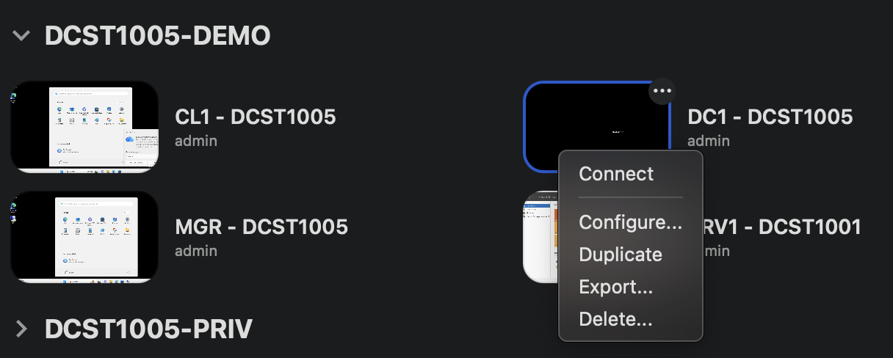
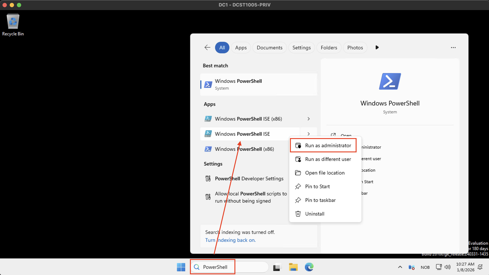
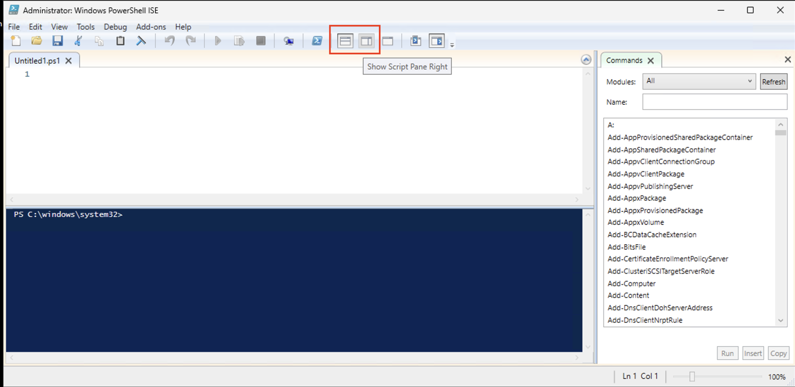

# Installasjon av Active Directory på Windows Server 2025 (DC1)

## Oversikt
Denne guiden viser hvordan du installerer og konfigurerer Active Directory Domain Services (AD DS) på Windows Server 2025 ved bruk av PowerShell.

**Server:** DC1 (OpenStack VM)  
**Domene:** InfraIT.sec  
**Tilgang:** Remote Desktop Connection

---

## Forutsetninger
- Remote Desktop-tilgang til serveren DC1
- Pålogget med Admin-brukeren

### ⚠️ VIKTIG: Bytte av påloggingsbruker etter installasjon
Etter at Active Directory er installert, må du bytte påloggingsbruker:
- **Før installasjon:** Logg inn med `Admin`
- **Etter installasjon:** Logg inn med `InfraIT\Administrator` (MERK: InfraIT hvis en benytter samme navn i scriptet)
- **Passord:** Det samme passordet du oppgir under installasjonen

---

## Steg 1: Koble til serveren

1. Koble deg til DC1 med Remote Desktop Connection som opprettet i del 1 av den praktiske øvingen
   1. 

---

## Steg 2: Åpne PowerShell som Administrator

1. Skriv inn PowerShell i søkfeltet nede i midten på skjeren.
2. Velg **Windows PowerShell ISE (Admin)**
   1. 
3. Bekreft UAC-dialogen hvis den dukker opp
4. Klikk deretter på delt vindu (horisontalt eller vertikalt, alt etter hva en liker best) i toppen for å få opp både editor og kommandolinje.
   1. 
5. Kopier deretter inn scriptet for installasjon av Active Directory inn i editor-visningen av PowerShell ISE:
   1. 

---

## Steg 3: Installer AD DS-rollen

Kjør følgende kommando for å installere Active Directory Domain Services:

```powershell
Install-WindowsFeature -Name AD-Domain-Services -IncludeManagementTools
```

**Forklaring:**
- `Install-WindowsFeature`: Installerer Windows Server-funksjoner
- `-Name AD-Domain-Services`: Spesifiserer AD DS-rollen
- `-IncludeManagementTools`: Inkluderer administrasjonsverktøy som Active Directory Users and Computers

**Forventet resultat:** Installasjonen tar noen minutter. Du vil se en fremdriftsindikator, og kommandoen returnerer status når den er ferdig.

---

## Steg 4: Oppgrader serveren til Domain Controller

Nå skal vi konfigurere serveren som en ny domain controller i et nytt forest.

### 4.1: Kjør oppgraderingskommandoen

```powershell
Install-ADDSForest -DomainName "InfraIT.sec" -InstallDns
```

**Domene:** InfraIT.sec (NetBIOS-navn blir automatisk "InfraIT")

### 4.2: Sett SafeModeAdministratorPassword

Etter at du har kjørt kommandoen over, vil du bli bedt om å oppgi et **Directory Services Restore Mode (DSRM)** passord.

**Passordkrav:**
- Minst 12 tegn
- Store bokstaver (A-Z)
- Små bokstaver (a-z)
- Tall (0-9)
- Spesialtegn (!@#$%^&* etc.)

**VIKTIG:** Dette passordet blir også brukt for å logge inn som `InfraIT\Administrator` etter installasjonen!

- Skriv inn et sterkt passord
- Bekreft passordet

### 4.3: Bekreft advarsler

Du vil se noen advarsler om DNS-delegering. Dette er normalt når du oppretter et nytt forest. Skriv **Y** og trykk Enter for å fortsette.

---

## Steg 5: Vent på installasjon og restart

- Installasjonen tar vanligvis 5-10 minutter
- Serveren vil automatisk restarte når installasjonen er fullført
- Remote Desktop-forbindelsen vil bli brutt under restart

---

## Steg 6: Koble til igjen etter restart

1. Vent 2-3 minutter etter at forbindelsen ble brutt
2. Åpne Remote Desktop Connection igjen
3. Koble til DC1
4. **Viktig - ny påloggingsinformasjon:**
   - **Brukernavn:** `InfraIT\Administrator`
   - **Passord:** Det samme passordet du oppga under installasjonen (DSRM-passordet)
   - **Merk:** Du logger ikke lenger inn med "Admin", men med domene-administrator-kontoen

---

## Steg 7: Verifiser installasjonen

Åpne PowerShell som administrator og kjør følgende kommandoer for å verifisere at Active Directory er korrekt installert:

### Sjekk domenekontroller-status
```powershell
Get-ADDomainController
```

### Sjekk domene-informasjon
```powershell
Get-ADDomain
```

### Sjekk forest-informasjon
```powershell
Get-ADForest
```

Hvis disse kommandoene returnerer informasjon om ditt domene, er installasjonen vellykket!

---

## Alternativ metode: Komplett installasjonscript

Du kan også bruke et ferdig script som inkluderer passordvalidering og alle innstillinger.

Last ned scriptet: `Install-ADDS.ps1`

**Scriptet inkluderer:**
- Automatisk installasjon av AD DS og DNS
- Passordkompleksitetssjekk (12+ tegn, store/små bokstaver, tall, spesialtegn)
- Promovering til Domain Controller
- Automatisk restart

**Kjør scriptet:**
```powershell
.\Install-ADDS.ps1
```

**Manuell versjon med alle parametere:**

```powershell
# Definer passord (erstatt med ditt eget sikre passord)
$SafeModePassword = ConvertTo-SecureString "MittSikre!Passord123" -AsPlainText -Force

# Installer AD DS og DNS
Install-WindowsFeature AD-Domain-Services, DNS -IncludeManagementTools

# Konfigurer domain controller
$Params = @{
    DomainMode = 'WinThreshold'
    DomainName = 'InfraIT.sec'
    DomainNetbiosName = 'InfraIT'
    ForestMode = 'WinThreshold'
    InstallDns = $true
    NoRebootOnCompletion = $true
    SafeModeAdministratorPassword = $SafeModePassword
    Force = $true
}

Install-ADDSForest @Params
Restart-Computer
```

**Husk:** Bytt ut `MittSikre!Passord123` med ditt eget passord som oppfyller kompleksitetskravene.

---

## Vanlige problemer og løsninger

### Problem: Kan ikke logge inn etter restart med "Admin"
**Løsning:** 
- Etter at serveren er promoverte til Domain Controller, må du bruke domenekontoen
- Bruk: `InfraIT\Administrator`
- Passord: Det samme som du oppga under installasjonen (DSRM-passordet)

### Problem: "The specified domain either does not exist or could not be contacted"
**Løsning:**
- Vent litt lenger - DNS-serveren trenger tid til å starte
- Prøv å logge inn med `.\Administrator` først, deretter `InfraIT\Administrator`

### Problem: "A parameter cannot be found that matches parameter name"
**Løsning:** Sørg for at AD DS-rollen er installert først (Steg 3)

### Problem: Kan ikke koble til etter restart
**Løsning:** 
- Vent litt lenger (restart kan ta opptil 5 minutter)
- Sjekk at du bruker riktig påloggingsformat: `InfraIT\Administrator`
- Bruk DSRM-passordet du oppga under installasjonen

### Problem: Passordet oppfyller ikke kompleksitetskravene
**Løsning:**
- Passordet må være minst 12 tegn
- Må inneholde: store bokstaver, små bokstaver, tall og spesialtegn
- Eksempel på gyldig passord: `AdminPass123!`

### Problem: DNS-advarsler under installasjon
**Løsning:** Dette er normalt når du oppretter et nytt forest. Trykk Y for å fortsette.

---

## Neste steg

Etter vellykket installasjon kan du:
- Opprette brukere og grupper i Active Directory
- Konfigurere Group Policy Objects (GPO)
- Legge til flere domain controllers for redundans
- Konfigurere Active Directory Sites and Services

---

## Viktige kommandoer for referanse

```powershell
# Liste installerte Windows-funksjoner
Get-WindowsFeature

# Sjekk AD DS-status
Get-Service ADWS, DNS, Netlogon

# Åpne Active Directory Users and Computers
dsa.msc

# Åpne DNS Manager
dnsmgmt.msc

# Åpne Active Directory Administrative Center
dsac.exe
```

---

## Konklusjon

Du har nå installert Active Directory Domain Services på DC1 ved bruk av PowerShell. Serveren fungerer som en domain controller i domenet **InfraIT.sec** med integrert DNS-server.

**Viktig å huske:**
- Logg inn med: `InfraIT\Administrator`
- Passord: DSRM-passordet du oppga under installasjonen
- Domene: InfraIT.sec
- NetBIOS-navn: InfraIT

**Husk å dokumentere:**
- DSRM-passord (oppbevar dette sikkert!)
- Administrator-passord for domenet