# Oppretting av personlig IT-admin bruker i Active Directory

## Oversikt
Denne guiden viser hvordan du oppretter en personlig administrativ brukerkonto i Active Directory-domenet **InfraIT.sec**. Din personlige admin-konto vil få Domain Admin-rettigheter og skal brukes for alle administrative oppgaver.

**Navnekonvensjon:** `adm_<dittbrukernavn>`  
**Eksempel:** Hvis ditt brukernavn er "ola", blir admin-kontoen `adm_ola`

---

## Hvorfor bruke egen admin-bruker fremfor Administrator?

### 🔒 Sikkerhetsmessige grunner

#### 1. **Sporbarhet (Accountability)**
- **Med Administrator:** Alle handlinger logges som "Administrator" - du vet ikke hvem som faktisk gjorde hva
- **Med adm_ola:** Alle handlinger sporres tilbake til deg personlig
- **Hvorfor viktig:** Ved sikkerhetshendelser eller feil kan du finne ut hvem som gjorde hva og når

**Eksempel:** Hvis noen ved et uhell sletter viktige brukere, vil loggene vise:
- ❌ "Administrator deleted user X" (hvem av 5 IT-ansatte var det?)
- ✅ "adm_ola deleted user X" (det var Ola!)

#### 2. **Minste privilegium-prinsippet (Principle of Least Privilege)**
- Du bør ha **to** kontoer:
  - **Daglig bruker:** `ola` - for e-post, web, dokumenter (ingen admin-rettigheter)
  - **Admin-bruker:** `adm_ola` - kun når du trenger admin-rettigheter
- **Hvorfor:** Hvis din daglige konto blir kompromittert (phishing, malware), har angriperen ikke admin-tilgang

#### 3. **Beskyttelse mot utilsiktede feil**
- Som admin kan du:
  - Slette hele organisasjonsenheter
  - Endre kritiske Group Policies
  - Deaktivere viktige brukere
- Ved å bruke admin-konto kun når nødvendig, reduserer du risikoen for "oops"-øyeblikk

#### 4. **Compliance og revisjon**
- Mange sikkerhetsstandarder (ISO 27001, NIST) **krever** personlige admin-kontoer
- Revisorer vil se etter dette i sikkerhetsgjennomganger
- God praksis i profesjonelle IT-miljøer

#### 5. **Passordpolicy**
- `Administrator`-passordet deles ofte mellom flere personer
- Hvis én person slutter, må du endre passordet og informere alle andre
- Med personlige kontoer: Bare deaktiver `adm_ola` når Ola slutter

---

## Når skal du bruke hvilken konto?

| Oppgave | Konto å bruke | Hvorfor |
|---------|---------------|---------|
| Lese e-post, surfe, skrive dokumenter | `ola` | Daglige oppgaver krever ikke admin-rettigheter |
| Opprette brukere i AD | `adm_ola` | Krever Domain Admin-rettigheter |
| Konfigurere Group Policy | `adm_ola` | Krever Domain Admin-rettigheter |
| Installere software på server | `adm_ola` | Krever admin-rettigheter |
| Lese rapporter i SharePoint | `ola` | Ikke admin-oppgave |
| Endre DNS-innstillinger | `adm_ola` | Krever admin-rettigheter |

**Tommelfingerregel:** Hvis du ikke **må** ha admin-rettigheter, bruk ikke admin-kontoen!

---

## Steg 1: Åpne Active Directory Users and Computers

Logg inn på DC1 med `InfraIT\Administrator`.

### Metode 1: Fra Start-menyen
1. Klikk på **Start**
2. Søk etter: `Active Directory Users and Computers`
3. Klikk på programmet
   1. 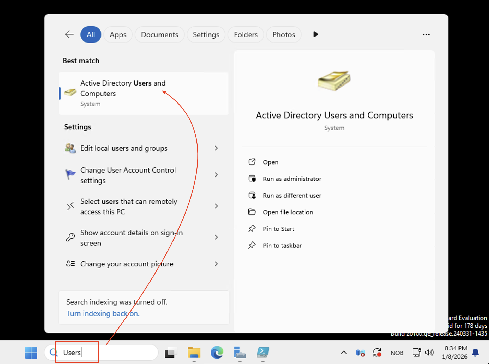

### Metode 2: Fra Server Manager
1. Åpne **Server Manager**
2. Klikk på **Tools** (øverst til høyre)
3. Velg **Active Directory Users and Computers**
   1. 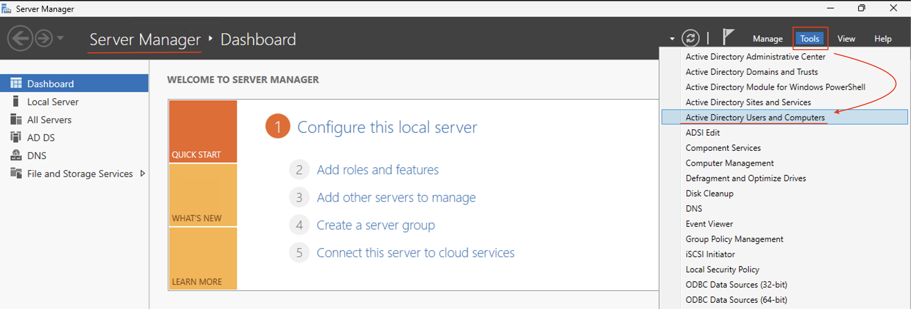

---

## Steg 2: Naviger til Users-containeren

1. I venstre panel, utvid **InfraIT.sec** (domenet ditt)
2. Klikk på **Users**-containeren
   - Dette er standard-lokasjonen for brukerkontoer
   - Du vil se innebygde kontoer som Administrator, Guest, krbtgt, etc.

**Merk:** I produksjonsmiljøer oppretter man ofte egne Organizational Units (OU) for administratorer, men for oppstarten bruker vi Users-containeren.

---

## Steg 3: Opprett ny bruker

1. **Høyreklikk** på **Users**-containeren i venstre panel
2. Velg **New** → **User**
   1. 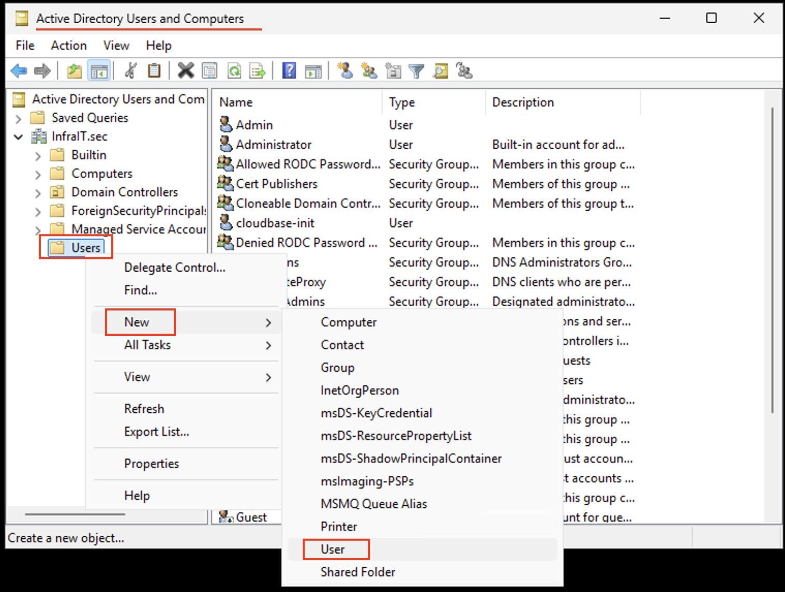

En dialog "New Object - User" åpnes med to sider.

---

## Steg 4: Fyll inn brukerinformasjon (Side 1 av 2)

I det første vinduet, fyll inn følgende:

### Felt å fylle ut:

**First name:** (ditt fornavn, f.eks. "Ola")  
**Last name:** (ditt etternavn, f.eks. "Nordmann")  
**Full name:** (genereres automatisk: "Ola Nordmann")  
**User logon name:** `adm_ola` (bytt "ola" med ditt brukernavn)  
- Dette er påloggingsnavnet brukeren vil bruke
- Domenet (@InfraIT.sec) legges til automatisk
- **Navnekonvensjon:** Prefikset `adm_` indikerer at dette er en admin-konto

**User logon name (pre-Windows 2000):** `adm_ola`  
- Fylles vanligvis ut automatisk

### Eksempel:
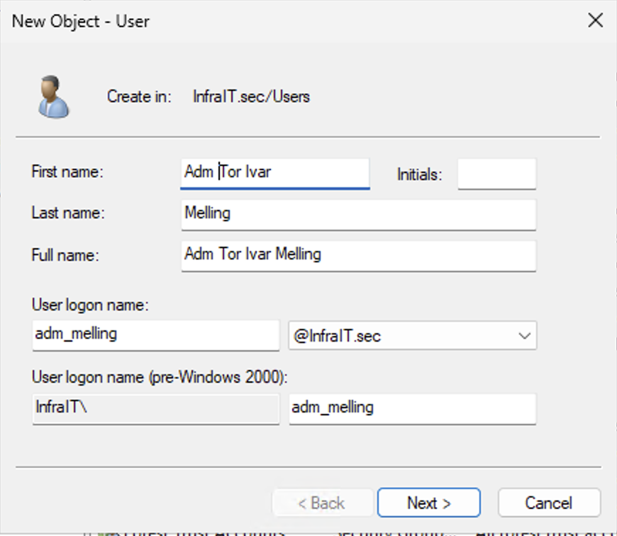

Klikk **Next** når du er ferdig.

---

## Steg 5: Sett passord (Side 2 av 2)

I det andre vinduet, sett passord og passordpolicy:
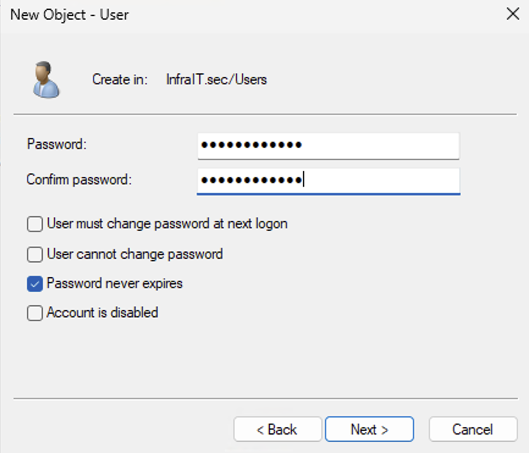
### Felt å fylle ut:

**Password:** (oppgi et sterkt passord)  
**Confirm password:** (bekreft passordet)

### Avkrysningsbokser:

✅ **User must change password at next logon**
- **Anbefalt for første gangs oppsett**
- Tvinger deg til å endre til et personlig passord ved første pålogging
- God sikkerhetspraksis

Eller (hvis du vil sette permanent passord nå):

⬜ User must change password at next logon  
✅ **User cannot change password** (ikke anbefalt)  
✅ **Password never expires** (kun for lab/test - IKKE produksjon!)  
⬜ Account is disabled

**Anbefaling for lab-miljø:**
- ✅ Password never expires (forenkler testing)
- ⬜ User must change password at next logon

**Anbefaling for produksjon:**
- ✅ User must change password at next logon
- ⬜ Password never expires

### Passordkrav:
Passordet må oppfylle domenets passordpolicy:
- Minst 12 tegn (som konfigurert i AD DS-scriptet)
- Store bokstaver (A-Z)
- Små bokstaver (a-z)
- Tall (0-9)
- Spesialtegn (!@#$%^&* etc.)


Klikk **Next** når du er ferdig.

---

## Steg 6: Bekreft og fullfør

1. Du får en oppsummering av brukeren som skal opprettes
2. Verifiser at informasjonen er riktig
3. Klikk **Finish**
   1. 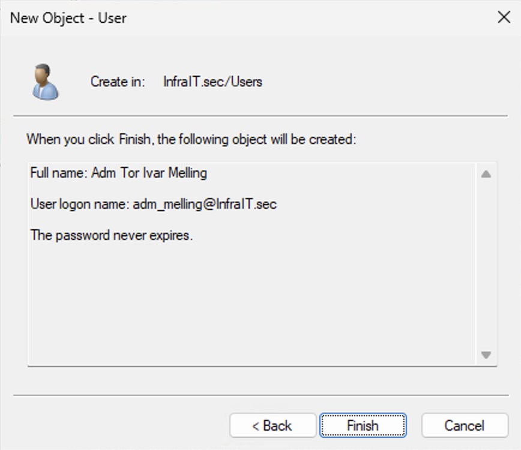

**Resultat:** Du ser nå `adm_ola` (eller ditt brukernavn) i Users-containeren i Active Directory Users and Computers.

---

## Steg 7: Legg til i Domain Admins-gruppen

Nå må vi gi brukeren Domain Admin-rettigheter.

### 7.1: Finn Domain Admins-gruppen

1. I **Active Directory Users and Computers**, klikk på **Users**-containeren
2. Finn gruppen **Domain Admins** i listen (vist med et gruppe-ikon med to personer)
3. **Dobbeltklikk** på **Domain Admins**

### 7.2: Legg til brukeren i gruppen

1. Dialog "Domain Admins Properties" åpnes
2. Klikk på **Members**-fanen
3. Klikk på **Add...**-knappen nederst
4. I "Select Users, Contacts, Computers, Service Accounts, or Groups"-dialogen:
   - Skriv: `adm_ola` (ditt admin-brukernavn)
   - Klikk **Check Names** (navnet understrekes hvis det finnes)
   - 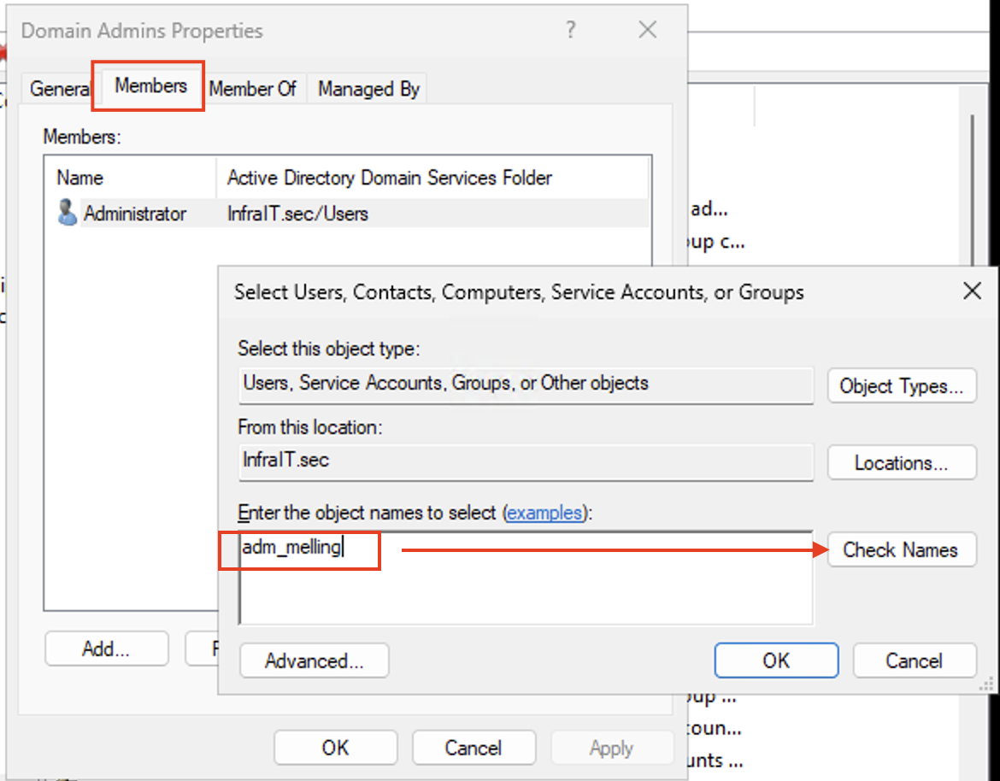
   - Klikk **OK**
   - 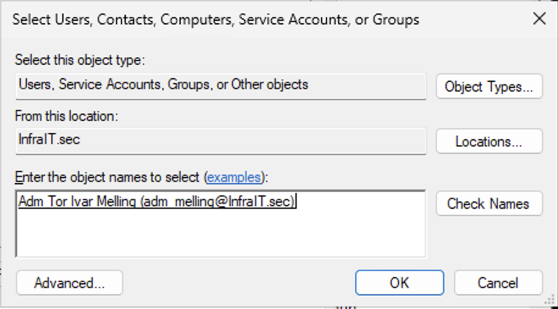
5. Du ser nå `adm_<dinBruker>` i listen over medlemmer
6. Klikk **OK** for å lukke Domain Admins Properties

**Resultat:** `adm_ola` er nå medlem av Domain Admins-gruppen og har full administrativ kontroll over domenet!

---

## Steg 8: Verifiser brukeropprettelse

### 8.1: Sjekk at brukeren eksisterer

1. I **Active Directory Users and Computers**, klikk på **Users**
2. Finn `adm_<dittBrukernavn>` i listen
3. **Dobbeltklikk** på brukeren for å se egenskaper

### 8.2: Verifiser gruppemedlemskap

1. I brukerens egenskaper, klikk på **Member Of**-fanen
2. Du skal se:
   - **Domain Admins**
   - **Domain Users** (automatisk lagt til)
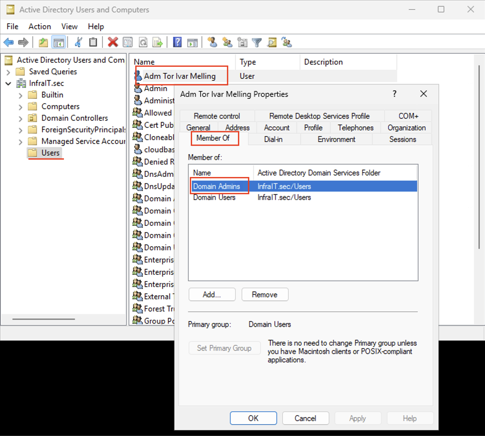
---

## Steg 9: Test pålogging

Nå skal du teste at den nye admin-brukeren fungerer.

### 9.1: Logg ut fra DC1

1. Klikk på Start-menyen
2. Klikk på brukernavnet ditt (øverst)
3. Velg **Sign out**

### 9.2: Logg inn med ny admin-bruker

1. Endre Remote Desktop oppkoblingen din til å nå autentisere seg med adm_dittbrukernavn@infrait.sec
2. **Brukernavn:** `InfraIT\adm_dittBrukernavn` eller `adm_dittBrukernavn@InfraIT.sec`
3. **Passord:** Passordet du satte ved oppretting av din adm_dittBrukernavn
   1. 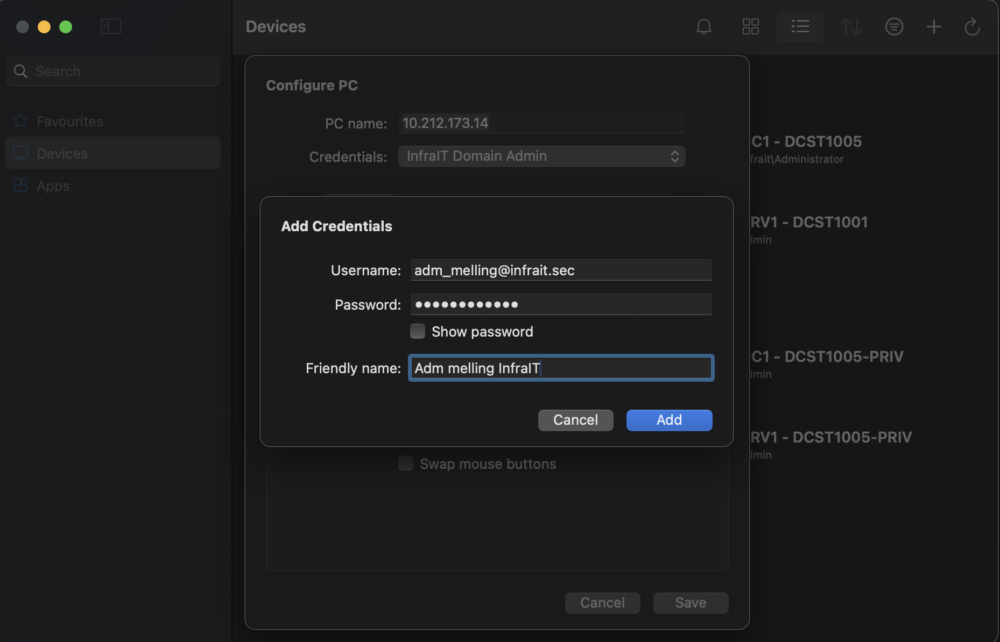


### 9.4: Verifiser admin-rettigheter

Åpne PowerShell og kjør:
```powershell
# Sjekk hvem du er logget inn som
whoami

# Sjekk gruppemedlemskap
whoami /groups

# Sjekk at du har Domain Admin-rettigheter
Get-ADGroupMember -Identity "Domain Admins"
```
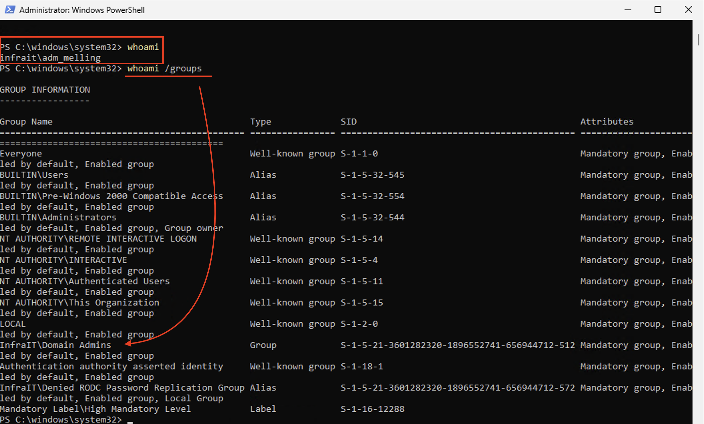

**Forventet resultat:**
- `whoami` returnerer `infrait\adm_ola`
- Du ser Domain Admins i gruppemedlemskapslisten

---

## Alternativ metode: Opprettelse via PowerShell

For å opprette samme bruker via PowerShell (raskere for flere brukere):

```powershell
# Definer variabler
$firstName = "Adm Ola"
$lastName = "Nordmann"
$username = "adm_ola"
$password = ConvertTo-SecureString "Admin2025!Passord" -AsPlainText -Force

# Opprett bruker
New-ADUser `
    -Name "$firstName $lastName" `
    -GivenName $firstName `
    -Surname $lastName `
    -SamAccountName $username `
    -UserPrincipalName "$username@InfraIT.sec" `
    -Path "CN=Users,DC=InfraIT,DC=sec" `
    -AccountPassword $password `
    -Enabled $true `
    -PasswordNeverExpires $true `
    -ChangePasswordAtLogon $false

# Legg til i Domain Admins
Add-ADGroupMember -Identity "Domain Admins" -Members $username

# Verifiser
Get-ADUser $username -Properties MemberOf | Select-Object Name, MemberOf
```

---

## Best practices for admin-kontoer

### 1. **Navnekonvensjon**
- ✅ `adm_ola` - Tydelig at det er admin-konto
- ✅ `ola_admin` - Alternativ konvensjon
- ❌ `ola2` - Ikke tydelig hva kontoen brukes til

### 2. **Passord**
- Bruk **forskjellige** passord for daglig bruker og admin-bruker
- Bruk passordmanager (KeePass, Bitwarden, etc.)
- **Aldri** skriv ned admin-passord på post-it-lapper!

### 3. **Bruk**
- Logg inn med admin-konto **kun** når du skal gjøre admin-oppgaver
- Når oppgaven er ferdig, logg ut og tilbake til daglig bruker
- Ikke surf på internett eller les e-post med admin-konto

### 4. **Dokumentasjon**
- Dokumenter hvem som har admin-kontoer
- Hold liste over admin-kontoer oppdatert
- Deaktiver admin-kontoer når folk slutter

### 5. **Multi-Factor Authentication (MFA)**
- I produksjon: Aktiver MFA på alle admin-kontoer
- Ekstra sikkerhetslag ved pålogging

---

## Vanlige problemer og løsninger

### Problem: "User already exists"
**Løsning:** Brukernavnet er allerede tatt. Velg et annet brukernavn eller sjekk om brukeren allerede finnes.

### Problem: "Password does not meet complexity requirements"
**Løsning:** Passordet må oppfylle kravene (12+ tegn, store/små bokstaver, tall, spesialtegn).

### Problem: Kan ikke logge inn med ny bruker
**Løsninger:**
- Vent 1-2 minutter (replikering i AD kan ta litt tid)
- Sjekk at du bruker riktig format: `InfraIT\adm_ola`
- Verifiser at kontoen er aktivert (ikke "Account is disabled")
- Sjekk at du skriver riktig passord

### Problem: "Access denied" selv om bruker er Domain Admin
**Løsninger:**
- Logg ut og inn igjen (gruppemedlemskap oppdateres ved pålogging)
- Verifiser at brukeren er i Domain Admins: `Get-ADGroupMember "Domain Admins"`
- Sjekk at kontoen ikke er deaktivert

---

## Oppsummering

Du har nå:
- ✅ Opprettet en personlig IT-admin bruker (`adm_<brukernavn>`)
- ✅ Gitt brukeren Domain Admin-rettigheter
- ✅ Forstått hvorfor personlige admin-kontoer er viktig
- ✅ Testet pålogging med den nye kontoen

**Viktig å huske:**
- Bruk `adm_ola` kun for administrative oppgaver
- Opprett en daglig brukerkonto (`ola`) for ikke-admin arbeid
- Dokumenter hvem som har hvilke admin-kontoer
- Følg prinsippet om minste privilegium (Least Privilege)

**Gratulerer!** Du har nå en IT admin-konto for administrasjon av InfraIT.sec-domenet! 🎉