# Innmelding av maskiner i Active Directory-domenet

## Oversikt
Denne guiden viser hvordan du melder inn tre Windows-maskiner (SRV1, CL1, og MGR) i Active Directory-domenet **InfraIT.sec**.

**Maskiner som skal meldes inn:**
- **SRV1** - Server
- **CL1** - Klient/Workstation
- **MGR** - Management-maskin

**Domain Controller:** DC1 (InfraIT.sec)

---

## Forutsetninger

- DC1 er konfigurert som Domain Controller for InfraIT.sec
- Du har Remote Desktop-tilgang til alle maskiner
- Du har Remote Desktop-tilgang på maskinene som skal meldes inn
- Du kjenner til IP-adressen til DC1 (192.x.x.x-adressen, ikke adressen for RDP)

---

## Steg 1: Finn IP-adressen til DC1

Før du begynner må du vite IP-adressen til Domain Controller (DC1).

### På DC1, åpne PowerShell og kjør:

```powershell
Get-NetIPAddress -AddressFamily IPv4 | Where-Object {$_.IPAddress -notlike "127.*"} | Select-Object IPAddress, InterfaceAlias
```
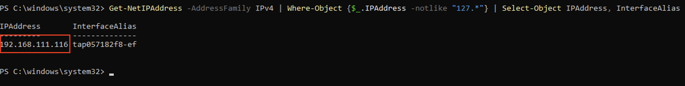

Eller enklere:
```powershell
ipconfig
```
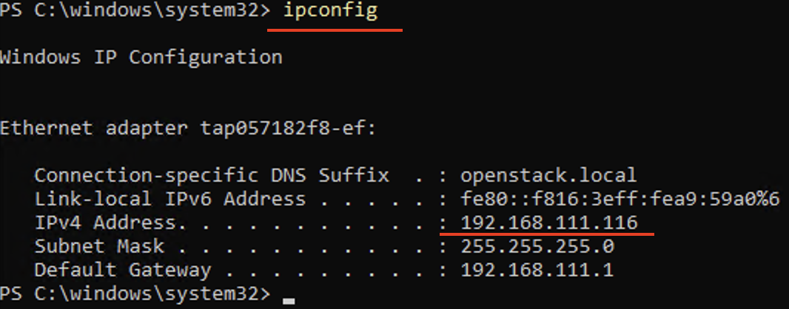
**Noter IP-adressen** - du trenger denne for å konfigurere DNS på de andre maskinene.

**Eksempel:** Hvis DC1 har IP `192.168.1.10`, skal du bruke denne adressen som DNS-server på SRV1, CL1 og MGR.

---

## Steg 2: Konfigurer DNS på maskinene

Du må konfigurere DNS-innstillinger på **hver maskin** (SRV1, CL1, og MGR) før de kan finne domenet.

### Metode 1: GUI (Anbefalt for læring)

#### På hver maskin (SRV1, CL1, MGR): Eksempelet viser på mgr maskinen (som er innlogget som Admin, siden den ikke er meldt inn i domenet enda)

1. **Åpne Network and Internet settings:**
   - 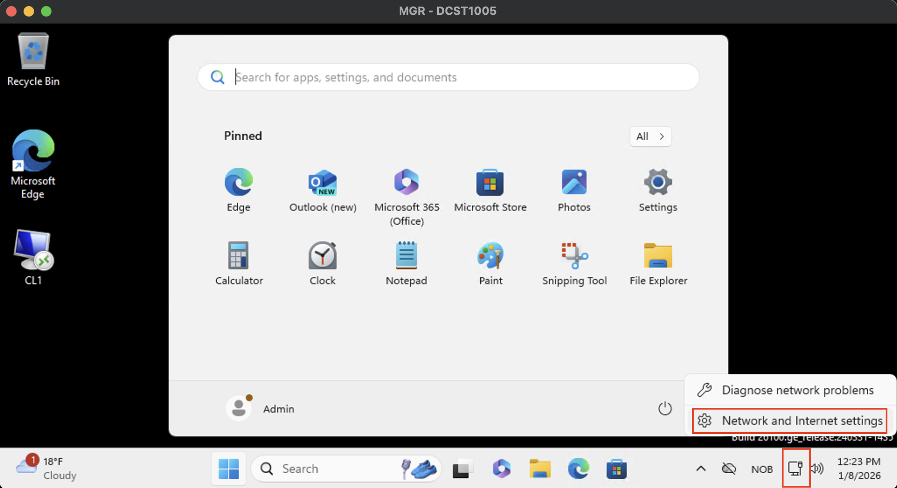

2. **Velg Ethernet:**
   - 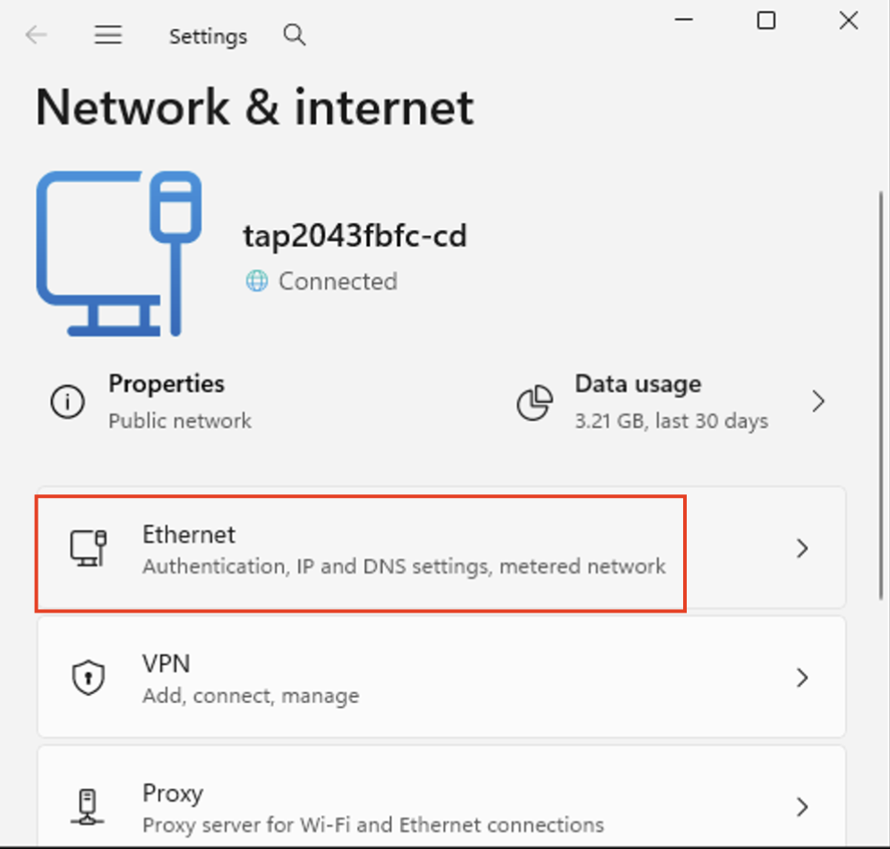

3. **Scroll ned til DNS**
   - 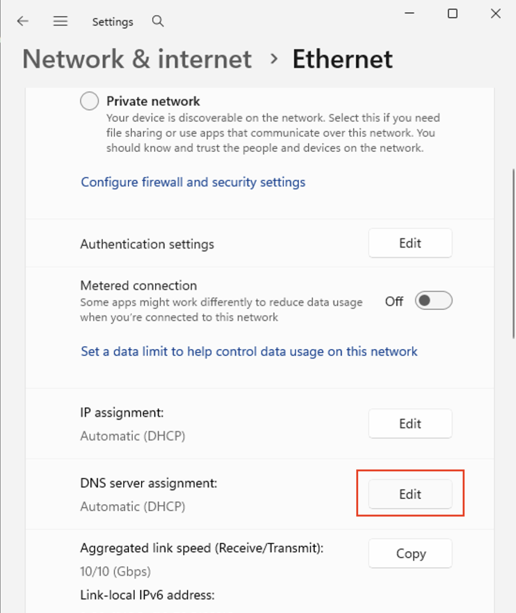

4. **Velg manual innstilling:**
   - Skriv inn IP-adressen til DC1
   - 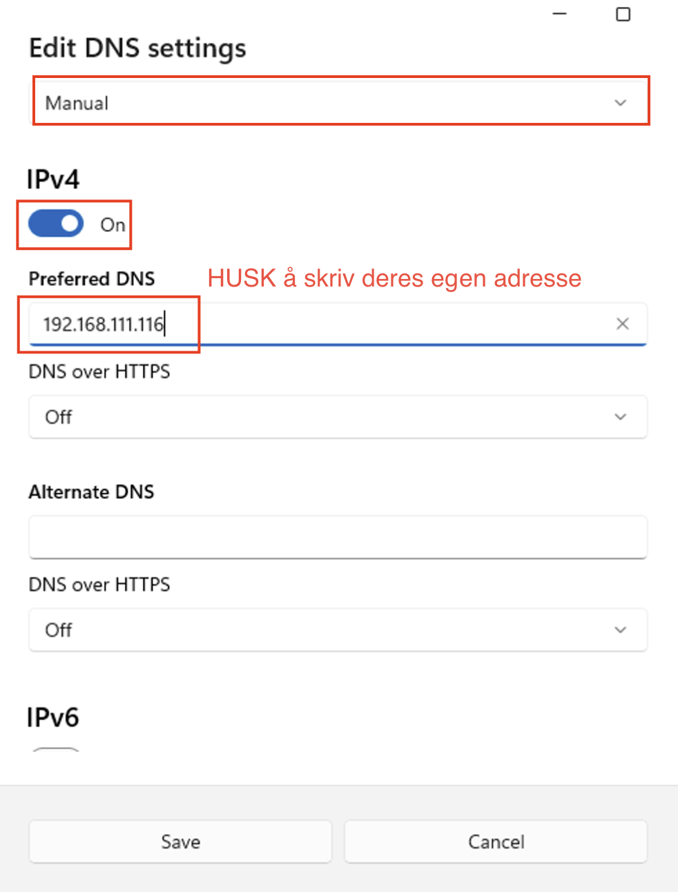
   - Velg deretter "Save"

### Metode 2: PowerShell

Kjør følgende kommando på hver maskin (bytt ut `192.168.1.10` med DC1s IP-adresse):

```powershell
# Finn nettverksadapterens navn
Get-NetAdapter

# Sett DNS-server (bytt "Ethernet" med ditt adapternavn hvis nødvendig)
Set-DnsClientServerAddress -InterfaceAlias "Ethernet" -ServerAddresses "192.168.1.10"

# Verifiser
Get-DnsClientServerAddress -InterfaceAlias "Ethernet"
```

---

## Steg 3: Test DNS-oppløsning

Før du melder inn maskinen, test at DNS fungerer:

```powershell
# Test at du kan nå DC1
ping DC1

# Test at domenenavnet fungerer
nslookup InfraIT.sec

# Test DNS-oppløsning av Domain Controller
nslookup DC1.InfraIT.sec
```
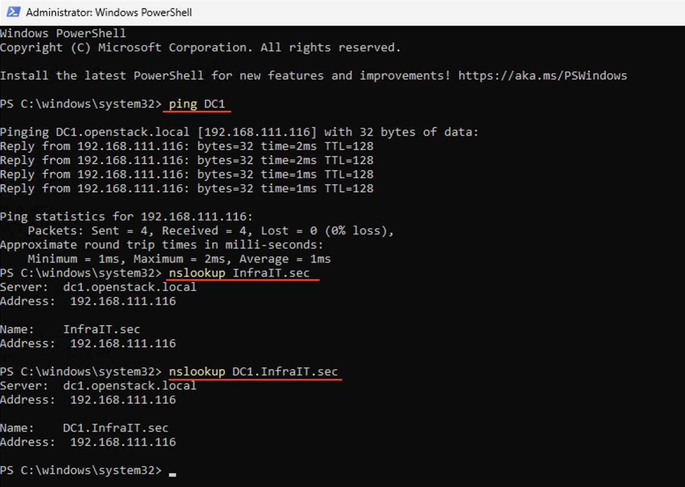
**Forventet resultat:** Du skal kunne "pinge" DC1 og få svar, og nslookup skal returnere IP-adressen til DC1.

**Hvis det ikke fungerer:**
- Dobbeltsjekk at DNS-server er satt til DC1s IP-adresse
- Sjekk at du har nettverksforbindelse til DC1
- Prøv å restarte maskinen

---

## Steg 4: Meld inn maskin i domenet (GUI)

Nå skal du melde **hver maskin** inn i InfraIT.sec-domenet.

### På hver maskin (SRV1, CL1, MGR):

1. **Åpne System Properties:**
   - Høyreklikk på Windows Iconet
     - 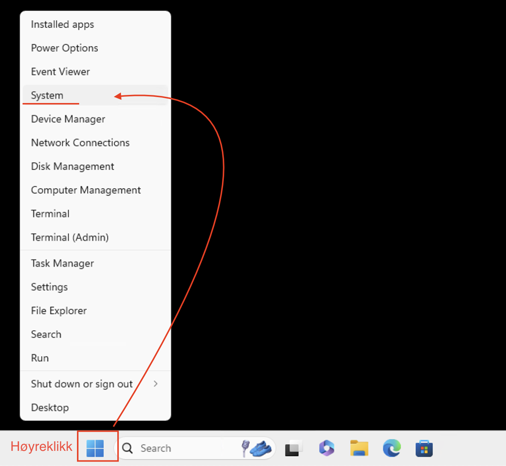
   - Scroll ned til:
     - 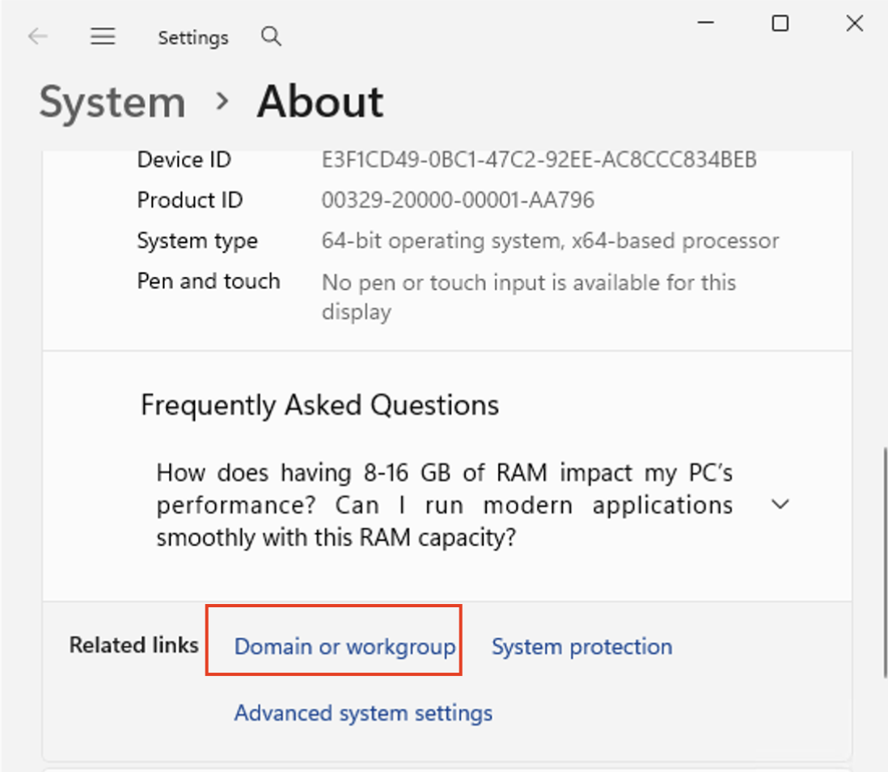
   - Klikk på change og trykk på Domain: og skriv inn InfraIT.sec. Trykk deretter OK
     - 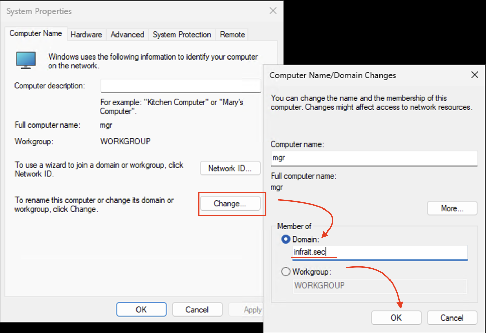
   - Skriv inn din adm_dittBrukernavn og passord:
     - 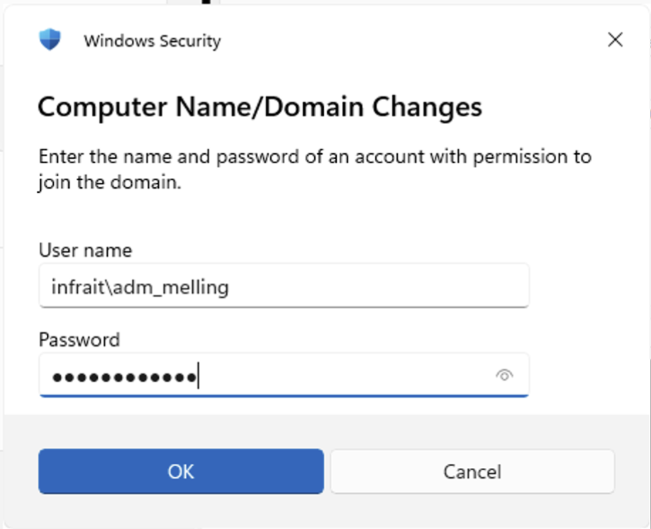
   - Taadaa 🥳
     - 
   - Hvis alt går bra, får du en melding: "Welcome to the InfraIT.sec domain"
   - Klikk **OK**

2. **Restart:**
   - Du blir bedt om å restarte maskinen
   - Klikk **OK** for å lukke alle vinduer
   - Klikk **Restart Now**

---

## Steg 5: Logg inn etter restart

Etter at maskinen har startet på nytt:

### Endre RDP-pålogging med domenekonto via RDP:

1. **Brukernavn:** `adm_melling@infrait.sec`
2. **Passord:** Administrator-passordet for domenet


**Merk:** Du logger nå inn med en domenekonto, ikke en lokal konto!

---

## Steg 6: Verifiser innmelding

Etter pålogging, verifiser at maskinen er korrekt meldt inn:

### I PowerShell:

```powershell
# Vis domeneinformasjon
Get-ComputerInfo | Select-Object CsDomain, CsDomainRole

# Alternativt
(Get-WmiObject -Class Win32_ComputerSystem).Domain
```

**Forventet resultat:** Skal vise `InfraIT.sec`

### På DC1:

Logg inn på DC1 og åpne **Active Directory Users and Computers**:

```powershell
dsa.msc
```

- Utvid **InfraIT.sec**
- Klikk på **Computers**-containeren
- Du skal se SRV1, CL1, og MGR i listen

---

## Vanlige problemer og løsninger

### Problem: "The specified domain either does not exist or could not be contacted"

**Løsninger:**
- Sjekk at DNS-server er satt til DC1s IP-adresse (`ipconfig /all`)
- Test DNS-oppløsning: `nslookup InfraIT.sec`
- Sjekk nettverksforbindelse til DC1: `ping DC1`
- Kontroller at Windows Firewall ikke blokkerer tilkobling
- Prøv å bruke DC1s IP-adresse direkte i stedet for domenenavn

### Problem: "Access is denied" eller "Logon failure"

**Løsninger:**
- Dobbeltsjekk brukernavn: `InfraIT\adm_dinBruker` eller `adm_dinBruker@InfraIT.sec`
- Verifiser at du bruker riktig passord
- Sjekk at Administrator-kontoen er aktivert på DC1

### Problem: Kan ikke finne DC1 med ping

**Løsninger:**
- Verifiser IP-adresse til DC1
- Sjekk at nettverket er konfigurert riktig i OpenStack
- Prøv `ping <DC1-IP-adresse>` direkte

### Problem: DNS virker ikke etter konfigurering

**Løsninger:**
- Kjør `ipconfig /flushdns` for å tømme DNS-cache
- Restart nettverksadapteren: `Restart-NetAdapter -Name "Ethernet"`
- Restart maskinen

---

## Oppsummering

For hver maskin (SRV1, CL1, MGR):

1. ✅ Sett DNS-server til DC1s IP-adresse
2. ✅ Test DNS-oppløsning (`nslookup InfraIT.sec`)
3. ✅ Meld inn i domenet via System Properties
4. ✅ Restart maskinen
5. ✅ Logg inn med `InfraIT\adm_dinBruker`
6. ✅ Verifiser at maskinen er i domenet

**Gratulerer!** Dine maskiner er nå en del av InfraIT.sec-domenet og kan administreres sentralt gjennom Active Directory.