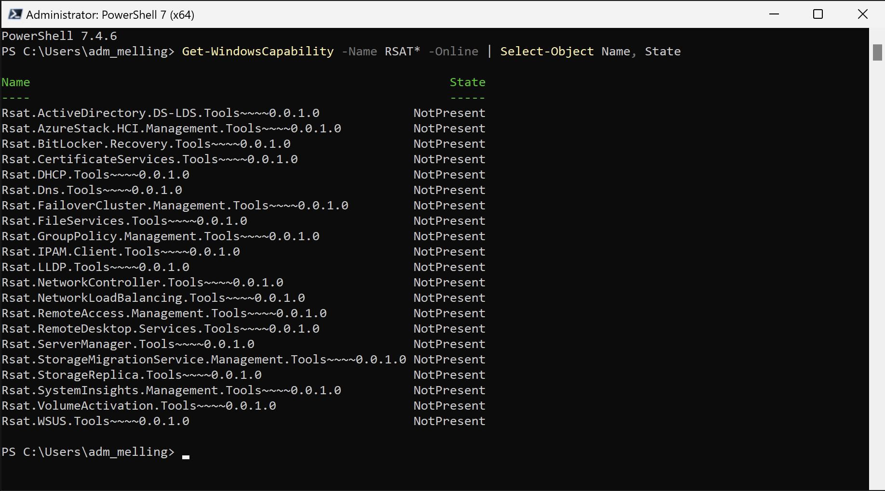

# Installing RSAT Tools for Windows using PowerShell

**Note**: These commands require administrative privileges. Make sure to run PowerShell as Administrator before executing them.

## Listing Available RSAT Tools

First, let's check which RSAT tools are available on your system:

```powershell
Get-WindowsCapability -Name RSAT* -Online | Select-Object Name, State
```

## Installing Specific RSAT Tools

### Active Directory Tools
To install Active Directory Domain Services and Lightweight Directory Services Tools:

```powershell
Add-WindowsCapability -Online -Name "Rsat.ActiveDirectory.DS-LDS.Tools~~~~0.0.1.0"
```

### DNS Server Tools
To install DNS Server Tools:

```powershell
Add-WindowsCapability -Online -Name "Rsat.Dns.Tools~~~~0.0.1.0"
```

## Verifying Installation

To verify that the tools were installed successfully:

```powershell
Get-WindowsCapability -Name Rsat.ActiveDirectory.DS-LDS.Tools~~~~0.0.1.0 -Online | Select-Object Name, State
Get-WindowsCapability -Name Rsat.Dns.Tools~~~~0.0.1.0 -Online | Select-Object Name, State
```

**Note**: These commands require administrative privileges. Make sure to run PowerShell as Administrator before executing them.