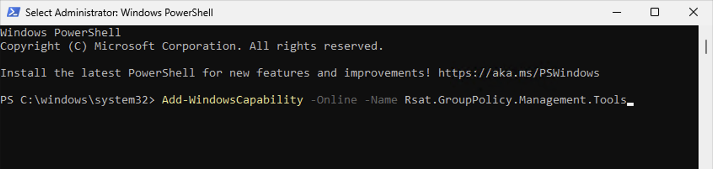

# Installing RSAT Group Policy Management Tools

## Description
This PowerShell command installs Remote Server Administration Tools (RSAT) for Group Policy management on Windows 11, enabling local management of Active Directory Group Policies.

## Prerequisites
- Windows 11 Pro/Enterprise
- Domain-joined computer
- Administrative privileges

## Installation
1. Open PowerShell as Administrator
2. Run:
```powershell
Add-WindowsCapability -Online -Name Rsat.GroupPolicy.Management.Tools
```


## Usage
After installation:
- Launch "Group Policy Management" from Start menu
- Create/Edit Group Policies
- Manage Group Policy Objects (GPOs)
- Configure security settings
- Deploy software and settings across domain

## Verification
Check installation status:
```powershell
Get-WindowsCapability -Online | Where-Object {$_.Name -like "*GroupPolicy*"}
```