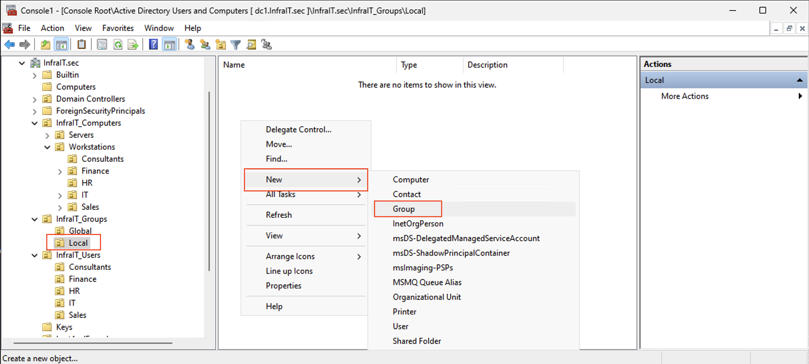
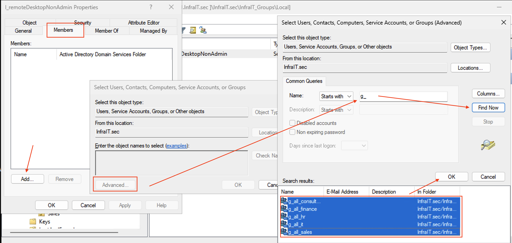
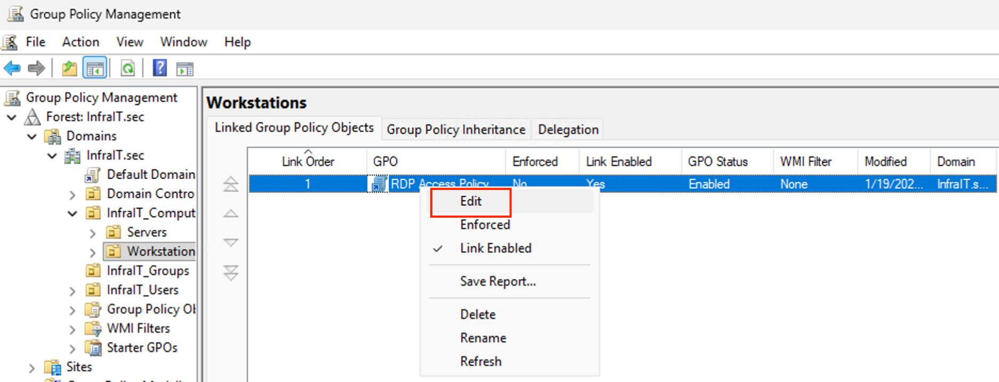
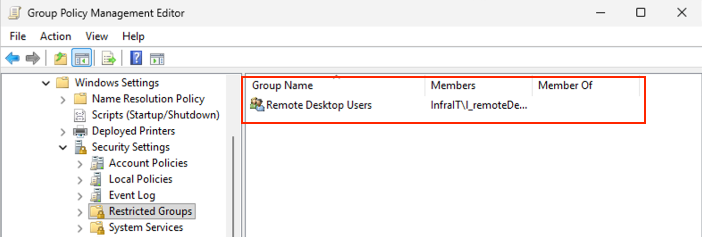
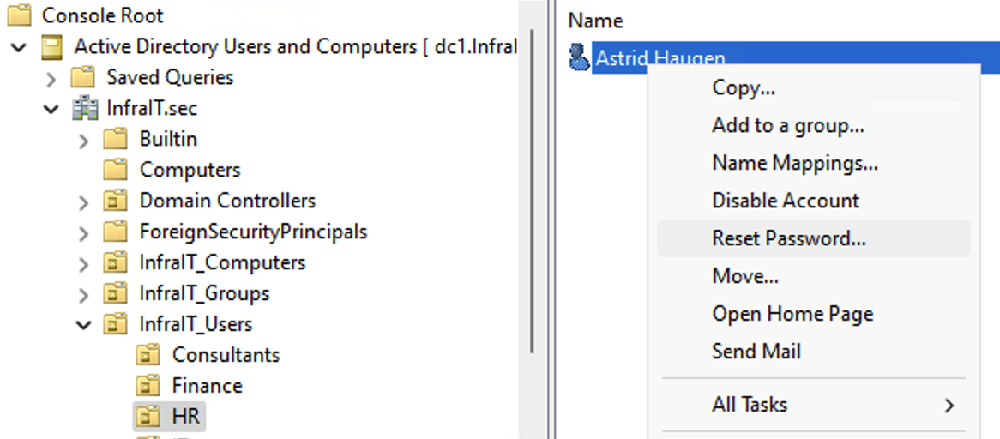
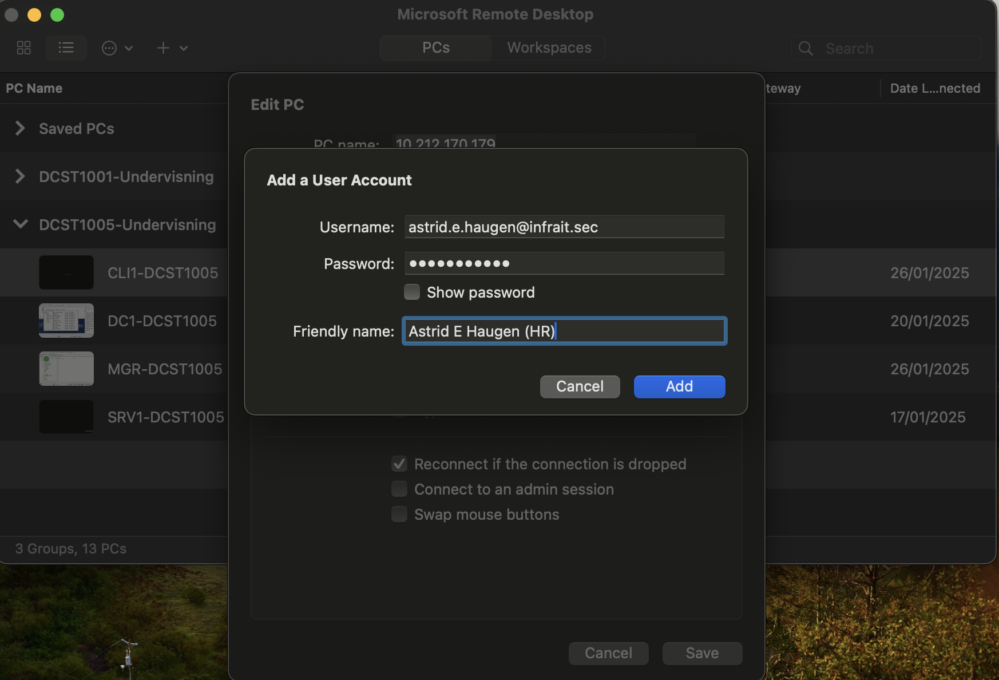
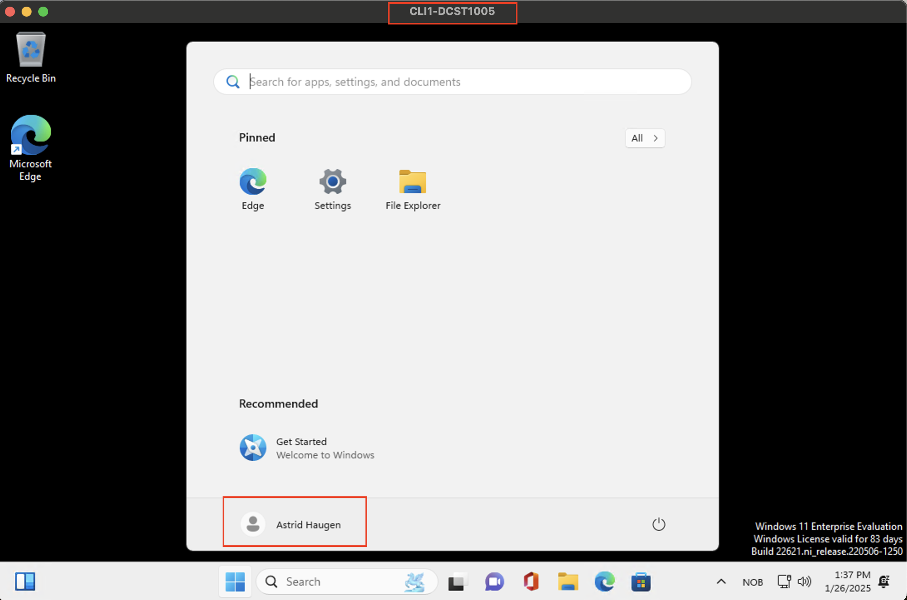

# Enabling Remote Desktop Access for Active Directory Users

## Prerequisites
- Domain Administrator rights
- Active Directory Domain Services installed
- Group Policy Management Console installed

## Steps

### 1. Create a Security Group
1. Open Active Directory Users and Computers
2. Drag n drop cl1 machine into a department OU under your computers OU, for example HR under InfraIT_Computers -> Workstations
3. Right-click the OU where you want to create the group (My example InfraIT_Groups -> Local)
   1. ‼️ NOTE ‼️ You don't need a OU for global and local groups. Use InfraIT_Groups as root OU for all groups 
4. Select New > Group
5. Name: l_remoteDesktopNonAdmin
6. Group scope: local
7. Group type: Security
8. Click OK



### 2. Add Users to the Security Group
1. Double-click the newly created group
2. Click the Members tab
3. Click Add
4. Find the groups where you have all your employees
5. Click OK to add selected
6. Click Apply and OK



### 3. Create and Configure Group Policy
1. Add Group Policy Management in MMC through Add/Remove Snap-in (you can have both Active Directory Users and Computers together with Group Policy in the same MMC user interface. Remember to save the file, so you don't have to add snapins every time (file Save As..))
   1. 
2. Navigate to the OU where you want to allow non admin users to Remote Desktop in
3. Right-click and select "Create a GPO in this domain, and Link it here"
   1. 
4. Name it "RDP Access Policy"
5. Right-click the new GPO and select Edit
   1. 

### 4. Configure Remote Desktop Settings
1. Navigate to:
   ```
   Computer Configuration > Policies > Windows Settings > Security Settings > Restricted Groups
   ```
2. Right-click in the right pane and select "Add Group"
3. Type "Remote Desktop Users" and click Ok
   1. 
4. Under "Members of this group", add your l_remoteDektopNonAdmin group
   1. 
5. Click Apply and OK
   1. Verify the name and group:
      1. 

### 5. Update group policy
1. Start a remote PS session against Cl1. Run the following commands
```
Enter-PSSession -ComputerName cl1
gpupdate /force
```
   1. 

### 6. Test user login
1. Set a password to test RDP. My example, a user in HR OU.
2. Right click the user and Reset Password. Take away the check mark for "user must change password at next login"
   1. 
3. Log in on Cl1 with Remote Desktop and your test NON ADMIN user.
   1. 
   2. 
4. ‼️ NOTE ‼️ If you get an permission error, try to login as domain admin and run the command `gpupdate /force` with PowerShell as Administrator
   1. Log out
   2. Then log back in with your test user (Astrid E.H. in my example)