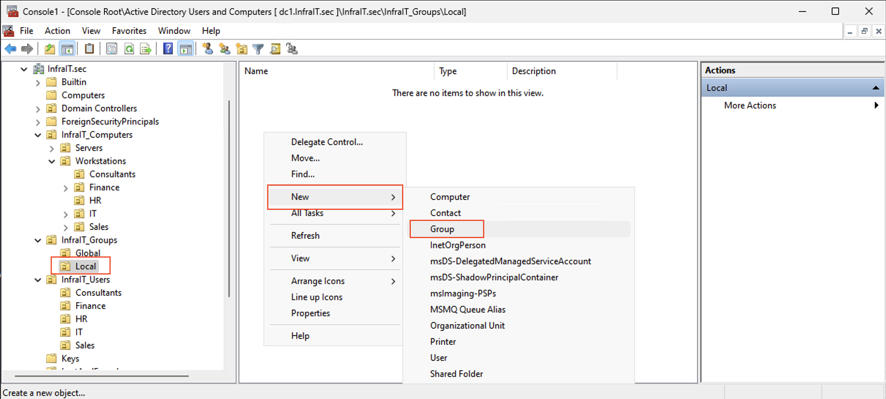
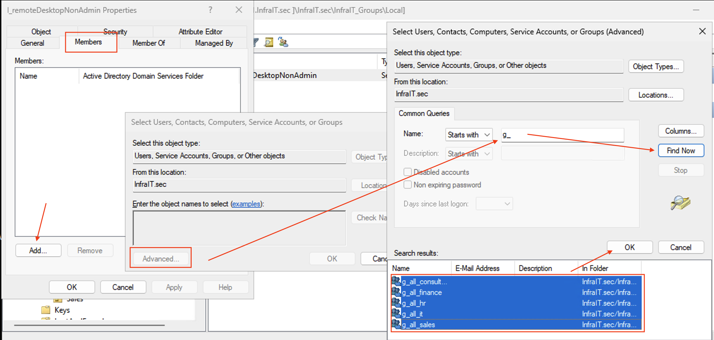
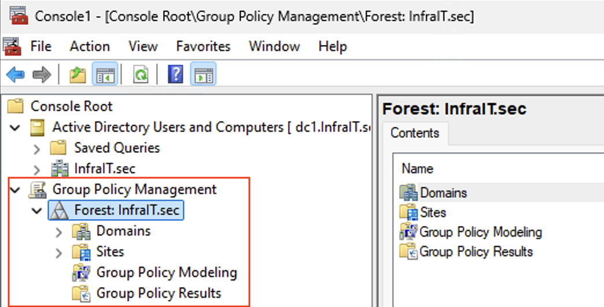
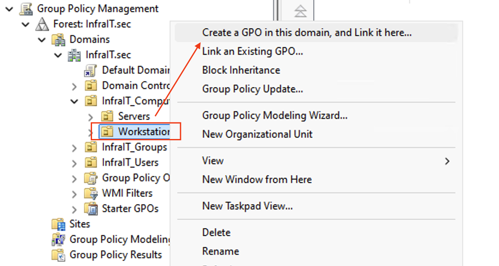
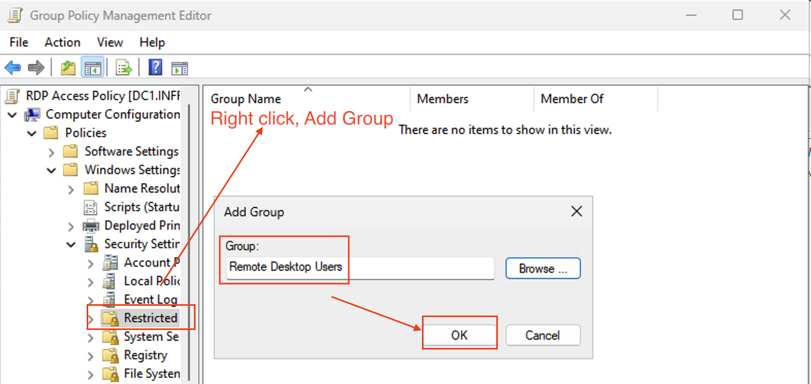
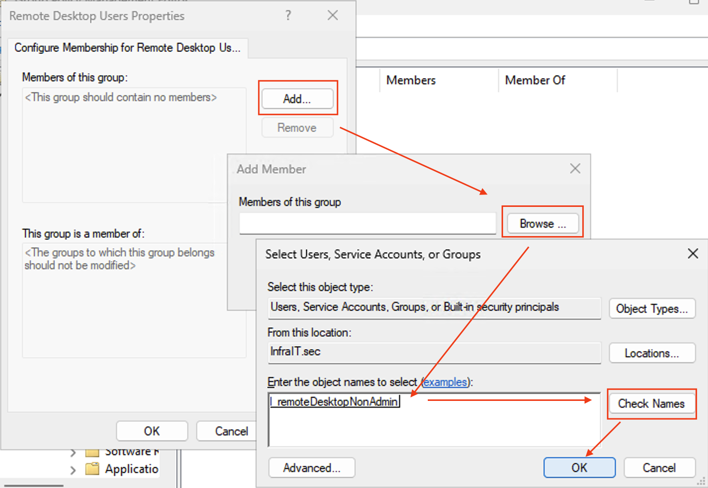
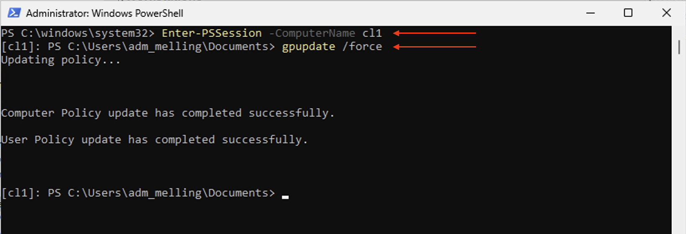

# Enabling Remote Desktop Access for Active Directory Users

## Prerequisites
- Domain Administrator rights
- Active Directory Domain Services installed
- Group Policy Management Console installed

## Steps

### 1. Create a Security Group
1. Open Active Directory Users and Computers
2. Drag n drop cl1 machine into a department OU under your computers OU, for example HR under InfraIT_Computers -> Workstations
3. Right-click the OU where you want to create the group (My example InfraIT_Groups -> Local)
4. Select New > Group
5. Name: l_remoteDesktopNonAdmin
6. Group scope: local
7. Group type: Security
8. Click OK



### 2. Add Users to the Security Group
1. Double-click the newly created group
2. Click the Members tab
3. Click Add
4. Find the groups where you have all your employees
5. Click OK to add selected
6. Click Apply and OK



### 3. Create and Configure Group Policy
1. Add Group Policy Management in MMC through Add/Remove Snap-in
   1. 
2. Navigate to the OU where you want to allow non admin users to Remote Desktop in
3. Right-click and select "Create a GPO in this domain, and Link it here"
   1. 
4. Name it "RDP Access Policy"
5. Right-click the new GPO and select Edit

### 4. Configure Remote Desktop Settings
1. Navigate to:
   ```
   Computer Configuration > Policies > Windows Settings > Security Settings > Restricted Groups
   ```
2. Right-click in the right pane and select "Add Group"
3. Type "Remote Desktop Users" and click Ok
   1. 
4. Under "Members of this group", add your l_remoteDektopNonAdmin group
   1. 
5. Click Apply and OK

### 5. Update group policy
1. Start a remote PS session against Cl1. Run the following commands
```
Enter-PSSession -ComputerName cl1
gpupdate /force
```
   1. 

### 6. Test user login
1. 
   ```
   Computer Configuration > Policies > Administrative Templates > Windows Components > Remote Desktop Services > Remote Desktop Session Host > Connections
   ```
2. Enable "Allow users to connect remotely by using Remote Desktop Services"

### 7. Configure Network Level Authentication
1. In the same location, find "Require user authentication for remote connections by using Network Level Authentication"
2. Set to "Enabled" for better security

### 8. Configure Windows Firewall
1. Navigate to:
   ```
   Computer Configuration > Policies > Windows Settings > Security Settings > Windows Firewall with Advanced Security
   ```
2. Create inbound rules for:
   - TCP port 3389
   - Remote Desktop - User Mode (TCP-In)
   - Remote Desktop - User Mode (UDP-In)

## 9. Apply and Test
1. Open Command Prompt as administrator on a domain controller
2. Run:
   ```
   gpupdate /force
   ```
3. On client machines, either restart or run:
   ```
   gpupdate /force
   ```
4. Test remote desktop connection from a user account

## Troubleshooting
- Ensure target computers are online and can receive group policy updates
- Verify user is a member of RDP_Users group
- Check Windows Firewall status on target machines
- Review Event Viewer for RDP-related errors
- Verify network connectivity between client and target machines
- Ensure target computers are domain-joined and in the correct OU

## Security Considerations
- Enable Network Level Authentication (NLA)
- Implement strong password policies
- Consider implemen#ting time-based access restrictions
- Monitor and audit RDP access attempts
- Keep systems updated with latest security patches
- Consider implementing Remote Desktop Gateway for external access