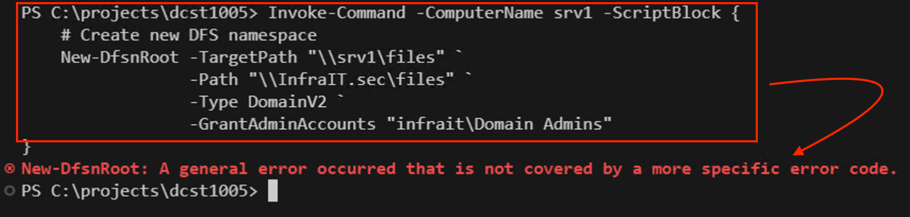
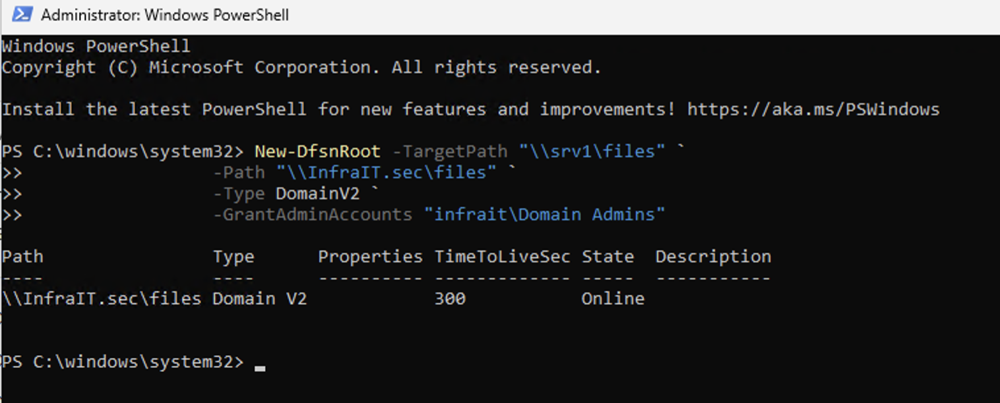

# Windows DFS Installation and Configuration Guide

## Installing Windows Features Remotely

To install the required Windows Features on SRV1 from MGR, use the following PowerShell command:

```powershell
Invoke-Command -ComputerName srv1 -ScriptBlock {
    Install-WindowsFeature -Name FS-DFS-Namespace, FS-DFS-Replication, RSAT-DFS-Mgmt-Con
}
```

## Verify Installation

To verify the features are installed correctly, run:

```powershell
Invoke-Command -ComputerName srv1 -ScriptBlock {
    Get-WindowsFeature | Where-Object {$_.Name -in ('FS-DFS-Namespace','FS-DFS-Replication','RSAT-DFS-Mgmt-Con')}
}
```

## Creating Required Folders and New DFSN Root 

Create the main directories:

```powershell
Invoke-Command -ComputerName srv1 -ScriptBlock {
    New-Item -Path "C:\dfsroots" -ItemType Directory -Force
    New-Item -Path "C:\shares" -ItemType Directory -Force
    
    # Create department folders
    $departments = @('Finance','Sales','IT','Consultants','HR')
    foreach ($dept in $departments) {
        New-Item -Path "C:\shares\$dept" -ItemType Directory -Force
    }
    
    # Create files folder under dfsroots
    New-Item -Path "C:\dfsroots\files" -ItemType Directory -Force
}
```

## Creating SMB Shares

Create SMB shares for all folders with Everyone having Full Access:

```powershell
Invoke-Command -ComputerName srv1 -ScriptBlock {
    # Share department folders
    $departments = @('Finance','Sales','IT','Consultants','HR')
    foreach ($dept in $departments) {
        New-SmbShare -Name $dept -Path "C:\shares\$dept" -FullAccess "Everyone"
    }
    
    # Share DFS root folder
    New-SmbShare -Name "files" -Path "C:\dfsroots\files" -FullAccess "Everyone"
}
```
## Create DFS Namespace Root

First, create the DFS Namespace root: (make sure to edit the domain name, if you don't have the same name)

```powershell
Invoke-Command -ComputerName srv1 -ScriptBlock {
    # Create new DFS namespace
    New-DfsnRoot -TargetPath "\\srv1\files" `
                 -Path "\\InfraIT.sec\files" `
                 -Type DomainV2 `
                 -GrantAdminAccounts "infrait\Domain Admins"
}
```
This command will give an error within a Invoke-Command. Must run localy on srv1 with an user with domain administrator rights.


Use Remote Desktop and run this command localy on srv1. Make sure you are logged on with your domain administrator user, not the local user Admin.


## Create DFS Folders (Links)

Then create the department folders in the namespace:

```powershell
Invoke-Command -ComputerName srv1 -ScriptBlock {
    # Create DFS folders for each department
    $departments = @('Finance','Sales','IT','Consultants','HR')
    foreach ($dept in $departments) {
        New-DfsnFolder -Path "\\infrait.sec\files\$dept" `
                      -TargetPath "\\srv1\$dept" `
                      -EnableTargetFailback $true
    }
}
```
-EnableTargetFailback: This property is particularly useful in scenarios where you have geographically dispersed targets and need clients to connect to the nearest or most efficient target whenever possible.

## Verify DFS Namespace Configuration

To verify the DFS namespace configuration:

```powershell
Invoke-Command -ComputerName srv1 -ScriptBlock {
    # Verify DFS root
    Get-DfsnRoot -Path "\\infrait.sec\files"

    # Verify DFS folders
    Get-DfsnFolder -Path "\\infrait.sec\files\*" | 
    Format-Table Path,TargetPath,State -AutoSize
}
```

## Required Active Directory Groups

The following local groups should be created in Active Directory:

- l_fullAccess-hr-share
- l_fullAccess-it-share
- l_fullAccess-sales-share
- l_fullAccess-finance-share
- l_fullAccess-consultants-share

Important Note: Each department's global group (containing all users from that department) should be made a member of their respective local full access group. For example, the global group "g__all_hr" should be a member of "l_fullAccess-hr-share".

After creating these groups, you should configure the appropriate NTFS permissions on each share to restrict access to only the relevant local group, replacing the initial "Everyone" Full Access permissions used during setup.


## Configuring NTFS Permissions

After creating the shares, configure the NTFS permissions to ensure proper access control:

```powershell
Invoke-Command -ComputerName srv1 -ScriptBlock {
    # Configure NTFS permissions for each department
    $folderPermissions = @{
        'HR' = 'l_fullAccess-hr-share'
        'IT' = 'l_fullAccess-it-share'
        'Sales' = 'l_fullAccess-sales-share'
        'Finance' = 'l_fullAccess-finance-share'
        'Consultants' = 'l_fullAccess-consultants-share'
    }

    foreach ($folder in $folderPermissions.Keys) {
        $path = "C:\shares\$folder"
        $group = $folderPermissions[$folder]

        # Create new ACL
        $acl = New-Object System.Security.AccessControl.DirectorySecurity

        # Disable inheritance and remove inherited permissions
        $acl.SetAccessRuleProtection($true, $false)
        
        # Create and add the rules
        $adminRule = New-Object System.Security.AccessControl.FileSystemAccessRule("BUILTIN\Administrators", "FullControl", "ContainerInherit,ObjectInherit", "None", "Allow")
        $systemRule = New-Object System.Security.AccessControl.FileSystemAccessRule("NT AUTHORITY\SYSTEM", "FullControl", "ContainerInherit,ObjectInherit", "None", "Allow")
        $groupRule = New-Object System.Security.AccessControl.FileSystemAccessRule($group, "FullControl", "ContainerInherit,ObjectInherit", "None", "Allow")

        $acl.AddAccessRule($adminRule)
        $acl.AddAccessRule($systemRule)
        $acl.AddAccessRule($groupRule)

        # Apply the new ACL
        Set-Acl -Path $path -AclObject $acl
        Write-Host "Permissions set for $folder"
    }

    # Configure DFS root with same approach
    $dfsPath = "C:\dfsroots\files"
    $dfsAcl = New-Object System.Security.AccessControl.DirectorySecurity
    $dfsAcl.SetAccessRuleProtection($true, $false)

    # Add base permissions
    $dfsAcl.AddAccessRule($adminRule)
    $dfsAcl.AddAccessRule($systemRule)

    # Add all department groups
    foreach ($group in $folderPermissions.Values) {
        $groupRule = New-Object System.Security.AccessControl.FileSystemAccessRule($group, "FullControl", "ContainerInherit,ObjectInherit", "None", "Allow")
        $dfsAcl.AddAccessRule($groupRule)
    }

    Set-Acl -Path $dfsPath -AclObject $dfsAcl
    Write-Host "Permissions set for DFS root"
}
```

## Verify NTFS Permissions

To verify the permissions are set correctly, you can run:

```powershell
Invoke-Command -ComputerName srv1 -ScriptBlock {
    $folders = @('HR', 'IT', 'Sales', 'Finance', 'Consultants')
    foreach ($folder in $folders) {
        Write-Host "`nPermissions for $folder folder:" -ForegroundColor Yellow
        (Get-Acl -Path "C:\shares\$folder").Access | Format-Table IdentityReference,FileSystemRights
    }

    Write-Host "`nPermissions for DFS root:" -ForegroundColor Yellow
    (Get-Acl -Path "C:\dfsroots\files").Access | Format-Table IdentityReference,FileSystemRights
}
```

This configuration ensures:

1. Each department folder has NTFS permissions for:
   - The corresponding local access group (Full Control)
   - SYSTEM (Full Control)
   - Administrators (Full Control)

2. The DFS root folder has NTFS permissions for:
   - All department local access groups (Full Control)
   - SYSTEM (Full Control)
   - Administrators (Full Control)

3. Inheritance is disabled on all folders to prevent unexpected permission changes

4. All other inherited permissions are removed for security
