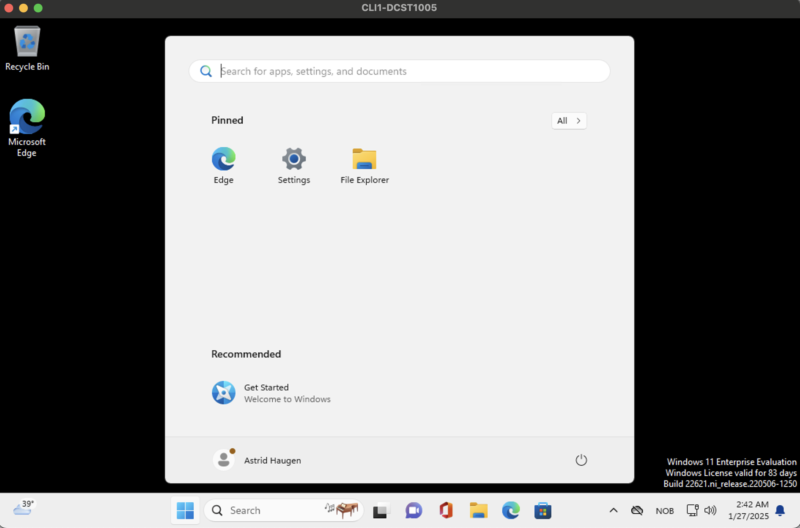
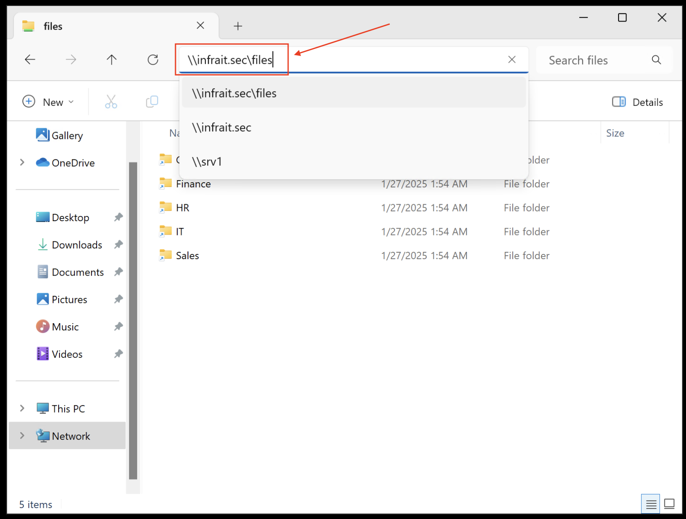
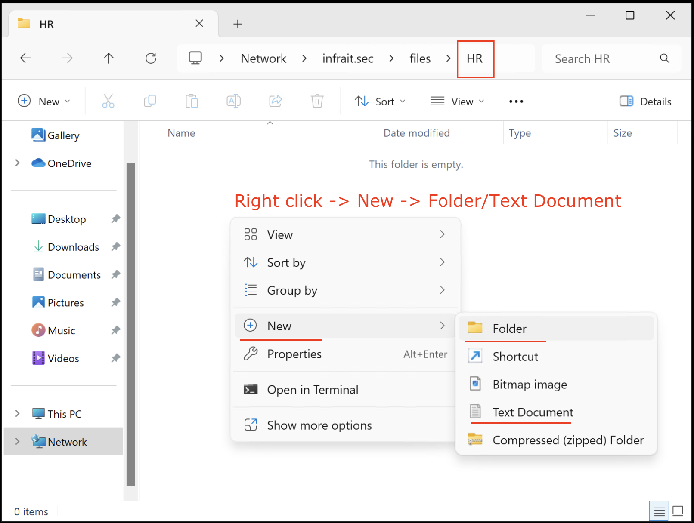

# Access Windows DFS Installation department share from CL1

## Log in with Remote Desktop on Cl1 with an employee of choice 
My example: HR, since CL1 computer is in HR OU

## Open File Explorer and access department share
Type in \\InfraIT.Sec\files in FileExplorer

Verify that you can access the users department share and create a folder and file within that folder

