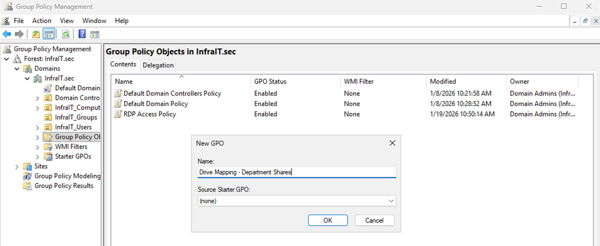
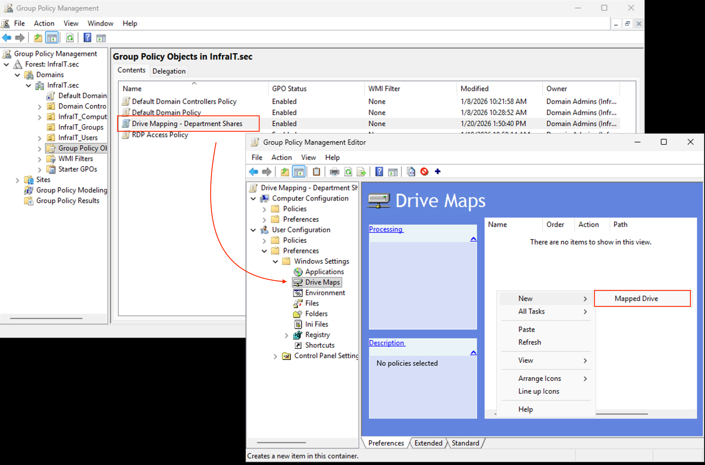
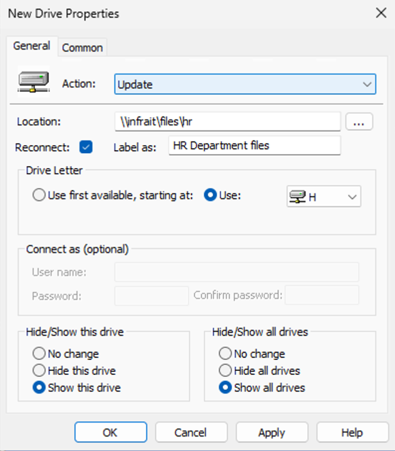
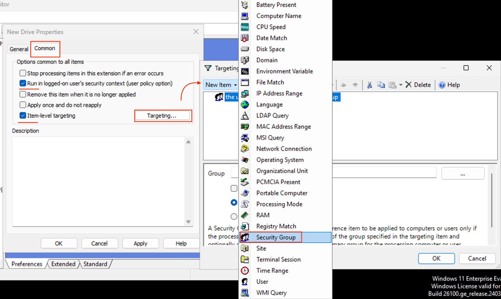
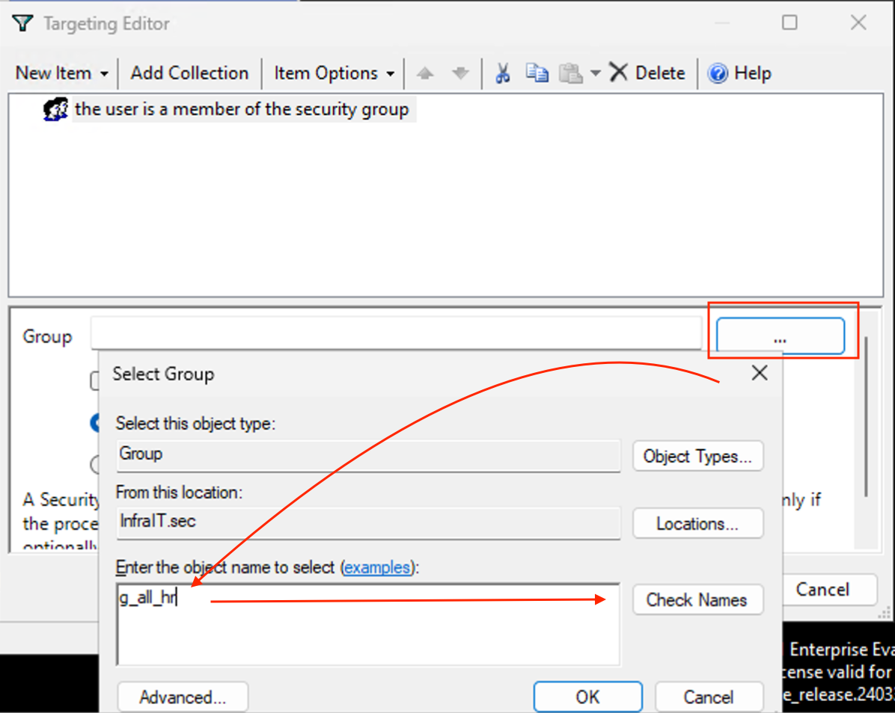
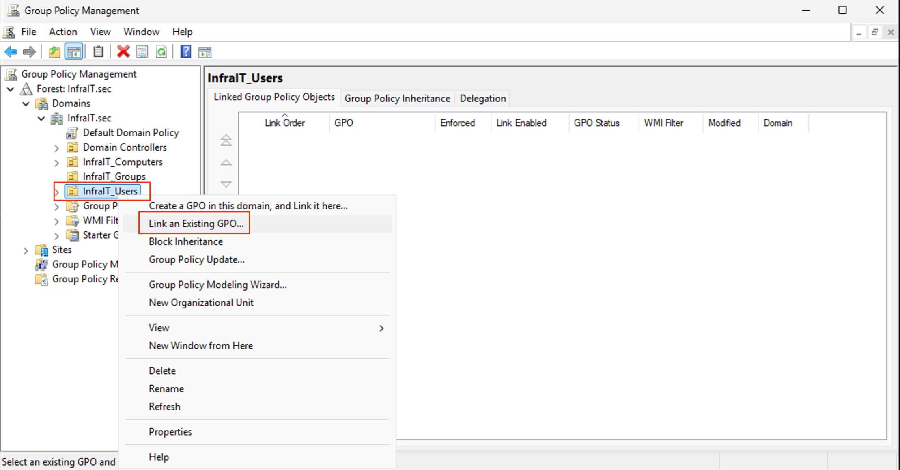

# Group Policy Drive Mapping Guide for Department Shares

## Overview

This guide demonstrates how to automatically map network drives to department-specific file shares using Group Policy in a Windows Server 2025 Active Directory environment. Students will learn to implement secure, role-based drive mappings that automatically connect users to their department's shared resources.

## Infrastructure Summary

- **Domain Controller**: DC1 (infrait.sec)
- **File Server**: SRV1 (Windows Server 2025)
- **Domain**: infrait.sec
- **Departments**: HR, IT, SALES, FINANCE, CONSULTANTS

### File Share Structure

```
\\infrait\files\hr
\\infrait\files\it
\\infrait\files\sales
\\infrait\files\finance
\\infrait\files\consultants
```

### Organizational Unit Structure

**Users:**
```
OU=HR,OU=InfraIT_Users,DC=InfraIT,DC=sec
OU=IT,OU=InfraIT_Users,DC=InfraIT,DC=sec
OU=SALES,OU=InfraIT_Users,DC=InfraIT,DC=sec
OU=FINANCE,OU=InfraIT_Users,DC=InfraIT,DC=sec
OU=CONSULTANTS,OU=InfraIT_Users,DC=InfraIT,DC=sec
```

**Computers:**
```
OU=HR,OU=Workstations,OU=InfraIT_Computers,DC=InfraIT,DC=sec
OU=IT,OU=Workstations,OU=InfraIT_Computers,DC=InfraIT,DC=sec
[...and so on for other departments]
```

### Security Group Structure (AGDLP Model)

**Domain Local Groups** (assigned permissions on file shares):
- `l_fullAccess-hr-share`
- `l_fullAccess-it-share`
- `l_fullAccess-sales-share`
- `l_fullAccess-finance-share`
- `l_fullAccess-consultants-share`

**Global Groups** (contain user accounts):
- `g_all_hr`
- `g_all_it`
- `g_all_sales`
- `g_all_finance`
- `g_all_consultants`

> **Note:** This follows the AGDLP principle (Account → Global Group → Domain Local Group → Permissions), which is Microsoft's recommended best practice for permission management in Active Directory environments.

---

## Prerequisites

Before beginning, ensure:
- [ ] File shares are created on SRV1 and accessible via the UNC paths
- [ ] Security groups are properly configured with nested memberships
- [ ] NTFS and share permissions are set correctly on each department folder
- [ ] Users are members of their respective global groups

---

## Method 1: Group Policy Preferences with Item-Level Targeting (Recommended)

This modern approach allows for flexible, granular control and is the preferred method for drive mapping in current Windows environments.

### Step 1: Create a New Group Policy Object

1. On **DC1**, open **Group Policy Management** (`gpmc.msc`)
2. Navigate to: `Forest: infrait.sec → Domains → infrait.sec → Group Policy Objects`
3. Right-click **Group Policy Objects** → **New**
4. Name: `Drive Mapping - Department Shares`
5. Click **OK**
   1. 

### Step 2: Configure Drive Mappings

1. Right-click the newly created GPO → **Edit**
2. Navigate to: `User Configuration → Preferences → Windows Settings → Drive Maps`
3. Right-click in the right pane → **New → Mapped Drive**
   1. 

#### Configure HR Department Mapping

1. **Action**: `Create`
2. **Location**: `\\infrait\files\hr`
3. **Reconnect**: ☑ Checked
4. **Label as**: `HR Department Files`
5. **Drive Letter**: `H:`
6. **Show this drive**: ☑ Checked
7. **Show all drives**: ☑ Checked
   1. 

8. Click the **Common** tab:
   - ☑ **Run in logged-on user's security context**
   - ☑ **Item-level targeting** → Click **Targeting...**
     - 

9.  In the Targeting Editor:
   - Click **New Item** → **Security Group**
   - Click **...** (browse button)
   - Enter: `g_all_hr`
   - Click **Check Names** → **OK**
   - Click **OK** to close Targeting Editor
     - 

10. Click **OK** to save the mapped drive

#### Repeat for Other Departments

Create additional mapped drives for each department with the following configurations:

**IT Department:**
- Location: `\\infrait\files\it`
- Drive Letter: `I:`
- Label: `IT Department Files`
- Target Group: `g_all_it`

**Sales Department:**
- Location: `\\infrait\files\sales`
- Drive Letter: `S:`
- Label: `Sales Department Files`
- Target Group: `g_all_sales`

**Finance Department:**
- Location: `\\infrait\files\finance`
- Drive Letter: `F:`
- Label: `Finance Department Files`
- Target Group: `g_all_finance`

**Consultants Department:**
- Location: `\\infrait\files\consultants`
- Drive Letter: `C:` (avoid - system drive) → **Use `T:` or `X:`**
- Label: `Consultants Department Files`
- Target Group: `g_all_consultants`

> **Important:** Avoid using drive letter `C:` as it's reserved for the system drive. Consider using `T:` (Team), `X:`, or another available letter.

### Step 3: Link the GPO to the Users OU

1. In **Group Policy Management**, navigate to: `OU=InfraIT_Users,DC=InfraIT,DC=sec`
2. Right-click **InfraIT_Users** → **Link an Existing GPO...**
3. Select `Drive Mapping - Department Shares`
4. Click **OK**
   1. 

### Step 4: Verify GPO Settings

1. Right-click the GPO → **Settings**
2. In the report, expand **User Configuration → Preferences → Windows Settings**
3. Verify all five mapped drives are listed with correct paths and targeting

---

## Method 2: Traditional GPO Drive Mapping with Security Filtering (Alternative)

This method uses separate GPOs for each department, filtered by security group membership. While functional, it requires more administrative overhead.

### Creating Individual GPOs

For each department, create a separate GPO:

1. Create GPO: `Drive Mapping - HR`
2. Edit the GPO
3. Navigate to: `User Configuration → Preferences → Windows Settings → Drive Maps`
4. Create mapped drive:
   - Location: `\\infrait\files\hr`
   - Drive Letter: `H:`
   - Label: `HR Department Files`
   - **Do NOT use Item-Level Targeting**

5. Close the editor
6. In Group Policy Management:
   - Select the GPO
   - In **Security Filtering** section, remove **Authenticated Users**
   - Click **Add** → enter `g_all_hr` → **OK**

7. Link the GPO to `OU=InfraIT_Users`

**Repeat for each department** with their respective groups and drive letters.

> **Why Item-Level Targeting is Preferred:** Using a single GPO with item-level targeting is cleaner, easier to manage, and reduces GPO processing overhead compared to multiple filtered GPOs.

---

## Testing and Verification

### On DC1 (Domain Controller)

#### 1. Verify GPO Replication

```powershell
# Check GPO exists
Get-GPO -Name "Drive Mapping - Department Shares"

# View GPO report
Get-GPOReport -Name "Drive Mapping - Department Shares" -ReportType HTML -Path "C:\Temp\GPO-Report.html"
```

#### 2. Force Group Policy Update (if needed)

```powershell
# On the client machine or via remote PowerShell
Invoke-Command -ComputerName CL1 -ScriptBlock { gpupdate /force }
```

### On Client Machine (CL1)

#### 1. User Testing

1. Log in as a test user from the HR department (e.g., `infrait\hr_user1`)
2. Open **File Explorer**
3. Verify that drive **H:** appears with the label "HR Department Files"
4. Attempt to access other department drives - they should **not** appear

#### 2. Verify GPO Application

```cmd
gpresult /r
```

Look for:
- **Applied Group Policy Objects**: Should show `Drive Mapping - Department Shares`
- **The user is a part of the following security groups**: Should include `g_all_hr`

#### 3. Detailed GPO Results

```cmd
gpresult /h C:\Temp\gpresult.html
```

Open the HTML file and verify:
- Drive mapping settings are present under User Configuration
- Item-level targeting evaluated successfully

#### 4. Event Viewer Verification

1. Open **Event Viewer** (`eventvwr.msc`)
2. Navigate to: `Applications and Services Logs → Microsoft → Windows → GroupPolicy → Operational`
3. Look for successful processing events (Event ID 8001)

### Troubleshooting Common Issues

| Issue | Possible Cause | Solution |
|-------|---------------|----------|
| Drive doesn't map | User not in correct security group | Verify group membership: `Get-ADUser username -Properties MemberOf` |
| GPO not applying | GPO not linked or disabled | Check GPO link status and enable if needed |
| "Network path not found" | Share not accessible | Verify share exists: `Test-Path \\infrait\files\hr` |
| Wrong drive appears | Item-level targeting misconfigured | Review targeting criteria in GPO |
| Drives map slowly | Network issues or DNS problems | Check DNS resolution: `nslookup infrait` |

---

## Security Considerations

### Why Use Item-Level Targeting Instead of Security Filtering?

1. **Single GPO Management**: One GPO is easier to audit and maintain than five separate GPOs
2. **Reduced Processing Overhead**: Less GPO evaluation improves login performance
3. **Granular Control**: Can combine multiple targeting criteria (group membership, OS version, IP range, etc.)
4. **Better Logging**: Clearer event logs when troubleshooting

### Permission Verification

Verify that file share permissions match the security group structure:

```powershell
# On SRV1 - Check NTFS permissions
Get-Acl "D:\Shares\Files\HR" | Format-List

# Verify share permissions
Get-SmbShareAccess -Name "Files"
```

Expected configuration:
- **Share permissions**: `Everyone` → Read (or more restrictive)
- **NTFS permissions**: 
  - `l_fullAccess-hr-share` → Modify (or Full Control)
  - Other department local groups → No access
  - Administrators → Full Control
  - SYSTEM → Full Control

> **Best Practice:** Always implement security at the NTFS level, not just at the share level. Share permissions should typically grant "Everyone - Read" while NTFS permissions provide granular control.

---

## Advanced Configuration Options

### Hide Specific Drive Letters

If you want to prevent users from seeing certain drive letters in File Explorer:

1. Edit the GPO
2. Navigate to: `User Configuration → Policies → Administrative Templates → Windows Components → File Explorer`
3. Enable **Hide these specified drives in My Computer**
4. Select drives to hide from the dropdown

### Persistent vs. Non-Persistent Mappings

- **Reconnect enabled**: Drive persists across reboots (recommended for department shares)
- **Reconnect disabled**: Drive only exists during current session (useful for temporary mappings)

### Dynamic Drive Mapping Based on Site

For organizations with multiple sites, you can add additional item-level targeting:

1. New Item → **Site**
2. Select the AD site
3. Combine with Security Group targeting using AND/OR logic

---

## Maintenance and Best Practices

### Regular Auditing

1. **Monthly**: Review GPO report to ensure settings remain correct
2. **Quarterly**: Verify group memberships align with employee roles
3. **Annually**: Review drive letter assignments for conflicts

### Documentation

Maintain a mapping document:

| Department | Drive Letter | UNC Path | Security Group | Local Group |
|-----------|--------------|----------|----------------|-------------|
| HR | H: | \\infrait\files\hr | g_all_hr | l_fullAccess-hr-share |
| IT | I: | \\infrait\files\it | g_all_it | l_fullAccess-it-share |
| Sales | S: | \\infrait\files\sales | g_all_sales | l_fullAccess-sales-share |
| Finance | F: | \\infrait\files\finance | g_all_finance | l_fullAccess-finance-share |
| Consultants | T: | \\infrait\files\consultants | g_all_consultants | l_fullAccess-consultants-share |

### Change Management

When modifying drive mappings:

1. Test changes in a separate test GPO first
2. Link test GPO to a pilot OU with test users
3. Verify functionality before rolling out to production
4. Communicate changes to users before implementation
5. Document all changes in change management system

---

## Learning Objectives Review

After completing this lab, you should understand:

- ✅ How Group Policy Preferences differ from traditional Group Policy settings
- ✅ The purpose and implementation of item-level targeting
- ✅ The AGDLP security model for permission management
- ✅ How to troubleshoot GPO application issues
- ✅ Best practices for drive mapping in enterprise environments
- ✅ The relationship between share permissions and NTFS permissions

---

## Additional Resources

- [Microsoft Docs: Group Policy Preferences](https://learn.microsoft.com/en-us/previous-versions/windows/it-pro/windows-server-2012-r2-and-2012/dn581922(v=ws.11))
- [Microsoft Docs: Item-Level Targeting](https://learn.microsoft.com/en-us/previous-versions/windows/it-pro/windows-server-2012-r2-and-2012/dn581921(v=ws.11))
- [AGDLP Best Practices](https://learn.microsoft.com/en-us/windows-server/identity/ad-ds/plan/security-best-practices/implementing-least-privilege-administrative-models)

---

## Appendix: PowerShell Automation Script

For instructors who want to deploy this programmatically:

```powershell
# Create GPO
$GPOName = "Drive Mapping - Department Shares"
New-GPO -Name $GPOName -Comment "Automatic department drive mapping with item-level targeting"

# Link GPO to InfraIT_Users OU
$TargetOU = "OU=InfraIT_Users,DC=InfraIT,DC=sec"
New-GPLink -Name $GPOName -Target $TargetOU -LinkEnabled Yes

# Note: Drive mapping configuration with item-level targeting
# must be done via the GUI or using Set-GPPrefRegistryValue with XML manipulation
# This is beyond the scope of basic PowerShell GPO cmdlets

Write-Host "GPO created and linked. Configure drive mappings via GPMC." -ForegroundColor Green
```

> **Note:** Full automation of Group Policy Preferences with item-level targeting requires XML manipulation or third-party modules, which is outside the scope of this guide.

---

**End of Guide**

*Remember: In production environments, always test GPO changes in a controlled environment before deploying to all users. Group Policy is a powerful tool that affects all users in the scope, so careful planning and testing are essential.*