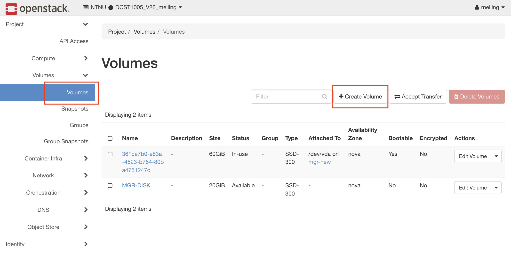
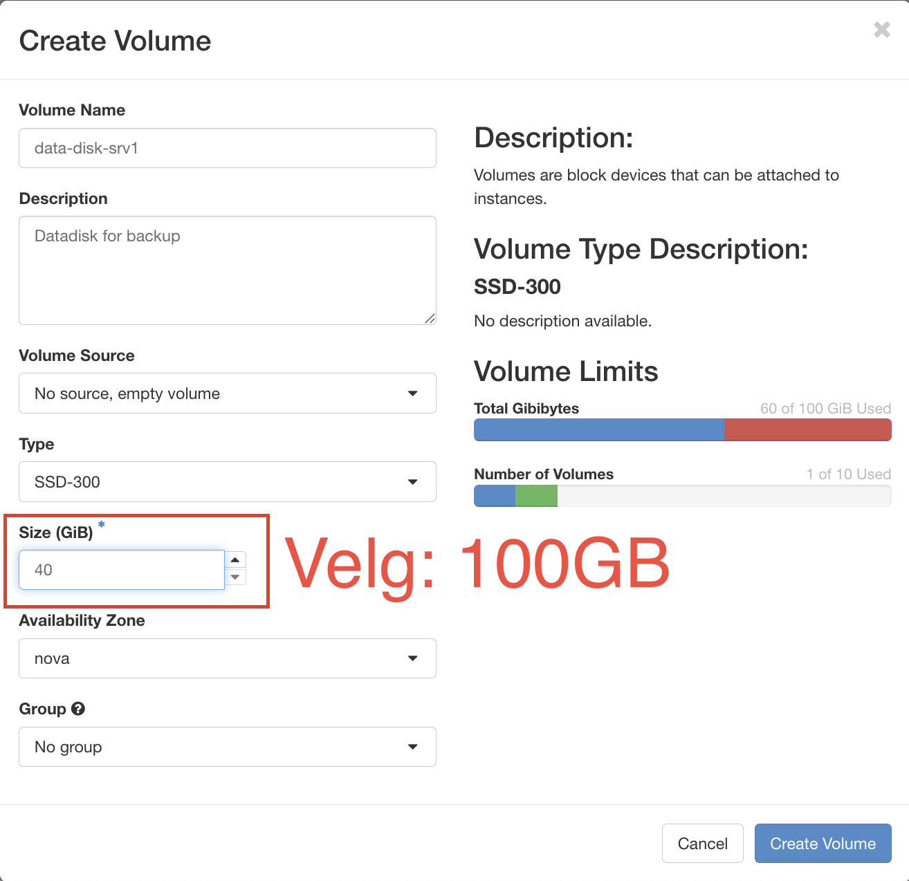
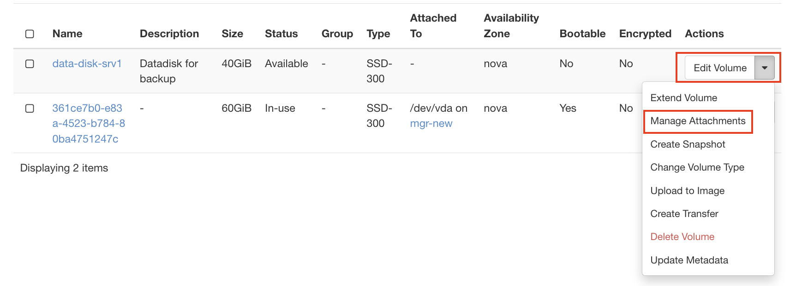
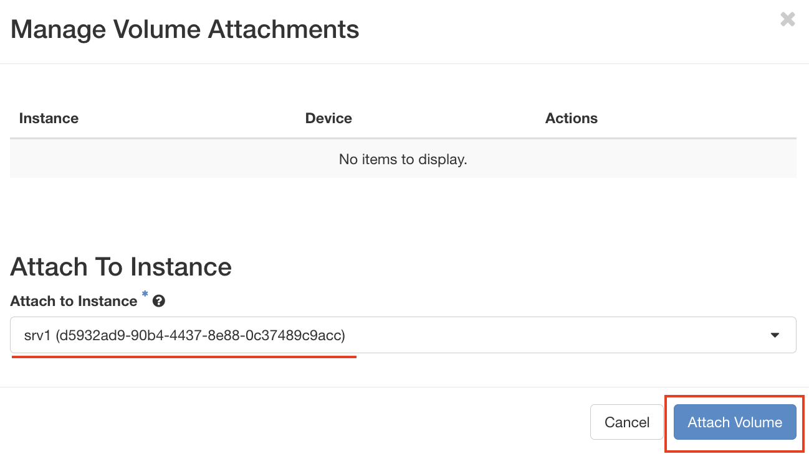
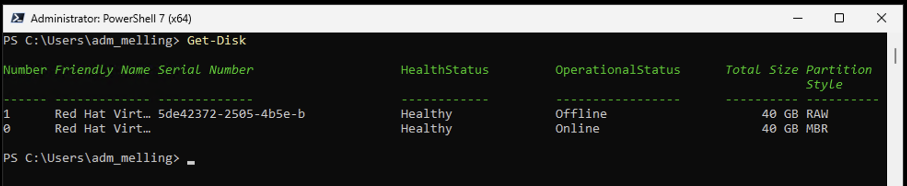
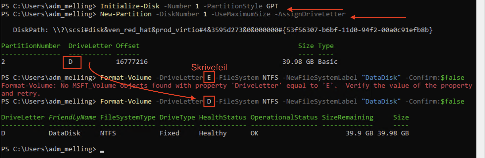

# Opprette og koble til Volume i OpenStack

## Innledning

Et **volume** i OpenStack er en virtuell disk som kan kobles til en virtuell maskin (VM). Volumes fungerer som eksterne harddisker og gir flere fordeler:

- **Persistens**: Data på et volume overlever selv om VM-en slettes
- **Fleksibilitet**: Volumes kan flyttes mellom forskjellige VM-er
- **Skalerbarhet**: Du kan enkelt legge til mer lagringsplass etter behov
- **Backup**: Volumes kan snapshotes og sikkerhetskopieres uavhengig av VM-en

I dette dokumentet lærer du hvordan du oppretter et volume og kobler det til en eksisterende VM via OpenStack Horizon dashboard.

---

## Del 1: Opprette et Volume

### Steg 1: Logg inn på OpenStack
1. Gå til https://skyhigh.iik.ntnu.no/
2. Logg inn med dine NTNU-legitimasjon

### Steg 2: Naviger til Volumes
1. I venstre meny, klikk på **Volumes** → **Volumes**
2. Du vil se en oversikt over eksisterende volumes

### Steg 3: Opprett nytt Volume
1. Klikk på **Create Volume**-knappen (øverst til høyre)
   1. 
2. Fyll ut følgende felt:

   | Felt | Verdi | Forklaring |
   |------|-------|------------|
   | **Volume Name** | For eksempel: `data-disk-srv1` | Beskrivende navn som forteller hva volumet skal brukes til |
   | **Description** | Valgfri beskrivelse | F.eks. "Datadisk for backup" |
   | **Volume Source** | No source, empty volume | Oppretter et tomt, uformatert volume |
   | **Type** | SSD-300 | Volumetype avhenger av din OpenStack-konfigurasjon |
   | **Size (GiB)** | `100` | Størrelsen på volumet i gigabytes |
   | **Availability Zone** | nova (vanligvis standard) | Hvor volumet fysisk lagres |

‼️ **MERK! Bildet viser 40 GB, som er kun for å illustrere, velg 100 GB** ‼️

3. Klikk **Create Volume**

### Steg 4: Verifiser opprettelsen
- Volumet skal nå vises i listen med status **Available**
- Dette betyr at volumet er klart til å kobles til en VM

> **Viktig**: Et volume med status "Available" er ikke i bruk og inneholder ingen data ennå.

---

## Del 2: Koble Volume til en Virtual Machine

### Steg 1: Gå til Instances
1. I venstre meny, klikk på **Compute** → **Instances**
2. Finn den VM-en du vil koble volumet til (f.eks. SRV1, CL1)

### Steg 2: Attach Volume
Det er to måter å koble til et volume:

#### **Metode A: Fra Instances-siden**
1. Lokalisér din VM i listen
2. I høyre side av VM-raden, klikk på nedtrekkspilen ved **Actions**
3. Velg **Attach Volume**
4. I dialogen som åpnes:
   - Velg volumet du opprettet fra nedtrekksmenyen
   - Klikk **Attach Volume**

#### **Metode B: Fra Volumes-siden**
1. Gå tilbake til **Volumes** → **Volumes**
2. Finn volumet du opprettet
3. I høyre side av volume-raden, klikk på nedtrekksmenyen
4. Velg **Manage Attachments**
   1. 
5. Velg hvilken **Instance** (VM) volumet skal kobles til
6. Klikk **Attach Volume**
   1. 

### Steg 3: Verifiser tilkoblingen
- Volumet vil nå ha status **In-use**
- Under kolonnen **Attached To** ser du hvilken VM volumet er koblet til
- Merk deg **device-navnet**, f.eks. `/dev/vdb` eller `/dev/sdb`

---

## Del 3: Bruke Volumet i Windows Server

Når et volume er koblet til en Windows VM, vises det som en ny disk, men den er **ikke formatert** eller tildelt en stasjonsbokstav ennå.

### Steg 1: Koble til VM-en
1. Bruk Remote Desktop SRV1 VM-en

### Steg 2: Initialiser disken via PowerShell (anbefalt metode) (Se video for GUI ved bruk av Disk Management)

```powershell
# Vis alle disker
# Identifiser den nye disken (vanligvis Disk 1, status "Raw" eller "Offline")
Get-Disk
```


```powershell
# Initialiser disken med GPT partition style
Initialize-Disk -Number 1 -PartitionStyle GPT
```

```powershell
# Opprett en partisjon som bruker all tilgjengelig plass
New-Partition -DiskNumber 1 -UseMaximumSize -AssignDriveLetter
```

```powershell
# Formater partisjonen med NTFS
# Bytt ut "D" med den stasjonsbokstaven som ble tildelt
Format-Volume -DriveLetter D -FileSystem NTFS -NewFileSystemLabel "DataDisk" -Confirm:$false
```


### Steg 3: Verifiser
```powershell
# Sjekk at den nye stasjonen er tilgjengelig
Get-Volume
```

```powershell
# Test ved å opprette en fil
New-Item -Path "D:\test.txt" -ItemType File -Value "Volume fungerer!"
Get-Content "D:\test.txt"
```

### Alternativ: Via GUI (Disk Management)
1. Åpne **Server Manager** → **Tools** → **Computer Management**
2. Velg **Disk Management** i venstre meny
3. Du vil se den nye disken som "Unknown" og "Not Initialized"
4. Høyreklikk på disken → **Initialize Disk** → Velg **GPT** → OK
5. Høyreklikk på det uallokerte området → **New Simple Volume**
6. Følg veiviseren: tildel stasjonsbokstav og velg **NTFS**-formatering

---

## Vanlige Problemer og Løsninger

### Problem: "Volume shows as Available but VM doesn't see it"
**Løsning**: Volumet er koblet til OpenStack, men ikke initialisert i Windows. Følg Del 3.

### Problem: "Cannot attach volume - already in use"
**Løsning**: Et volume kan kun være koblet til én VM om gangen. Koble fra (detach) volumet først.

### Problem: "Disk shows as Offline in Windows"
**Løsning**:
```powershell
# Sett disken online
Set-Disk -Number 1 -IsOffline $false
```

---
