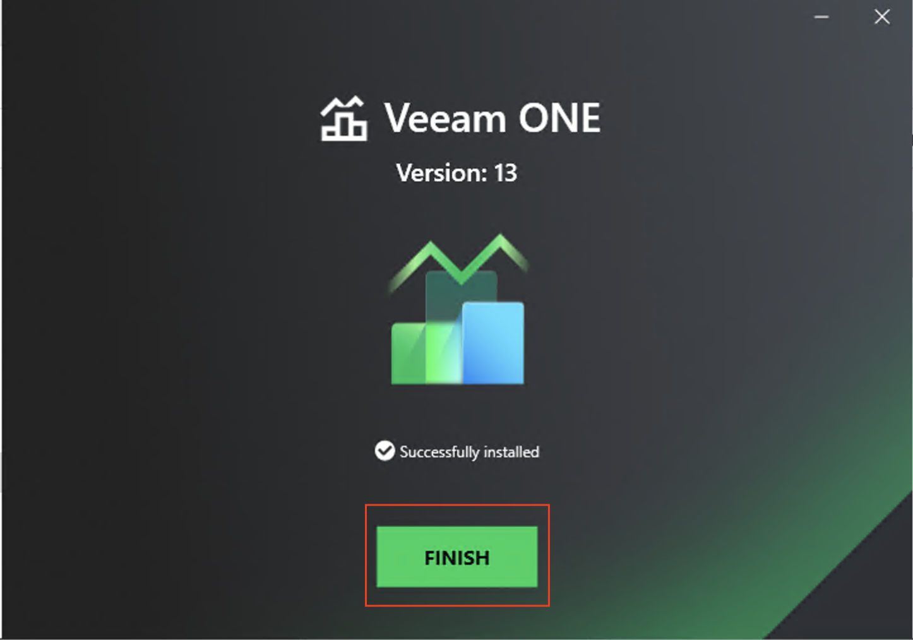
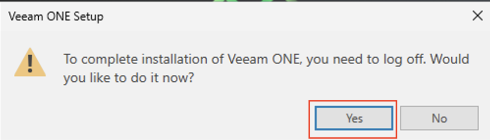
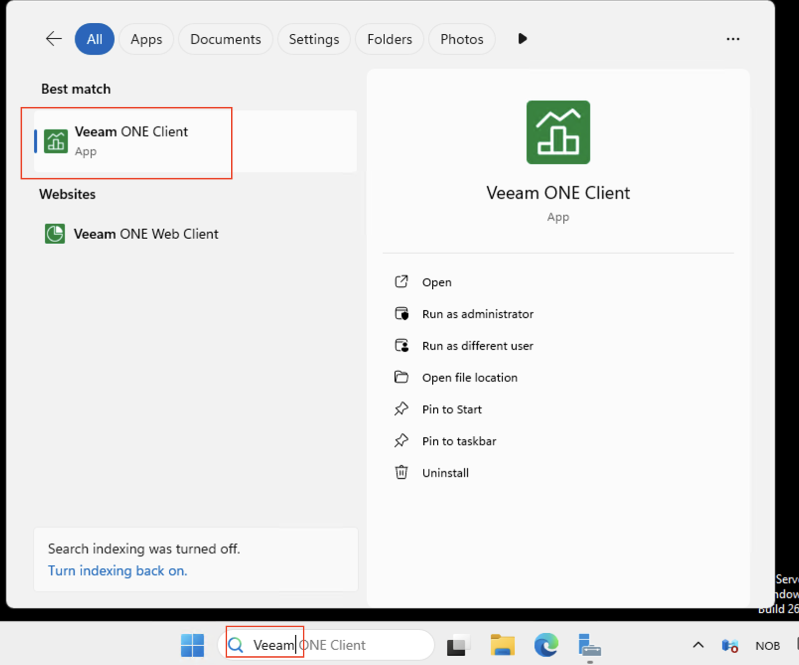
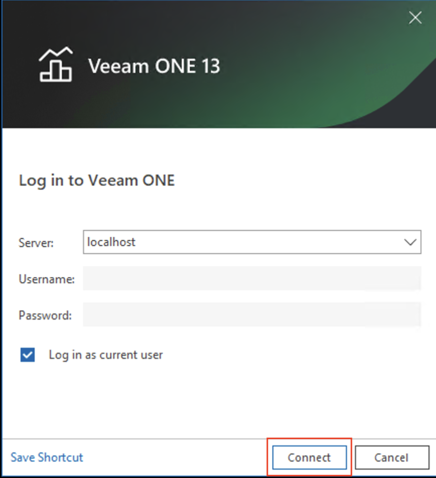
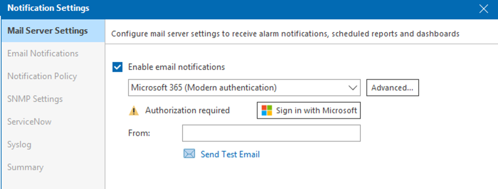
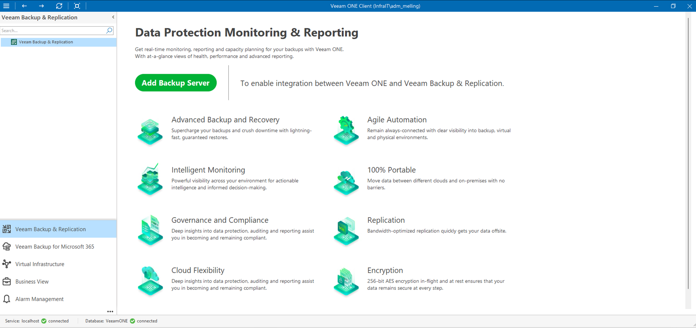

# Laste ned og installere VEEAM ONE på SRV1

## Innledning

**VEEAM One** Veeam ONE er et omfattende overvåkings-, rapporterings- og analyseverktøy utviklet for Veeam Backup & Replication-miljøer, virtuell infrastruktur (VMware vSphere/Hyper-V) og fysiske/skybaserte arbeidsbelastninger. Det gir sanntidsoversikt, intelligent diagnostikk og AI-drevet innsikt for proaktivt å administrere sikkerhetskopier, sikre databeskyttelse og optimalisere ressursytelsen.

- Kobler til SRV1 via Remote Desktop
- Laster ned VEEAM-installasjonsfil (.iso) og lisensfil direkte til D:\
- Starter installasjonen ved å dobbeltklikke på ISO-filen

> **Hvorfor D:\?** I vårt testmiljø er C:\-disken (boot-disk) begrenset i størrelse. VEEAM-installasjonsfiler er store (4-6 GB), og installasjonen krever betydelig diskplass. Derfor bruker vi D:\-volumet som har mer tilgjengelig plass.

---

## Del 1: Koble til SRV1 via Remote Desktop
- Kjent fremgangsmåte..

## Del 2: Forbered D:\-disken

### Steg 1: Åpne File Explorer
1. Inne på SRV1, klikk på **File Explorer**-ikonet i oppgavelinjen
2. Opprett deretter en mappe som heter InstallFiles. Høyreklikk og velg:
   1. 
---

## Del 2: Last ned VEEAM filer fra filesender.sikt.no

### Steg 1: Få tilgang til nedlastingslenken
1. Lenken for nedlasting ligger i BlackBoard under Undervisningsmateriell.
   1. MERK! Last ned filen på SRV1 maskinen, ikke til din egen maskin. Kopier lenken inn til SRV1.
   2. 
2. Åpne deretter lenken på SRV1 i Edge, og **høyreklikk på Donwnload-knappen og velg Save link as..**
   1. 
3. Velg å **laste ned til D:\InstallFiles mappen som tidligere opprettet**
   1. 

**Nedlastingen starter:**
- Du vil se fremdriften nederst i nettleservinduet
- Nedlastingen kan ta **5-20 minutter** avhengig av nettverkshastighet
- En ISO-fil på ~5 GB ved 50 Mbps tar ca. 13 minutter

> **Viktig**: Mens nedlastingen pågår:
> - **Ikke lukk nettleseren**

### Steg 2: Sjekk nedlastingsfremdrift

**Slik ser du fremdriften:**
1. Klikk på **nedlastingsikonet** (pil ned) i øvre høyre hjørne av Edge
2. Eller trykk **Ctrl+J** for å åpne nedlastingsoversikten
3. Du vil se:
   - Filnavn
   - Nedlastet størrelse / Total størrelse
   - Gjenstående tid
   - Fremdriftslinje

### Steg 3: Last ned lisensfilen

**Mens ISO-filen lastes ned** (eller etter at den er ferdig), last ned lisensfilen:

1. Kopier lenken til lisensfilen fra BlackBoard inn til SRV1 og last ned filen.

> **Merk**: Lisensfilen er veldig liten (5 KB) og lastes ned umiddelbart (under 1 sekund).

### Steg 4: Vent til ISO-filen er ferdig nedlastet

**Hvordan vet du at nedlastingen er fullført?**
1. Åpne nedlastingsoversikten (Ctrl+J)
2. Når nedlastingen er ferdig, vil det stå:
   - **"Show in folder"** eller **"Vis i mappe"**
   - Ingen fremdriftslinje
   - Grønn hake eller "Complete"

---

## Del 3: Verifiser nedlastede filer

### Steg 1: Åpne File Explorer og gå til D:\VEEAM
1. Åpne File Explorer (Windows + E)
2. Naviger til **D:\InstallFiles**

### Steg 2: Sjekk at begge filene er der
Du skal nå se to filer:
- **VeeamONE_XX.X.X.XXXX.iso** (ca. 3-6 GB)
- **veeam_backup_nfr_XX_XXXXX.lic** (ca. 5 KB)
- 
---

## Del 4: Monter ISO-filen og start installasjonen

### Steg 1: Monter ISO-filen
1. I File Explorer, naviger til **D:\VEEAM**
2. **Dobbeltklikk på ISO-filen** (VeeamONE_XX.X.X.XXXX.iso)
3. Windows vil automatisk "montere" ISO-en som et virtuelt DVD-drev
   1. 
   2. 
   3. 
4. Hvis du får en "User Account Control"-melding, klikk **Yes**

**Hva skjer:**
- ISO-filen blir behandlet som om du satte inn en DVD
- Et nytt drev dukker opp i **This PC** (f.eks. E:\ eller F:\)
- File Explorer åpner automatisk det nye drevet

---

## Del 5: Følg installasjonsveiviseren

### Steg 1: Velkomstsiden
1. Du vil se VEEAM-velkomstsiden
2. Klikk **Install** under "Veeam ONE"
   1. 
3. Velg **Install Veeam ONE**
   1. 
4. **"License agreement"**
5. Klikk **I Accept**
6. Velg deretter å finne frem til lisensfilen som en har lastet ned tidligere:
   1. 
   2. 
7. Klikk **Next**

> **Viktig**: Hvis du hopper over dette steget, vil VEEAM installeres i trial-modus (30 dager).

### Steg 2: Angi domenekonto for Veeam ONE

Vent deretter på **System Configuration Check** (kan ta litt tid)

### Steg 3: Velg installasjonsplassering
### 1. Customize Settings

### 2. Klikk **Next**, med alle Components markert for installasjon

### 3. La Monitoring Database stå til default valg:

### 4. La Reporting Database stå til default valg:

### 5. Velg deretter å installere det på D:\ i stedet for på C:\

### 6. Velg D:\ -> Høyreklikk, og velg New Folder. Navngi mappen VEEAM

### 7. Dobbeltklikk på mappen VEEAM og velg deretter Select Folder:

### 8. Når den er ferdig med å sjekke tilgjengelig diskplass, sjekk at det står til D:\ og trykk deretter Next

### 9. La det stå til Veeam backup data only

### 10. La alle porter stå til default

### 11. Install - Vil ta litt tid! Det er mye som skal installeres.. Database, applikasjon etc. etc..

### 12. Når installasjonen er ferdig, FINISH (Merk: Min installasjon tok 62 minutter)

### 13. Logg ut og inn igjen etter installasjon er ferdig:

---

## Del 7: Verifiser installasjonen

### Steg 1: Sjekk at VEEAM er installert
1. Åpne **Start-menyen**
2. Søk etter **"Veeam"**

3. **Frivillig:** Test om det er mulig med e-postvarsel til sin NTNU-konto. Logg på med NTNU-brukere for Microsoft 365. (MERK: har ikke testet selv)

## ALT ER KLART 🎉

---

## Oppsummering

Du har nå:
1. ✅ Koblet til SRV1 via Remote Desktop
2. ✅ Opprettet D:\InstallFiles for nedlastede filer
3. ✅ Lastet ned VEEAM ISO-installasjonsfil (4-6 GB) til D:\InstallFiles
4. ✅ Lastet ned VEEAM-lisensfil til D:\InstallFiles
5. ✅ Montert ISO-filen ved å dobbeltklikke på den
6. ✅ Startet installasjonsveiviseren (Setup.exe)
7. ✅ Fulgt installasjonsveiviseren med fokus på å bruke D:\ for lagring
8. ✅ Verifisert at VEEAM er installert og lisensiert korrekt

---

**Gratulerer!** Du har nå installert Veeam ONE. 🥳