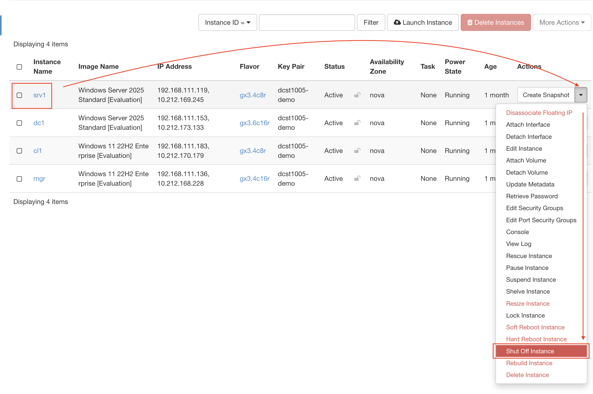

# Changing VM Flavor in OpenStack SkyHigh

## Overview
In this guide, you will learn how to change the flavor of a Virtual Machine (srv1) in OpenStack - SkyHigh. This is necessary to ensure adequate resources for installing VEEAM Backup and Replication.

### Current Configuration
- Virtual Machine: srv1
- Current Flavor: gx1.2c4r (2 CPU, 4GB RAM)
- Target Flavor: gx3.4c8r (4 CPU, 8GB RAM)

## Prerequisites
- Access to OpenStack SkyHigh dashboard
- The virtual machine (srv1) must be shut down before changing the flavor

## Step-by-Step Instructions

### 1. Prepare the Virtual Machine
1. Log in to OpenStack SkyHigh dashboard
2. Locate srv1 in your list of instances
3. If the VM is running, perform a graceful shutdown (or shutdown from Remote Desktop):
   - Select srv1
   - Click on the "Shut Off Instance" option
   - Wait for the status to show as "Shutoff"



### 2. Change the Flavor
1. With srv1 shut down:
   - Click on the instance name "srv1"
   - From the dropdown menu, select "Resize Instance"
2. In the Resize Instance dialog:
   - Select the new flavor "gx3.4c8r" from the flavor list
   - Verify the new specifications (4 CPU, 8GB RAM)
   - Click "Resize"

[Image Placeholder: Screenshot of resize dialog]

### 3. Confirm the Resize
1. Once the resize operation completes:
   - The status will change to "Verify Resize/Migrate"
   - Click "Confirm Resize/Migrate"
2. Wait for the operation to complete
   - Status should return to "Shutoff"

[Image Placeholder: Screenshot of confirming resize]

### 4. Start the Virtual Machine
1. Start srv1:
   - Select the instance
   - Click "Start Instance"
2. Verify the new configuration:
   - Check the instance details
   - Confirm new flavor shows as gx3.4c8r

[Image Placeholder: Screenshot of instance details showing new configuration]

## Verification
To ensure the resize was successful:
1. Check the instance details in OpenStack
2. Log into the VM and verify the resources:
   ```bash
   # Check CPU
   nproc
   # Check RAM
   free -h
   ```

## Troubleshooting
If you encounter issues:
- Ensure the VM is completely shut down before attempting the resize
- Verify you have sufficient quota for the new flavor
- Check the OpenStack logs for any error messages
- Contact your instructor if problems persist

## Next Steps
With the proper resources now allocated, you can proceed with the installation of VEEAM Backup and Replication.

---
**Note**: Remember to document any issues encountered during this process for future reference.