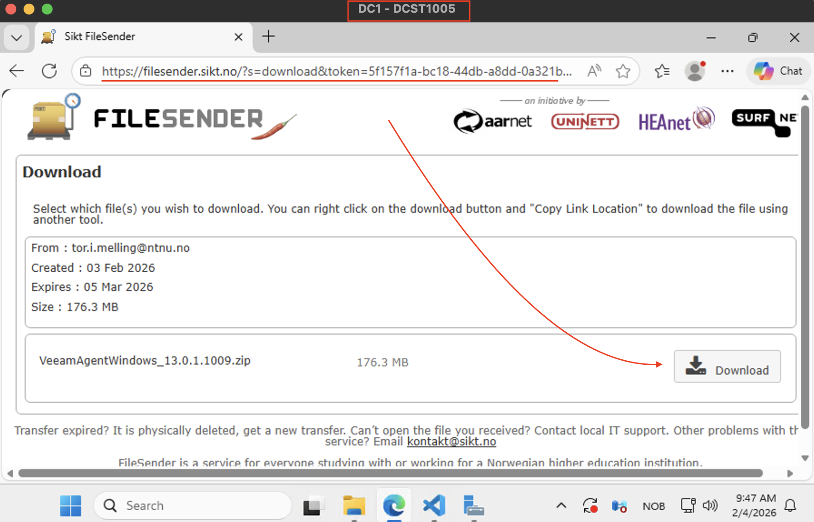
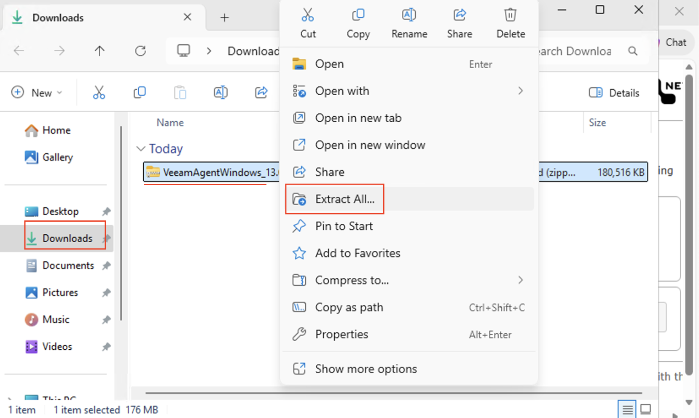
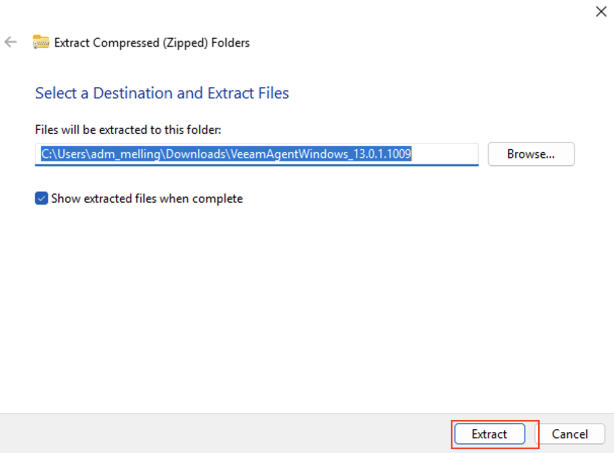
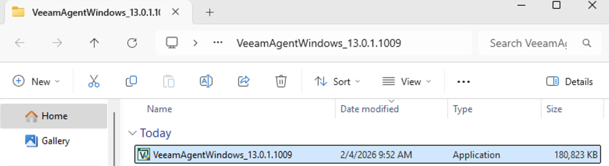
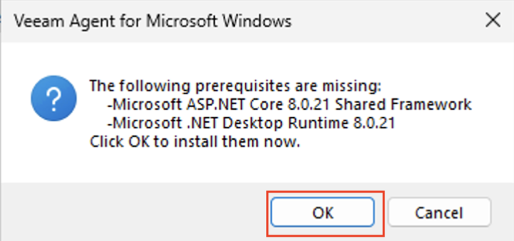
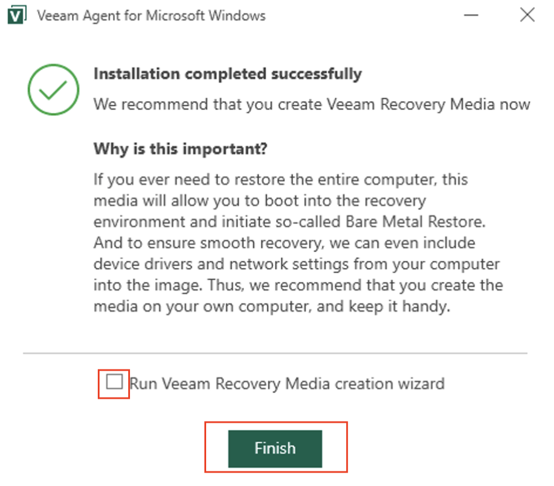

# Installere VEEAM Agent på DC1

## Innledning

**VEEAM Agent for Windows** er en klientkomponent som installeres på individuelle Windows-servere og -maskiner for å muliggjøre backup og restore. I motsetning til VEEAM Backup & Replication som kjører sentralt på SRV1, installeres VEEAM Agent lokalt på hver maskin som skal sikkerhetskopiere.

### Hvorfor installere VEEAM Agent på DC1?

- **Domain Controller-backup**: DC1 er domenekontrolleren og inneholder kritisk Active Directory-data
- **Systemtilstand**: VEEAM Agent kan sikkerhetskopiere Windows System State, inkludert AD-databasen
- **Fleksibilitet**: Agenten kan kjøre lokale backups eller koble til VEEAM Backup & Replication på SRV1
- **Disaster Recovery**: Raskere gjenoppretting av domenekontroller ved feil

I denne guiden lærer du hvordan du:
- Finner nedlastingslenken i Blackboard
- Laster ned VEEAM Agent for Windows på DC1
- Installerer agenten via installasjonsveiviseren

---

## Del 1: Finn nedlastingslenken i Blackboard

### Steg 1: Logg inn på Blackboard

### Steg 2: Finn VEEAM Agent-lenken
1. Gå til Undervisningsmateriell
2. Finn riktig uke (6) som inneholder VEEAM-ressurser
3. Lokalisér **"VEEAM Agent for Windows"**-lenken
4. Lenken vil være en direkte nedlastingslenke

### Steg 3: Kopier lenken
**Viktig: Ikke klikk på lenken ennå!**

1. **Høyreklikk** på nedlastingslenken
2. Velg **"Copy link address"** eller **"Kopier lenkeadresse"**
3. Lenken er nå kopiert til utklippstavlen

---

## Del 2: Koble til DC1 og forbered nedlasting

### Steg 1: Koble til DC1
1. Åpne Remote Desktop Connection (mstsc)
2. Koble til **DC1.InfraIT.sec** eller DC1s IP-adresse
3. Logg inn med din administrative konto: **InfraIT\adm_<dittbrukernavn>**

### Steg 2: Åpne nettleser på DC1
1. Klikk på **Start**-menyen
2. Søk etter **"Edge"** eller **"Internet Explorer"**
3. Åpne nettleseren
4. Lim inn adressen og last ned Veeam Agent for Windows

---
## Del 3: Installer VEEAM Agent

### Steg 1: Start installasjonen
1. I File Explorer, **Downloads** mappen.
2. Høyreklikk på filen og velg **Extract all**
   1. 
   2. 
3. Åpne mappe, om den ikke åpner av selg selv
4. Dobbeltklikk på **VeeamAgentWindows_13.0.x.x.x**
   1. 
5. Hvis du får en **User Account Control**-melding, klikk **Yes** eller **Ja**
6. Installasjonsveiviseren starter
   1. 
7. Følg Installasjonsveiviseren
8. Huk av for **"I accept the terms in the license agreement"**
9. Klikk **Next**
10. Ta vekk avhukingen for Recovery Media Wizard
    1.  

---

## Oppsummering

Du har nå:
1. ✅ Funnet nedlastingslenken for VEEAM Agent i Blackboard
2. ✅ Kopiert lenken og brukt den på DC1
3. ✅ Lastet ned VEEAM Agent for Windows på DC1
4. ✅ Installert VEEAM Agent via installasjonsveiviseren

---

## Neste Steg

Nå som VEEAM Agent er installert på DC1, er du klar for neste fase:

### I neste øvelse vil du lære:
1. **Koble VEEAM Agent til VEEAM Backup & Replication** på SRV1
2. **Opprette en backup job** for DC1 som inkluderer:
   - System State (Active Directory)
   - C:\ disk
   - Kritiske systemfiler
3. **Konfigurere backup schedule** (daglig, ukentlig, etc.)
4. **Teste backup og restore** av filer og System State
5. **Overvåke backup-status** og feilsøke problemer

### Forberedelse til neste øvelse:
- VEEAM Backup & Replication må kjøre på SRV1
- DC1 må ha nettverkstilgang til SRV1
- D:\VeeamBackup må ha tilstrekkelig ledig plass (minimum 20 GB anbefalt)

**Gratulerer!** Du har nå installert VEEAM Agent på domenekontrolleren og er klar til å konfigurere enterprise-grade backup.