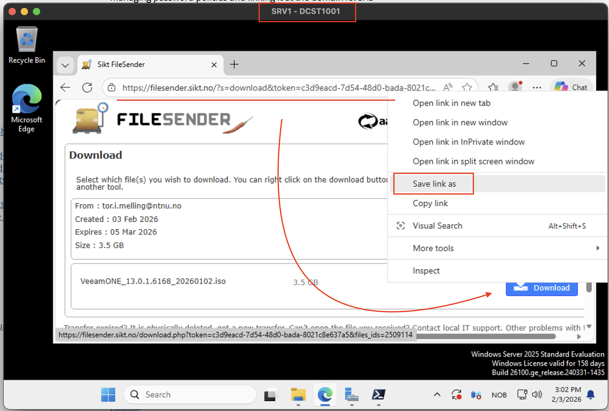
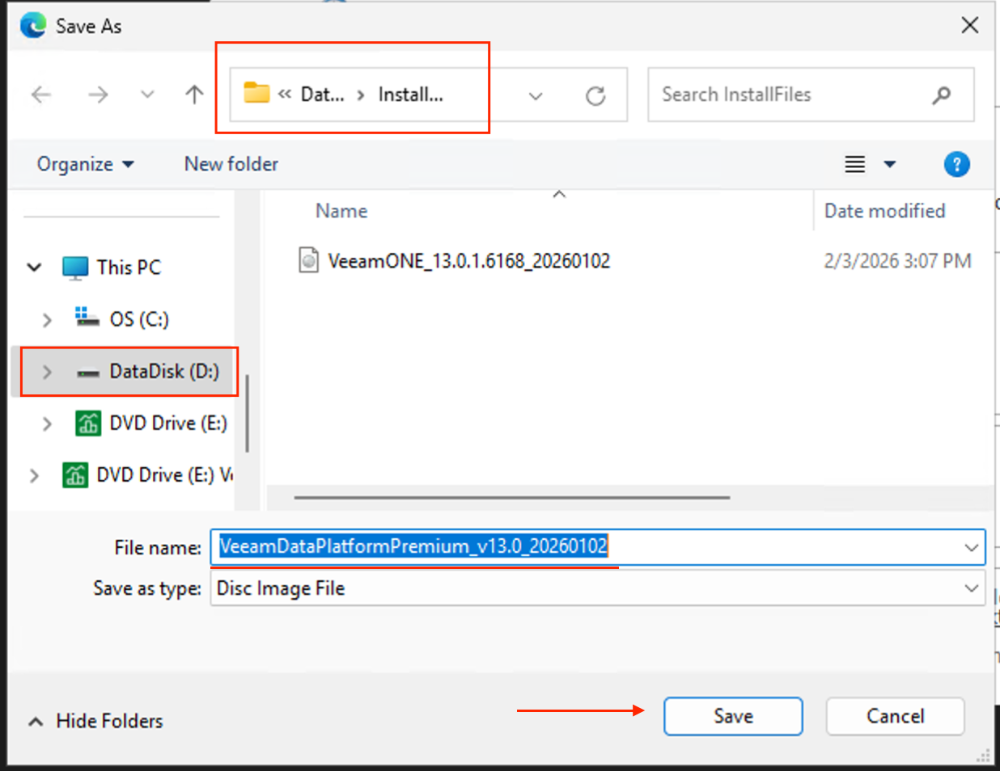
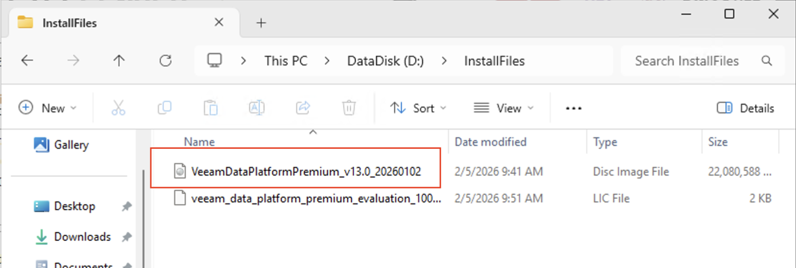
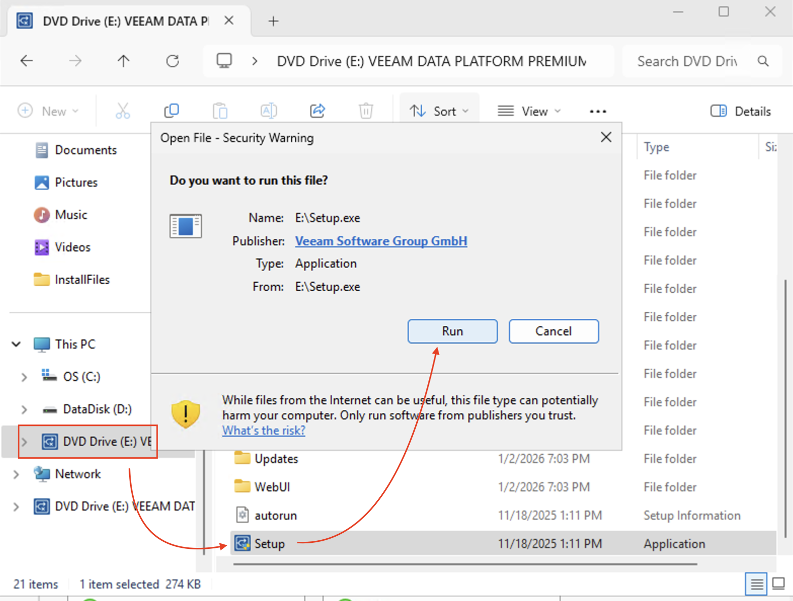
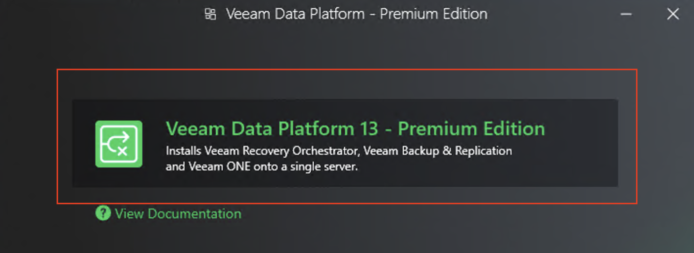

# Laste ned og installere VEEAM Data Platform Permium (tidligere Backup & Replication) på SRV1

## Innledning

**VEEAM Data Platform Permium** er en profesjonell backup-løsning som brukes i mange enterprise-miljøer for sikkerhetskopi av servere, VM-er og data. I denne guiden lærer du hvordan du:

- Kobler til SRV1 via Remote Desktop
- Laster ned VEEAMDataPlatformPremim-installasjonsfil (.iso) direkte til D:\
- Starter installasjonen ved å dobbeltklikke på ISO-filen

> **Hvorfor D:\?** I vårt testmiljø er C:\-disken (boot-disk) begrenset i størrelse. VEEAM-installasjonsfiler er store (4-6 GB), og installasjonen krever betydelig diskplass. Derfor bruker vi D:\-volumet som har mer tilgjengelig plass.

---

## Del 1: Koble til SRV1 via Remote Desktop

### Steg 1: Åpne Remote Desktop Connection
1. På din lokale PC, trykk **Windows + R**
2. Skriv `mstsc` og trykk **Enter**
3. Remote Desktop Connection åpnes

### Steg 2: Koble til SRV1
1. I **Computer**-feltet, skriv inn:
   - `SRV1.InfraIT.sec` (hvis du er koblet til domenet)
   - Eller IP-adressen til SRV1
2. Klikk **Connect**
3. Logg inn med din administrative konto:
   - Brukernavn: `InfraIT\adm_<dittbrukernavn>` eller `adm_<dittbrukernavn>`
   - Passord: ditt administrative passord

> **Viktig**: Bruk alltid din personlige administrative konto (adm_<brukernavn>) for administrative oppgaver, ikke den delte Admin-kontoen.

---

## Del 2: Last ned VEEAM-filer fra filesender.sikt.no

## Del 2: Last ned VEEAM filer fra filesender.sikt.no

### Steg 1: Få tilgang til nedlastingslenken
1. Lenken for nedlasting ligger i BlackBoard under Undervisningsmateriell.
2. MERK! Last ned filen på SRV1 maskinen, ikke til din egen maskin. Kopier lenken inn til SRV1.
3. Åpne deretter lenken på SRV1 i Edge, og **høyreklikk på Donwnload-knappen og velg Save link as..**
   1. 
4. Opprett en mappe på D:\ som heter InstallFiles å **laste ned til D:\InstallFiles** (se bort i fra VeeamONE filen, ikke relevant for oss)
   1. 

### Steg 2: Last ned lisensfil
1. Kopier lenken for lisensfilen fra BlackBoard over til SRV1
2. Last ned filen på SRV1, kan også legges på InstallFiles-mappen på D:\

### Steg 3: Se oversikt over tilgjengelige filer
Du vil nå se en liste over filer som kan lastes ned:
- **VeeamDataPlatformPremim_XX.X.X.XXXX.iso** - Installasjonsfil (ca. 20+ GB) - Stor fil, vil ta litt tid før den er ferdig nedlastet
- **Veeam_data_platform_premium_evalution_1000.lic** - Lisensfil. (ca 2KB)
- Klikk på **nedlastingsikonet** (pil ned) i øvre høyre hjørne av Edge
- Eller trykk **Ctrl+J** for å åpne nedlastingsoversikten



## Del 3: Monter ISO-filen og start installasjonen

### Steg 1: Monter ISO-filen
1. I File Explorer, naviger til **D:\InstallFiles**
2. **Dobbeltklikk på ISO-filen** (VeeamDataPlatformPremim_XX.X.X.XXXX.iso)
3. Windows vil automatisk "montere" ISO-en som et virtuelt DVD-drev

**Hva skjer:**
- ISO-filen blir behandlet som om du satte inn en DVD
- Et nytt drev dukker opp i **This PC** (f.eks. E:\ eller F:\)
- File Explorer åpner automatisk det nye drevet

### Steg 2: Finn installasjonsveiviseren
Når ISO-en er montert, skal du se innholdet av installasjonsmediet:
- **Setup.exe** - Dette er installasjonsprogrammet
- Flere mapper med navn som "Backup", "Redistr", "Packages", osv.

### Steg 3: Start installasjonen
1. **Dobbeltklikk på Setup.exe**
2. Hvis du får en "User Account Control"-melding, klikk **Yes** eller **Ja**
3. VEEAM Data Platform Premium installasjonsveiviser starter
   1. 

---

## Del 6: Følg installasjonsveiviseren

### Steg 1: Velkomstsiden
1. Du vil se VEEAM-velkomstsiden
2. Klikk **Install** og velg deretter Data Platform Premium
   1. 

### Steg 2: Lisensavtale
1. Les gjennom lisensavtalen
2. Huk av for **"I accept the terms in the license agreement"**
3. Klikk **Next**

### Steg 3: Lisensinstallasjon
1. Du vil bli bedt om å velge en lisensfil
2. Klikk **Browse** eller **Bla gjennom**
3. Naviger til **D:\InstallFiles\veeam_backup_nfr_XX_XXXXX.lic**
4. Velg lisensfilen og klikk **Open**
5. Klikk **Next**

> **Viktig**: Hvis du hopper over dette steget, vil VEEAM installeres i trial-modus (30 dager).

### Steg 4: Program Features
1. Her kan du velge hvilke komponenter som skal installeres
2. **Anbefaling for lab-miljø**: La alle standardvalg stå
3. Klikk **Next**

### Steg 5: System Configuration Check
1. Installasjonsveiviseren sjekker systemkrav
2. Hvis alt er grønt (OK), klikk **Next**
3. Hvis det er advarsler (gult), les dem nøye - de fleste kan ignoreres i lab-miljø

### Steg 6: Default Backup Repository

**Dette er viktig - vi skal bruke D:\ for backup-lagring!**

1. Du vil se en sti for "Default backup repository"
2. **Standard er C:\Backup** - dette må endres!
3. Klikk **Browse** eller **Bla gjennom**
4. Naviger til **D:\**
5. Klikk **Make New Folder** eller **Opprett ny mappe**
6. Gi mappen navnet **VeeamBackup**
7. Velg denne mappen (D:\InstallFilesBackup)
8. Klikk **OK** og deretter **Next**

> **Hvorfor D:\?** Backup-filer kan bli svært store og C:\ har begrenset plass.

### Steg 7: Database Configuration
1. VEEAM bruker en database for å holde oversikt over backups
2. **Standard**: VEEAM installerer sin egen SQL Server Express-instans
3. **Anbefaling**: La standardvalgene stå for lab-miljø
4. Klikk **Next**

### Steg 8: Service Account
1. VEEAM trenger en tjenestekonto
2. **Anbefaling for lab**: Bruk **Local System account**
3. I produksjonsmiljø ville man brukt en dedikert domenekonto
4. Klikk **Next**

### Steg 9: Default Gateway Server Ports
1. Her konfigureres porter for kommunikasjon
2. **Anbefaling**: La standardportene stå (9392, 9395, osv.)
3. Klikk **Next**

### Steg 10: Ready to Install
1. Du vil nå se en oppsummering av installasjonsvalg
2. **Verifiser at backup repository er på D:\InstallFilesBackup**
3. Klikk **Install** for å starte installasjonen

### Steg 11: Installasjonsprosess
- Installasjonen tar **10-20 minutter**
- Du vil se fremdrift for ulike komponenter
- Ikke avbryt installasjonen

### Steg 12: Installation Complete
1. Når installasjonen er ferdig, vil du se "Installation Complete"
2. Huk av for **"Launch Veeam Backup & Replication Console"** hvis du vil åpne programmet
3. Klikk **Finish**

---

## Del 7: Verifiser installasjonen

### Steg 1: Sjekk at VEEAM er installert
1. Åpne **Start-menyen**
2. Søk etter **"Veeam"**
3. Du skal se:
   - **Veeam Backup & Replication Console**
   - **Veeam Backup & Replication Documentation**

### Steg 2: Åpne VEEAM Console
1. Klikk på **Veeam Backup & Replication Console**
2. Hvis du får en User Account Control-melding, klikk **Yes**
3. VEEAM Console åpner
4. Du skal se hovedvinduet med menylinjer og verktøy

### Steg 3: Verifiser lisens
1. I VEEAM Console, klikk på **Menu** (øverst til venstre)
2. Velg **License** eller **Lisens**
3. Sjekk at:
   - Lisenstype vises (NFR - Not For Resale)
   - Utløpsdato vises
   - Status er **Valid**

### Steg 4: Sjekk diskforbruk
1. Åpne File Explorer (Windows + E)
2. Høyreklikk på **D:\**
3. Velg **Properties** eller **Egenskaper**
4. Sjekk **Free space** - du skal fortsatt ha flere GB ledig

---

## Beste Praksis og Tips

### Mappestruktur etter installasjon
Etter installasjonen vil D:\ ha følgende struktur:
```
D:\
├── VEEAM\
│   ├── VeeamDataPlatformPremim_XX.X.X.XXXX.iso  (kan slettes etter installasjon)
│   └── veeam_backup_nfr_XX_XXXXX.lic            (behold denne!)
└── VeeamBackup\                                  (opprettet under installasjon)
    └── (backup-filer vil lagres her)
```

### Skal jeg slette ISO-filen?
**Anbefaling:**
- **Behold ISO-filen** hvis du har plass (for re-installasjon eller reparasjon)
- **Slett ISO-filen** hvis du trenger diskplass
- **Alltid behold lisensfilen** - den er liten og nødvendig

**Slik sletter du ISO-filen:**
1. Først, **avmonter ISO-filen**:
   - Gå til **This PC** i File Explorer
   - Høyreklikk på det virtuelle DVD-drevet (f.eks. E:\)
   - Velg **Eject** eller **Løs ut**
2. Gå til **D:\InstallFiles**
3. Høyreklikk på ISO-filen
4. Velg **Delete**

### Sikkerhetskopiering av lisensfil
**Viktig:**
1. Lisensfilen er verdifull og bør sikkerhetskopieres
2. Kopier **veeam_backup_nfr_XX_XXXXX.lic** til en trygg lokasjon:
   - Lagre en kopi på din lokale PC
   - Eller send til deg selv på e-post
   - Eller lagre i et delt område som ikke slettes

---

## Vanlige Problemer og Løsninger

### Problem: "ISO-filen monteres ikke når jeg dobbeltklikker"
**Løsning:**
1. Høyreklikk på ISO-filen
2. Velg **Mount** eller **Monter**
3. Hvis dette alternativet ikke finnes:
   - Høyreklikk → **Open with** → **Windows Explorer**

### Problem: "Setup.exe kjører ikke - 'Access Denied'"
**Løsning:**
- Sørg for at du er logget inn med administratorkonto (adm_<brukernavn>)
- Høyreklikk på Setup.exe → **Run as administrator**

### Problem: "Ikke nok plass til installasjon"
**Løsning:**
- Sjekk ledig plass på D:\ (høyreklikk → Properties)
- Du trenger minimum 10 GB ledig for en komfortabel installasjon
- Slett unødvendige filer eller utvid D:\-volumet

### Problem: "Kan ikke finne lisensfilen under installasjon"
**Løsning:**
1. Under installasjon, når du blir bedt om lisensfil
2. Klikk **Browse**
3. Naviger til **D:\InstallFiles\**
4. Endre filtype-filteret nederst til **"All Files (*.*)"**
5. Nå skal du se .lic-filen

### Problem: "Installasjonen feiler under Database Configuration"
**Løsning:**
- VEEAM trenger å installere SQL Server Express
- Sørg for at C:\ har minst 2-3 GB ledig for SQL-installasjonen
- Restart SRV1 og prøv på nytt

---

## Oppsummering

Du har nå:
1. ✅ Koblet til SRV1 via Remote Desktop
2. ✅ Opprettet D:\InstallFiles-mappe for nedlastede filer
3. ✅ Lastet ned VEEAM ISO-installasjonsfil (4-6 GB) til D:\InstallFiles
4. ✅ Lastet ned VEEAM-lisensfil til D:\InstallFiles
5. ✅ Montert ISO-filen ved å dobbeltklikke på den
6. ✅ Startet installasjonsveiviseren (Setup.exe)
7. ✅ Fulgt installasjonsveiviseren med fokus på å bruke D:\ for lagring
8. ✅ Verifisert at VEEAM er installert og lisensiert korrekt

---

## Neste Steg

I neste øvelse vil du lære:
- Hvordan konfigurere backup jobs i VEEAM
- Hvordan legge til servere og VM-er for backup
- Hvordan utføre restore-operasjoner
- Hvordan overvåke backup-status

**Gratulerer!** Du har nå installert enterprise backup-software på en profesjonell måte i lab-miljøet.