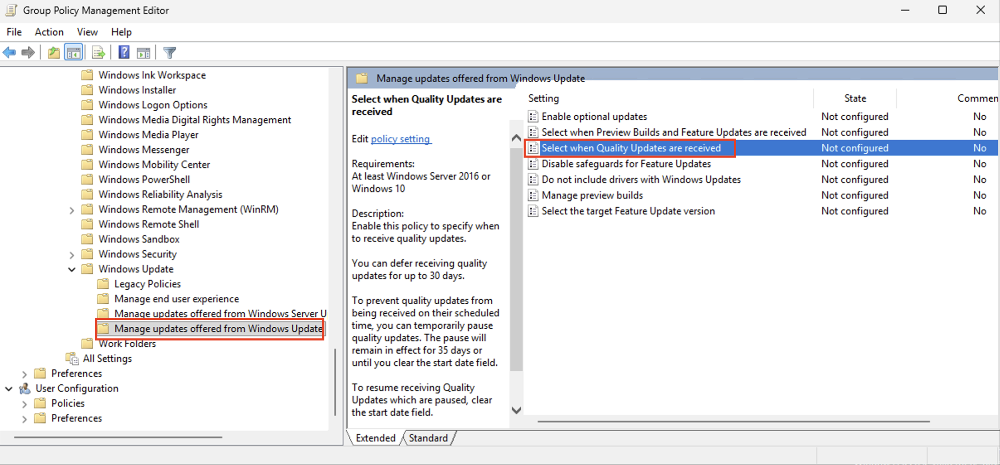
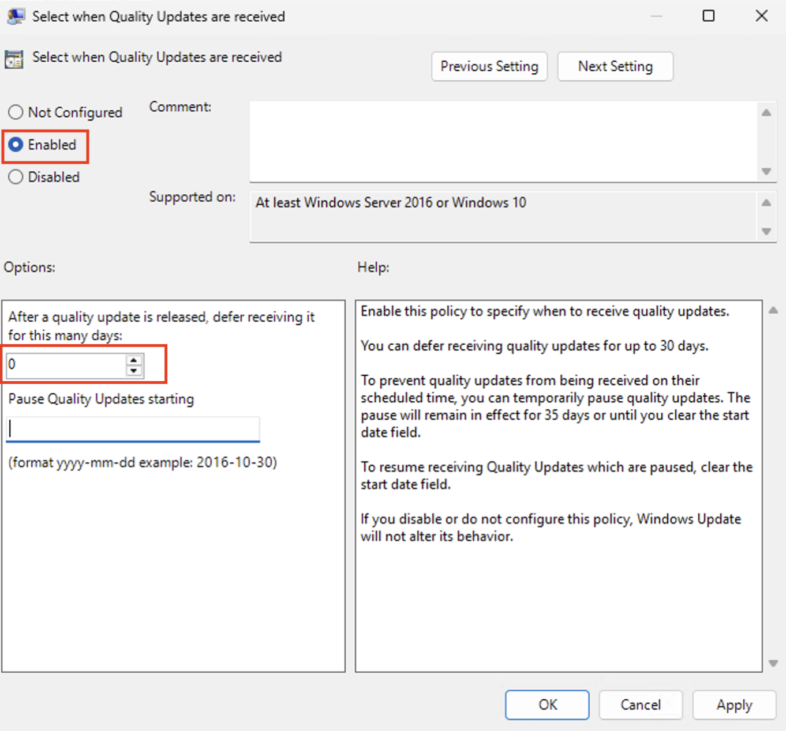
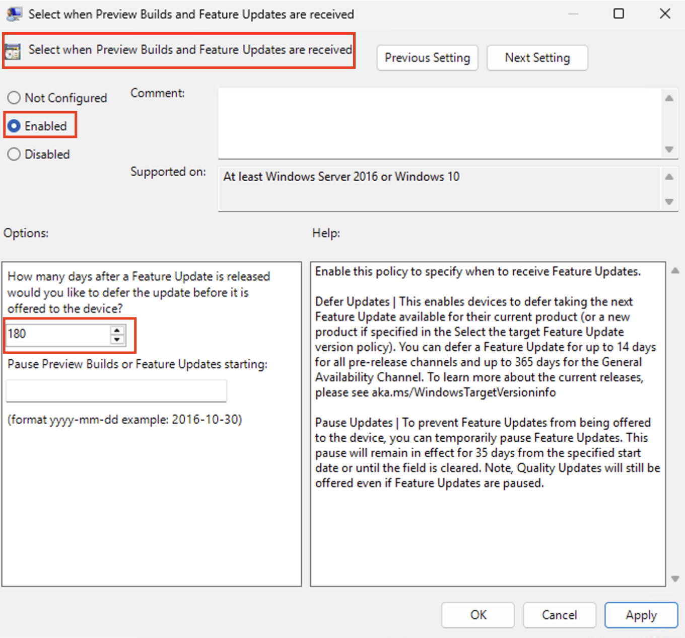
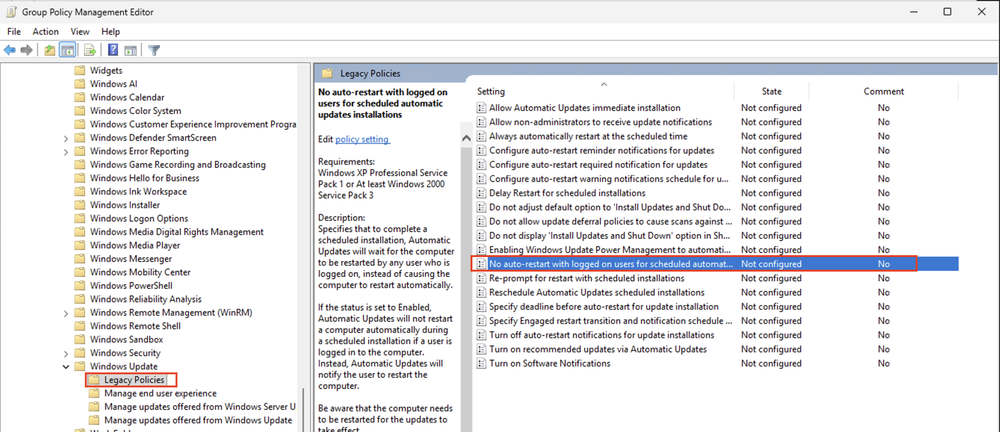
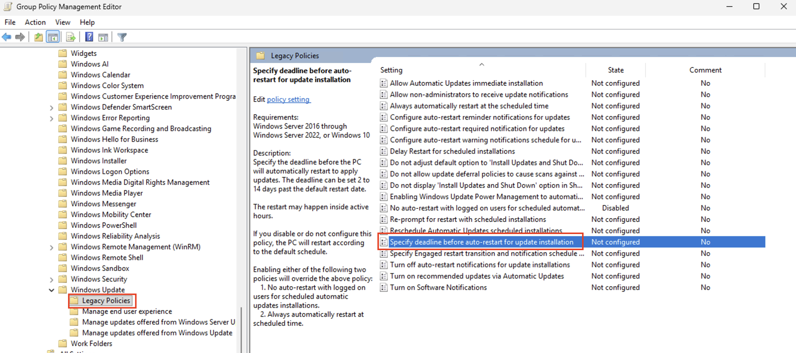
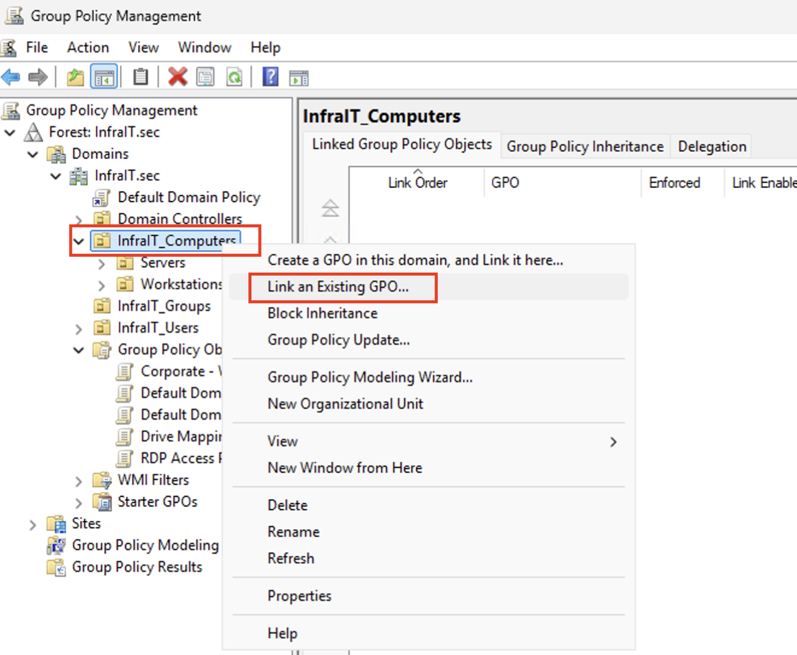

# Lab: Administrer Windows Update Management via Group Policy

## Læringsmål
Etter denne laben skal du kunne:
- Konfigurere Windows Update policies via Group Policy for enterprise miljøer
- Forstå forskjellen mellom Feature Updates og Quality Updates
- Implementere deferral policies og maintenance windows
- Verifisere update compliance via PowerShell på tvers av domenet
- Feilsøke vanlige Windows Update problemer i et domenemiljø
- MERK‼️ Vi oppretter en GPO for både servere og arbeidsstasjoner i denne gjennomgangen. God praksis ville vært å opprette egen GPO for arbeidsstasjoner og servere.

---

## Forutsetninger

**Påkrevde administrative rettigheter:**
- Innlogget som `adm_<brukernavn>` på **mgr.infrait.sec**
- Medlemskap i gruppen `Domain Admins` eller `Group Policy Creator Owners`

**Lab-miljø:**
- **dc1.infrait.sec** - Domain Controller (Windows Server 2025)
- **srv1.infrait.sec** - File Server med DFS (Windows Server 2025)
- **cl1.infrait.sec** - Klient-maskin (Windows 11)
- **mgr.infrait.sec** - IT Admin workstation (Windows 11)

**Verktøy som skal være installert på mgr:**
- Group Policy Management Console (GPMC)
- PowerShell 5.1 / 7.x
- Remote Server Administration Tools (RSAT)

---

## Teorigrunnlag (5 min lesing)

### Hvorfor ikke WSUS lenger?

Windows Server Update Services (WSUS) er deprecated og erstattes av moderne løsninger:
- **Windows Update for Business** - GPO-basert, krever ingen dedikert server
- **Microsoft Intune** - Cloud-basert for moderne device management
- **Microsoft Update Catalog** - Manuell nedlasting for air-gapped miljøer

For små til mellomstore miljøer er **Windows Update for Business via Group Policy** den mest kostnadseffektive løsningen.

### Update-typer du må forstå:

| Update Type | Innhold | Frekvens | Typisk Deferral |
|-------------|---------|----------|-----------------|
| **Quality Updates** | Sikkerhetsfixer, kritiske bugs | Månedlig (Patch Tuesday) | 0-30 dager |
| **Feature Updates** | Nye funksjoner, større endringer | 1-2 ganger/år | 90-365 dager |
| **Driver Updates** | Hardware drivers | Varierende | Ofte blokkert i enterprise |

### Viktige konsepter:

**Deferral Period:** Hvor lenge du venter etter Microsoft releaser en update før den installeres.
- **Quality (Security) Updates:** Anbefalt 0-7 dager (haster!)
- **Feature Updates:** Anbefalt 180-365 dager (testing først!)

**Deadline Enforcement:** Tvinger restart etter X dager, selv om bruker utsetter.

**Maintenance Window:** Bestemmer NÅR updates kan installeres (f.eks. kl 03:00).

---

## Del 1: Opprett Update Management GPO

### Steg 1.1: Åpne Group Policy Management

På **mgr.infrait.sec**:

```powershell
# Åpne GPMC
gpmc.msc
```

### Steg 1.2: Opprett ny GPO

1. Høyreklikk på **Group Policy Objects** under `infrait.sec`
2. Velg **New**
   1. 
3. Navn: `Corporate - Windows Update Policy`

### Steg 1.3: Konfigurer Quality Updates (Security Patches)

Høyreklikk på den nye GPO-en → **Edit**

Naviger til:
```
Computer Configuration
  └── Policies
      └── Administrative Templates
          └── Windows Components
              └── Windows Update
                  └── Manage updates offered from Windows Update
```

**Konfigurasjon A: Quality Updates (VIKTIGST!)**

Policy: **"Select when Quality Updates are received"**

```
Status: Enabled

Settings:
- Deferral period for Quality Updates: 0 days
  (Installerer sikkerhetsfixer umiddelbart!)

- Pause Quality Updates starting: [La stå tom]
  (Brukes kun ved vedlikeholdsvinduer)
```

**Hvorfor 0 dager?** Sikkerhetsfixer er kritiske og bør installeres ASAP. I produksjonsmiljøer kan du vurdere 3-7 dager for testing i en pilot-gruppe først.

---

**Konfigurasjon B: Feature Updates**

Policy: **"Select when Preview Builds and Feature Updates are received"**

```
Status: Enabled

Settings:
- Select the branch readiness level: Semi-Annual Channel
- Deferral period for Feature Updates: 180 days
  (La andre teste nye features først!)

- Pause Feature Updates starting: [La stå tom]
```

**Hvorfor 180 dager?** Feature Updates inneholder store endringer som kan påvirke applikasjoner. Ved å vente 6 måneder får du:
- Stabilitetsfixer fra Microsoft
- Feedback fra andre organisasjoner
- Tid til å teste i lab-miljø

---

### Steg 1.4: Konfigurer Automatic Updates Oppførsel

Naviger til:
```
Computer Configuration
  └── Policies
      └── Administrative Templates
          └── Windows Components
              └── Windows Update
                  └── Manage end user experience
```

**Policy 1: "Configure Automatic Updates"**

```
Status: Enabled

Settings:
- Configure automatic updating: 2 - Notify for download and auto install (Velger dette siden vi ikke ønsker at disken skal fylles opp med Windows update installasjonsfiler. Ok løsning for vårt labmiljø)
- Scheduled install day: 0 - Every day
- Scheduled install time: 03:00

- Install updates for other Microsoft products: ✓ Checked
  (Inkluderer Office, .NET, SQL Server, etc.)
```

**Hvorfor kl 03:00?** Minimerer påvirkning på brukere. I produksjon: vurder separate GPO-er for servere (kl 02:00 søndag) vs. klienter (kl 03:00 daglig).

---

**Policy 2: "No auto-restart with logged on users for scheduled automatic updates installations"**

```
Status: Disabled
```

**Viktig:** Dette TILLATER auto-restart selv om brukere er innlogget. Kombiner med deadline enforcement!

---

**Policy 4: "Specify deadline before auto-restart for update installation"**

```
Status: Enabled

Settings:
- Quality Updates: 2 days
- Feature Updates: 7 days
```

**Hvorfor deadlines?** Uten deadlines vil maskiner aldri restarte hvis brukere ignorerer varslinger. Etter deadline TVINGES restart.

---

### Steg 1.5: Link GPO til domenet

1. I GPMC, høyreklikk på `InfraIT_Computers`
2. Velg **Link an Existing GPO**
3. Velg `Corporate - Windows Update Policy`
4. Klikk **OK**


> **Alternativt:** Link kun til spesifikke OUer (f.eks. "Workstations" og "Servers" separat for forskjellige policies).
> 
> **MERK:** For at disse policiene skal bli aktivert på maskinene, må maskinene ligge i en av OU-ene under InfraIT_Computers


---

## Del 2: Tvinge Group Policy Oppdatering

### Steg 2.1: Oppdater Group Policy på alle maskiner

Fra **mgr.infrait.sec**, kjør PowerShell som Administrator:

```powershell
# Definer alle domene-maskiner
$Computers = @('dc1', 'srv1', 'cl1')

# Tvinge GPO-oppdatering på alle maskiner
foreach ($Computer in $Computers) {
    Write-Host "Oppdaterer Group Policy på $Computer.infrait.sec..." -ForegroundColor Cyan
    
    Invoke-Command -ComputerName "$Computer.infrait.sec" -ScriptBlock {
        gpupdate /force
    }
}
```

**Forventet output:**
```
Oppdaterer Group Policy på dc1.infrait.sec...
Updating policy...

Computer Policy update has completed successfully.
User Policy update has completed successfully.
```

**Hvis feil:** Se [Troubleshooting](#troubleshooting) nedenfor.

---

### Steg 2.2: Verifiser at GPO er applisert

Sjekk hvilke GPO-er som faktisk er aktive på en maskin.

```powershell
# Kjør på en av maskinene (f.eks. cl1)
Invoke-Command -ComputerName cl1.infrait.sec -ScriptBlock {
    gpresult /r /scope:computer
}
```

**Se etter i output:**
```
COMPUTER SETTINGS
...
Applied Group Policy Objects
-----------------------------
    RDP Access Policy
    Corporate - Windows Update Policy <---
    Default Domain Policy
```

**Hvis GPO ikke vises:** Vent 5 minutter eller kjør `gpupdate /force` på nytt.

---

## Del 3: Verifiser Windows Update Konfigurasjon

### Steg 3.1: Sjekk Registry Settings (Teknisk Verifisering)

Group Policy skriver til Registry. La oss sjekke at settings er satt:

```powershell
# Sjekk Quality Update deferral på cl1
Invoke-Command -ComputerName cl1.infrait.sec -ScriptBlock {
    $Path = 'HKLM:\SOFTWARE\Policies\Microsoft\Windows\WindowsUpdate'
    
    if (Test-Path $Path) {
        Get-ItemProperty -Path $Path | Select-Object `
            DeferQualityUpdates,
            DeferQualityUpdatesPeriodInDays,
            DeferFeatureUpdates,
            DeferFeatureUpdatesPeriodInDays
    } else {
        Write-Warning "Windows Update policy path ikke funnet!"
    }
}
```

**Forventet output:**
```
DeferQualityUpdates              : 1
DeferQualityUpdatesPeriodInDays  : 0
DeferFeatureUpdates              : 1
DeferFeatureUpdatesPeriodInDays  : 180
```

---
### Steg 3.2: Tvinge Windows Update Scan
La Windows Update søke etter nye oppdateringer umiddelbart:
powershell# Tvinge update scan på alle maskiner
```powershell
$Computers = @('cl1')

foreach ($Computer in $Computers) {
    Write-Host "`nTvinger update scan på $Computer.infrait.sec..." -ForegroundColor Yellow
    
    Invoke-Command -ComputerName "$Computer.infrait.sec" -ScriptBlock {
        # Tving Windows Update scan via UsoClient (native tool)
        Write-Host "Starter update scan..." -ForegroundColor Cyan
        UsoClient StartScan
        
        # Vent litt for at scan skal starte
        Start-Sleep -Seconds 3
        
        Write-Host "Update scan startet. Sjekk status om 1-2 minutter med Get-WindowsUpdateStatus.ps1" -ForegroundColor Green
    }
}
```
Dette kan ta 2-5 minutter per maskin.

---

### Steg 3.3: Komplett Update Status Script

Lagre dette scriptet som `C:\Scripts\Get-WindowsUpdateStatus.ps1` på **mgr.infrait.sec**:

```powershell
<#
.SYNOPSIS
    Henter Windows Update status via Event Log
#>
[CmdletBinding()]
param(
    [string[]]$ComputerName = @('cl1.infrait.sec')
)

$Results = foreach ($Computer in $ComputerName) {
    Write-Host "`nSjekker $Computer..." -ForegroundColor Cyan
    
    try {
        $UpdateInfo = Invoke-Command -ComputerName $Computer -ErrorAction Stop -ScriptBlock {
            
            # Hent pending updates fra registry (uten COM!)
            $PendingUpdatesPath = 'HKLM:\SOFTWARE\Microsoft\Windows\CurrentVersion\WindowsUpdate\Auto Update\Results\Install'
            
            if (Test-Path $PendingUpdatesPath) {
                $LastInstallResult = Get-ItemProperty -Path $PendingUpdatesPath
            }
            
            # Sjekk om updates venter på reboot
            $RebootRequired = $false
            $RebootPaths = @(
                'HKLM:\SOFTWARE\Microsoft\Windows\CurrentVersion\WindowsUpdate\Auto Update\RebootRequired',
                'HKLM:\SOFTWARE\Microsoft\Windows\CurrentVersion\Component Based Servicing\RebootPending'
            )
            
            foreach ($Path in $RebootPaths) {
                if (Test-Path $Path) {
                    $RebootRequired = $true
                    break
                }
            }
            
            # Hent siste successful update fra Event Log
            $LastSuccessfulUpdate = Get-WinEvent -FilterHashtable @{
                LogName = 'System'
                ProviderName = 'Microsoft-Windows-WindowsUpdateClient'
                ID = 19  # Installation Successful
            } -MaxEvents 1 -ErrorAction SilentlyContinue
            
            # Hent pending updates count fra Event Log
            $PendingUpdatesEvent = Get-WinEvent -FilterHashtable @{
                LogName = 'System'
                ProviderName = 'Microsoft-Windows-WindowsUpdateClient'
                ID = 44  # Updates detected
            } -MaxEvents 1 -ErrorAction SilentlyContinue
            
            # Parse message for update count
            $PendingCount = 0
            if ($PendingUpdatesEvent) {
                if ($PendingUpdatesEvent.Message -match '(\d+) updates') {
                    $PendingCount = [int]$Matches[1]
                }
            }
            
            # Hent siste reboot
            $OS = Get-CimInstance -ClassName Win32_OperatingSystem
            $LastBoot = $OS.LastBootUpTime
            
            # Return object
            [PSCustomObject]@{
                Computer = $env:COMPUTERNAME
                PendingUpdateCount = $PendingCount
                RebootRequired = $RebootRequired
                LastSuccessfulUpdate = if ($LastSuccessfulUpdate) { $LastSuccessfulUpdate.Message } else { "Ingen nylige updates funnet" }
                LastUpdateDate = if ($LastInstallResult) { $LastInstallResult.LastSuccessTime } else { "N/A" }
                LastReboot = $LastBoot
                DaysSinceReboot = [math]::Round(((Get-Date) - $LastBoot).TotalDays, 1)
            }
        }
        
        $UpdateInfo
        
    } catch {
        Write-Warning "Kunne ikke kontakte $Computer : $_"
        
        [PSCustomObject]@{
            Computer = $Computer
            PendingUpdateCount = 'ERROR'
            RebootRequired = 'ERROR'
            LastSuccessfulUpdate = $_.Exception.Message
            LastUpdateDate = $null
            LastReboot = $null
            DaysSinceReboot = 'N/A'
        }
    }
}

# Vis resultater
$Results | Format-Table -AutoSize -Wrap

# Generer HTML rapport
$HTML = $Results | ConvertTo-Html -Title "Windows Update Status - InfraIT.sec" -PreContent "<h1>Windows Update Compliance Report</h1><p>Generated: $(Get-Date)</p>"
$HTML | Out-File "C:\temp\UpdateStatus_$(Get-Date -Format 'yyyyMMdd_HHmm').html"

Write-Host "`nRapport generert: C:\temp\UpdateStatus_$(Get-Date -Format 'yyyyMMdd_HHmm').html" -ForegroundColor Green
```

**Kjør scriptet:**

```powershell
# Opprett temp-mappe først (om den ikke eksisterer)
New-Item -Path C:\temp -ItemType Directory -Force

# Kjør status script
.\Get-WindowsUpdateStatus.ps1
```

**Forventet output (MERK‼️: en vil kun se CL1 så lenge en ikke har lagt til de andre maskinene i PowerShell scriptene selv):**
```
Computer PendingUpdateCount PendingUpdates                        LastInstalledUpdate           LastUpdateDate        LastReboot           DaysSinceReboot
-------- ------------------ --------------                        -------------------           --------------        ----------           ---------------
DC1      3                  2025-02 Security Update for .NET;...  2025-01 Cumulative Update...  2025-01-15 03:15:22   2025-02-01 04:22:11  5.2
SRV1     1                  2025-02 Cumulative Update            2025-01 Security Update...    2025-01-20 03:42:11   2025-02-03 03:15:44  3.1
CL1      0                                                        2025-02 Cumulative Update...  2025-02-05 03:10:33   2025-02-05 09:22:18  0.8
MGR      2                  2025-02 Security Update; Driver...   2025-01 Cumulative Update...  2025-01-28 03:05:19   2025-02-04 08:15:22  1.9
```

---

## Troubleshooting

### Problem 1: GPO appliseres ikke

**Symptom:** `gpresult /r` viser ikke den nye GPO-en.

**Sjekk:**
```powershell
# Er GPO linket korrekt?
Get-GPO -Name "Corporate - Windows Update Policy" | Get-GPOReport -ReportType HTML | Out-File C:\GPO-Report.html

# Er maskinen i riktig OU?
Get-ADComputer -Identity CL1 | Select DistinguishedName

# Er det GPO inheritance blokkering?
Get-GPInheritance -Target "DC=infrait,DC=sec"
```

**Løsning:**
- Kjør `gpupdate /force /boot` (reboot kan være nødvendig)
- Sjekk at Security Filtering ikke blokkerer (standard: Authenticated Users)
- Vent 90 minutter (standard GP refresh interval) eller tving refresh

---

### Problem 2: Windows Update finner ingen oppdateringer

**Symptom:** Update-søk returnerer 0 updates, selv om du vet det finnes nye.

**Sjekk:**
```powershell
Invoke-Command -ComputerName cl1.infrait.sec -ScriptBlock {
    # Sjekk Windows Update Service
    Get-Service wuauserv
    
    # Hent update history fra Event Log (ingen COM!)
    $UpdateHistory = Get-WinEvent -FilterHashtable @{
        LogName = 'System'
        ProviderName = 'Microsoft-Windows-WindowsUpdateClient'
        ID = 19, 20, 43, 44  # Installation events
    } -MaxEvents 100 -ErrorAction SilentlyContinue
    
    Write-Host "Antall update events (siste 100): $($UpdateHistory.Count)" -ForegroundColor Green
    
    # Vis siste 5 updates
    Write-Host "`nSiste 5 update events:" -ForegroundColor Yellow
    $UpdateHistory | Select-Object -First 5 TimeCreated, Id, Message | Format-List
}
```

**Løsning:**
```powershell
# Reset Windows Update Components
Invoke-Command -ComputerName cl1.infrait.sec -ScriptBlock {
    Stop-Service wuauserv, bits -Force
    Remove-Item C:\Windows\SoftwareDistribution -Recurse -Force
    Start-Service wuauserv, bits
    
    # Tving ny registrering
    UsoClient ResetAuthorization
    UsoClient StartScan
}
```

---

### Problem 3: Updates installeres ikke selv om de er downloaded

**Symptom:** Pending updates vises, men installeres aldri.

**Sjekk Event Log:**
```powershell
Invoke-Command -ComputerName cl1.infrait.sec -ScriptBlock {
    Get-WinEvent -LogName System -FilterHashtable @{
        ProviderName='Microsoft-Windows-WindowsUpdateClient'
        ID=20,44  # Installation errors
    } -MaxEvents 10 | Format-List TimeCreated, Message
}
```

**Vanlige årsaker:**
- Disk full (sjekk `Get-PSDrive C`)
- Corrupted Windows Update database (kjør `DISM /Online /Cleanup-Image /RestoreHealth`)
- Konflikterende GPO-er (sjekk med `gpresult /h C:\gpresult.html`)

---

### Problem 4: Maskiner restarter IKKE etter deadline

**Symptom:** Deadline har passert, men maskin restarter ikke.

**Sjekk:**
```powershell
# Er auto-restart policy konfigurert korrekt?
$Path = 'HKLM:\SOFTWARE\Policies\Microsoft\Windows\WindowsUpdate\AU'
Get-ItemProperty -Path $Path | Select NoAutoRebootWithLoggedOnUsers, AUOptions
```

**Forventet:**
- `NoAutoRebootWithLoggedOnUsers` = 0 (eller ikke eksisterer)
- `AUOptions` = 4

**Løsning:** Verifiser at GPO "No auto-restart with logged on users" er satt til **Disabled**.

---

## Refleksjonsspørsmål

1. **Hvorfor er 0-dagers deferral for Quality Updates en god praksis i de fleste miljøer?**
   - Hva er risikoen med å vente for lenge?
   - I hvilke scenarioer kan 3-7 dagers deferral være bedre?

2. **Hva er forskjellen mellom "pause updates" og "deferral period"?**
   - Når bruker du hver av dem?

3. **Hvorfor bør servere og workstations ha forskjellige maintenance windows?**
   - Hva skjer hvis en Domain Controller restarter midt på dagen?

4. **Hvordan ville du skalert denne løsningen til 1000 maskiner?**
   - Ville du brukt samme GPO for alle?
   - Hvordan ville du testet updates før produksjonsutrulling?

5. **Hva er ulempene med Windows Update for Business sammenlignet med WSUS?**
   - Når ville du fortsatt anbefalt WSUS (eller en cloud-løsning som Intune)?

---

## Oppsummering

Du har nå lært:
- ✅ Konfigurere Windows Update policies via Group Policy
- ✅ Implementere deferral strategies for ulike update-typer
- ✅ Verifisere update compliance via PowerShell og Registry
- ✅ Feilsøke vanlige Windows Update problemer
- ✅ Automatisere update status rapportering på tvers av domenet

**Neste steg:** Kombiner dette med Microsoft Security Compliance Toolkit for komplett infrastructure hardening!

---

## Referanser

- [Windows Update for Business (Microsoft Docs)](https://learn.microsoft.com/en-us/windows/deployment/update/waas-manage-updates-wufb)
- [Group Policy Settings Reference for Windows](https://www.microsoft.com/en-us/download/details.aspx?id=25250)
- [Windows Update Troubleshooting Guide](https://learn.microsoft.com/en-us/troubleshoot/windows-client/deployment/windows-update-issues-troubleshooting)