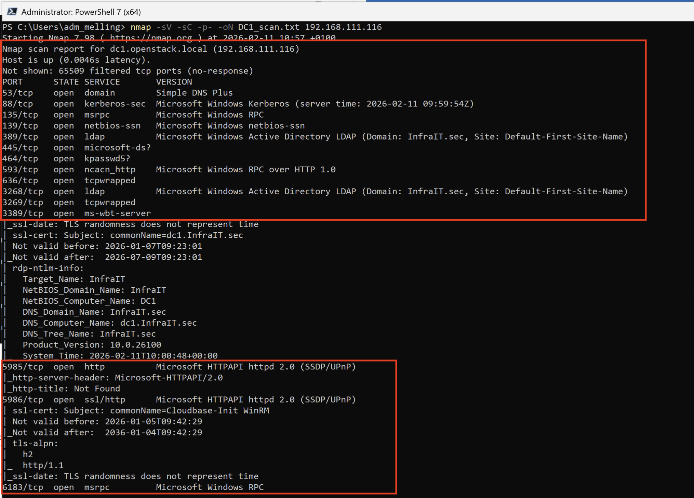

# Lab: Penetration Testing og Vulnerability Scanning

## Innledning

I denne labben skal dere teste sikkerheten i deres infrastruktur ved å utføre grunnleggende penetration testing og vulnerability scanning. Dette gir dere innsikt i hvordan en angriper kan kartlegge systemene deres, og lar dere validere effekten av hardeningsarbeidet dere har gjort.

**Læringsmål:**
- Forstå hvordan nettverksscanning avdekker eksponerte tjenester
- Validere at security baselines er korrekt implementert
- Teste for svake passord i Active Directory-miljøet
- Lære å tolke sikkerhetstestresultater

**Viktig etisk merknad:** Disse teknikkene skal kun brukes i deres egen lab-infrastruktur. Scanning og testing av systemer dere ikke eier er ulovlig.

## Forutsetninger

- Alle fire maskiner (DC1, SRV1, CL1, MGR) er oppe og kjører
- MGR er medlem av InfraIT.sec domenet
- Dere har administratortilgang via deres `adm_<brukernavn>` konto
- Hardening av infrastrukturen er gjennomført (for best sammenligning)

---

## Del 1: Nettverksscanning med Nmap

### Hva er Nmap?

Nmap (Network Mapper) er det mest brukte verktøyet for nettverksscanning i verden. Det identifiserer hvilke porter som er åpne, hvilke tjenester som kjører, og kan gi informasjon om operativsystem.

### Installasjon på MGR

1. **Logg inn på MGR** med din `adm_<brukernavn>` konto

2. **Åpne PowerShell som administrator**

3. **Installer Nmap via Chocolatey:**
```powershell
choco install nmap -y
```

4. **Verifiser installasjonen:**
```powershell
nmap --version
```

### Scanning av lab-miljøet

#### Scan DC1 (Domain Controller)
Erstatt IP-adressen med dine egne IP-adresser
```powershell
nmap -sV -sC -p- -oN DC1_scan.txt 192.168.111.116
```

**Forklaring av parametere:**
- `-sV`: Detekter tjeneste-versjoner
- `-sC`: Kjør standard scripts for ytterligere info
- `-p-`: Scan alle 65535 porter (tar litt tid)
- `-oN`: Lagre output til fil

**Hva ser dere etter:**
- Port 53 (DNS)
- Port 88 (Kerberos)
- Port 135, 139, 445 (RPC, NetBIOS, SMB)
- Port 389, 636 (LDAP, LDAPS)
- Port 3389 (RDP)

**Se i terminal eller .txt fil som opprettes på stående katalog for terminal:**


#### Raskere scan (bare vanlige porter)

```powershell
nmap -sV -sC 192.168.111.116 -oN DC1_quick_scan.txt
```

#### Scan SRV1 (File Server)

```powershell
nmap -sV -sC 192.168.111.157 -oN SRV1_scan.txt
```

**Forventet:**
- Port 445 (SMB - file sharing)
- Port 3389 (RDP)
- Færre tjenester enn DC1

#### Scan CL1 (Client)

```powershell
nmap -sV -sC 192.168.111.154 -oN CL1_scan.txt
```

**Forventet:**
- Færrest åpne porter
- Hovedsakelig port 3389 hvis RDP er aktivert

### Analyser resultatene

1. **Åpne scanfilene:**
```powershell
notepad DC1_scan.txt
notepad SRV1_scan.txt
notepad CL1_scan.txt
```

2. **Diskuter:**
   - Hvilke unødvendige tjenester er eksponert?
   - Er det forskjeller mellom maskinene?
   - Hvordan kan resultatene brukes av en angriper?

---

## Del 2: PowerShell Security Validation

### Validere Security Baseline Settings

Her tester dere om hardeningsarbeidet faktisk er implementert korrekt.

#### Test 1: Verifiser Security Policy Settings

Kjør dette scriptet på **MGR** for å teste alle maskiner:

```powershell
# Test Security Settings på alle servere
$computers = @("DC1", "SRV1", "CL1")

foreach ($computer in $computers) {
    Write-Host "`n=== Testing $computer ===" -ForegroundColor Cyan
    
    # Test 1: SMBv1 Protocol (skal være disabled)
    Write-Host "`nChecking SMBv1 status..." -ForegroundColor Yellow
    $smb1 = Invoke-Command -ComputerName $computer -ScriptBlock {
        Get-WindowsOptionalFeature -Online -FeatureName SMB1Protocol
    }
    
    if ($smb1.State -eq "Disabled") {
        Write-Host "✓ SMBv1 is disabled (GOOD)" -ForegroundColor Green
    } else {
        Write-Host "✗ SMBv1 is enabled (SECURITY RISK)" -ForegroundColor Red
    }
    
    # Test 2: Windows Firewall Status
    Write-Host "`nChecking Windows Firewall..." -ForegroundColor Yellow
    $firewall = Invoke-Command -ComputerName $computer -ScriptBlock {
        Get-NetFirewallProfile | Select-Object Name, Enabled
    }
    
    foreach ($profile in $firewall) {
        if ($profile.Enabled) {
            Write-Host "✓ $($profile.Name) profile is enabled (GOOD)" -ForegroundColor Green
        } else {
            Write-Host "✗ $($profile.Name) profile is disabled (BAD)" -ForegroundColor Red
        }
    }
    
    # Test 3: PowerShell Execution Policy
    Write-Host "`nChecking PowerShell Execution Policy..." -ForegroundColor Yellow
    $execPolicy = Invoke-Command -ComputerName $computer -ScriptBlock {
        Get-ExecutionPolicy
    }
    Write-Host "Execution Policy: $execPolicy" -ForegroundColor White
    
    # Test 4: Local Administrator Accounts
    Write-Host "`nChecking local administrators..." -ForegroundColor Yellow
    $admins = Invoke-Command -ComputerName $computer -ScriptBlock {
        Get-LocalGroupMember -Group "Administrators" | Select-Object Name
    }
    Write-Host "Local Administrators:" -ForegroundColor White
    $admins | ForEach-Object { Write-Host "  - $($_.Name)" }
}
```

**Lagre scriptet som:** `Test-SecurityBaseline.ps1`

**Kjør det:**
```powershell
.\Test-SecurityBaseline.ps1
```

#### Test 2: Verifiser Kritiske Group Policy Settings

```powershell
# Test spesifikke GPO-innstillinger
$computers = @("DC1", "SRV1", "CL1")

foreach ($computer in $computers) {
    Write-Host "`n=== GPO Settings on $computer ===" -ForegroundColor Cyan
    
    # Test Password Policy (på DC1)
    if ($computer -eq "DC1") {
        Write-Host "`nPassword Policy:" -ForegroundColor Yellow
        net accounts /domain
    }
    
    # Test Audit Policy
    Write-Host "`nAudit Policy:" -ForegroundColor Yellow
    Invoke-Command -ComputerName $computer -ScriptBlock {
        auditpol /get /category:*
    }
}
```

**Hva ser dere etter:**
- Minimum password length ≥ 14 characters
- Password complexity requirements enabled
- Account lockout threshold configured
- Audit policies enabled (especially Logon/Logoff, Account Management)
- Er en fornøyd med resultatet? Hva bør eventuelt gjøres?
---

## Del 3: Password Testing

### Etisk merknad

Denne testen demonstrerer viktigheten av sterke passord. Dere tester kun kontoer i deres egen lab.

### Metode 1: Test for vanlige svake passord

Vi bruker en PowerShell-modul som tester om brukere har svake passord fra en kjent liste.

#### Installasjon av DSInternals (på MGR)

```powershell
# Installer DSInternals module
Install-Module -Name DSInternals -Force
```

#### Opprett liste med vanlige svake passord

Lag en fil `common-passwords.txt` på MGR:

```
Password1
Password123
Welcome1
Summer2024
Winter2024
InfraIT123
Passord123
Administrator
P@ssw0rd
```

#### Test for svake passord

```powershell
# Test for weak passwords
$weakPasswords = Get-Content "common-passwords.txt"
$domain = "InfraIT.sec"

# Get all domain users
$users = Get-ADUser -Filter * -Properties SamAccountName | 
         Where-Object { $_.Enabled -eq $true }

Write-Host "Testing for weak passwords..." -ForegroundColor Yellow
Write-Host "Total users to test: $($users.Count)`n" -ForegroundColor Cyan

$vulnerableAccounts = @()

foreach ($user in $users) {
    $username = $user.SamAccountName
    
    foreach ($password in $weakPasswords) {
        try {
            $secPassword = ConvertTo-SecureString $password -AsPlainText -Force
            $cred = New-Object System.Management.Automation.PSCredential ("$domain\$username", $secPassword)
            
            # Test authentication
            $connection = New-Object System.DirectoryServices.DirectoryEntry("LDAP://DC1", $cred.UserName, $password)
            
            if ($connection.Name) {
                Write-Host "✗ VULNERABLE: $username uses password: $password" -ForegroundColor Red
                $vulnerableAccounts += [PSCustomObject]@{
                    Username = $username
                    Password = $password
                }
            }
        }
        catch {
            # Authentication failed - good!
        }
    }
}

# Summary
Write-Host "`n=== SUMMARY ===" -ForegroundColor Cyan
if ($vulnerableAccounts.Count -eq 0) {
    Write-Host "✓ No weak passwords found! (GOOD)" -ForegroundColor Green
} else {
    Write-Host "✗ Found $($vulnerableAccounts.Count) accounts with weak passwords:" -ForegroundColor Red
    $vulnerableAccounts | Format-Table -AutoSize
}
```

**Lagre som:** `Test-WeakPasswords.ps1`

**Kjør testen:**
```powershell
.\Test-WeakPasswords.ps1
```
Forsøk å sette et passord på en bruker som vil få treff på listen over svake passord.
---

## Analyse og Rapportering

### Lag en sikkerhetsrapport

Samle resultatene i et dokument som inkluderer:

1. **Nmap Scanning Results**
   - Hvilke tjenester er eksponert på hver maskin?
   - Er noen unødvendige tjenester åpne?
   - Anbefalinger for reduksjon av attack surface

2. **Security Baseline Validation**
   - Er alle hardening-tiltak implementert?
   - Hvilke avvik ble funnet?
   - Prioritering av fiks

3. **Password Security**
   - Antall kontoer med svake passord
   - Er password policy tilstrekkelig streng?
   - Anbefalinger for passord-forbedring

### Eksempel på rapport-struktur

```
SIKKERHETSTESTRAPPORT
InfraIT.sec Lab-miljø
Dato: [DATO]
Testet av: [NAVN]

1. EXECUTIVE SUMMARY
   - Overordnet sikkerhetsstatus
   - Antall kritiske funn
   - Umiddelbare anbefalinger

2. NETTVERKSSCANNING
   - DC1: [funn]
   - SRV1: [funn]
   - CL1: [funn]

3. SECURITY BASELINE
   - Compliant settings: [X/Y]
   - Non-compliant settings: [liste]

4. PASSWORD SECURITY
   - Svake passord funnet: [antall]
   - Policy enforcement: [OK/Ikke OK]

5. ANBEFALINGER
   [Prioritert liste med tiltak]
```

---

## Sikkerhetsbetraktninger

### Hva har dere lært?

1. **Nettverksscanning avslører attack surface**
   - Hver åpen port er en potensiell inngangsvektor
   - Principle of least privilege gjelder også nettverkstjenester
   - Regular scanning avdekker uønskede endringer

2. **Configuration validation er kritisk**
   - Hardening er ikke "set and forget"
   - Kontinuerlig validering er nødvendig
   - Automated testing fanger avvik tidlig

3. **Password security er fundamentalt**
   - Svake passord er fortsatt #1 angrepsvektor
   - Technical controls (policy) + user awareness = forsvar
   - Regular password audits er best practice

### I produksjonsmiljø

- Slike tester kjøres jevnlig (monthly/quarterly)
- Resultatene dokumenteres og følges opp
- Vulnerability scanning er ofte automatisert
- Penetration testing utføres av dedikerte team eller eksterne konsulenter

---

*Viktig påminnelse: Teknikkene i denne labben skal kun brukes i autoriserte miljøer. Uautorisert scanning og testing er ulovlig.*