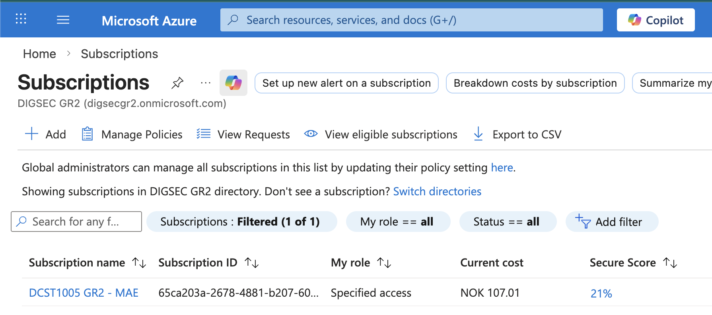
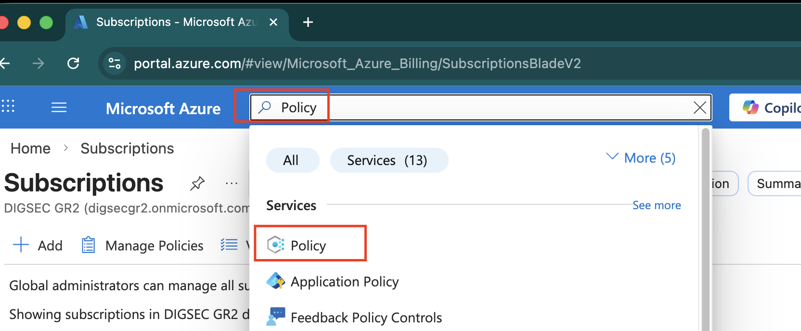
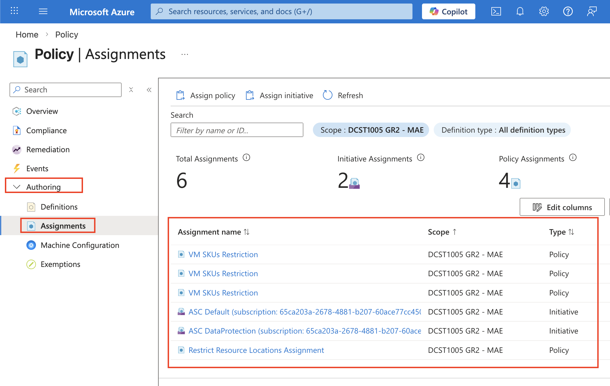
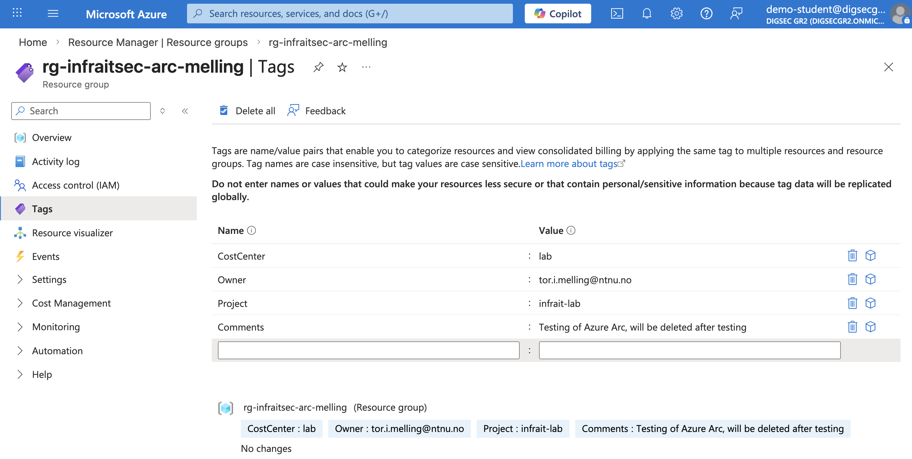
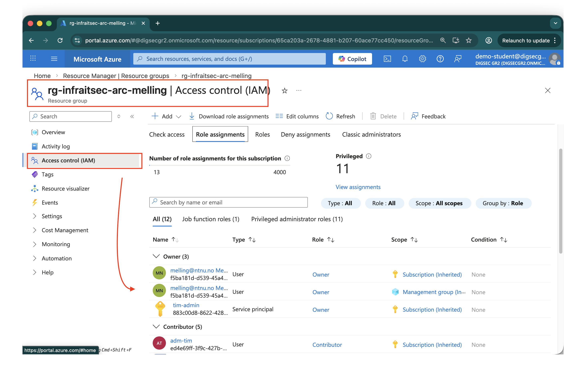
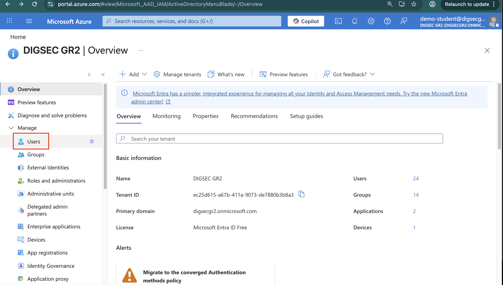
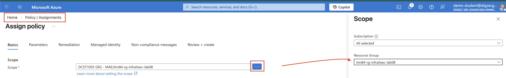
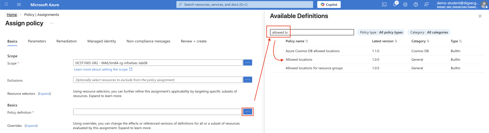

# Lab 08 – Azure Foundations: Building Your Guardrails

**Course:** DCST1005 – Digital Infrastructure and Cybersecurity  
**Prerequisites:** Completed on-premises labs (InfraIT.sec domain, DC1/SRV1/CL1/MGR)  
**Estimated time:** 3–4 hours

---

## Overview

In the previous labs you built and hardened an on-premises Windows Server domain. Now you step into the role of an Azure administrator for a small Norwegian company — **NordStack AS** — and prepare a structured, controlled Azure environment before any workloads are deployed.

This lab mirrors what you already know:

| On-premises concept | Azure equivalent used in this lab |
|---|---|
| Organizational Units (OUs) | Resource Groups |
| Group Policy Objects (GPOs) | Azure Policy assignments |
| AGDLP / RBAC on file shares | Azure Role-Based Access Control (RBAC) |
| OU-level delegation | Role assignment scoped to a Resource Group |
| GPO enforcement / Block Inheritance | Policy at subscription vs. Resource Group scope |

The goal is to have your guardrails in place *before* you create any resources. Just as you would not add computers to a domain without GPOs and OU structure ready, you do not deploy to Azure without Policy, RBAC, and tagging in order.

---

## Naming Convention — Important

You are **10 students sharing the same tenant**. Every object you create must carry a unique identifier to avoid collisions and to make cost tracking meaningful.

### Your prefix

Use **two or three lowercase letters** derived from your name or student username, followed by a number, last two in your birth year. Examples:

| Student | Prefix |
|---|---|
| Ola Nordmann | `on03` |
| Kari Bakke | `kb00` |

> **Rule:** No two students should share the same prefix.

### Naming pattern

Apply your prefix to everything you create:

| Resource type | Pattern | Example |
|---|---|---|
| Resource Group | `<prefix>-rg-<env>` | `on03-rg-dev` |
| Policy assignment | `<prefix>-policy-<description>` | `on03-policy-tags` |
| Role assignment description | Use your prefix when documenting | — |
| Budget alert | `<prefix>-budget-lab` | `on03-budget-lab` |

---

## Phase 1 – Orientation and Access

*Covers: Video 08-01, Video 08-03*

### 1.1 Sign in and accept your invitation

1. You have received an invitation email to the tenant, accept it before continuing. You may need to switch directory — click your account icon in the top right and select **Switch directory**.
2. Open a browser and go to [https://portal.azure.com](https://portal.azure.com).
3. Sign in with your student account.


### 1.2 Verify your subscription

1. In the search bar at the top, type **Subscriptions** and open the service.
2. Confirm you can see the shared lab subscription.
   1. 
3. Note the **Subscription ID** — you will refer to it later.


### 1.3 Observe existing subscription-level policies

Before adding your own policies, you need to understand what guardrails are already in place at the subscription level — set by your instructor.

1. In the portal, search for **Policy** and open it.
   1. 
2. Go to **Assignments** and set the scope to your subscription.
3. Find and note the two existing policies:
   - **Allowed locations** — permits: `uksouth`, `northeurope`, `westeurope`, `norwayeast`
   - **Allowed virtual machine SKUs** — see the list in the appendix.
   - 

> These subscription-level policies act like a GPO linked to the top-level OU — they apply to everything beneath them, including all Resource Groups. Your own policies at Resource Group scope will layer *on top of* these, potentially adding further restrictions but never removing them.

---

## Phase 2 – Resource Groups and Tags

*Covers: Video 08-04, Video 08-05*

### 2.1 Create your Resource Groups

You will create three Resource Groups representing different environments within InfraIT.Sec.

1. Search for **Resource groups** and select **+ Create**.
2. Create the following three groups. Use your own prefix in place of `<prefix>`:

| Name | Region | Purpose |
|---|---|---|
| `<prefix>-rg-infraitsec-arc` | Norway East | For later use with Azure Arc and OpenStack VM's |
| `<prefix>-rg-infraitsec-hybrid` | Norway East | For hybrid resources and file sync between on-prem and Azure |
| `<prefix>-rg-infraitsec-lab08` | Norway East | Testing for todays lab |

3. For each Resource Group, proceed to the **Tags** tab during creation and add the following tags:

| Tag name | Value |
|---|---|
| `CostCenter` | `lab` |
| `Owner` | Your student mail address |
| `Project` | `infrait-lab` |
| `Comments` | `For your own comments` |

1. Complete the creation and verify all three groups appear in the Resource Groups list.

> **Why three resource groups?** This mirrors a real enterprise pattern. Policies and RBAC assignments often differ between resource groups. You will apply increasingly restrictive policies as you progress through this lab when we get to different environments (dev,test,prod).

### 2.2 Verify tag inheritance

Tags on a Resource Group do *not* automatically propagate to resources created inside it unless you enforce this with a policy. You will address this in Phase 4. For now, simply confirm the tags are visible on each Resource Group:

1. Open one of your Resource Groups.
2. Click **Tags** in the left menu.
3. Confirm your four tags are present.
   1. 

---

## Phase 3 – Role-Based Access Control

*Covers: Video 08-06*

In the on-premises lab you used the AGDLP model: accounts were placed in Global groups, which were placed in Domain Local groups, which received permissions on resources. Azure RBAC follows a similar layered model: a **principal** (user, group, or service principal) is assigned a **role** (set of permissions) at a specific **scope** (subscription, Resource Group, or resource).

### 3.1 Review your current access

1. Open your Resource Group.
2. In the left menu, select **Access control (IAM)**.
3. Click **View my access**. Note which role you have been assigned and at which scope.
   1. 

### 3.2 Create a test user in Entra ID

Before you can test RBAC, you need a user to assign a role to. You will create a dedicated test user in Entra ID — this mirrors what you did on-premises when you created users in Active Directory Users and Computers.

1. In the portal, search for **Microsoft Entra ID** and open it.
2. Go to **Users** → **+ New user** → **Create new user**.
   1. 
3. Configure the user as follows:

| Field | Value |
|---|---|
| User principal name | `<prefix>-testuser@<your-tenant-domain>` |
| Display name | `<prefix>-testuser` |
| Password | Set a temporary password and note it down |

4. Leave all other settings as default and select **Review + create** → **Create**.

> **Reflection:** In the on-premises lab you created users in a specific OU so that the correct GPOs applied automatically. In Entra ID there are no OUs — access and permissions are controlled entirely through group memberships and RBAC assignments, not by where the object is placed in a hierarchy.

### 3.3 Assign a role to your test user

1. Open your `<prefix>-rg-infraitsec-lab08` Resource Group.
2. Go to **Access control (IAM)** → **+ Add** → **Add role assignment**.
3. Select the **Reader** role. Click **Next**.
4. Under **Members**, click **+ Select members** and search for your `<prefix>-testuser`.
5. Complete the assignment.

**Verify the assignment:**
1. Open a private/incognito browser window and go to [https://portal.azure.com](https://portal.azure.com).
2. Sign in as your test user using the temporary password you noted.
3. Navigate to **Resource groups** and confirm the user can see `<prefix>-rg-infraitsec-lab08` but cannot create or delete anything.
4. Attempt to create a resource inside the group — the option should either be missing or blocked.
5. Close the incognito window when done.

**Clean up:**
1. Return to `<prefix>-rg-infraitsec-lab08` → **Access control (IAM)** → **Role assignments**.
2. Find the Reader assignment for your test user and remove it.
3. Go back to **Microsoft Entra ID** → **Users**, find your test user and delete it.

> **Reflection:** This is equivalent to removing a user from a Domain Local group on a file server. Access is revoked immediately — no reboot or logoff required. Compare this to GPO processing, which requires a policy refresh cycle. Also note that deleting the user in Entra ID is a soft delete — the account is retained for 30 days before permanent removal, just as AD has a tombstone period for deleted objects.

### 3.4 Understand role scope inheritance

1. Go to the subscription level: **Subscriptions** → your subscription → **Access control (IAM)** → **Role assignments**.
2. Observe that roles assigned at subscription scope apply to all Resource Groups beneath.
3. Note how this parallels a GPO linked at a high OU level affecting all child OUs.

---

## Phase 4 – Azure Policy Guardrails (NOTE: It can take a minute or two before the policies take effect)

*Covers: Video 08-07, Video 08-08, Video 08-09*

This is the core of the lab. You will create three Policy assignments scoped to your own Resource Groups, then verify each one works by attempting to violate it.

### 4.1 Allowed Locations — scoped to `<prefix>-rg-infraitsec-lab08`

The subscription already restricts locations globally. You will add a *further* restriction on your production environment, limiting it to a single region.

1. Go to **Policy** → **Assignments** → **+ Assign policy**.
2. Set **Scope** to your `<prefix>-rg-infraitsec-lab08` Resource Group.
   1. 
3. Search for and select the built-in definition: **Allowed locations**.
   1. 
4. Leave enforcement mode as **Enabled**. Assign.
5. Under **Parameters → Allowed locations**, select only **Norway East**.
   1. 
6. Name the assignment: `<prefix>-policy-location-lab08`


**Test it:**
1. Inside `<prefix>-rg-infraitsec-lab08`, try to create a simple resource (e.g., a Storage Account) and choose **UK South** as the region.
2. You should receive a policy violation error during validation.
3. Now try with **Norway East** — it should pass the policy check (though you can cancel before actually creating the resource to avoid costs).

> **What you proved:** Policy blocks non-compliant deployments at the moment of creation, not after. This is equivalent to a GPO that prevents a configuration from being applied rather than detecting it after the fact.

### 4.2 Tag Enforcement — scoped to `<prefix>-rg-infraitsec-lab08`

In Phase 2 you manually added tags to your Resource Groups. Now you will enforce that any *resource* created inside `<prefix>-rg-infraitsec-lab08` must also carry the `Owner` tag.

1. Go to **Policy** → **Assignments** → **+ Assign policy**.
2. Set **Scope** to your `<prefix>-rg-infraitsec-lab08` Resource Group.
3. Search for the built-in definition: **Require a tag on resources**.
4. Under **Parameters → Tag Name**, enter: `Owner`
5. Name the assignment: `<prefix>-policy-tag-owner-lab08`
6. Assign.

**Test it:**
1. Inside `<prefix>-rg-dev`, attempt to create a resource *without* the `Owner` tag.
2. At the **Review + create** step, you should see a policy violation.
3. Add the tag and verify the validation now passes.

> **Note:** Policy assignments can take a few minutes to take effect after creation. If you do not see the block immediately, wait 2–3 minutes and try again.

> **Reflection:** In the on-premises environment you could not technically prevent someone from creating a folder without proper permissions — but you could audit it after the fact. Azure Policy's `Deny` effect prevents the non-compliant state from ever existing.

### 4.3 Resource SKU — scoped to `rg-prod`

The subscription already has an allowed SKU list. Add an additional, stricter restriction to your production Resource Group that allows only one VM size.

1. Go to **Policy** → **Assignments** → **+ Assign policy**.
2. Set **Scope** to your `<prefix>-rg-prod` Resource Group.
3. Search for the built-in definition: **Allowed virtual machine size SKUs**.
4. Under **Parameters**, select only: `Standard_B2s`
5. Name the assignment: `<prefix>-policy-sku-prod`
6. Assign.

**Test it:**
1. Inside `<prefix>-rg-prod`, begin creating a Virtual Machine.
2. Under **Size**, attempt to select `Standard_B1ms`.
3. You may not see the block until **Review + create** — at that point you should receive a policy violation for the SKU.
4. Cancel the VM creation — do not create a VM unless specifically instructed.

> **Important:** If you encounter SKU availability issues or error messages suggesting the built-in SKU policy list is outdated, note this in your lab report. VM SKU availability changes as Azure retires and introduces sizes.

### 4.4 Review your Policy compliance dashboard

1. Go to **Policy** → **Compliance**.
2. Filter by your Resource Groups.
3. Observe the compliance state of your three assignments.

> New assignments will initially show all resources as **Not started** or **Non-compliant** until the first compliance scan runs (up to 30 minutes). Resources created *before* a Deny policy was assigned are not retroactively deleted — the policy only affects new deployments.

---

## Phase 5 – Cost Management

*Covers: Video 08-10*

### 5.1 Explore the Cost Analysis view

1. Navigate to **Cost Management + Billing** → **Cost Management** → **Cost analysis**.
2. Set the scope to your subscription.
3. Group costs by **Tag: Owner** to see how the tagging from Phase 2 feeds into cost visibility.
4. Note that resources *without* the Owner tag appear under an **Untagged** group — this is why tag enforcement matters.

### 5.2 Create a budget alert

1. In Cost Management, go to **Budgets** → **+ Add**.
2. Set the scope to your subscription (or ask your instructor if individual Resource Group budgets are preferred).
3. Configure:

| Field | Value |
|---|---|
| Name | `<prefix>-budget-lab` |
| Reset period | Monthly |
| Amount | A small amount set by your instructor |
| Alert threshold | 80% of amount |
| Alert recipients | Your student email address |

4. Save the budget.

> **Reflection:** Cost Management without tags is like monitoring network traffic without knowing which server generated it. The tags you set in Phase 2 and enforced in Phase 4 are what make cost attribution possible.

---

## Lab Completion Checklist

Before finishing, verify the following:

- [ ] Logged in with your individual student account (not a shared account)
- [ ] Three Resource Groups created with correct naming convention and all four tags
- [ ] Reader role assigned to a classmate and subsequently removed
- [ ] Policy assignment: Allowed Locations on `rg-prod` — violation confirmed
- [ ] Policy assignment: Tag enforcement (Owner) on `rg-dev` — violation confirmed
- [ ] Policy assignment: SKU restriction on `rg-prod` — violation confirmed
- [ ] Policy compliance dashboard reviewed
- [ ] Budget alert created with your prefix in the name
- [ ] All resources and assignments clearly carry your prefix

---

## Summary

You have now built the guardrail layer for NordStack AS in Azure. Before a single production workload is deployed, the environment enforces:

- **Where** resources can be created (location policy)
- **How** resources must be tagged (tag enforcement policy)
- **What sizes** are allowed in production (SKU policy)
- **Who** can do what in each environment (RBAC)
- **Budget awareness** tied to tagged ownership

This pattern — structure and controls first, workloads second — is the foundation of responsible cloud governance, and it mirrors the principle you applied on-premises: configure your OU hierarchy, GPOs, and delegation model before joining machines to the domain.

In the next lab you will use this environment to onboard your on-premises servers (DC1, SRV1) via **Azure Arc**, extending these same governance controls to your on-premises infrastructure.

---

## Appendix: Subscription-Level Allowed VM SKUs

The following sizes are currently permitted at subscription scope. Your own policy in `rg-prod` further restricts this to `Standard_B2s` only.

```
Standard_B1s
Standard_B1ms
Standard_B2s
Standard_B2ms
Standard_D2s_v3
Standard_D4s_v3
Standard_D2as_v5
Standard_D4as_v5
Standard_D2a_v4
Standard_D4a_v4
```

> **Note:** This list may not reflect current Azure SKU availability in all regions. If you receive an availability error during testing, note the specific SKU and region in your lab report.

---

*DCST1005 — Norwegian University of Science and Technology (NTNU)*  
*Department of Information Security and Communication Technology*