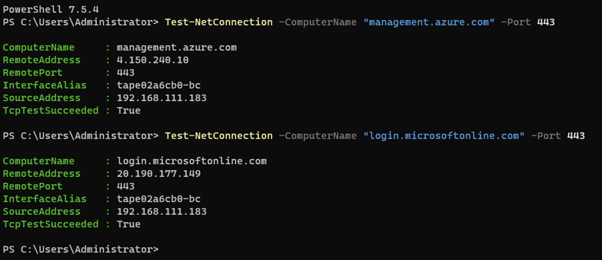
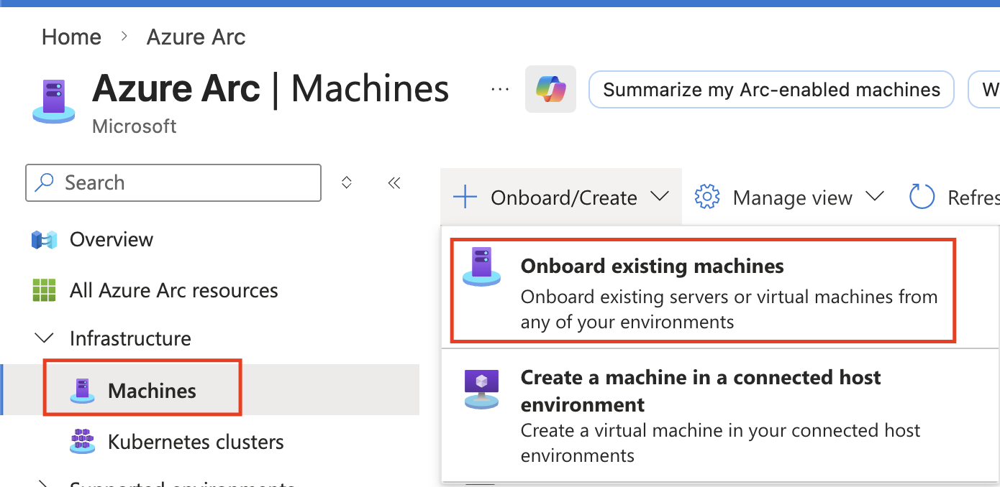
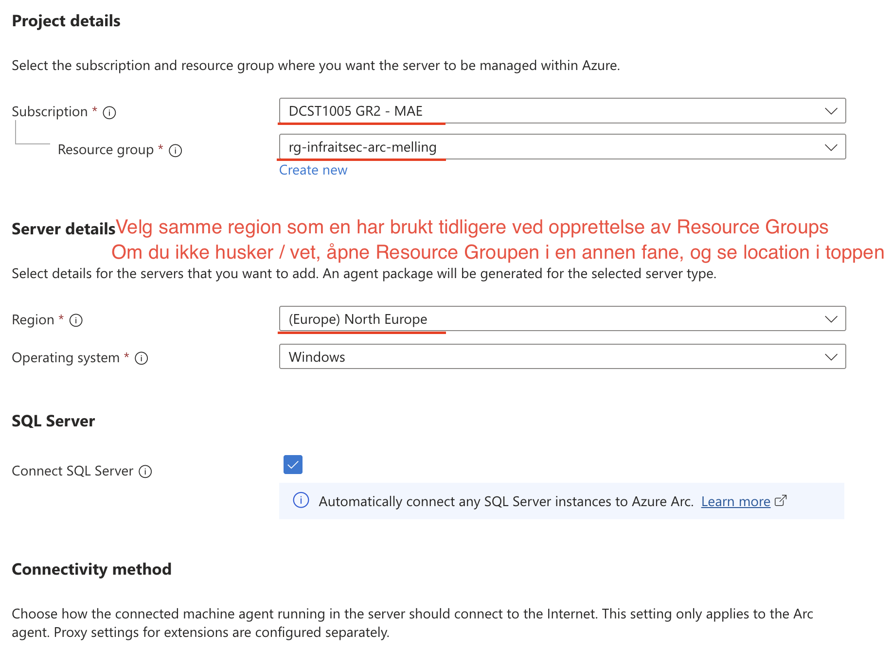
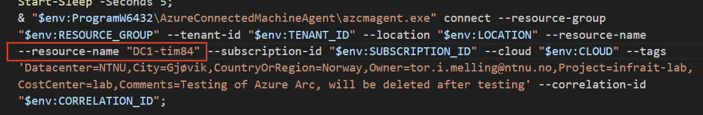
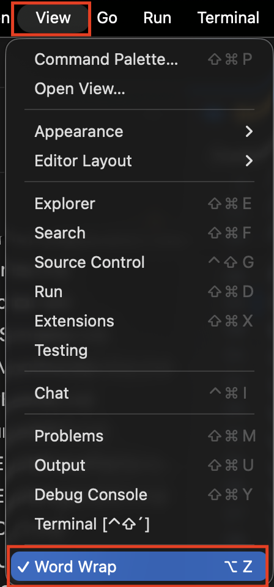
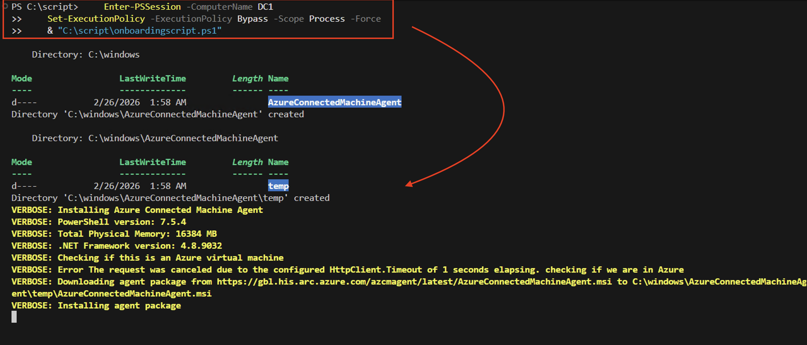
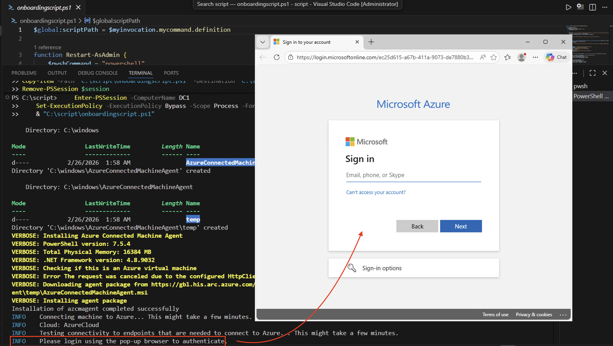
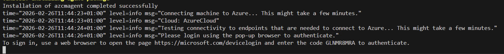
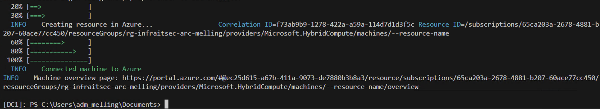

# Azure Arc - Onboarding av Lab-maskiner

## Oversikt

I denne gjennomgangen skal du koble dine on-premises lab-maskiner (DC1, SRV1, MGR, CL1) til Azure Arc. Dette gir deg mulighet til å administrere maskinene fra Azure Portal, selv om de kjører i OpenStack-miljøet på NTNU.

**Hva er Azure Arc?**
Azure Arc utvider Azure management og tjenester til servere som kjører utenfor Azure - i dette tilfellet dine OpenStack VMs. Du får:
- Sentralisert oversikt over alle maskiner
- Remote management capabilities
- Azure Policy enforcement
- Update management
- Monitoring og logging
- Security posture management

**Læringsmål:**
- Forstå hybrid cloud management
- Installere og konfigurere Azure Connected Machine Agent
- Autentisere sikker med Azure AD (ingen lagrede credentials)
- Verifisere tilkobling og status
- Automatisere onboarding med PowerShell

**Estimert tid:** 45-60 minutter (alle 4 maskiner)

---

## Forutsetninger

- [ ] Tilgang til Azure Portal med din NTNU-bruker (B2B guest)
- [ ] Tilgang til Resource Group: `<prefix>-rg-infraitsec-arc`
- [ ] Rolle: "Azure Connected Machine Onboarding" på Resource Group (dere har Global Admin)
- [ ] Administratortilgang på DC1, SRV1, MGR, CL1
- [ ] Maskinene har utgående internett-tilgang (port 443)

**Verifiser internett-tilgang:**

Kjør på **én av maskinene** (f.eks. DC1):
```powershell
# Test HTTPS connectivity til Azure endpoints
Test-NetConnection -ComputerName "management.azure.com" -Port 443
Test-NetConnection -ComputerName "login.microsoftonline.com" -Port 443
```

**Forventet output:** `TcpTestSucceeded: True` for begge


Hvis dette feiler, kontakt lærer før du fortsetter.

---

## Del 1: GUI-basert Installasjon (Første maskin)

Vi starter med **DC1** ved hjelp av Azure Portal GUI. Dette gir deg forståelse for prosessen før vi automatiserer.

### Steg 1.1: Generer Onboarding Script

1. Logg inn på [Azure Portal](https://portal.azure.com) med din NTNU-bruker

2. Søk etter **"Azure Arc"** i søkefeltet øverst

3. Under "Infrastructure" → velg **"Machines"**

4. Klikk **"+ Onboard/Create"** → **"Onboard existing machines"**
   1. 

5. Velg **"Fyll inn Basics konfigurasjon"**
   1. 

   **Resource details:**
   - **Subscription:** (Velg riktig subscription)
   - **Resource group:** `<prefix>-rg-infraitsec-arc`
   - **Region:** `North Europe`
   - **Operating system:** `Windows`
   
   **Machine details:**
   - **Connectivity method:** `Public endpoint`
   
   **Authentication:**
   - **Authentication method:** Velg `Authenticate machines manually`

6. Klikk **"Next"** til du kommer til **"Tags"**

**Legg inn tags i henhold til god praksis, husk Owner!**


7. Klikk **"Next"** til du kommer til **"Download and run script"**

8. Klikk **"Download / Copy icon"** - Kopier .ps1 filen til MGR for editering

   **VIKTIG:** Ikke kjør scriptet ennå! Vi må tilpasse det først.

### Steg 1.2: Tilpass Script (Custom Resource Name)

Det nedlastede scriptet bruker hostname som resource name i Azure. Siden alle studenter har maskiner som heter "DC1", "SRV1" etc., må vi legge til et unikt navn.

1. Åpne det nedlastede scriptet i VS Code

2. Finn linjen som starter med:
```powershell
   & "$env:ProgramW6432\AzureConnectedMachineAgent\azcmagent.exe" connect ...
```

1. Legg til `--resource-name` parameter **FØR** `--subscription-id`:
```powershell
   --resource-name "DC1-<prefix>"
```


**Om du ikke ser hele linjen, kan du velge at VS Code skal ha visning Word wrap. Det gjør at alt sammen vises i editeringsvinduet, selv om det er en lang setning:**



**Hvorfor?** Dette sikrer at din DC1 vises som "DC1-<prefix>" i Azure Portal, ikke bare "DC1". Da unngår vi konflikter med andre studenter.

### Steg 1.3: Kjør Script på DC1

1. **Koble til DC1** (RDP eller fra MGR):
```powershell
   Enter-PSSession -ComputerName DC1
```

2. **Kopier Script fra MGR til DC1: (MERK! Mappen script opprettes om den ikke finnes fra før på destinasjon, her DC1)**
```powershell
$session = New-PSSession -ComputerName DC1

Invoke-Command -Session $session -ScriptBlock {
    if (-not (Test-Path "C:\script")) {
        New-Item -Path "C:\script" -ItemType Directory -Force
        Write-Host "Opprettet mappe: C:\script"
    }
}

Copy-Item -Path "C:\script\onboardingscript.ps1" -Destination "C:\script\onboardingscript.ps1" -ToSession $session
Write-Host "Fil kopiert til DC1"

Remove-PSSession $session
```

1. **Kjør scriptet som Administrator:**
```powershell
Enter-PSSession -ComputerName DC1
Set-ExecutionPolicy -ExecutionPolicy Bypass -Scope Process -Force
& "C:\script\onboardingscript.ps1"
Exit-PSSession
```



### Steg 1.4: Interaktiv Autentisering (EDGE nettleser åpne opp påloggingsvinduet)



## Om du ikke får Edge popup, kan du vente litt og se om det dukker opp følgende informasjon nederst i terminalen om Device Login med tilhørende kode. Denne instruksen kan utføres på egen laptop i egen nettleser om ønskelig:



**Output du vil se:**
```
Installation of azcmagent completed successfully
INFO    Connecting machine to Azure... This might take a few minutes. 
INFO    Cloud: AzureCloud
INFO    Testing connectivity to endpoints that are needed to connect to Azure... This might take a few minutes. 
INFO    Please login using the pop-up browser to authenticate. 
```

**Etter authentisering via nettleser vil en se følgende i terminal:**



### Steg 1.5: Verifiser i Azure Portal

1. Gå tilbake til **Azure Portal** → **Azure Arc** → **Machines**

2. Du skal nå se: **DC1-<prefix>** i listen

3. Klikk på maskinnavnet for å se detaljer:
   - **Status:** Connected
   - **Agent version:** (nyeste versjon)
   - **Operating System:** Windows Server 2025 (eller 2022)
   - **Last heartbeat:** (< 5 minutter siden)

**Gratulerer!** DC1 er nå Arc-enabled! 🎉

---

## Del 2: Azure-Arc onboarding på resterende maskiner:

Nå gjentar vi prosessen for **SRV1**, **MGR**, og **CL1**.

**Forenklet prosess (ettersom vi allerede har scriptet):**

### SRV1 ‼️MERK: Vi må redigere --resource-name for hver maskin vi kjører det for.
```powershell
$session = New-PSSession -ComputerName srv1

Invoke-Command -Session $session -ScriptBlock {
    if (-not (Test-Path "C:\script")) {
        New-Item -Path "C:\script" -ItemType Directory -Force
        Write-Host "Opprettet mappe: C:\script"
    }
}

Copy-Item -Path "C:\script\onboardingscript.ps1" -Destination "C:\script\onboardingscript.ps1" -ToSession $session
Write-Host "Fil kopiert til srv1"

Remove-PSSession $session
```

### Kjør sriptet på SRV1

```powershell
Enter-PSSession -ComputerName srv1
Set-ExecutionPolicy -ExecutionPolicy Bypass -Scope Process -Force
& "C:\script\onboardingscript.ps1"
Exit-PSSession
```

### CL1 ‼️MERK: Vi må redigere --resource-name for hver maskin vi kjører det for.
```powershell
$session = New-PSSession -ComputerName cl1

Invoke-Command -Session $session -ScriptBlock {
    if (-not (Test-Path "C:\script")) {
        New-Item -Path "C:\script" -ItemType Directory -Force
        Write-Host "Opprettet mappe: C:\script"
    }
}

Copy-Item -Path "C:\script\onboardingscript.ps1" -Destination "C:\script\onboardingscript.ps1" -ToSession $session
Write-Host "Fil kopiert til cl1"

Remove-PSSession $session
```

### Kjør sriptet på CL1

```powershell
Enter-PSSession -ComputerName cl1
Set-ExecutionPolicy -ExecutionPolicy Bypass -Scope Process -Force
& "C:\script\onboardingscript.ps1"
Exit-PSSession
```

### MGR ‼️MERK: Vi må redigere --resource-name for hver maskin vi kjører det for.

**Kjent issue:**
>Hvorfor virket det remote, men ikke lokalt?
>
>Remote execution: Invoke-Command kjører scriptet direkte i en session som allerede har admin-rettigheter (PSSession etablert med admin-bruker)
>Lokal execution: Scriptet må re-starte seg selv via Start-Process, og da blir quotes/escape-sekvenser tolket på nytt av PowerShell → parametere blir ødelagt

**Fiks:**
- Scriptet må skrives om, se eget script: 

```powershell
# Kjør scriptet lokalt :)
```

---

## Del 3: PowerShell-basert Installasjon (Automatisering)
## ‼️IKKE VERIFISERT AT ALT UNDER DEL 3 FUNGERER 100% ENDA (26.02.2026)

GUI/PowerShell-metoden fungerer, men er repetitiv. For en fullautomatisere prosessen, krever det et litt lengre og mer avansert PowerShell script.

**Scenario:** Du må re-onboarde maskinene eller onboarde nye maskiner senere.

### Steg 3.1: Opprett Felles Onboarding Script

**På MGR** (eller lokal PC), opprett følgende script:

**Fil:** `C:\Scripts\Deploy-ArcAgent.ps1`
```powershell
<#
.SYNOPSIS
    Automatisk installasjon og onboarding av Azure Arc agent
.DESCRIPTION
    Dette scriptet installerer Azure Connected Machine Agent og registrerer maskinen til Azure Arc.
    Bruker interaktiv autentisering (device code login).
.PARAMETER ComputerName
    Navn på maskinen som skal Arc-enables
.PARAMETER ResourceName
    Navn som vises i Azure Portal (f.eks. "DC1-<prefix>")
.PARAMETER TenantId
    Azure AD Tenant ID
.PARAMETER SubscriptionId
    Azure Subscription ID
.PARAMETER ResourceGroup
    Azure Resource Group navn
.PARAMETER Location
    Azure region (f.eks. "northeurope")
.EXAMPLE
    .\Deploy-ArcAgent.ps1 -ComputerName "DC1" -ResourceName "DC1-studenta" -TenantId "..." -SubscriptionId "..." -ResourceGroup "studenta-rg-infraitsec-arc" -Location "northeurope"
#>

param(
    [Parameter(Mandatory=$true)]
    [string]$ComputerName,
    
    [Parameter(Mandatory=$true)]
    [string]$ResourceName,
    
    [Parameter(Mandatory=$true)]
    [string]$TenantId,
    
    [Parameter(Mandatory=$true)]
    [string]$SubscriptionId,
    
    [Parameter(Mandatory=$true)]
    [string]$ResourceGroup,
    
    [Parameter(Mandatory=$false)]
    [string]$Location = "northeurope"
)

Write-Host "`n========================================" -ForegroundColor Cyan
Write-Host "Azure Arc Agent Deployment" -ForegroundColor Cyan
Write-Host "Target: $ComputerName" -ForegroundColor Cyan
Write-Host "Azure Name: $ResourceName" -ForegroundColor Cyan
Write-Host "========================================`n" -ForegroundColor Cyan

# Definér script block som skal kjøres på remote machine
$scriptBlock = {
    param($ResourceName, $TenantId, $SubscriptionId, $ResourceGroup, $Location)
    
    # Variabler
    $agentUrl = "https://aka.ms/AzureConnectedMachineAgent"
    $installerPath = "C:\Temp\AzureConnectedMachineAgent.msi"
    $logPath = "C:\Temp\ArcAgentInstall.log"
    
    # Opprett temp directory
    New-Item -Path "C:\Temp" -ItemType Directory -Force | Out-Null
    
    Write-Host "[1/3] Downloading Azure Connected Machine Agent..." -ForegroundColor Yellow
    try {
        Invoke-WebRequest -Uri $agentUrl -OutFile $installerPath -UseBasicParsing
        Write-Host "      Download completed." -ForegroundColor Green
    } catch {
        Write-Error "Failed to download agent: $_"
        return $false
    }
    
    Write-Host "[2/3] Installing Azure Connected Machine Agent..." -ForegroundColor Yellow
    try {
        $installArgs = "/i `"$installerPath`" /qn /l*v `"$logPath`""
        $process = Start-Process msiexec.exe -ArgumentList $installArgs -Wait -PassThru
        
        if ($process.ExitCode -eq 0) {
            Write-Host "      Installation completed successfully." -ForegroundColor Green
        } else {
            Write-Error "Installation failed with exit code: $($process.ExitCode)"
            Write-Host "Check log: $logPath" -ForegroundColor Red
            return $false
        }
    } catch {
        Write-Error "Installation error: $_"
        return $false
    }
    
    # Vent litt for at service skal starte
    Start-Sleep -Seconds 5
    
    # Verifiser at agent er installert
    $agentPath = "C:\Program Files\AzureConnectedMachineAgent\azcmagent.exe"
    if (-not (Test-Path $agentPath)) {
        Write-Error "Agent executable not found at: $agentPath"
        return $false
    }
    
    Write-Host "[3/3] Connecting machine to Azure Arc..." -ForegroundColor Yellow
    Write-Host "      You will be prompted for device code login..." -ForegroundColor Cyan
    
    try {
        $connectArgs = @(
            "connect",
            "--resource-name", $ResourceName,
            "--resource-group", $ResourceGroup,
            "--tenant-id", $TenantId,
            "--subscription-id", $SubscriptionId,
            "--location", $Location,
            "--cloud", "AzureCloud"
        )
        
        & $agentPath $connectArgs
        
        if ($LASTEXITCODE -eq 0) {
            Write-Host "`n      Successfully connected to Azure Arc!" -ForegroundColor Green
            
            # Vis status
            Write-Host "`n      Verifying connection..." -ForegroundColor Yellow
            & $agentPath show
            
            return $true
        } else {
            Write-Error "Connection failed with exit code: $LASTEXITCODE"
            return $false
        }
    } catch {
        Write-Error "Connection error: $_"
        return $false
    }
}

# Kjør script på target machine
try {
    if ($ComputerName -eq $env:COMPUTERNAME) {
        # Kjør lokalt
        $result = & $scriptBlock -ResourceName $ResourceName -TenantId $TenantId -SubscriptionId $SubscriptionId -ResourceGroup $ResourceGroup -Location $Location
    } else {
        # Kjør remote
        Write-Host "Connecting to $ComputerName..." -ForegroundColor Yellow
        $session = New-PSSession -ComputerName $ComputerName -Credential (Get-Credential -Message "Enter credentials for $ComputerName")
        
        $result = Invoke-Command -Session $session -ScriptBlock $scriptBlock -ArgumentList $ResourceName, $TenantId, $SubscriptionId, $ResourceGroup, $Location
        
        Remove-PSSession -Session $session
    }
    
    if ($result) {
        Write-Host "`n========================================" -ForegroundColor Green
        Write-Host "SUCCESS: $ComputerName is now Arc-enabled!" -ForegroundColor Green
        Write-Host "========================================`n" -ForegroundColor Green
    } else {
        Write-Host "`n========================================" -ForegroundColor Red
        Write-Host "FAILED: Arc onboarding did not complete" -ForegroundColor Red
        Write-Host "========================================`n" -ForegroundColor Red
    }
    
} catch {
    Write-Error "Script execution failed: $_"
}
```

### Steg 3.2: Konfigurer Variabler

**Opprett en konfigurasjonsfil med dine verdier:**

**Fil:** `C:\Scripts\ArcConfig.ps1`
```powershell
# Azure Arc Configuration
# ENDRE DISSE VERDIENE TIL DINE EGNE!

$ArcConfig = @{
    TenantId       = "<din-tenant-id>"          # Finn i Azure Portal → Azure AD → Properties
    SubscriptionId = "<din-subscription-id>"    # Finn i Azure Portal → Subscriptions
    ResourceGroup  = "<prefix>-rg-infraitsec-arc"
    Location       = "northeurope"
    Prefix         = "<prefix>"                 # Ditt tildelte prefix
}

# Maskinliste som skal Arc-enables
$Machines = @(
    @{ComputerName = "DC1";  ResourceName = "DC1-$($ArcConfig.Prefix)"},
    @{ComputerName = "SRV1"; ResourceName = "SRV1-$($ArcConfig.Prefix)"},
    @{ComputerName = "MGR";  ResourceName = "MGR-$($ArcConfig.Prefix)"},
    @{ComputerName = "CL1";  ResourceName = "CL1-$($ArcConfig.Prefix)"}
)

# Eksporter for bruk i andre scripts
Export-ModuleMember -Variable ArcConfig, Machines
```

**Hvordan finne TenantId og SubscriptionId:**

1. **TenantId:**
   - Azure Portal → **Microsoft Entra ID** → **Overview** → kopier **Tenant ID**

2. **SubscriptionId:**
   - Azure Portal → **Subscriptions** → kopier **Subscription ID**

### Steg 3.3: Deploy til Alle Maskiner

**Metode 1: Én og én maskin (anbefalt første gang)**
```powershell
# Last inn config
. C:\Scripts\ArcConfig.ps1

# Deploy til DC1
.\Deploy-ArcAgent.ps1 `
    -ComputerName "DC1" `
    -ResourceName "DC1-$($ArcConfig.Prefix)" `
    -TenantId $ArcConfig.TenantId `
    -SubscriptionId $ArcConfig.SubscriptionId `
    -ResourceGroup $ArcConfig.ResourceGroup `
    -Location $ArcConfig.Location
```

**Metode 2: Alle maskiner i loop**
```powershell
# Last inn config
. C:\Scripts\ArcConfig.ps1

# Deploy til alle maskiner
foreach ($machine in $Machines) {
    Write-Host "`n`nProcessing: $($machine.ComputerName)" -ForegroundColor Magenta
    
    .\Deploy-ArcAgent.ps1 `
        -ComputerName $machine.ComputerName `
        -ResourceName $machine.ResourceName `
        -TenantId $ArcConfig.TenantId `
        -SubscriptionId $ArcConfig.SubscriptionId `
        -ResourceGroup $ArcConfig.ResourceGroup `
        -Location $ArcConfig.Location
    
    Write-Host "`nWaiting 30 seconds before next machine..." -ForegroundColor Gray
    Start-Sleep -Seconds 30
}

Write-Host "`n`nAll machines processed!" -ForegroundColor Green
```

**VIKTIG:** Du må gjennomføre device code login for hver maskin.

---

## Del 4: Verifisering og Status

### Steg 4.1: Sjekk Status i Azure Portal

1. **Azure Portal** → **Azure Arc** → **Machines**

2. Filtrer på Resource Group: `<prefix>-rg-infraitsec-arc`

3. Du skal nå se alle 4 maskiner:
   - DC1-<prefix>
   - SRV1-<prefix>
   - MGR-<prefix>
   - CL1-<prefix>

4. Verifiser for hver maskin:
   - **Arc agent status:** Connected (grønn prikk)
   - **Last heartbeat:** < 5 minutter siden
   - **Agent version:** (siste versjon)
   - **Operating system:** Windows Server 2025 / Windows 11

### Steg 4.2: Sjekk Status fra PowerShell (Lokalt)

**På hver maskin:**
```powershell
# Vis Arc agent status
& 'C:\Program Files\AzureConnectedMachineAgent\azcmagent.exe' show

# Forventet output:
# Resource Name: DC1-<prefix>
# Agent Status: Connected
# Agent Version: 1.xx
# Subscription ID: ...
# Resource Group: <prefix>-rg-infraitsec-arc
```

**Sjekk service status:**
```powershell
Get-Service -Name himds

# Status skal være: Running
```

### Steg 4.3: Sjekk Status fra Azure (PowerShell)

**På MGR (eller lokal PC med Az PowerShell):**
```powershell
# Installer Az.ConnectedMachine module (hvis ikke installert)
Install-Module -Name Az.ConnectedMachine -Force -AllowClobber

# Connect til Azure
Connect-AzAccount

# List alle Arc-enabled machines i din RG
Get-AzConnectedMachine -ResourceGroupName "<prefix>-rg-infraitsec-arc" | 
    Select-Object Name, Status, ProvisioningState, LastStatusChange | 
    Format-Table -AutoSize
```

**Forventet output:**
```
Name         Status    ProvisioningState LastStatusChange
----         ------    ----------------- ----------------
DC1-<prefix> Connected Succeeded         2025-02-26 14:23:11
SRV1-<prefix> Connected Succeeded        2025-02-26 14:25:33
MGR-<prefix> Connected Succeeded         2025-02-26 14:27:45
CL1-<prefix> Connected Succeeded         2025-02-26 14:29:12
```

---

## Del 5: Post-Onboarding Tasks

### Steg 5.1: Tag Resources

Legg til tags for bedre organisering:
```powershell
# Azure Portal → Arc machine → Tags
Name: Owner
Value: <brukernavn>

Name: Environment
Value: Lab

Name: Course
Value: InfraIT-Cyber

Name: Semester
Value: Spring-2025
```

**Eller via PowerShell:**
```powershell
$tags = @{
    Owner = "<brukernavn>"
    Environment = "Lab"
    Course = "InfraIT-Cyber"
    Semester = "Spring-2025"
}

Get-AzConnectedMachine -ResourceGroupName "<prefix>-rg-infraitsec-arc" | ForEach-Object {
    Update-AzTag -ResourceId $_.Id -Tag $tags -Operation Merge
}
```

### Steg 5.2: Enable System-Assigned Managed Identity

**Hvorfor?** Managed Identity lar maskinene autentisere til Azure-tjenester (Key Vault, Storage, etc.) uten å lagre credentials.

**For hver maskin i Azure Portal:**

1. Arc machine → **Identity**
2. **System assigned** tab
3. **Status:** ON
4. **Save**

**Eller via PowerShell:**
```powershell
Get-AzConnectedMachine -ResourceGroupName "<prefix>-rg-infraitsec-arc" | ForEach-Object {
    Update-AzConnectedMachine -ResourceGroupName $_.ResourceGroupName -Name $_.Name -EnableSystemAssignedIdentity
    Write-Host "Enabled Managed Identity for $($_.Name)" -ForegroundColor Green
}
```

---

## Troubleshooting

### Problem: "Failed to connect - Network connectivity error"

**Symptom:**
```
error   Unable to reach https://management.azure.com
```

**Løsning:**

1. Verifiser internett-tilgang:
```powershell
   Test-NetConnection -ComputerName "management.azure.com" -Port 443
```

2. Sjekk Windows Firewall:
```powershell
   Get-NetFirewallRule -DisplayName "*Azure*" | Format-Table DisplayName, Enabled, Action
```

3. Hvis bak proxy, konfigurer proxy:
```powershell
   & 'C:\Program Files\AzureConnectedMachineAgent\azcmagent.exe' config set proxy.url "http://proxy:port"
```

---

### Problem: "Authentication failed - AADSTS50105"

**Symptom:**
```
error   User account is disabled or does not exist
```

**Løsning:**

1. Verifiser at din NTNU-bruker er invitert som B2B guest
2. Sjekk at du har "Azure Connected Machine Onboarding" rolle
3. Prøv å logge inn på Azure Portal først for å verifisere tilgang

---

### Problem: "Resource already exists"

**Symptom:**
```
error   A machine with the name 'DC1-<prefix>' already exists
```

**Løsning:**

**Hvis dette er re-onboarding:**

1. Disconnect først:
```powershell
   & 'C:\Program Files\AzureConnectedMachineAgent\azcmagent.exe' disconnect --force-local-only
```

2. Slett ressursen i Azure Portal:
   - Arc → Machines → Velg maskinen → Delete

3. Prøv onboarding på nytt

---

### Problem: Agent installerer ikke

**Symptom:**
```
error   Installation failed with exit code 1603
```

**Løsning:**

1. Sjekk installasjon log:
```powershell
   Get-Content "C:\Temp\ArcAgentInstall.log" | Select-String "error" -Context 3
```

2. Verifiser at du kjører som Administrator

3. Sjekk at .NET Framework 4.7.2 eller høyere er installert:
```powershell
   (Get-ItemProperty "HKLM:\SOFTWARE\Microsoft\NET Framework Setup\NDP\v4\Full").Version
```

4. Prøv manuell installasjon:
```powershell
   msiexec /i "C:\Temp\AzureConnectedMachineAgent.msi" /l*v "C:\Temp\ManualInstall.log"
```

---

### Problem: "Disconnected" status i Azure Portal

**Symptom:**
Maskinen vises som "Disconnected" selv om den virker online.

**Løsning:**

1. Sjekk service på maskinen:
```powershell
   Get-Service -Name himds
   Restart-Service -Name himds
```

2. Sjekk event log:
```powershell
   Get-WinEvent -LogName "Azure Connected Machine Agent" -MaxEvents 20
```

3. Force reconnect:
```powershell
   & 'C:\Program Files\AzureConnectedMachineAgent\azcmagent.exe' reconnect
```

---

## Cleanup (Kun ved lab reset)

**ADVARSEL:** Gjør kun dette hvis du skal rebuilde lab-miljøet!

### Disconnect maskiner

**På hver maskin:**
```powershell
& 'C:\Program Files\AzureConnectedMachineAgent\azcmagent.exe' disconnect --force-local-only
```

### Slett fra Azure Portal
```powershell
# Azure Cloud Shell eller lokal PC
Get-AzConnectedMachine -ResourceGroupName "<prefix>-rg-infraitsec-arc" | Remove-AzConnectedMachine -Force
```

### Avinstaller agent (valgfritt)
```powershell
msiexec /x "C:\Temp\AzureConnectedMachineAgent.msi" /qn
```

---

## Refleksjonsspørsmål

Svar på disse spørsmålene etter at du har fullført onboarding:

1. **Hybrid Management:**
   - Hva er forskjellen mellom å administrere maskiner via RDP/GPO vs. Azure Arc?
   - Hvilke fordeler gir sentralisert management fra Azure Portal?

2. **Autentisering:**
   - Hvorfor bruker vi device code login istedenfor service principals?
   - Hva er fordelene med Managed Identity?

3. **Naming Convention:**
   - Hvorfor må vi bruke `--resource-name` parameter?
   - Hva hadde skjedd hvis alle studenter brukte samme navn?

4. **Automatisering:**
   - Hva er fordelen med PowerShell-basert deployment?
   - I hvilke scenarier ville du brukt GUI vs. PowerShell?

5. **Troubleshooting:**
   - Hvilke feilmeldinger opplevde du?
   - Hvordan løste du dem?
   - Hva ville du gjort annerledes neste gang?

---

## Neste Steg

Nå som maskinene dine er Arc-enabled, kan du gå videre med:

1. **Azure Arc Management** - Bruk Arc til remote command execution, update management, og policy enforcement
2. **Azure Blob Storage** - Sett opp automatisk backup fra SRV1
3. **Azure File Sync** - Replikér DFS folders til Azure for disaster recovery

**Gratulerer med fullført Azure Arc onboarding!** 🎉

---

## Ressurser

- [Azure Arc Documentation](https://learn.microsoft.com/en-us/azure/azure-arc/)
- [Connected Machine Agent Overview](https://learn.microsoft.com/en-us/azure/azure-arc/servers/agent-overview)
- [Troubleshooting Guide](https://learn.microsoft.com/en-us/azure/azure-arc/servers/troubleshoot-agent-onboard)
- [Azure Arc Best Practices](https://learn.microsoft.com/en-us/azure/azure-arc/servers/best-practices)