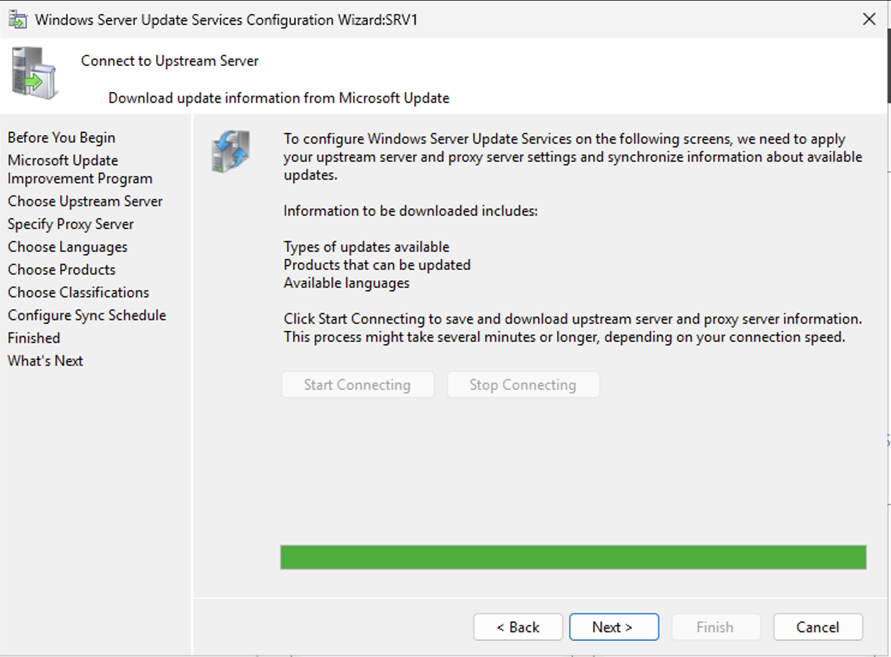
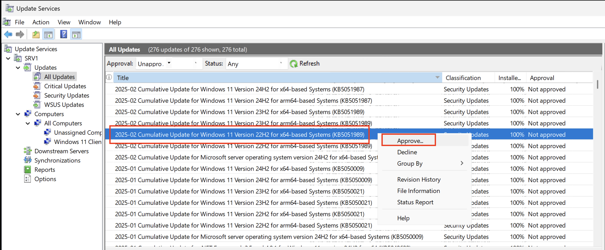

# Installing WSUS on Windows Server 2025 - SRV1

## Prerequisites
- Windows Server 2025 (SRV1)
- Administrator access (administrator@<yourDomain.nn>)
- Minimum 10GB free disk space (40GB recommended)
- TIPS!! RESTART SRV1 to avoid other setups, configurations affecting the WSUS role install

## Step 1: Install Required Server Roles and Features (SRV1)

1. Remember to restart first, my setup got "stuck"
2. Open Server Manager
3. Click "Manage" → "Add Roles and Features"

1. Click "Next" until you reach "Server Roles"
2. Select the following roles:

   - Windows Server Update Services - Select WSUS first, then it will automatically select the necessary roles for WSUS.
   - IIS (if not already installed)

1. Choose your installation location for WSUS updates
   - Create a new folder on D:\ -> D:\WSUS 
   - Recommended: Separate volume with sufficient space


1. Complete the installation wizard
2. Wait for the installation to finish
3. OBS! If it get "stuck", wait a bit longer..
4. Start the post install configuration..


## Step 2: Post install and Configure WSUS Post-Installation

1. Open Server Manager

2. Click on "Tools" → "Windows Server Update Services"

3. The WSUS Configuration Wizard will start automatically


### Initial Configuration Steps:
1. Choose upstream server:
   - Synchronize from Microsoft Update

2. No proxy settings
3. Click "Start Connecting" to test connection



4. Choose languages:
   - Select "Download updates only in these languages"
   - Choose required languages: English

5. Choose products to update:
   - Windows Server 2025 -> Listed as Windows Server 24h2
   - Windows 11

6. Select update classifications:
   - Critical Updates
   - Security Updates
   - Service Packs

7. Configure sync schedule:
   - Recommended: Daily at off-peak hours
   - Initial sync may take several hours

8. WSUS after search and synchronizing


## Step 3: Configure Client-Side Settings

1. Open Group Policy Management Console
2. Create new GPO or edit existing one

3. Edit GPO and navigate to:
   ```
   Computer Configuration\Administrative Templates\Windows Components\Windows Update
   ```

4. Configure these key settings:
   - "Configure Automatic Updates": Enabled

   - "Specify intranet Microsoft update service location": Enabled
     - Set URL to your WSUS server (my example: http://srv1.infrait.sec:8530)


1. Set update frequency and behavior. NOTE: 1 hour is only for test environments, not good practice for production environment. It creates to much network activity.


1. Link GPO to appropriate OU

2. Force policy update on clients:
   ```powershell
   gpupdate /force
   ```

## Step 4: Verify GPO and Installation

1. Check Registry on CL1:

   - Open WSUS Management Console
   - NOTE!! It could take up to 30 - 60 minutes before the client reports to the WSUS Server: Check for connected clients, set status to Any and hit refresh.

   - If it does not show up, wait and hit Refresh again at a later time:


2. Create a group for clients in WSUS:
   - Right click on All Computers and click Add Computer Group
   - Name it Windows 11 Clients
   - Right click the CL1 in Unnasigned Computers and move it to the new group

   - Verify the CL1 computer in Windows 11 Clients

3. Check for unaproved updates

4. Approve 2025-02 Cumulative Updates for Windows 11 22h2 (KB5051989)

5. Select group for approval

NOTE! It will now start to download the update to the WSUS Server and installed based on configured schedule.

6. Verify updates are being offered to clients
7. Check IIS logs for client connections

## Troubleshooting


   ```powershell
   # On client machine
   wuauclt /detectnow
   wuauclt /reportnow
   ```

### Common Issues:
1. Synchronization Failures
   - Check network connectivity
   - Verify proxy settings
   - Review WSUSContent folder permissions

2. Client Connection Issues
   - Verify GPO settings
   - Check client-side Windows Update logs
   - Ensure firewall allows WSUS traffic (Ports 8530/8531)

3. Database Issues
   - Run WSUS Server Cleanup Wizard
   - Check SQL Server connectivity
   - Monitor database growth

### Maintenance Tasks:
1. Regular cleanup:
   ```powershell
   # Run WSUS cleanup wizard monthly
   Get-WsusServer | Invoke-WsusServerCleanup -CleanupObsoleteUpdates
   ```

2. Monitor disk space usage
3. Review and decline superseded updates
4. Check for failed client installations

## Best Practices

1. Regular Maintenance:
   - Run Server Cleanup Wizard monthly
   - Monitor database size
   - Review and approve updates weekly

2. Security:
   - Use SSL for WSUS traffic
   - Implement role-based access control
   - Regular backup of WSUS database

3. Performance:
   - Store updates on separate volume
   - Configure IIS application pool recycling
   - Implement automatic cleanup procedures

## Additional Resources

- Microsoft WSUS Documentation
- Windows Server Update Services Best Practices
- Group Policy Settings Reference

## Support

For additional support:
1. Check Windows Server logs
2. Review IIS logs
3. Contact your system administrator
4. Reference Microsoft TechNet forums