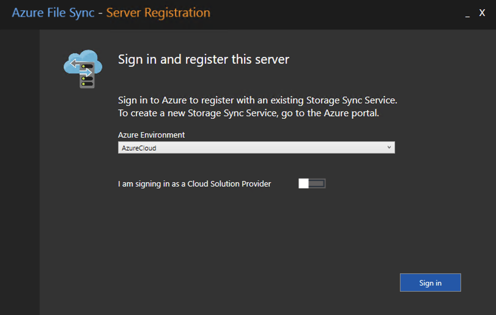
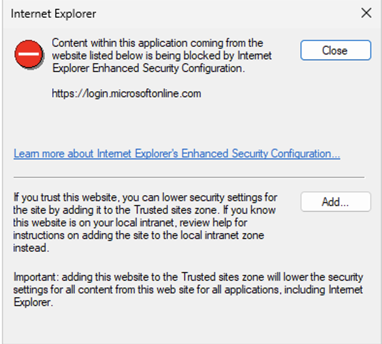
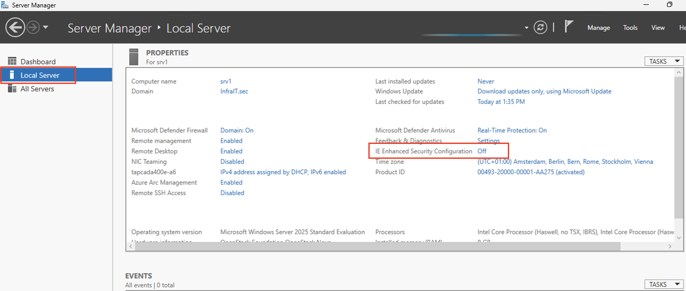
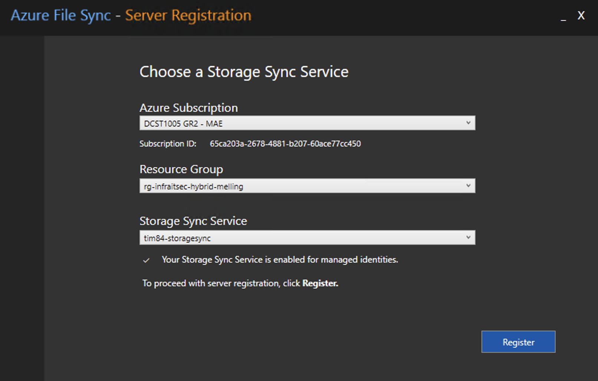
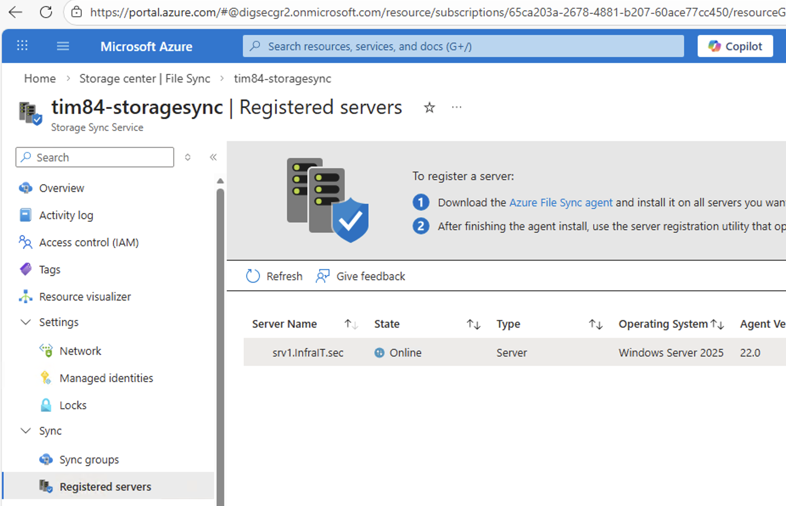
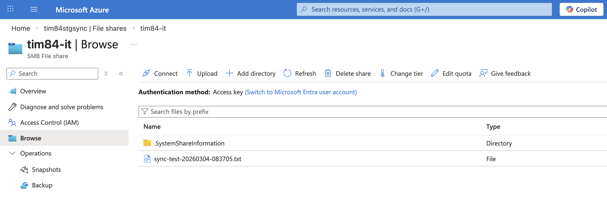

# Azure File Sync – Hybrid filsynkronisering for InfraIT.Sec

## ‼️ MERK ‼️ I løpet av denne og forrige "walkthrough", kan dere møte på flere utfordringer sammenlignet hva selve gjennomgangen tar for seg. Dette er "by design", siden dere har vært så snille og gjort alt sammen som jeg sier i tidligere oppgaver/lab. En del av oppgaven / utfordringen for denne uken blir å finne ut hvordan dere kan løse / komme dere rundt problemene som oppstår underveis. Forsøk først selv, spør en medstudent / venn(AI?), diskuter på gruppebordene. Spør læringsassistenten om hint/hjelp. If all fails, grand master Melling will assist.

## Oversikt

I denne gjennomgangen skal du sette opp Azure File Sync mellom SRV1 og Azure. Dette gjør at de delte avdelingsmappene på SRV1 automatisk synkroniseres til Azure Files, og gir deg grunnlaget for disaster recovery og hybrid filaksess.

**Hva er Azure File Sync?**
Azure File Sync gjør det mulig å sentralisere fildelene dine i Azure Files og samtidig beholde lokal ytelse og tilgjengelighet på SRV1. Du får:
- Automatisk toveis synkronisering mellom SRV1 og Azure
- Cloud tiering — sjeldent brukte filer flyttes til Azure, mens aktive filer forblir lokalt
- Disaster recovery — hvis SRV1 faller ned, finnes alle filer i Azure
- Multi-site access — samme filshare tilgjengelig fra flere lokasjoner

**Koblingen til tidligere lab-er:**

| Hva du har fra før | Hva det brukes til her |
|---|---|
| SRV1 med avdelingsshares (AGDLP-oppsett) | Kilde for synkronisering |
| `<prefix>-rg-infraitsec-hybrid` (Lab 08) | Ressursgruppe for alt som opprettes i dag |
| Azure Arc-onboarding av SRV1 (Lab 09) | Gir oss oversikt over SRV1 i Azure Portal |
| Navnekonvensjon med prefix | Brukes konsekvent på alle nye ressurser |

**Læringsmål:**
- Forstå arkitekturen bak Azure File Sync
- Opprette Storage Account og Azure File Shares
- Opprette Storage Sync Service og koble den til Resource Group
- Installere og registrere Azure File Sync-agenten på SRV1
- Konfigurere Sync Groups og Endpoints for hver avdelingsshare
- Verifisere synkronisering og teste disaster recovery-scenarioet

**Estimert tid:** 60–90 minutter

---

## Arkitektur

Før du starter er det viktig å forstå de fire komponentene som til sammen utgjør Azure File Sync:

```
┌────────────────────────────────────────────────────────────┐
│                    Azure (Cloud)                           │
│                                                            │
│  ┌─────────────────┐      ┌────────────────────────────┐   │
│  │  Storage Account│      │   Storage Sync Service     │   │
│  │                 │      │                            │   │
│  │  File Share:    │◄────►│   Sync Group per avdeling  │   │
│  │  - it           │      │   - Cloud Endpoint         │   │
│  │  - hr           │      │   - Server Endpoint        │   │
│  │  - finance      │      │                            │   │
│  └─────────────────┘      └────────────┬───────────────┘   │
└───────────────────────────────────────┬────────────────────┘
                                        │ Azure File Sync Agent
                                        │ (port 443 utgående)
┌───────────────────────────────────────▼────────────────────┐
│                    SRV1 (On-premises / OpenStack)          │
│                                                            │
│  C:\Shares\IT       ◄──── synkronisert                     │
│  C:\Shares\HR       ◄──── synkronisert                     │
│  C:\Shares\Finance  ◄──── synkronisert                     │
└────────────────────────────────────────────────────────────┘
```

**Viktig begrepsforklaring:**

| Begrep | Forklaring | Merknad |
|---|---|---|
| **Storage Account** | Azure-lagringskontoen som holder File Shares | |
| **Azure File Share** | En SMB-filshare i skyen — én per avdeling | Vil ikke fungere grunnet blokkering av SMB inn/ut av nettverket |
| **Storage Sync Service** | Tjenesten som orkestrerer synkroniseringen | |
| **Sync Group** | Kobler én Azure File Share til én eller flere Server Endpoints | |
| **Cloud Endpoint** | Azure File Share-siden av en Sync Group | |
| **Server Endpoint** | Den lokale mappen på SRV1 som synkroniseres | |
| **Registered Server** | SRV1 registrert hos Storage Sync Service | |

---

## Forutsetninger

- [ ] Lab 08 fullført — `<prefix>-rg-infraitsec-hybrid` eksisterer
- [ ] Lab 09-01 fullført — SRV1 er Arc-enabled
- [ ] SRV1 har utgående internett-tilgang på port 443
- [ ] Du har administratortilgang på SRV1
- [ ] Avdelingsshares eksisterer på SRV1 (fra tidligere fil-serverlab)

**Verifiser at avdelingsshares finnes på SRV1:**

Kjør fra MGR:
```powershell
# List alle shares på SRV1
Get-SmbShare -CimSession SRV1 | Where-Object { $_.Name -notlike "*$" } | 
    Select-Object Name, Path | Format-Table -AutoSize
```

Vi får bruk for disse stiene til avdelingsmappene i Del 3.

**Eksempel på forventet output:**
```
Name     Path
----     ----
IT       C:\Shares\IT
HR       C:\Shares\HR
finance  C:\Shares\Finance
```

---

## Del 1: Klargjøring i Azure Portal

### Steg 1.1: Opprett Storage Account

Storage Account er beholderen for alle Azure File Shares. Naming-regler: kun lowercase bokstaver og tall, 3–24 tegn, globalt unikt.

1. Logg inn på [Azure Portal](https://portal.azure.com) med din NTNU-bruker
2. Søk etter **"Storage accounts"** og klikk **"+ Create"**
3. Fyll inn følgende:

   **Basics:**
   | Felt | Verdi | Kommentar |
   |---|---|---|
   | Subscription | Din lab-subscription | |
   | Resource group | `<prefix>-rg-infraitsec-hybrid` | |
   | Storage account name | `<prefix>stgsync` (kun lowercase, ingen bindestrek) | |
   | Region | `Norway East` | Velg samme region som tidligere (lab08) |
   | Performance | `Standard` | |
   | Redundancy | `Locally-redundant storage (LRS)` | |

   > **Merk:** LRS er tilstrekkelig for lab-formål. I produksjon ville man typisk valgt GRS (Geo-redundant) for disaster recovery på tvers av regioner.

4. Gå til **"Tags"**-fanen og legg til tags som gått igjennom i lab 08:

   | Tag | Verdi |
   |---|---|
   | `Owner` | `Din student-e-post` |
   | `CostCenter` | `lab` |
   | `Project` | `infrait-lab` |

5. Gå til **"Data protection"** og ta vekk avhukingen for `Enable soft delete for .....` - Blobs, containers og file shares (MERK: kun for lab, dårlig praksis for produksjonsmiljø)
6. Klikk **"Review + create"** → **"Create"**

### Steg 1.2: Opprett Azure File Shares

Du skal opprette én File Share per avdeling. Gjenta stegene under for hver avdeling du har på SRV1.

1. Åpne Storage Account du nettopp opprettet
2. I venstremenyen, gå til **"Data storage"** → **"File shares"**
3. Klikk **"+ File share"**
4. Konfigurer:

   | Felt | Verdi |
   |---|---|
   | Name | `<prefix>-it` (eller `<prefix>-hr`, `<prefix>-finance` osv.) |
   | Tier | `Transaction optimized` |
   | Backup | Fjern avhukingen for `Enable backup` under Backup |

5. Klikk **"Create"**

**Opprett én share per avdeling.** Eksempel på hva du skal ha når dette er ferdig:

```
<prefix>stgsync (Storage Account)
├── <prefix>-it          (File Share)
├── <prefix>-hr          (File Share)
└── <prefix>-finance     (File Share)
```

> **Navnekonvensjon:** File Share-navn er globalt synlige innenfor Storage Account. Vi inkluderer prefix for å gjøre det tydelig hvilken student som eier hvilken share.

---

## Del 2: Opprett Storage Sync Service

Storage Sync Service er orkestratoren — den vet om alle servere og alle sync-grupper i ditt oppsett.

1. I Azure Portal, søk etter **"Storage Sync Services"** og åpne tjenesten
2. Klikk **"File Sync"** og deretter **"+ Create"**
3. Konfigurer:

   | Felt | Verdi |
   |---|---|
   | Subscription | Din lab-subscription |
   | Resource group | `<prefix>-rg-infraitsec-hybrid` |
   | Storage Sync Service name | `<prefix>-storagesync` |
   | Region | `Norway East` (eller den regionen du har brukt ved oppretting av Resource Group) |

4. Gå til **"Tags"**-fanen og legg til de samme tags som i Steg 1.1
5. Klikk **"Review + create"** → **"Create"**

---

## Del 3: Installer Azure File Sync Agent på SRV1

Azure File Sync-agenten er en separat agent fra Azure Arc-agenten. Den håndterer selve filsynkroniseringen.

### Steg 3.1: Last ned og installer agenten - Browser (srv1) / Script (mgr)

**Fra SRV1, åpne nettleser: https://aka.ms/afs/agent/Server2022**

**Fra MGR, kopier installasjonsscriptet til SRV1:**

```powershell
# Last ned Azure File Sync-agenten direkte på SRV1
$session = New-PSSession -ComputerName SRV1

Invoke-Command -Session $session -ScriptBlock {
    if (-not (Test-Path "C:\script")) {
        New-Item -Path "C:\script" -ItemType Directory -Force
    }

    $url = "https://aka.ms/afs/agent/Server2022"
    $dest = "C:\script\StorageSyncAgent.msi"
    
    Write-Host "Laster ned Azure File Sync agent..." -ForegroundColor Cyan
    Invoke-WebRequest -Uri $url -OutFile $dest -UseBasicParsing
    Write-Host "Nedlasting fullført: $dest" -ForegroundColor Green
}

Remove-PSSession $session
```

**Installer agenten på SRV1:**

```powershell
# Installer agenten på SRV1 via Invoke-Command
Invoke-Command -ComputerName SRV1 -ScriptBlock {
    $logFile = "C:\script\afs_install.log"
    
    Write-Host "Starter installasjon..." -ForegroundColor Cyan
    $result = Start-Process -FilePath "msiexec.exe" `
        -ArgumentList "/i `"C:\script\StorageSyncAgent.msi`" /qn /norestart /l*v `"$logFile`"" `
        -Wait -PassThru
    
    Write-Host "Exit code: $($result.ExitCode)" -ForegroundColor Cyan
    
    if ($result.ExitCode -eq 0) {
        Write-Host "Installasjon fullført." -ForegroundColor Green
    } else {
        Write-Host "Installasjon feilet. Sjekk log: $logFile" -ForegroundColor Red
        Get-Content $logFile | Select-Object -Last 30
    }
    
    Get-Service -Name FileSyncSvc -ErrorAction SilentlyContinue
}
```

**Forventet output:**
```
Status   Name               DisplayName
------   ----               -----------
Running  FileSyncSvc        Storage Sync Monitor
```

> Hvis tjenesten ikke starter umiddelbart, vent 1–2 minutter og kjør `Get-Service -Name FileSyncSvc` på nytt.

**Restart SRV1**
```powershell
Invoke-Command -ComputerName SRV1 -ScriptBlock { 
    Restart-Computer -Force
    }
```

### Steg 3.2: Registrer SRV1 hos Storage Sync Service

Registrering etablerer tillitsforholdet mellom SRV1 og din Storage Sync Service i Azure. Dette gjøres via en interaktiv pålogging — samme prinsipp som Arc-onboarding.

1. Naviger til:
   ```
   C:\Program Files\Azure\StorageSyncAgent\ServerRegistration.exe
   ```

2. Klikk **"Sign in"** og logg inn med din NTNU-bruker ‼️MERK‼️ Om det blir **trøbbel med NTNU-brukeren**, opprett en egen adm_egetBrukerNavn og gi den Global Administrator rollen i Azure Tenant (f.eks: adm_melling@digsecgr2.onmicrosoft.com). Benytt deretter denne brukeren for å logge på Azure File Sync. En bør logge inn via en nettleser først, for å få satt opp MFA på denne nye brukeren.

   1. 

**Om du får følgende visning:**


**Slå av IE Enhanced Security fra Server Manager → Local Server → IE Enhanced Security Configuration → Off - Avslutt Server Registration og start den på nytt**


1. Velg:

   | Felt | Verdi |
   |---|---|
   | Subscription | Din lab-subscription |
   | Resource group | `<prefix>-rg-infraitsec-hybrid` |
   | Storage Sync Service | `<prefix>-storagesync` |

**Eksempelvisning, navn vil avvike fra deres visning.**


2. Klikk **"Register"**

**Verifiser registreringen i Azure Portal:**

1. Gå til **Storage Sync Service → File Sync → `<prefix>-storagesync` → Sync → Reistrated servers**
2. Under **"Registered servers"** skal du nå se **SRV1** med status **Online**


---

## Del 4: Konfigurer Sync Groups og Endpoints

En Sync Group kobler én Azure File Share (Cloud Endpoint) til én lokal mappe på SRV1 (Server Endpoint). Du skal opprette én Sync Group per avdeling.

### Steg 4.1: Opprett Sync Group for første avdeling

Gjenta dette for hver avdeling.

1. I Azure Portal, gå til → `<prefix>-storagesync`
2. Klikk **Sync group** I venstremenyen under **Sync**
3. Velg deretter **"+ Create a sync group"**
4. Konfigurer:

   | Felt | Verdi | Kommentar |
   |---|---|---|
   | Sync group name | `<prefix>-syncgroup-it` | |
   | Subscription | Din lab-subscription | |
   | Storage Account | `<prefix>stgsync` | Klikk på Select storage account og velg din egen storage account |
   | Azure File Share | `<prefix>-it` | |

5. Klikk **"Create"**

### Steg 4.2: Legg til Server Endpoint

1. Klikk på Sync Group du nettopp opprettet (`<prefix>-syncgroup-it`)
2. Klikk **"+ Add server endpoint"**
3. Konfigurer:

   | Felt | Verdi |
   |---|---|
   | Registered server | `SRV1` |
   | Path | `C:\Shares\IT` (eller den faktiske stien til IT-mappen din) |
   | Cloud Tiering | `Disabled` (deaktiver for lab-formål) |
   | Volume Free Space | N/A (kun relevant med Cloud Tiering aktivert) |

4. Klikk **"Create"**

> **Cloud Tiering:** I produksjon aktiverer man Cloud Tiering slik at sjeldent brukte filer automatisk flyttes til Azure og frigjør lokal diskplass. For lab-formål holder vi dette deaktivert for å se full synkronisering.

### Steg 4.3: Gjenta for alle avdelinger

Opprett en ny Sync Group for hver avdeling etter samme mønster:

| Sync Group | Azure File Share | Server Path |
|---|---|---|
| `<prefix>-syncgroup-it` | `<prefix>-it` | `C:\Shares\IT` |
| `<prefix>-syncgroup-hr` | `<prefix>-hr` | `C:\Shares\HR` |
| `<prefix>-syncgroup-finance` | `<prefix>-finance` | `C:\Shares\finance` |
| ... | ... | ... |
| ... | ... | ... |

---

## Del 5: Verifiser synkronisering

### Steg 5.1: Opprett en testfil på SRV1

```powershell
# Opprett testfil i IT-mappen fra MGR
$session = New-PSSession -ComputerName SRV1

Invoke-Command -Session $session -ScriptBlock {
    $timestamp = Get-Date -Format "yyyyMMdd-HHmmss"
    $content = "Synkroniseringstest opprettet: $timestamp`nMaskin: $env:COMPUTERNAME`nBruker: $env:USERNAME"
    
    New-Item -Path "C:\Shares\IT\sync-test-$timestamp.txt" -ItemType File -Value $content -Force
    Write-Host "Testfil opprettet: sync-test-$timestamp.txt" -ForegroundColor Green
}

Remove-PSSession $session
```

### Steg 5.2: Verifiser at filen dukker opp i Azure

1. Gå til Azure Portal → **Storage accounts** → `<prefix>stgsync`
2. Under **"Data storage"** → **"File shares"** → `<prefix>-it`
3. Vent noen sekunder — testfilen skal nå vises i Azure File Share
   1. 

> **Merk:** Første synkronisering etter at en Server Endpoint er opprettet kan ta noen minutter, avhengig av mengden data. Etterfølgende synkroniseringer er inkrementelle og går raskere.


### Steg 5.4: Sjekk sync-helse i Azure Portal

1. Gå til **Azure File Sync** → `<prefix>-storagesync`
2. Klikk på en Sync Group
3. Verifiser:
   - **Cloud endpoint:** Grønn hake
   - **Server endpoint (SRV1):** Status **Healthy**, siste sync < 5 minutter siden

---

## Del 6: Disaster Recovery-scenario

Dette steget simulerer at SRV1 krasjer og blir utilgjengelig. Når serveren er "nede"
synkroniserer ikke agenten lenger — og Azure Files beholder siste kjente tilstand.

### Steg 6.1: Simuler at SRV1 faller ned

Vi stopper Azure File Sync-agenten på SRV1 for å simulere at serveren er utilgjengelig.
Så lenge tjenesten er stoppet, vil ingen endringer lokalt på SRV1 synkroniseres til Azure.
```powershell
Invoke-Command -ComputerName SRV1 -ScriptBlock {
    Stop-Service -Name FileSyncSvc -Force
    Write-Host "Azure File Sync agent stoppet — SRV1 er nå 'nede'" -ForegroundColor Yellow
    Get-Service -Name FileSyncSvc | Select-Object Name, Status
}
```

### Steg 6.2: Slett filen lokalt (simuler datatap)
```powershell
Invoke-Command -ComputerName SRV1 -ScriptBlock {
    $files = Get-ChildItem "C:\Shares\IT\sync-test-*.txt" -ErrorAction SilentlyContinue
    if ($files) {
        $files | Remove-Item -Force
        Write-Host "Slettet $($files.Count) fil(er) lokalt — filen er borte fra SRV1" -ForegroundColor Red
    } else {
        Write-Host "Ingen testfiler funnet" -ForegroundColor Yellow
    }
}
```

### Steg 6.3: Verifiser at filen fortsatt finnes i Azure

1. Gå til Azure Portal → **Storage accounts** → `<prefix>stgsync`
2. Åpne File Share `<prefix>-it`
3. Bekreft at `sync-test-*.txt` fortsatt er der

> **Hva du ser:** Fordi sync-agenten var stoppet da du slettet filen lokalt,
> fikk Azure aldri beskjed om slettingen. Dette speiler virkeligheten: hvis en
> server krasjer midt i en arbeidsdag, fryser Azure Files på siste synkroniserte
> tilstand.

### Steg 6.4: Gjenopprett filen fra Azure (MERK! Veldig manuell fremgangsmåte. Prinsippene er de samme)

Last ned filen fra Azure Portal:
1. Klikk på filen i File Share → **"..."** → **"Download"**
2. Kopier den nedlastede filen tilbake til SRV1:
```powershell
# Kopier gjenopprettet fil fra MGR til SRV1 - HUSK Å SKRIVE INN DITT BRUKERNAVN I STIEN UNDER, for meg er det adm_melling
# "C:\Users\adm_melling\Downloads\sync-test-*.txt"
$session = New-PSSession -ComputerName SRV1

Copy-Item -Path "C:\Users\adm_melling\Downloads\sync-test-*.txt" `
    -Destination "C:\Shares\IT\" `
    -ToSession $session

Remove-PSSession $session
```

### Steg 6.5: Start SRV1 opp igjen
```powershell
Invoke-Command -ComputerName SRV1 -ScriptBlock {
    Start-Service -Name FileSyncSvc
    Write-Host "SRV1 er tilbake online — synkronisering gjenopptas" -ForegroundColor Green
    Get-Service -Name FileSyncSvc | Select-Object Name, Status
}
```

Vent 2–3 minutter og verifiser at alle Sync Groups viser **Healthy** i Azure Portal.

> **Hva du beviste:** Selv om filen forsvant fra SRV1, levde den trygt i Azure Files.
> I et reelt scenario ville man registrert SRV1 (eller en helt ny server) mot den
> samme Storage Sync Service og fått alle filer tilbake automatisk via synkronisering —
> uten å måtte laste ned fil for fil.

---

## Del 7: Verifiser oppsett i Azure Portal

### Steg 7.1: Overordnet statussjekk

1. Gå til **Azure File Sync** → `<prefix>-storagesync`
2. Verifiser:
   - **Registered servers:** SRV1 — Status **Online**
   - **Sync groups:** Én per avdeling, alle med grønn status

3. Klikk inn på hver Sync Group og bekreft:

   | Komponent | Forventet status |
   |---|---|
   | Cloud Endpoint | Provisioned |
   | Server Endpoint (SRV1) | Healthy |
   | Files synced | > 0 |
   | Last sync | < 15 minutter siden |

### Steg 7.2: Kobling til Cost Management

Fordi du la til `Owner`-tag på Storage Account i Steg 1.1, vil kostnadene for filsynkronisering dukke opp under din identitet i Cost Management — slik du konfigurerte i Lab 08.

1. Gå til **Cost Management** → **Cost analysis**
2. Grupper på **Tag: Owner**
3. Filtrer på `<prefix>-rg-infraitsec-hybrid`

---

## Sjekkliste

- [ ] Storage Account opprettet med korrekt prefix og tags
- [ ] Azure File Share opprettet for hver avdeling
- [ ] Storage Sync Service opprettet i `<prefix>-rg-infraitsec-hybrid`
- [ ] Azure File Sync-agent installert og kjørende på SRV1
- [ ] SRV1 registrert som **Online** under Storage Sync Service
- [ ] Sync Group opprettet for hver avdeling med Cloud og Server Endpoint
- [ ] Testfil synkronisert fra SRV1 → Azure (bevist i portal)
- [ ] Disaster recovery-scenario gjennomført — fil gjenopprettet automatisk

---

## Feilsøking

### Problem: "Server is not registered"

**Symptom:** Server Endpoint-oppretting feiler med melding om at serveren ikke er registrert.

**Løsning:**
1. Verifiser at `FileSyncSvc`-tjenesten kjører på SRV1:
   ```powershell
   Enter-PSSession -ComputerName SRV1
   Get-Service -Name FileSyncSvc
   Start-Service -Name FileSyncSvc
   ```
2. Kjør `ServerRegistration.exe` på nytt og verifiser at du velger riktig Storage Sync Service

---

### Problem: Sync-status viser "Error" eller "Pending"

**Symptom:** Server Endpoint viser feil i Azure Portal.

**Løsning:**
```powershell
Enter-PSSession -ComputerName SRV1

# Se feillog
Get-WinEvent -ProviderName "Microsoft-FileSync-Agent" -MaxEvents 20 | 
    Where-Object { $_.LevelDisplayName -eq "Error" } |
    Select-Object TimeCreated, Message |
    Format-List
```

Vanlige årsaker:
- Stien i Server Endpoint eksisterer ikke på SRV1 → opprett mappen manuelt
- Tillatelser mangler på lokal mappe → gi `FileSyncSvc`-tjenestekontoen lesetilgang

---

### Problem: Port 445 blokkert (Azure Files SMB-mount)

**Symptom:** `Test-NetConnection -Port 445` returnerer `TcpTestSucceeded: False`

**Forklaring:** NTNU blokkerer utgående SMB-trafikk. Dette påvirker *direkte mounting* av Azure File Share, men **ikke** Azure File Sync — synkronisering går over port 443 og er upåvirket.

**Løsning for direkte filaksess:** Bruk Azure Portal for opp- og nedlasting av enkeltfiler.

---

### Problem: Agentinstallasjon feiler

**Løsning:**
```powershell
Enter-PSSession -ComputerName SRV1

# Sjekk Windows version (krever 2012 R2 eller nyere)
Get-WmiObject -Class Win32_OperatingSystem | Select-Object Caption, Version

# Sjekk installasjonslogs
Get-Content "C:\Windows\Temp\StorageSyncAgent*.log" -Tail 50
```

---

## Refleksjonsspørsmål

1. **Hybrid filarkitektur:**
   - Hva er forskjellen mellom å ha filer kun på SRV1 vs. synkronisert til Azure Files?
   - I hvilke scenarioer ville du aktivert Cloud Tiering?

2. **Disaster recovery:**
   - Hva skjer med synkroniserte filer hvis SRV1 er utilgjengelig i én uke?
   - Hvordan ville du gjenopprettet filaksess for brukerne raskest mulig?

3. **Tilgangsstyring:**
   - Hvem har tilgang til filene i Azure File Share? Er det de samme som har tilgang til shares på SRV1?
   - Hva må du gjøre for å sikre at AGDLP-modellen fra on-prem speiles i Azure?

4. **Navnekonvensjon og tags:**
   - Hvorfor er det viktig at Storage Account og File Shares har samme prefix som resten av ditt oppsett?
   - Hva skjer i Cost Management hvis du glemmer å sette `Owner`-tag på Storage Account?

5. **Arkitektur:**
   - Hva er forskjellen på Cloud Endpoint og Server Endpoint?
   - Kan du ha én Azure File Share synkronisert mot to forskjellige servere? Hva ville bruksscenarioet vært?

---

## Neste steg

Med Azure File Sync på plass har du nå et fullstendig hybrid-oppsett:

- **On-premises:** DC1 (domenekontrller), SRV1 (filserver med synkroniserte shares), CL1 (klientmaskin)
- **Azure Arc:** Alle maskiner administrert og synlig fra Azure Portal
- **Azure File Sync:** Avdelingsshares speilet til Azure med automatisk disaster recovery

Neste lab vil ta for seg **sentralisert monitorering og sikkerhetsstyring** av hybrid-infrastrukturen via Azure Monitor og Defender for Cloud.

---

## Ressurser

- [Azure File Sync Documentation](https://learn.microsoft.com/en-us/azure/storage/file-sync/file-sync-introduction)
- [Planning for Azure File Sync](https://learn.microsoft.com/en-us/azure/storage/file-sync/file-sync-planning)
- [Azure File Sync Agent Release Notes](https://learn.microsoft.com/en-us/azure/storage/file-sync/file-sync-release-notes)
- [Troubleshooting Azure File Sync](https://learn.microsoft.com/en-us/azure/storage/file-sync/file-sync-troubleshoot)
- [Azure Files pricing](https://azure.microsoft.com/en-us/pricing/details/storage/files/)

---

*DCST1005 – Digital Infrastructure and Cybersecurity*  
*NTNU – Institutt for informasjonssikkerhet og kommunikasjonsteknologi*