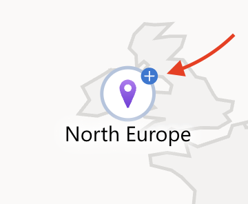

# Azure Subnets - Oppdeling av Virtual Network

## Oversikt

I denne øvelsen skal du dele opp ditt Virtual Network i flere subnets. Subnets er logiske segmenter innenfor et VNet som brukes til å organisere og isolere forskjellige typer ressurser.

**Hva er et Subnet?**

Et subnet er en underdeling av et Virtual Network sitt IP-adresseområde. Tenk på det som separate "rom" i ditt nettverk-"hus". Hvert subnet har sitt eget IP-adresseområde som er en del av VNet sitt totale adresseområde.

**Læringsmål:**
- Forstå formålet med subnetting i Azure
- Opprette flere subnets med forskjellige størrelser
- Implementere n-tier nettverksdesign
- Forstå subnet-sizing og IP-adresse reservasjoner

**Estimert tid:** 20 minutter

---

## Forutsetninger

- [ ] Ferdigstilt forrige øvelse (VNet opprettet)
- [ ] Tilgang til Azure Portal
- [ ] VNet: `<prefix>-vnet-infraitsec` med adresseområde `10.0.0.0/16`

---

## Del 1: Subnet Design og Planlegging

### Hvorfor Trenger Vi Subnets?

Selv om du teknisk sett kan plassere alle ressurser direkte i VNet uten subnets, gir subnetting flere viktige fordeler:

**Organisasjon:**
- Gruppere relaterte ressurser logisk
- Separere frontend-servere fra backend-databaser
- Isolere management-ressurser fra produksjonsworkloads

**Sikkerhet:**
- Network Security Groups (NSG) kan knyttes til subnets
- Kontrollere trafikk mellom subnets
- Implementere microsegmentation

**Adressestyring:**
- Fordele IP-adresser effektivt
- Unngå IP-adresse exhaustion
- Enklere å planlegge fremtidig vekst

**Routing:**
- Kontrollere trafikk-flow mellom subnets
- Implementere custom routing hvis nødvendig

### N-Tier Network Design

En vanlig best practice er å designe nettverk i flere lag (tiers):

**3-Tier Design (anbefalt for denne labben):**
```
┌─────────────────────────────────────────┐
│  Frontend Subnet (10.0.1.0/24)          │
│  - Web servers                          │
│  - Load balancers                       │
│  - Public-facing services               │
└─────────────────────────────────────────┘
                   ↓
┌─────────────────────────────────────────┐
│  Backend Subnet (10.0.2.0/24)           │
│  - Application servers                  │
│  - Business logic                       │
│  - Internal APIs                        │
└─────────────────────────────────────────┘
                   ↓
┌─────────────────────────────────────────┐
│  Data Subnet (10.0.3.0/24)              │
│  - Database servers                     │
│  - File servers                         │
│  - Storage services                     │
└─────────────────────────────────────────┘
```

**Ekstra subnets (valgfritt):**
- **Management Subnet** - Jump boxes, admin tools
- **Gateway Subnet** - VPN Gateway (hvis du skal sette opp VPN)
- **AzureBastionSubnet** - Azure Bastion service (hvis brukt)

### Subnet Sizing

For denne labben bruker vi `/24` subnets:

- `/24` = 256 IP-adresser totalt
- Azure reserverer **5 første IP-adresser** i hvert subnet
- Tilgjengelig for dine ressurser: **251 adresser**

**Azure sine reserverte adresser (for 10.0.1.0/24):**
- `10.0.1.0` - Network address
- `10.0.1.1` - Gateway (Azure router)
- `10.0.1.2` - DNS mapping
- `10.0.1.3` - DNS mapping
- `10.0.1.4` - Fremtidig bruk
- `10.0.1.5` - Første tilgjengelige adresse for dine ressurser
- `10.0.1.255` - Broadcast address (reservert)

**Hvorfor `/24`?**

- 251 tilgjengelige adresser er nok for de fleste lab-formål
- Enkelt å huske og administrere
- Standardvalg i mange organisasjoner
- Passer godt innenfor `10.0.0.0/16` VNet

---

## Del 2: Opprett Frontend Subnet

### Steg 2.1: Naviger til Subnets

1. Azure Portal → Søk etter ditt VNet: `<prefix>-vnet-infraitsec`

2. Klikk på VNet-et fra søkeresultatene

3. Venstre meny → **Subnets** (under Settings)

4. Klikk **"+ Subnet"** øverst

### Steg 2.2: Konfigurer Frontend Subnet

**Subnet details:**
- **Subnet purpose**
  - Default

- **Name:** `subnet-frontend`
  - Beskrivende navn som indikerer formål
  - Ingen prefix nødvendig (subnet er allerede innenfor ditt VNet)
  
- **Subnet address range:**
  - **Starting address:** `10.0.1.0`
  - **Subnet size:** `/24 (256 addresses)`
  - Azure fyller automatisk ut "Address range": `10.0.1.0/24`

**Service endpoints:** 
- La stå tom (ikke velg noe)
- Service endpoints lar ressurser i subnet koble direkte til Azure-tjenester
- Ikke nødvendig for basic lab

**Subnet delegation:**
- La stå på **"None"**
- Delegation gir Azure-tjenester (som Azure SQL, Container Instances) eksklusiv kontroll over subnet
- Ikke relevant for våre formål

**Network security group:**
- Velg **"None"** (vi oppretter NSG senere og knytter den til)

**Route table:**
- Velg **"None"**
- Custom routing ikke nødvendig

**Klikk "Save"**

### Steg 2.3: Verifiser Frontend Subnet

Etter noen sekunder skal du se:
- **subnet-frontend** i listen
- **Address range:** `10.0.1.0/24`
- **Available IPs:** 251
- **Delegated to:** None

---

## Del 3: Opprett Backend Subnet

### Steg 3.1: Opprett Subnet

1. Fortsatt på **Subnets**-siden → klikk **"+ Subnet"**

2. **Fyll ut:**
   - **Name:** `subnet-backend`
   - **Starting address:** `10.0.2.0`
   - **Subnet size:** `/24 (256 addresses)`
   - Address range blir automatisk: `10.0.2.0/24`

3. **La alle andre innstillinger stå på default/None**

4. Klikk **"Save"**

### Steg 3.2: Verifiser

Du skal nå se to subnets:
- `subnet-frontend` - `10.0.1.0/24`
- `subnet-backend` - `10.0.2.0/24`

---

## Del 4: Opprett Data Subnet

### Steg 4.1: Opprett Subnet

1. Klikk **"+ Subnet"**

2. **Fyll ut:**
   - **Name:** `subnet-data`
   - **Starting address:** `10.0.3.0`
   - **Subnet size:** `/24 (256 addresses)`

3. Klikk **"Save"**

### Steg 4.2: Verifiser Alle Subnets

Du skal nå ha tre subnets:

| Subnet Name | Address Range | Available IPs |
|-------------|---------------|---------------|
| subnet-frontend | 10.0.1.0/24 | 251 |
| subnet-backend | 10.0.2.0/24 | 251 |
| subnet-data | 10.0.3.0/24 | 251 |

---

## Del 5: (Valgfritt) Opprett Management Subnet

Hvis du vil ha et dedikert management-subnet for administrative verktøy, jump boxes, osv:

### Steg 5.1: Opprett Management Subnet

1. Klikk **"+ Subnet"**

2. **Fyll ut:**
   - **Name:** `subnet-management`
   - **Starting address:** `10.0.10.0`
   - **Subnet size:** `/24 (256 addresses)`

**Hvorfor 10.0.10.0 og ikke 10.0.4.0?**

Ved å "hoppe" til `.10.0` lar vi `.4.0` til `.9.0` stå ledig for fremtidige application-tier subnets. Dette gir fleksibilitet i nettverksdesignet.

3. Klikk **"Save"**

---

## Del 6: Forstå Subnet-kommunikasjon

### Default Kommunikasjon i VNet

**Viktig konsept:**

Ressurser i forskjellige subnets innenfor samme VNet kan som standard kommunisere fritt med hverandre. Azure router automatisk trafikk mellom subnets.

**Eksempel:**
- En VM i `subnet-frontend` (10.0.1.5) kan nå en VM i `subnet-backend` (10.0.2.10)
- Ingen spesiell konfigurasjon nødvendig
- Lav latency, høy throughput (intern Azure networking)

**Hvordan kontrollere trafikk mellom subnets?**

Network Security Groups (NSGs) lar deg definere regler som tillater eller blokkerer trafikk:
- NSG på subnet-nivå (påvirker alle ressurser i subnet)
- NSG på VM-nivå (påvirker kun den spesifikke VM)
- Regler evalueres basert på prioritet

Vi skal jobbe med NSGs i neste øvelse.

### Kommunikasjon til/fra Internett

**Default oppførsel:**

- **Utgående til internett:** TILLATT (ressurser kan nå ut til internett)
- **Inngående fra internett:** BLOKKERT (ingen kan nå inn uten public IP + NSG-regel)

**For å tillate inngående trafikk fra internett:**

1. VM må ha en **Public IP address**
2. NSG må ha **inbound rule** som tillater trafikken (f.eks. port 80 for HTTP)

Vi skal se på dette når vi deployer VMs.

---

## Del 7: Visualiser Subnet-struktur

### Steg 7.1: Network Topology

1. Azure Portal → Søk **"Network Watcher"**

2. Venstre meny → **Topology** (Under Monitoring)

3. Velg din **Resource Group:** `<prefix>-rg-infraitsec-network` i toppen under scope

4. **Se topologien:**
   - VNet-ikonet i midten (trykk på pl)
   - Subnets vises som "sub-ikoner" eller i detaljer
   - Foreløpig ingen VMs eller andre ressurser
   - 

---

## Del 8: Best Practices for Subnet Design

### IP-adresse Planlegging

**Godt design:**
- Bruk konsekvent subnetting (f.eks. alle `/24`)
- La det være "luft" mellom subnets for fremtidig vekst
- Dokumenter hensikten med hvert subnet

**Dårlig design:**
- Tilfeldig tildeling av adresseområder
- Subnets som overlapper
- Altfor store subnets som sløser adresser

### Subnet Naming Conventions

**Anbefalt:**
- `subnet-<purpose>` - Beskrivende formål (frontend, backend, data)
- `subnet-<tier>-<app>` - Hvis multiple applikasjoner (web-app1, web-app2)

**Unngå:**
- Generiske navn som "subnet1", "subnet2"
- Navn uten mening som "test", "misc"

### Fremtidig Vekst

Når du designer subnets, tenk fremover:
- Trenger du plass til flere tiers senere?
- Kan applikasjonen skalere til å trenge flere subnets?
- Er det plass til testing/staging-miljøer?

For lab-formål er dette mindre kritisk, men i produksjon er dette viktig.

---

## Del 9: Feilsøking

### Problem: "Address range overlaps with existing subnet"

**Symptom:** Kan ikke opprette subnet - adresseområdet overlapper.

**Årsak:** Du prøver å bruke IP-adresser som allerede er tildelt et annet subnet.

**Løsning:**

1. Sjekk eksisterende subnets: VNet → Subnets → se hvilke adresseområder som er i bruk
2. Velg et adresseområde som ikke overlapper
3. Husk at `/24` = 256 adresser, så `10.0.1.0/24` bruker `10.0.1.0` til `10.0.1.255`

---

### Problem: "Cannot delete subnet - resources attached"

**Symptom:** Kan ikke slette subnet fordi det er ressurser i bruk.

**Årsak:** VMs, NICs (Network Interface Cards), eller andre ressurser er deployed i subnet.

**Løsning:**

1. Identifiser ressurser: Subnet-siden → "Connected devices"
2. Slett eller flytt ressursene først
3. Deretter kan subnet slettes

---

### Problem: "Insufficient address space in VNet"

**Symptom:** Kan ikke opprette subnet - ikke nok plass i VNet.

**Årsak:** VNet sitt totale adresseområde er oppbrukt.

**Løsning:**

1. VNet → Address space → legg til flere adresseområder hvis nødvendig
2. Eksempel: Legg til `10.1.0.0/16` i tillegg til `10.0.0.0/16`
3. Eller: Redesign subnets med mindre størrelser (f.eks. `/25` i stedet for `/24`)

**For denne labben:** `10.0.0.0/16` gir 65,536 adresser - mer enn nok!

---

## Refleksjonsspørsmål

1. **Subnet Segmentation:**
   - Hvorfor er det lurt å separere frontend, backend, og data i separate subnets?
   - Hvilke sikkerhetsfordeler gir dette?

2. **IP-adresse Planning:**
   - Hva skjer med de 5 første IP-adressene i hvert subnet?
   - Hvorfor er det viktig å planlegge subnet-størrelse på forhånd?

3. **N-Tier Design:**
   - Hvordan mapper 3-tier subnet design til tradisjonell on-premises nettverksdesign?
   - Hva er forskjellen på VLANs og Azure subnets?

4. **Kommunikasjon:**
   - Kan ressurser i forskjellige subnets kommunisere som standard?
   - Hva må til for å blokkere trafikk mellom subnets?

5. **Skalerbarhet:**
   - Hvordan ville du designet subnets hvis applikasjonen skulle skalere til flere regioner?
   - Er det bedre med mange små subnets eller få store?

---

## Neste Steg

Nå som du har opprettet subnets, skal du:

1. **Opprette Network Security Groups (NSG)** - Definere firewallregler
2. **Knytte NSG til subnets** - Implementere sikkerhetskontroller
3. **Deploye Virtual Machines** - Plassere VMs i riktige subnets
4. **Test kommunikasjon** - Verifisere nettverksdesign

**Gratulerer!** Du har nå et strukturert nettverk med logisk segmentering! 🎉

---

## Ressurser

- [Azure Subnets Documentation](https://learn.microsoft.com/en-us/azure/virtual-network/virtual-network-vnet-plan-design-arm)
- [Subnet Sizing Calculator](https://www.subnet-calculator.com/)
- [Azure Networking Best Practices](https://learn.microsoft.com/en-us/azure/architecture/framework/security/design-network)