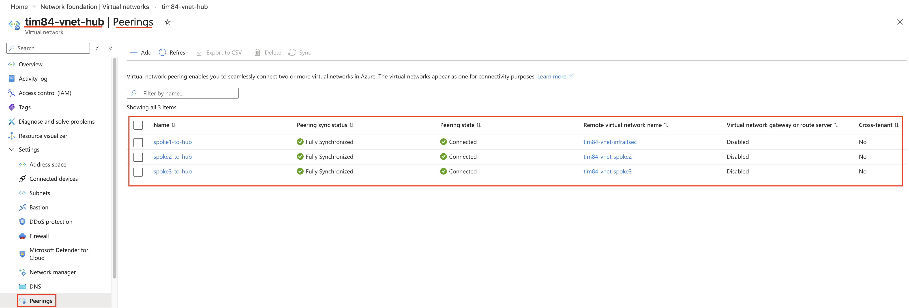

# Azure Hub-Spoke Topologi med Azure Firewall

## Oversikt

I de forrige øvelsene opprettet du et virtuelt nettverk med tre subnets — frontend, backend og data — og kontrollerte trafikken mellom dem med Network Security Groups. Dette er et solid utgangspunkt, men det modellerer bare ett isolert miljø.

I en reell virksomhet vil det sjelden finnes bare ett virtuelt nettverk. InfraIT.sec har for eksempel behov for separate nettverk for ulike avdelinger eller prosjekter, og disse nettverkene må kommunisere med hverandre på en kontrollert måte. Den naive løsningen er å koble hvert nettverk direkte til alle andre. Med tre nettverk gir det tre koblinger; med ti nettverk gir det førti-fem. Kompleksiteten vokser raskt, og hvert direkte punkt-til-punkt-forbindelse er en potensiell sikkerhetsrisiko.

**Hub-spoke-topologi** løser dette ved å innføre ett sentralt nettverk — huben — som alle andre nettverk (spokes) kobles til. Spokes kobles aldri direkte til hverandre. All trafikk mellom spokes må gå via huben, der en **Azure Firewall** inspiserer og kontrollerer hvert enkelt trafikkflyt.

I denne øvelsen skal du bygge denne arkitekturen oppå det du allerede har. Ditt eksisterende n-tier-nettverk blir spoke 1. Du oppretter to nye spoke-nettverk og et hub-nettverk med Azure Firewall. Du konfigurerer deretter **User Defined Routes (UDR)** for å sikre at trafikk mellom spokes faktisk sendes gjennom firewallen — fordi Azure ikke gjør dette automatisk bare fordi en firewall finnes — og til slutt definerer du hvilken trafikk firewallen skal tillate.

**Læringsmål:**
- Forstå hub-spoke-topologi og hvorfor den brukes i enterprise-miljøer
- Opprette og koble sammen flere virtuelle nettverk med VNET Peering
- Forstå ikke-transitivitet i VNET Peering
- Konfigurere User Defined Routes for å tvinge trafikk gjennom Azure Firewall
- Opprette en Azure Firewall Policy med nettverksregler
- Verifisere topologien via Azure Portal

**Estimert tid:** 75–90 minutter

---

## Forutsetninger

- [ ] Tilgang til Azure Portal med din NTNU-bruker
- [ ] Følgende ressurser fra forrige øvelse er på plass i `<prefix>-rg-infraitsec-network`:
  - `<prefix>-vnet-infraitsec` med adresserom `10.0.0.0/16`
  - `subnet-frontend` (`10.0.1.0/24`), `subnet-backend` (`10.0.2.0/24`), `subnet-data` (`10.0.3.0/24`)
  - NSGer `<prefix>-nsg-frontend`, `<prefix>-nsg-backend`, `<prefix>-nsg-data` tilknyttet sine respektive subnets
  - VM-ene `<prefix>-vm-frontend`, `<prefix>-vm-backend`, `<prefix>-vm-data`
- [ ] Ditt tildelte prefix (f.eks. `eg06`, `tim84`)

---

## Nettverksplan

Før du starter, gjør deg kjent med hele adresseplanen for denne øvelsen. Det er mye enklere å forstå hvert enkelt konfigurasjonssteg når du har det store bildet klart.

| Ressurs | Adresserom | Merknad |
|---|---|---|
| `<prefix>-vnet-hub` | `10.100.0.0/16` | Nytt hub-nettverk |
| `AzureFirewallSubnet` | `10.100.1.0/26` | Reservert navn — må skrives eksakt slik |
| `subnet-management` | `10.100.0.0/24` | Administrasjonssubnet i hub |
| `<prefix>-vnet-infraitsec` | `10.0.0.0/16` | Eksisterende — blir spoke 1 |
| `<prefix>-vnet-spoke2` | `10.1.0.0/16` | Nytt spoke 2 |
| `subnet-workload` | `10.1.0.0/24` | Eneste subnet i spoke 2 |
| `<prefix>-vnet-spoke3` | `10.2.0.0/16` | Nytt spoke 3 |
| `subnet-workload` | `10.2.0.0/24` | Eneste subnet i spoke 3 |

To ting i denne tabellen er verdt å merke seg. Hub-nettverket bruker `10.100.0.0/16` i stedet for et påfølgende blokk som `10.3.0.0/16`. Dette er bevisst — i større miljøer er det vanlig å holde hub-adressering tydelig adskilt fra spoke-adressering, slik at rutetabeller er lettere å lese. Subnettet som heter `AzureFirewallSubnet` er dessuten ikke et navn du velger fritt — det er et navn Azure krever. Bruker du noe annet, vil du ikke få deployet en firewall i det subnettet.

> 💡 **Kostnadsbevisst rekkefølge:** Azure Firewall faktureres per time fra det øyeblikket ressursen opprettes — uavhengig av om den prosesserer trafikk. Denne walkthroughen er strukturert slik at firewallen deployes så sent som mulig: etter at alle nettverk og peerings er på plass. Da er ventetiden på deployment den eneste gangen du betaler uten å gjøre noe produktivt.

---

## Del 1: Opprett hub-nettverket

### Hva er hub-nettverket?

Hub-nettverket er kjernen i topologien. Det huser Azure Firewall, som er det eneste stedet trafikk mellom spokes kan passere, og et management-subnet som i et produksjonsmiljø ville huset en jumpbox eller Bastion-ressurs for sikker administrativ tilgang til hele miljøet.

### Steg 1.1: Naviger til Virtual Networks

1. Logg inn på [Azure Portal](https://portal.azure.com)
2. Søk etter **"Virtual networks"** i søkefeltet øverst
3. Klikk **"+ Create"**

### Steg 1.2: Basics-fanen

**Project details:**
- **Subscription:** Velg riktig subscription
- **Resource group:** `<prefix>-rg-infraitsec-network`

**Instance details:**
- **Name:** `<prefix>-vnet-hub`
- **Region:** `<samme region som tidligere>`

Klikk **Next** for å gå til Security-fanen. La alle valg her stå på **Disabled** — vi oppretter firewallen manuelt i en egen ressurs i stedet for gjennom denne veiviseren.

### Steg 1.3: IP Addresses-fanen

1. Fjern det forhåndsutfylte adresserommet og skriv inn `10.100.0.0/16`
2. Slett default-subnettet hvis det finnes (søppelbøtte-ikon)
3. Klikk **"+ Add a subnet"** for å legge til management-subnettet:

   | Felt | Verdi |
   |---|---|
   | Subnet name | `subnet-management` |
   | Starting address | `10.100.0.0` |
   | Size | `/24` |

   Lagre subnettet.

4. Klikk **"+ Add a subnet"** igjen for å legge til firewall-subnettet:

   | Felt | Verdi |
   |---|---|
   | Subnet purpose | Azure Firewall |
   | Starting address | `10.100.1.0` |
   | Size | `/26` |

   **Merk:** `/26` gir 64 adresser, som er minimumet Azure krever for et firewall-subnet. Legg også merke til at Azure ikke lar deg knytte en NSG til `AzureFirewallSubnet` — dette er en bevisst begrensning fordi firewallen selv kontrollerer trafikken på dette subnettet.

   Lagre subnettet.

5. Klikk **"+ Add a subnet"** igjen for å legge til firewall management-subnettet:

   | Felt | Verdi |
   |---|---|
   | Subnet purpose | Firewall Management (forced tunneling) |
   | Starting address | `10.100.2.0` |
   | Size | `/26` |

   Lagre subnettet.

### Steg 1.4: Tags-fanen

Legg til følgende tags:

| Name | Value |
|---|---|
| `Owner` | `<dittbrukernavn>` |
| `Environment` | `Lab` |
| `Course` | `InfraIT-Cyber` |

Klikk **"Review + create"** og deretter **"Create"**.

---

## Del 2: Opprett NSG for management-subnettet

### Hvorfor NSG på management-subnettet?

Management-subnettet er ment for administrative ressurser som har tilgang til resten av miljøet. Det er god praksis å knytte en NSG til et subnet umiddelbart, slik at eventuelle VMs som deployes der er beskyttet fra første øyeblikk — ikke som en etterpåklokskap når noe allerede er oppe.

### Steg 2.1: Opprett NSG

1. Søk etter **"Network security groups"** i søkefeltet
2. Klikk **"+ Create"**
3. Fyll inn:

   | Felt | Verdi |
   |---|---|
   | Resource group | `<prefix>-rg-infraitsec-network` |
   | Name | `<prefix>-nsg-management` |
   | Region | `<velg samme region som tidligere>` |

4. Legg til de samme tags som ovenfor
5. Klikk **"Review + create"** → **"Create"**

### Steg 2.2: Legg til innkommende SSH-regel

1. Naviger til `<prefix>-nsg-management`
2. Velg **"Inbound security rules"** i venstremenyen
3. Klikk **"+ Add"** og fyll inn:

   | Felt | Verdi |
   |---|---|
   | Source | 129.241.0.0/16 |
   | Source port ranges | `*` |
   | Destination | Any |
   | Service | SSH |
   | Action | Allow |
   | Priority | `1000` |
   | Name | `allow-ssh-inbound` |

   **Merk:** 129.241.0.0/16 er NTNU nettverket, om du skal få tilgang hjemmefra, må du også legge til egen IP-adresse i tillegg..

4. Klikk **"Add"**

### Steg 2.3: Knytt NSG til subnet

1. Velg **"Subnets"** i venstremenyen på NSG-en
2. Klikk **"+ Associate"**
3. Velg:
   - **Virtual network:** `<prefix>-vnet-hub`
   - **Subnet:** `subnet-management`
4. Klikk **"OK"**

---

## Del 3: Opprett Public IP-adresse

Azure Firewall krever en dedikert public IP-adresse av typen **Standard SKU**. Denne adressen blir det offentlige inngangspunktet for eventuell innkommende trafikk du senere ønsker å rute gjennom firewallen. Vi oppretter den nå slik at den er klar når firewallen deployes i Del 7.

### Steg 3.1: Opprett 2x Public IP

1. Søk etter **"Public IP addresses"** i søkefeltet
2. Klikk **"+ Create"**
3. Fyll inn:

   | Felt | Verdi |
   |---|---|
   | Resource group | `<prefix>-rg-infraitsec-network` |
   | Name | `<prefix>-pip-fw` |
   | Region | `<velg samme region som tidligere>` |
   | SKU | Standard |
   | IP version | IPv4 |
   | Assignment | Static |
   | Availability zone | Zone-redundant |
   | Tier | Regional |
   | Routing preference | Microsoft Network |
   | Idle timeout (minutes) | 4 |
   | DNS name label | <prefix>-infrait |
   | Domain name label scope (preview) | None |

4. Legg til tags som tidligere og klikk **"Review + create"** → **"Create"**
5. Velg å opprett enda en Public IP for mangagmenet:

   | Felt | Verdi |
   |---|---|
   | Resource group | `<prefix>-rg-infraitsec-network` |
   | Name | `<prefix>-pip-fw-mgmt` |
   | Region | `<velg samme region som tidligere>` |
   | SKU | Standard |
   | IP version | IPv4 |
   | Assignment | Static |
   | Availability zone | Zone-redundant |
   | Tier | Regional |
   | Routing preference | Microsoft Network |
   | Idle timeout (minutes) | 4 |
   | DNS name label | <prefix>-infrait |
   | Domain name label scope (preview) | None |

**Hvorfor statisk IP?**
En statisk IP-adresse endrer seg ikke, selv om du stopper og starter tilknyttede ressurser. For en firewall er dette kritisk — alle regler og DNS-oppføringer som peker på denne adressen vil fortsette å fungere.

---

## Del 4: Opprett Firewall Policy

### Hva er en Firewall Policy?

En **Firewall Policy** er en selvstendig Azure-ressurs som inneholder alle reglene firewallen skal håndheve. Å separere policy fra selve firewall-instansen er den moderne, anbefalte tilnærmingen. Det gjør det mulig å administrere regler uavhengig av firewall-instansen, og å dele én policy på tvers av flere firewaller om miljøet vokser.

Vi oppretter policyen nå, men legger til regler i den i Del 10 — etter at firewallen er oppe og vi har bekreftet at alt annet fungerer.

### Steg 4.1: Opprett Policy

1. Søk etter **"Firewall Policies"** i søkefeltet
2. Klikk **"+ Create"**
3. Fyll inn:

   | Felt | Verdi |
   |---|---|
   | Resource group | `<prefix>-rg-infraitsec-network` |
   | Name | `<prefix>-fwpolicy-hub` |
   | Region | Samme region som tidligere |
   | Policy tier | **Basic** |

   **Merk:** Policy-tier må matche tier på selve firewallen du oppretter i Del 7. Basic-tier støtter nettverksregler og DNAT-regler, som er alt du trenger for denne øvelsen. Avanserte funksjoner som applikasjonslagsinspeksjon (layer 7) og Threat Intelligence krever Standard- eller Premium-tier.

4. Legg til tags og klikk **"Review + create"** → **"Create"**

---

## Del 5: Opprett spoke-nettverkene

**TIL INFO: Her er det mye som vi har gjort manuelt fra før, ta heller en titt på hvordan dette kan utføres ved bruk av PowerShell:**
[PowerShell-gjennomgang](11-02-PowerShellSpokes.md)

Du oppretter nå de to nye spoke-nettverkene. Disse representerer separate miljøer — tenk på dem som ulike avdelinger eller prosjekter hos InfraIT.sec som trenger kontrollert tilgang til ressurser i hverandre og i spoke 1.

### Steg 5.1: Opprett spoke 2

1. Naviger til **"Virtual networks"** og klikk **"+ Create"**
2. Fyll inn:

   | Felt | Verdi |
   |---|---|
   | Resource group | `<prefix>-rg-infraitsec-network` |
   | Name | `<prefix>-vnet-spoke2` |
   | Region | `<velg samme region som tidligere>` |

3. På **IP Addresses**-fanen:
   - Adresserom: `10.1.0.0/16`
   - Slett default-subnet
   - Legg til subnet:

     | Felt | Verdi |
     |---|---|
     | Subnet name | `subnet-workload` |
     | Starting address | `10.1.0.0` |
     | Size | `/24` |

4. Legg til tags og klikk **"Review + create"** → **"Create"**

### Steg 5.2: Opprett spoke 3

Gjenta prosessen for spoke 3:

| Felt | Verdi |
|---|---|
| Name | `<prefix>-vnet-spoke3` |
| Adresserom | `10.2.0.0/16` |
| Subnet name | `subnet-workload` |
| Starting address | `10.2.0.0` |
| Size | `/24` |

---

## Del 6: Opprett VNET Peering

### Hva er VNET Peering — og hva er ikke-transitivitet?

VNET Peering er det som muliggjør nettverkskommunikasjon mellom to virtuelle nettverk. Uten peering er nettverkene fullstendig isolerte fra hverandre.

En viktig egenskap ved peering er at den er **ikke-transitiv**. Hvis hub er koblet til spoke 1 og hub er koblet til spoke 2, betyr ikke det at spoke 1 og spoke 2 kan nå hverandre direkte. For at spoke 1 skal nå spoke 2 må trafikken gå via hub. Dette er ikke en begrensning som skal jobbes rundt — det er selve arkitekturegenskapen som gjør hub-spoke til et nyttig sikkerhetsmønster.

Du oppretter nå alle tre peering-forbindelsene fra hub-siden. Portalen lar deg opprette begge retninger samtidig med **"Add remote peering"**-valget.

### Steg 6.1: Opprett peering — Hub ↔ Spoke 1 

Peer med samme nettverk som opprettet i sist lab: `<prefix>-vnet-infraitsec`, om du har slettet det, kan du opprette et nytt nettverk som heter `<prefix>-vnet-spoke1`

1. Naviger til `<prefix>-vnet-hub`
2. Velg **"Peerings"** i venstremenyen
3. Klikk **"+ Add"**
4. Fyll inn:

   **This virtual network (hub → spoke 1):**

   | Felt | Verdi |
   |---|---|
   | Peering link name | `hub-to-spoke1` |
   | Allow `<prefix>-vnet-infraitsec` to access `<prefix>-vnet-hub` | Allow |
   | Allow `<prefix>-vnet-infraitsec` to receive forwarded traffic from `<prefix>-vnet-hub` | **Allow** |
   | Allow gateway or route server in `<prefix>-vnet-infraitsec` to forward traffic to `<prefix>-vnet-hub` | None |
   | Enable `<prefix>-vnet-infraitsec` to use `<prefix>-vnet-hub` remote gateway or route server | None | 

   **Merk: Noen innstillinger må endres om en skulle testet og benyttet VPN Gateway i dette oppsettet**
   >**`<prefix>-vnet-hub` does not have a VPN gateway or route server. To enable this option, `<prefix>-vnet-hub` needs to have a VPN gateway or route server. Learn how to create a VPN gateway or Route Server**

   **Remote virtual network (spoke 1 → hub):**

   | Felt | Verdi |
   |---|---|
   | Peering link name | `spoke1-to-hub` |
   | Virtual network | `<prefix>-vnet-infraitsec` |
   | Allow `<prefix>-vnet-hub` to access `<prefix>-vnet-infraitsec` | Allow |
   | Allow `<prefix>-vnet-hub` to receive forwarded traffic from `<prefix>-vnet-infraitsec` | **Allow** |
   | Allow gateway or route server in `<prefix>-vnet-hub` to forward traffic to `<prefix>-vnet-infraitsec` | None |
   | Enable `<prefix>-vnet-hub` to use `<prefix>-vnet-infraitsec` remote gateway or route server | None |

5. Klikk **"Add"**

**Hvorfor "Allow forwarded traffic" på begge sider?**
Når firewallen mottar en pakke fra spoke 1 og skal sende den videre til spoke 2, videresender den pakken gjennom peering-forbindelsen til spoke 2. Men pakken kom ikke *opprinnelig* fra hub — den ble videresendt dit av firewallen. Hvis peering-forbindelsen ikke tillater videresendt trafikk, vil Azure FireWall droppe pakken. Dette er det vanligste punktet der hub-spoke-konfigurasjoner feiler.

### Steg 6.2: Opprett peering — Hub ↔ Spoke 2

Gjenta for spoke 2

### Steg 6.3: Opprett peering — Hub ↔ Spoke 3

Gjenta for spoke 3

### Steg 6.4: Bekreft peering-status

På Peerings-menyen til `<prefix>-vnet-hub` skal du nå se tre oppføringer — to retninger for hvert av de tre spoke-nettverkene. Alle skal ha status **Connected**.

---

## Del 7: Deploy Azure Firewall

> ⚠️ **Billing starter nå.** Fra det øyeblikket firewallen opprettes, begynner kostnaden å løpe. Alt av nettverk, peerings og støtteressurser er allerede på plass — du er klar til å deploye og kan gå rett til verifisering og opprydding uten unødvendig ventetid.

### Steg 7.1: Opprett Firewall

1. Søk etter **"Firewalls"** i søkefeltet
2. Klikk **"+ Create"**
3. Fyll inn på **Basics**-fanen:

   | Felt | Verdi |
   |---|---|
   | Resource group | `<prefix>-rg-infraitsec-network` |
   | Name | `<prefix>-fw-hub` |
   | Region | `<velg tidliger brukt region>` |
   | Firewall tier | **Basic** |
   | Firewall management | **Use a Firewall Policy to manage this firewall** |
   | Firewall policy | `<prefix>-fwpolicy-hub` |
   | Choose a virtual network - Use existing | `<prefix>-vnet-hub` |
   | Public IP address | `<prefix>-pip-fw` |

   Når du velger `<prefix>-vnet-hub` som virtuelt nettverk, plasserer Azure automatisk firewallen i `AzureFirewallSubnet`.

4. Legg til tags og klikk **"Review + create"** → **"Create"**

> ⏳ **Deploymentet tar omtrent 10 minutter.**

---

## Del 8: Noter firewall private IP

Før du konfigurerer rutetabellene trenger du den private IP-adressen som Azure har tildelt firewallen. Denne adressen er **next hop** i alle rutene du skal opprette — det vil si adressen spoke-nettverkene sender trafikk til for at den skal inspiseres av firewallen.

### Steg 8.1: Hent firewall private IP

1. Naviger til `<prefix>-fw-hub`
2. På **Overview**-siden, finn feltet **Private IP address**
3. Adressen vil ligge i `10.100.1.0/26`-rommet — typisk `10.100.1.4`, siden Azure reserverer de fire første adressene i hvert subnet

> 📋 **Skriv ned firewall private IP**

Du bruker denne adressen i alle rutetabellene i neste del.

---

## Del 9: Opprett rutetabeller (User Defined Routes)

### Hvorfor er rutetabeller nødvendig?

VNET Peering etablerer nettverksforbindelsen, men styrer ikke hvilken vei trafikken tar. Overlatt til seg selv ville Azures standard systemruter sende trafikk mellom to peeringkoblede nettverk via den korteste veien — noe som betyr at trafikk fra spoke 1 til spoke 2 ville gå direkte via peering-forbindelsen, og aldri innom firewallen.

**User Defined Routes (UDR)** overstyrer Azures systemruter. Ved å knytte en rutetabell til et subnet instruerer du Azure om å konsultere dine ruter først. Du oppretter én rutetabell per spoke med ruter som sender trafikk destined for andre spokes til firewall-IP-adressen som **next hop**.

**Next hop type: Virtual appliance** er betegnelsen Azure bruker for en nettverksappliance eller VM som fungerer som ruter — og Azure Firewall faller inn under denne kategorien, selv om det er en managed tjeneste.

### Steg 9.1: Opprett rutetabell for spoke 1

1. Søk etter **"Route tables"** i søkefeltet
2. Klikk **"+ Create"**
3. Fyll inn:

   | Felt | Verdi |
   |---|---|
   | Resource group | `<prefix>-rg-infraitsec-network` |
   | Region | `<velg samme region som tidligere>` |
   | Name | `<prefix>-rt-spoke1` |
   | Propagate gateway routes | **No** |

4. Legg til tags og klikk **"Review + create"** → **"Create"**

### Steg 9.2: Legg til ruter i spoke 1-tabellen

1. Naviger til `<prefix>-rt-spoke1`
2. Velg **"Routes"** i venstremenyen
3. Klikk **"+ Add"** og legg til første rute:

   | Felt | Verdi |
   |---|---|
   | Route name | `to-spoke2-via-fw` |
   | Destination type | IP Addresses |
   | Destination IP addresses | `10.1.0.0/16` |
   | Next hop type | Virtual appliance |
   | Next hop address | *(firewall private IP fra Del 8)* |

4. Klikk **"Add"** og legg deretter til andre rute:

   | Felt | Verdi |
   |---|---|
   | Route name | `to-spoke3-via-fw` |
   | Destination type | IP Addresses |
   | Destination IP addresses | `10.2.0.0/16` |
   | Next hop type | Virtual appliance |
   | Next hop address | *(firewall private IP fra Del 8)* |

### Steg 9.3: Knytt rutetabell til spoke 1-subnets

Rutetabellen må knyttes til alle tre subnets i `<prefix>-vnet-infraitsec` for at rutene skal gjelde.

1. Velg **"Subnets"** i venstremenyen på rutetabellen
2. Klikk **"+ Associate"** og knytt til `<prefix>-vnet-infraitsec` / `subnet-frontend`
3. Gjenta for `subnet-backend` og `subnet-data`

### Steg 9.4: Opprett rutetabell for spoke 2

Opprett `<prefix>-rt-spoke2` med følgende ruter:

| Route name | Destination | Next hop type | Next hop address |
|---|---|---|---|
| `to-spoke1-via-fw` | `10.0.0.0/16` | Virtual appliance | *(firewall private IP)* |
| `to-spoke3-via-fw` | `10.2.0.0/16` | Virtual appliance | *(firewall private IP)* |

Knytt rutetabellen til: `<prefix>-vnet-spoke2` / `subnet-workload`

### Steg 9.5: Opprett rutetabell for spoke 3

Opprett `<prefix>-rt-spoke3` med følgende ruter:

| Route name | Destination | Next hop type | Next hop address |
|---|---|---|---|
| `to-spoke1-via-fw` | `10.0.0.0/16` | Virtual appliance | *(firewall private IP)* |
| `to-spoke2-via-fw` | `10.1.0.0/16` | Virtual appliance | *(firewall private IP)* |

Knytt rutetabellen til: `<prefix>-vnet-spoke3` / `subnet-workload`

Rutetabellene er nå på plass. Trafikk fra et subnet i en spoke som er destined for et annet spoke-nettverk, vil bli sendt til firewall-IP-adressen som next hop. Men firewallen har ennå ikke fått beskjed om å slippe trafikken gjennom — standardoppførselen til Azure Firewall er å **blokkere alt**. Det fikser vi i neste del.

---

## Del 10: Konfigurer Firewall Policy-regler

### Steg 10.1: Naviger til Firewall Policy

1. Naviger til `<prefix>-fwpolicy-hub`
2. Velg **"Rule collections"** i venstremenyen

### Hva er en Rule Collection?

En **Rule Collection** er en navngitt gruppe regler med felles prioritet og handling (Allow eller Deny). Regler evalueres i stigende prioritetsrekkefølge — lavere tall evalueres først. Du oppretter én nettverksregel-samling som tillater trafikk mellom alle spokes.

### Steg 10.2: Opprett nettverksregel-samling

1. Klikk **"+ Add a rule collection"**
2. Fyll inn:

   | Felt | Verdi |
   |---|---|
   | Name | `allow-inter-spoke` |
   | Rule collection type | Network |
   | Priority | `200` |
   | Rule collection action | Allow |
   | Rule collection group | DefaultNetworkRuleCollectionGroup |

3. Under **Rules**, legg til én regel:

   | Felt | Verdi |
   |---|---|
   | Name | `spoke-to-spoke` |
   | Protocol | Any |
   | Source type | IP Address |
   | Source | `10.0.0.0/16,10.1.0.0/16,10.2.0.0/16` |
   | Destination type | IP Address |
   | Destination | `10.0.0.0/16,10.1.0.0/16,10.2.0.0/16` |
   | Destination ports | `*` |

4. Klikk **"Add"**

**Merk:** Denne regelen tillater all IP-trafikk på alle porter mellom de tre spoke-nettverkene. I et produksjonsmiljø ville du vært langt mer restriktiv — for eksempel kun tillate spesifikke porter fra frontend til backend, og nekte alt annet. For lab-formål lar den brede regelen deg verifisere at firewallen faktisk slipper trafikk gjennom, uten å måtte feilsøke applikasjonsspesifikke porter.

Endringer i Firewall Policy propageres automatisk til firewallen, typisk innen ett til to minutter.

---

## Del 11: Verifiser topologien

### Steg 11.1: Verifiser peering-status fra hub

1. Naviger til `<prefix>-vnet-hub`
2. Velg **"Peerings"** i venstremenyen
3. Bekreft at alle seks oppføringer viser status **Connected**:
   - `hub-to-spoke1` — Connected
   - `spoke1-to-hub` — Connected
   - `hub-to-spoke2` — Connected
   - `spoke2-to-hub` — Connected
   - `hub-to-spoke3` — Connected
   - `spoke3-to-hub` — Connected

### Steg 11.2: Verifiser peering-status fra spoke-siden

1. Naviger til `<prefix>-vnet-infraitsec`
2. Velg **"Peerings"** — du skal se én oppføring: `spoke1-to-hub` med status **Connected**
3. Gjenta for `<prefix>-vnet-spoke2` — én oppføring: `spoke2-to-hub` — Connected
4. Gjenta for `<prefix>-vnet-spoke3` — én oppføring: `spoke3-to-hub` — Connected

### Steg 11.3: Observer ikke-transitivitet

Se nøye på Peerings-bladet til `<prefix>-vnet-spoke2`. Du ser bare én peering-forbindelse: til hub. Det finnes ingen direkte forbindelse til spoke 1 eller spoke 3.

Dette er ikke-transitivitet i praksis. Selv om spoke 2 er koblet til hub og spoke 1 er koblet til hub, betyr ikke det at spoke 2 og spoke 1 har noen direkte kjennskap til hverandre. Fra Azures perspektiv har spoke 2 bare én nabo: hub. Den eneste veien mellom spoke 1 og spoke 2 går via hub — og via firewallen som sitter der.

---

## Oppsummering

Du har nå transformert ett isolert segmentert nettverk til en hub-spoke-topologi styrt av en sentralisert firewall. Her er en rask oversikt over hva hvert element bidrar med:

`<prefix>-vnet-hub` er arkitekturens sentrum og huser firewallen og et fremtidig management-subnet for administrativ tilgang.

`<prefix>-fw-hub` er Azure Firewall Basic med tilknyttet Firewall Policy. Den inspiserer all trafikk mellom spokes og håndhever reglene du definerte. Den opererer på nettverkslaget og er dermed bevisst på IP-adresser og porter.

`<prefix>-rt-spoke1`, `<prefix>-rt-spoke2` og `<prefix>-rt-spoke3` er User Defined Route-tabeller som overstyrer Azures standard systemruter. Uten dem ville peering-trafikk gå den korteste veien og aldri passere firewallen. Disse rutetabellene er det som gjør at firewallen faktisk er i dataflyten.

VNET Peering med **Allow forwarded traffic** aktivert på begge sider er det som gjør det mulig for firewallen å fungere som et transitpunkt mellom spokes som ikke er direkte koblet til hverandre.

---

## Opprydding

> ⚠️ **Azure Firewall faktureres per time den eksisterer, uavhengig av om den prosesserer trafikk.** Slett ressursene i riktig rekkefølge så snart du er ferdig med å verifisere konfigurasjonen.

Slett i denne rekkefølgen for å unngå avhengighetsfeil:

1. `<prefix>-fw-hub` — firewallen stoppes og slettes (billing stopper umiddelbart)
2. `<prefix>-fwpolicy-hub`
3. `<prefix>-rt-spoke1`, `<prefix>-rt-spoke2`, `<prefix>-rt-spoke3`
4. `<prefix>-vnet-spoke2`, `<prefix>-vnet-spoke3` (inkludert peering-forbindelsene)
5. `<prefix>-vnet-hub`
6. `<prefix>-pip-fw`
7. `<prefix>-nsg-management`

Du skal **ikke** slette `<prefix>-vnet-infraitsec` eller tilhørende ressurser — disse brukes videre i kommende øvelser.

> **Tips:** I neste del av dette modulet gjennomgår vi et PowerShell-script som automatiserer både deployment og opprydding av hele hub-spoke-miljøet. Dette gjør det enkelt å bygge opp og rive ned topologien på nytt ved behov.

---

## Feilsøking

### Problem: Kan ikke deploye firewall — "AzureFirewallSubnet not found"
**Årsak:** Subnet-navnet er skrevet feil — Azure krever eksakt stavemåte.
**Løsning:** Sjekk at subnettet heter `AzureFirewallSubnet` — stor A, stor F, stor S, ingen mellomrom eller bindestreker. Naviger til `<prefix>-vnet-hub` → Subnets og verifiser.

### Problem: Peering-status viser "Disconnected" eller "Failed"
**Årsak:** Adresserom overlapper mellom to nettverk du prøver å koble, eller den ene siden av peering-paret ble ikke opprettet.
**Løsning:** Sjekk at `10.0.0.0/16`, `10.1.0.0/16`, `10.2.0.0/16` og `10.100.0.0/16` ikke overlapper. Slett og gjenopprett peering om nødvendig.

### Problem: Rutetabell er tilknyttet men "Effective routes" viser ikke custom-rutene
**Årsak:** Rutetabellen er kanskje tilknyttet feil subnet, eller endringen er ikke propagert ennå.
**Løsning:** Naviger til rutetabellen → Subnets og bekreft tilknytningen. Vent ett minutt og sjekk igjen. Du kan inspisere effective routes på en NIC ved å navigere til VM → Networking → NIC → Effective routes.

### Problem: Firewall Policy-regler propageres ikke
**Årsak:** Det tar ett til to minutter fra en regel lagres til den er aktiv på firewallen.
**Løsning:** Vent litt og prøv igjen. Du kan sjekke provisioning-status på `<prefix>-fw-hub` — den skal vise **Succeeded**.

---

## Refleksjonsspørsmål

1. **Topologi:**
   - Hva er den praktiske forskjellen mellom å styre inter-spoke-trafikk med NSG-regler direkte på subnets kontra å sende all trafikk gjennom en sentralisert firewall?
   - Hva skjer med spoke-til-spoke-kommunikasjon hvis firewallen er nede for vedlikehold?

2. **Ikke-transitivitet:**
   - Hvorfor er det en sikkerhetsfordel at spokes ikke kan nå hverandre direkte, selv om det teknisk sett ville vært mulig å sette opp direkte peering?
   - Tenk deg at InfraIT.sec legger til et fjerde spoke-nettverk. Hva må du gjøre for at det nye nettverket skal kommunisere med de eksisterende tre?

3. **Rutetabeller:**
   - Hva ville skje med trafikk fra spoke 1 til spoke 2 hvis du glemte å opprette rutetabellen for spoke 1, men rutetabellen for spoke 2 er korrekt konfigurert?
   - Hvorfor satte vi "Propagate gateway routes" til **No** da vi opprettet rutetabellene?

4. **Azure Firewall:**
   - Hva er forskjellen mellom en NSG og Azure Firewall som sikkerhetsmekanisme?
   - Hvorfor er Azure Firewall Basic tilstrekkelig for denne lab-konfigurasjonen, og hva mangler du sammenlignet med Standard-tier?

---

## Neste steg

Nå som hub-spoke-topologien er på plass, er naturlige neste steg:

---

## Ressurser

- [Azure Hub-Spoke Network Topology](https://learn.microsoft.com/en-us/azure/architecture/networking/architecture/hub-spoke)
- [Azure Firewall Documentation](https://learn.microsoft.com/en-us/azure/firewall/)
- [Virtual Network Peering](https://learn.microsoft.com/en-us/azure/virtual-network/virtual-network-peering-overview)
- [User Defined Routes](https://learn.microsoft.com/en-us/azure/virtual-network/virtual-networks-udr-overview)
- [Azure Firewall Policy](https://learn.microsoft.com/en-us/azure/firewall/policy-rule-sets)