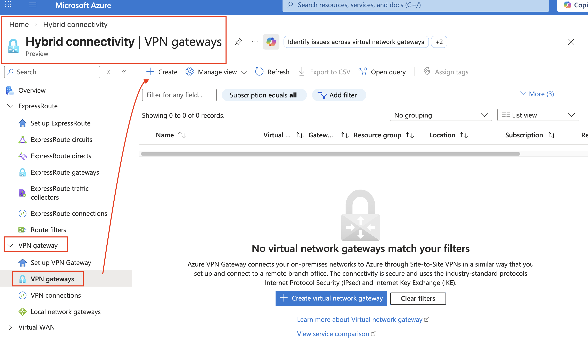

# Lab 12-02: Point-to-Site VPN Gateway og Azure Kubernetes Service

I denne labben skal du sette opp en sikker VPN-tilkobling fra din egen maskin inn til det private Azure-nettverket du opprettet i forrige lab. Når tilkoblingen er på plass, skal du deploye en containerbasert applikasjon i Azure Kubernetes Service (AKS) som kun er tilgjengelig via VPN — uten en eneste public IP-adresse eksponert mot internett.

Dette er det samme prinsippet NTNU bruker når du må være på NTNU VPN eller campusnett for å nå OpenStack-miljøet ditt på skyhigh.iik.ntnu.no. Ressursen eksisterer, men den er ikke tilgjengelig uten at du er autentisert og tilkoblet via en godkjent kanal.

Autentiseringen mot VPN-en skjer via Microsoft Entra ID, noe som betyr at det er *hvem du er* — ikke bare hvilken maskin du bruker — som avgjør om du får tilgang. Dette er et sentralt prinsipp i moderne Zero Trust-arkitektur.

> **Merk om kostnader:** VPN Gateway og AKS er de to dyreste ressursene du har opprettet i dette kurset. VPN Gateway (VpnGw1) koster rundt 130–140 USD per måned, og AKS-noder faktureres per time. Det er derfor viktig at du sletter disse ressursene ved slutten av labben, slik det beskrives i Del 8. De øvrige nettverksressursene (VNET, subnett, peering) kan stå siden de ikke medfører kostnad.

---

## Del 1 — Opprett Public IP og VPN Gateway

En VPN Gateway er Azure-siden av VPN-tilkoblingen. Den provisjoneres inn i `GatewaySubnet` i hub-VNET-et ditt og fungerer som endepunktet som VPN-klienten på din maskin kobler seg til. Gateway-en trenger en Public IP-adresse slik at klienter utenfor Azure kan nå den.

Provisjonering av en VPN Gateway tar 30–45 minutter. Du starter derfor denne prosessen først, og bruker ventetiden til å sette opp AKS-clusteret i Del 2.

### Steg 1.1 — Opprett Public IP-adresse

Naviger til `<prefix>-rg-infraitsec-network` i Azure Portal og velg **Create**.

Søk etter **Public IP address** og opprett en ressurs med følgende konfigurasjon:

| Felt | Verdi |
|------|-------|
| Name | `<prefix>-pip-vpngw` |
| Region | Norway East |
| SKU | Standard |
| IP version | IPv4 |
| Assignment | Static |
| Routing preference | Microsoft network |

Static assignment er nødvendig fordi VPN Gateway-konfigurasjonen lagrer IP-adressen permanent. Skulle adressen endres ved en omstart, ville alle VPN-klienter slutte å fungere. Standard SKU er et krav for VpnGw1 og nyere gateway-SKU-er.

### Steg 1.2 — Opprett VPN Gateway

Søk etter **Virtual network gateways** i Azure Portal og velg **Create**.



Fyll inn følgende konfigurasjon:

| Felt | Verdi |
|------|-------|
| Name | `<prefix>-vpngw-hub` |
| Region | Norway East |
| Gateway type | VPN |
| SKU | VpnGw2AZ |
| Generation | Generation2 |
| Virtual network | `<prefix>-vnet-hub` |
| Gateway subnet address range | 10.0.0.0/27 (fylles automatisk) |
| Public IP address (use existing) | `<prefix>-pip-vpngw` |
| Enable active-active mode | Disabled |
| Configure BGP | Disabled |

**Om SKU-valget:** Basic SKU er utgått (deprecated) og støtter ikke Entra ID-autentisering. VpnGw2AZ Generation2 støtter OpenVPN med Entra ID, og er tilstrekkelig for lab-formål.

**Om BGP:** Border Gateway Protocol brukes for dynamisk ruting i komplekse hybrid-nettverksoppsett med Site-to-Site VPN. Det er ikke relevant for Point-to-Site og kan med fordel nevnes som et eksempel på avansert funksjonalitet du ikke trenger å ta stilling til i denne labben.

Velg **Review + create** og deretter **Create**. Provisjoneringen starter nå og tar 30–45 minutter.

> **Ikke vent — fortsett til Del 2** mens gateway-en provisjoneres.

---

## Del 2 — Opprett AKS-cluster i spoke-en via Azure Cloud Shell

Azure Kubernetes Service (AKS) er Azures administrerte Kubernetes-plattform. I stedet for å sette opp og vedlikeholde et Kubernetes-cluster selv, håndterer Azure control plane, oppgraderinger og helseovervåkning av selve clusteret. Du er ansvarlig for applikasjonene som kjører i det.

Mens VM-er representerer én server per ressurs, representerer AKS en plattform der mange containerbaserte applikasjoner kjører side om side og deler underliggende compute-ressurser. Dette er én av grunnene til at containers og Kubernetes er blitt den dominerende måten å kjøre applikasjoner i sky på.

AKS administreres primært via Azure CLI og `kubectl` — bransjestandardverktøyene for Kubernetes. Du jobber derfor i Azure Cloud Shell (Bash) for denne delen.

### Steg 2.1 — Åpne Azure Cloud Shell

Klikk på Cloud Shell-ikonet øverst i Azure Portal og velg **Bash**. Azure Cloud Shell har Azure CLI og `kubectl` ferdig installert.

### Steg 2.2 — Sett opp variabler

```bash
PREFIX="<prefix>"   # <-- ENDRE TIL DITT EGET PREFIKS
LOCATION="norwayeast"
RG_NETWORK="${PREFIX}-rg-infraitsec-network"
RG_COMPUTE="${PREFIX}-rg-infraitsec-compute"
AKS_CLUSTER="${PREFIX}-aks-infraitsec"
VNET_NAME="${PREFIX}-vnet-spoke"
SUBNET_NAME="${PREFIX}-snet-aks"
```

### Steg 2.3 — Hent AKS-subnettets resource ID

AKS skal deployes inn i spoke-subnettet du opprettet med deployment-scriptet. Du henter subnettets ID slik:

```bash
AKS_SUBNET_ID=$(az network vnet subnet show \
    --resource-group $RG_NETWORK \
    --vnet-name $VNET_NAME \
    --name $SUBNET_NAME \
    --query id \
    --output tsv)

echo "AKS Subnet ID: $AKS_SUBNET_ID"
```

Verifiser at variabelen inneholder en gyldig resource ID før du går videre.

### Steg 2.4 — Opprett AKS-cluster

```bash
az aks create \
    --resource-group $RG_COMPUTE \
    --name $AKS_CLUSTER \
    --location $LOCATION \
    --node-count 1 \
    --node-vm-size Standard_B2s \
    --network-plugin kubenet \
    --vnet-subnet-id $AKS_SUBNET_ID \
    --generate-ssh-keys \
    --tags Environment=Lab Owner=$PREFIX
```

Parameterne er valgt med tanke på kostnad og lab-formål. `--node-count 1` gir ett worker-node, som er tilstrekkelig for denne applikasjonen. `Standard_B2s` er en burstable VM-størrelse som er rimeligere enn standard compute-størrelser. `--network-plugin kubenet` betyr at pods bruker et separat internt adresserom og ikke tar opp IP-adresser direkte fra spoke-subnettet.

Provisjoneringen tar 15–20 minutter. La kommandoen kjøre i bakgrunnen og fortsett til Del 3.

> **På dette tidspunktet provisjoneres både VPN Gateway og AKS parallelt.** Du bruker ventetiden produktivt i Del 3, 4 og 5.

---

## Del 3 — Konfigurer Point-to-Site med OpenVPN og Entra ID

Når VPN Gateway er ferdig provisjonert (sjekk status i portalen — den skal vise **Succeeded**), kan du konfigurere Point-to-Site-innstillingene.

Point-to-Site (P2S) er en VPN-tilkoblingstype der én klientmaskin kobler seg til Azure-nettverket, i motsetning til Site-to-Site som kobler to hele nettverk sammen. P2S passer perfekt for enkeltpersoner som trenger sikker tilgang til interne Azure-ressurser — for eksempel en utvikler som vil nå en intern database, eller en student som vil nå et lab-miljø.

### Steg 3.1 — Åpne Point-to-site configuration

Naviger til `<prefix>-vpngw-hub` i Azure Portal. Velg **Point-to-site configuration** under Settings i venstremenyen.

### Steg 3.2 — Konfigurer P2S-innstillinger

Fyll inn følgende:

| Felt | Verdi |
|------|-------|
| Address pool | 172.16.0.0/24 |
| Tunnel type | OpenVPN (SSL) |
| Authentication type | Microsoft Entra ID |

Address pool er adresserommet som VPN-klienter tildeles IP-adresser fra når de kobler til. Dette adresserommet må ikke overlappe med noen av VNET-adresserommene dine (10.0.0.0/16 og 10.1.0.0/16).

**Under Microsoft Entra ID — fyll inn følgende verdier:**

| Felt | Verdi |
|------|-------|
| Tenant | `https://login.microsoftonline.com/<tenant-id>/` |
| Audience | `41b23e61-6c1e-4545-b367-cd054e0ed4b4` |
| Issuer | `https://sts.windows.net/<tenant-id>/` |

Tenant ID finner du under **Entra ID → Overview** i Azure Portal. Audience-verdien er en fast, velkjent identifikator for Microsoft Azure VPN-applikasjonen og er den samme for alle studenter i tenanten. Denne applikasjonen er allerede registrert og godkjent i tenanten av faglærer.

Velg **Save**. Lagringen tar 15–30 minutter fordi Azure i praksis re-provisjonerer gateway-konfigurasjonen.

> **Fortsett til Del 4 og 5 mens konfigurasjonen lagres.**

---

## Del 4 — Oppdater spoke-peering

Deployment-scriptet satte `UseRemoteGateways = false` på spoke-peeringen fordi VPN Gateway ikke eksisterte ennå. Nå som gateway-en er opprettet, må denne innstillingen aktiveres slik at trafikk fra VPN-klienter kan rutes gjennom hub-en og videre inn i spoke-en.

### Steg 4.1 — Oppdater peering via Azure Cloud Shell

```bash
# Hent gjeldende peering-konfigurasjon
PEERING_NAME="${PREFIX}-peer-spoke-to-hub"
SPOKE_VNET="${PREFIX}-vnet-spoke"

# Oppdater UseRemoteGateways til true
az network vnet peering update \
    --resource-group $RG_NETWORK \
    --vnet-name $SPOKE_VNET \
    --name $PEERING_NAME \
    --set useRemoteGateways=true
```

### Steg 4.2 — Verifiser peering-status

```bash
az network vnet peering show \
    --resource-group $RG_NETWORK \
    --vnet-name $SPOKE_VNET \
    --name $PEERING_NAME \
    --query "{State:peeringState, UseRemoteGateways:useRemoteGateways}" \
    --output table
```

Utdata skal vise `Connected` og `True`. Hvis du får en feilmelding om at gateway-en ikke finnes ennå, betyr det at VPN Gateway fortsatt provisjoneres — vent noen minutter og prøv igjen.

---

## Del 5 — Opprett Entra ID-testbruker og gi VPN-tilgang

I stedet for å bruke din egen `@stud.ntnu.no`-konto til VPN-tilkoblingen, oppretter du en dedikert testbruker. Dette gjenspeiler god praksis i virkeligheten, der VPN-tilgang styres per brukeridentitet og kan trekkes tilbake uten å påvirke andre kontoer.

### Steg 5.1 — Opprett testbruker i Entra ID

Naviger til **Microsoft Entra ID → Users → New user → Create new user** i Azure Portal.

| Felt | Verdi |
|------|-------|
| User principal name | `<prefix>-vpn-test@<tenant-domene>` |
| Display name | `<prefix> VPN Test` |
| Password | Velg et sterkt passord og noter det |

> **Merk:** I produksjon ville gruppebasert tilgang via Entra ID-grupper vært den foretrukne løsningen, der du legger brukere til i en gruppe som har tilgang til VPN-applikasjonen. Dette krever Entra ID P1-lisens. Med Entra ID Free tildeles tilgang direkte per bruker, slik vi gjør her.

### Steg 5.2 — Tildel brukeren tilgang til Azure VPN-applikasjonen

Naviger til **Microsoft Entra ID → Enterprise applications** og søk etter **Azure VPN**.

Velg applikasjonen og naviger til **Users and groups → Add user/group**.

Legg til testbrukeren du opprettet i Steg 5.1 og bekreft tildelingen.

Uten denne tildelingen vil brukeren ikke kunne autentisere mot VPN-en, selv om de kjenner passordet. Applikasjonstildelingen er portporten som styrer hvem som har lov til å bruke Azure VPN-applikasjonen i denne tenanten.

---

## Del 6 — Last ned VPN-klient og koble til

På dette tidspunktet bør P2S-konfigurasjonen være ferdig lagret. Sjekk at **Point-to-site configuration** i portalen ikke lenger viser en spinner.

### Steg 6.1 — Last ned VPN-klienten

På **Point-to-site configuration**-siden velger du **Download VPN client**. Du får en ZIP-fil som inneholder konfigurasjonsfiler for ulike operativsystemer.

For OpenVPN med Entra ID-autentisering bruker du **Azure VPN Client**, som lastes ned fra Microsoft Store (Windows) eller App Store (macOS). Konfigurasjonsfilen du trenger ligger i `AzureVPN`-mappen i ZIP-filen og heter `azurevpnconfig.xml`.

### Steg 6.2 — Importer konfigurasjon og koble til

Åpne Azure VPN Client og velg **+** → **Import**. Velg `azurevpnconfig.xml` fra ZIP-filen.

Klikk **Connect**. Du vil bli bedt om å logge inn — bruk testbrukeren du opprettet i Del 5 (`<prefix>-vpn-test@<tenant-domene>`).

### Steg 6.3 — Verifiser VPN-tilkobling

Når tilkoblingen er etablert, skal Azure VPN Client vise **Connected** og tildelt IP-adresse fra adressepoolen `172.16.0.0/24`.

Verifiser i terminalen på din egen maskin at du har ruting mot spoke-subnettet:

```bash
# macOS / Linux
ping 10.1.0.1

# Windows (PowerShell)
Test-NetConnection -ComputerName 10.1.0.1 -InformationLevel Detailed
```

---

## Del 7 — Deploy og nå applikasjonen via VPN

AKS-clusteret skal nå være ferdig provisjonert. Du deployer applikasjonen og verifiserer at den kun er nåbar via VPN.

### Steg 7.1 — Hent AKS-credentials

```bash
az aks get-credentials \
    --resource-group $RG_COMPUTE \
    --name $AKS_CLUSTER

# Verifiser at du er koblet til clusteret
kubectl get nodes
```

Du skal se én node med status `Ready`.

### Steg 7.2 — Deploy testapplikasjonen

```bash
cat > employee-app.yaml << EOF
---
apiVersion: apps/v1
kind: Deployment
metadata:
  name: employee-app
  labels:
    app: employee-app
spec:
  replicas: 1
  selector:
    matchLabels:
      app: employee-app
  template:
    metadata:
      labels:
        app: employee-app
    spec:
      containers:
      - name: employee-app
        image: nginx:alpine
        ports:
        - containerPort: 80
---
apiVersion: v1
kind: Service
metadata:
  name: employee-app
  annotations:
    service.beta.kubernetes.io/azure-load-balancer-internal: "true"
spec:
  type: LoadBalancer
  ports:
  - port: 80
    targetPort: 80
  selector:
    app: employee-app
EOF

kubectl apply -f employee-app.yaml
```

Annotasjonen `azure-load-balancer-internal: "true"` er det som gjør denne tjenesten intern. Uten denne annotasjonen ville Kubernetes opprette en public load balancer med en offentlig IP-adresse. Med den opprettes load balanceren i spoke-subnettet og tildeles en privat IP fra `10.1.0.0/24`.

### Steg 7.3 — Vent på intern IP-adresse

```bash
kubectl get service employee-app --watch
```

Vent til kolonnen `EXTERNAL-IP` viser en IP-adresse i `10.1.x.x`-området. Dette er den private IP-adressen til load balanceren i spoke-subnettet.

### Steg 7.4 — Verifiser tilgang via VPN

Med VPN-tilkoblingen aktiv, åpne nettleseren på din egen maskin og naviger til `http://<intern-ip>`. Du skal se nginx velkomstsiden.

Koble deretter fra VPN og last siden på nytt. Du skal nå få timeout — siden er ikke tilgjengelig fra internett.

Dette er kjernen av det du har bygget: en applikasjon som er tilgjengelig for autentiserte brukere via VPN, og fullstendig utilgjengelig for alle andre.

---

## Del 8 — Opprydding

VPN Gateway og AKS-noder er kostbare ressurser som skal slettes ved labslutt. De øvrige nettverksressursene (VNET, subnett, peering, NSG) kan beholdes til neste lab.

### Steg 8.1 — Slett VPN Gateway og Public IP

Naviger til `<prefix>-vpngw-hub` i Azure Portal og velg **Delete**. Dette tar 10–15 minutter.

Slett deretter `<prefix>-pip-vpngw`.

### Steg 8.2 — Slett AKS-cluster

```bash
az aks delete \
    --resource-group $RG_COMPUTE \
    --name $AKS_CLUSTER \
    --yes \
    --no-wait
```

`--no-wait` returnerer umiddelbart mens slettingen kjører i bakgrunnen.

### Steg 8.3 — Tilbakestill spoke-peering

Siden VPN Gateway nå er slettet, må `UseRemoteGateways` settes tilbake til false for å unngå feilmelding på peeringen:

```bash
az network vnet peering update \
    --resource-group $RG_NETWORK \
    --vnet-name $SPOKE_VNET \
    --name $PEERING_NAME \
    --set useRemoteGateways=false
```

### Steg 8.4 — Verifiser kostnader

Naviger til **Cost Management → Cost analysis** i Azure Portal og filtrer på din resource group. Verifiser at ingen uventede ressurser fortsatt kjører.

---

## Refleksjonsspørsmål

Hvorfor er det hensiktsmessig å separere nettverksressurser og compute-ressurser i separate resource groups, slik dere har gjort i denne labben?

Hva er forskjellen på en intern og ekstern load balancer i Kubernetes, og hvilken sikkerhetsimplikasjon har dette valget?

I en produksjonssetting ville gruppebasert tilgang via Entra ID-grupper vært foretrukket over direkte brukertildeling til Azure VPN-applikasjonen. Forklar hvorfor dette er bedre fra et administrasjonsperspektiv.

Hva ville skjedd med VPN-tilkoblingen til spoke-en dersom du hadde glemt å oppdatere `UseRemoteGateways = true` på spoke-peeringen?