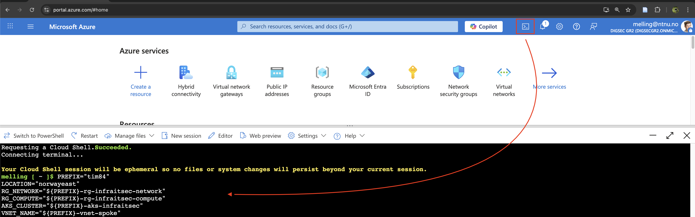
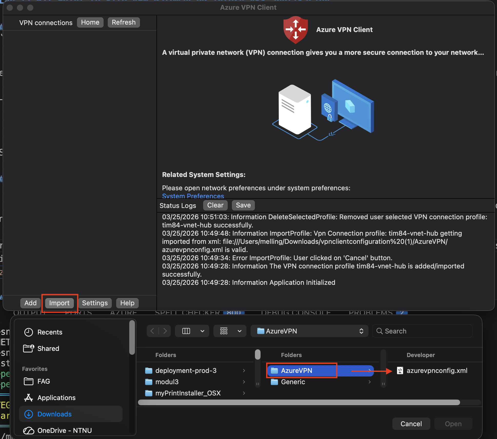
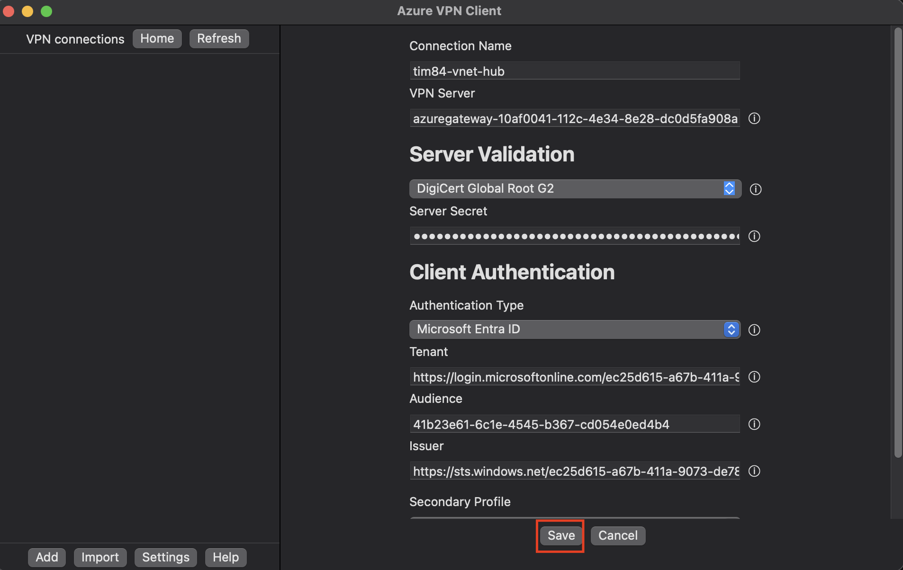
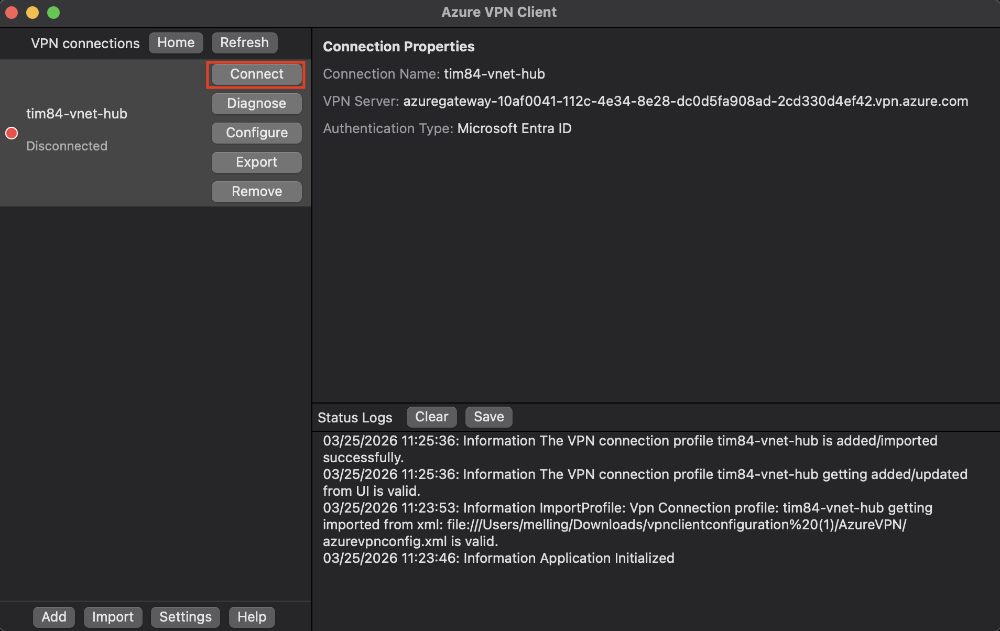
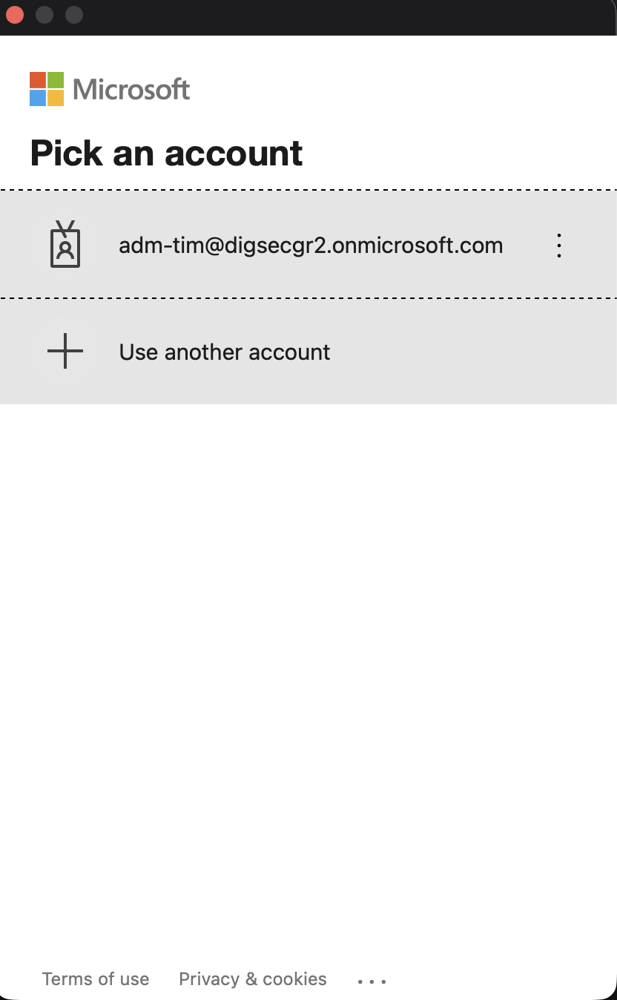
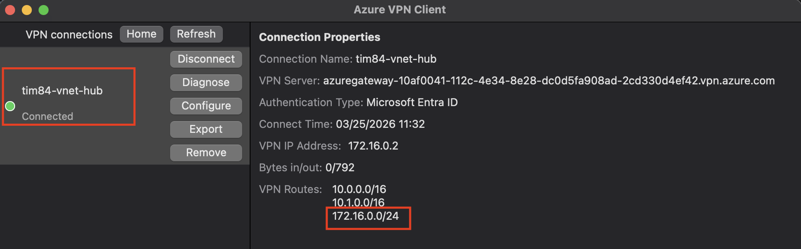
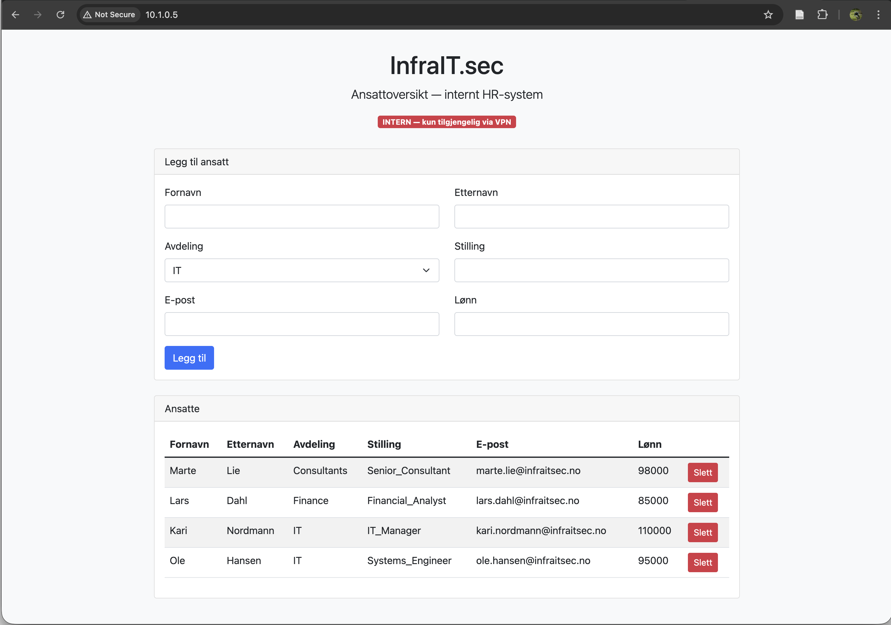
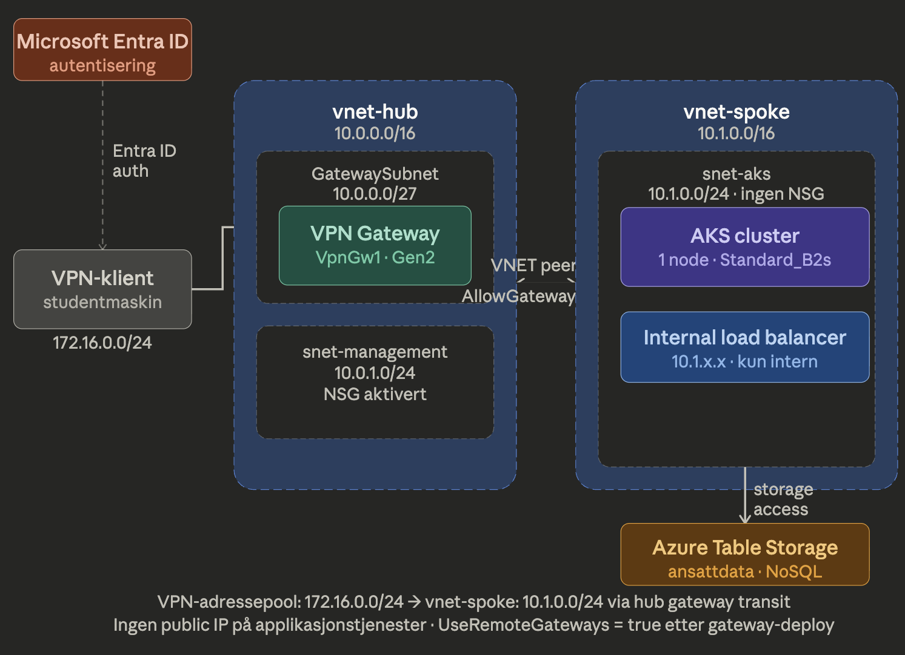

# Lab 12-02: Point-to-Site VPN Gateway og intern AKS-applikasjon

I denne labben skal du sette opp en sikker VPN-tilkobling **fra din egen maskin** (ikke bruk MGR) inn til det private Azure-nettverket du opprettet i Lab 12-01. Når tilkoblingen er på plass, skal du nå en containerbasert webapplikasjon som kjører i Azure Kubernetes Service (AKS) og lagrer data i Azure Table Storage — uten en eneste public IP-adresse eksponert mot internett.

Dette er det samme prinsippet NTNU bruker når du må være på NTNU VPN eller campusnett for å nå OpenStack-miljøet ditt på skyhigh.iik.ntnu.no. Ressursen eksisterer, men den er ikke tilgjengelig uten at du er autentisert og tilkoblet via en godkjent kanal.

Autentiseringen mot VPN-en skjer via Microsoft Entra ID, noe som betyr at det er *hvem du er* — ikke bare hvilken maskin du bruker — som avgjør om du får tilgang. Dette er et sentralt prinsipp i moderne Zero Trust-arkitektur.

Labben er delt i to parallelle løp som kjører samtidig: VPN Gateway-provisjonering (Del 1–3) og applikasjonsbygging (Del 7–9). Begge tar lang tid, og du utnytter ventetiden ved å jobbe på det andre løpet mens Azure provisjonerer i bakgrunnen.

> **Merk om kostnader:** VPN Gateway og AKS-noder er de to dyreste ressursene du oppretter i denne labben. VPN Gateway (VpnGw1) koster rundt 130–140 USD per måned, og AKS-noder faktureres per time. Det er viktig at du sletter disse ressursene ved slutten av labben slik det beskrives i Del 10. De øvrige nettverksressursene kan beholdes siden de ikke medfører kostnad.

---

## Oversikt over tidslinje

| Tidspunkt | Aktivitet |
|-----------|-----------|
| Start | Del 1: Start VPN Gateway-provisjonering (30–45 min) |
| ~5 min | Del 2: Start AKS-provisjonering (15–20 min) |
| ~20 min | Del 3–5: P2S-konfigurasjon, peering, Entra ID-bruker |
| ~25 min | Del 7–9: Bygg og deploy applikasjon mens VPN Gateway ferdigstilles |
| ~50 min | Del 6: Last ned VPN-klient og koble til |
| ~55 min | Del 9: Verifiser applikasjonen via VPN |

---

## Del 1 — Opprett Public IP og VPN Gateway

En VPN Gateway er Azure-siden av VPN-tilkoblingen. Den provisjoneres inn i `GatewaySubnet` i hub-VNET-et ditt og fungerer som endepunktet som VPN-klienten på din maskin kobler seg til. Gateway-en trenger en Public IP-adresse slik at klienter utenfor Azure kan nå den.

Provisjonering av en VPN Gateway tar 30–45 minutter. Du starter denne prosessen først, og bruker ventetiden til parallelt arbeid i Del 2 og fremover.

### Steg 1.1 — Opprett Public IP-adresse

Naviger til `<prefix>-rg-infraitsec-network` i Azure Portal og velg **Create**.

Søk etter **Public IP address** og opprett en ressurs med følgende konfigurasjon:

| Felt | Verdi |
|------|-------|
| Name | `<prefix>-pip-vpngw` |
| Region | Norway East |
| SKU | Standard |
| IP version | IPv4 |
| Assignment | Static |
| Routing preference | Microsoft network |

Static assignment er nødvendig fordi VPN Gateway-konfigurasjonen lagrer IP-adressen permanent. Skulle adressen endre seg ved omstart, ville alle VPN-klienter slutte å fungere. Standard SKU er et krav for VpnGw1 og nyere gateway-SKU-er.

### Steg 1.2 — Opprett VPN Gateway

Søk etter **Virtual network gateways** i Azure Portal og velg **Create** under **VPN Gateway** og **VPN Gateways**.

Fyll inn følgende konfigurasjon:

| Felt | Verdi |
|------|-------|
| Name | `<prefix>-vpngw-hub` |
| Region | Norway East |
| Gateway type | VPN |
| SKU | VpnGw2AZ |
| Generation | Generation2 |
| Virtual network | `<prefix>-vnet-hub` |
| Gateway subnet address range | 10.0.0.0/27 (fylles automatisk) |
| Public IP address | `<prefix>-pip-vpngw` |
| Enable active-active mode | Disabled |
| Configure BGP | Disabled |

**Om SKU-valget:** Basic SKU er utgått (deprecated) og støtter ikke Entra ID-autentisering. VpnGwAZ2 Generation2 støtter OpenVPN med Entra ID, og er tilstrekkelig for lab-formål.

**Om BGP:** Border Gateway Protocol brukes for dynamisk ruting i komplekse hybrid-nettverksoppsett med Site-to-Site VPN. Det er ikke relevant for Point-to-Site og kan trygt stå disabled.

Velg **Review + create** og deretter **Create**. Provisjoneringen starter nå og tar 30–45 minutter.

> **Ikke vent — fortsett umiddelbart til Del 2.**

---

## Del 2 — Opprett AKS-cluster i spoke-en

Azure Kubernetes Service (AKS) er Azures administrerte Kubernetes-plattform. I stedet for å sette opp og vedlikeholde et Kubernetes-cluster selv, håndterer Azure control plane, oppgraderinger og helseovervåkning av selve clusteret. Du er ansvarlig for applikasjonene som kjører i det.

Mens VM-er representerer én server per ressurs, representerer AKS en plattform der mange containerbaserte applikasjoner kjører side om side og deler underliggende compute-ressurser. Dette er én av grunnene til at containers og Kubernetes er blitt den dominerende måten å kjøre applikasjoner i sky på.

AKS administreres primært via Azure CLI og `kubectl` — bransjestandardverktøyene for Kubernetes. Du jobber i Azure Cloud Shell (Bash) gjennom hele denne labben.

### Steg 2.1 — Åpne Azure Cloud Shell

Klikk på Cloud Shell-ikonet øverst i Azure Portal og velg **Bash**.

### Steg 2.2 — Sett opp variabler

```bash
PREFIX="<prefix>"   # <-- ENDRE TIL DITT EGET PREFIKS
LOCATION="norwayeast"
RG_NETWORK="${PREFIX}-rg-infraitsec-network"
RG_COMPUTE="${PREFIX}-rg-infraitsec-compute"
AKS_CLUSTER="${PREFIX}-aks-infraitsec"
ACR_NAME="${PREFIX}acrinfraisec"
VNET_NAME="${PREFIX}-vnet-spoke"
SUBNET_NAME="${PREFIX}-snet-aks"
STORAGE_ACCOUNT="${PREFIX}stginfraisec"
TABLE_NAME="employees"
```



> **Merk:** Storage Account-navn kan kun inneholde små bokstaver og tall, og må være globalt unikt i Azure. Hvis navnet allerede er tatt, legg til et par ekstra tegn.

### Steg 2.3 — Hent AKS-subnettets resource ID

```bash
AKS_SUBNET_ID=$(az network vnet subnet show \
    --resource-group $RG_NETWORK \
    --vnet-name $VNET_NAME \
    --name $SUBNET_NAME \
    --query id \
    --output tsv)

echo "AKS Subnet ID: $AKS_SUBNET_ID"
```

Verifiser at variabelen inneholder en gyldig resource ID før du går videre.

### Steg 2.4 — Opprett Azure Container Registry

Container Registry (ACR) er et privat register for container images, tilsvarende Docker Hub men innenfor din Azure-tenant. Applikasjonen du bygger i Del 7 pakkes som et container image og lagres her før det deployes til AKS.

```bash
az acr create \
    --resource-group $RG_COMPUTE \
    --name $ACR_NAME \
    --sku Basic \
    --location $LOCATION \
    --tags Environment=Lab Owner=$PREFIX

ACR_LOGIN_SERVER=$(az acr show \
    --name $ACR_NAME \
    --query loginServer \
    --output tsv)

echo "Container Registry: $ACR_LOGIN_SERVER"
```

### Steg 2.5 — Opprett AKS-cluster

```bash
az aks create \
    --resource-group $RG_COMPUTE \
    --name $AKS_CLUSTER \
    --location $LOCATION \
    --node-count 1 \
    --node-vm-size Standard_B2s \
    --network-plugin kubenet \
    --vnet-subnet-id $AKS_SUBNET_ID \
    --attach-acr $ACR_NAME \
    --generate-ssh-keys \
    --tags Environment=Lab Owner=$PREFIX
```

`--attach-acr` gir AKS-clusteret tillatelse til å hente container images fra ACR-registeret ditt. Uten denne tillatelsen vil Kubernetes feile når det forsøker å starte applikasjonen. `--network-plugin kubenet` betyr at pods bruker et separat internt adresserom og ikke tar IP-adresser direkte fra spoke-subnettet.

Provisjoneringen tar 15–20 minutter.

> **På dette tidspunktet provisjoneres både VPN Gateway og AKS parallelt.** Når AKS er ferdig, fortsett med steg 2.6. Deretter kan du fortsett med Del 3 når VPN er ferdig.

### Steg 2.6 — Gi AKS tilgang til spoke-subnettet
AKS trenger Network Contributor på subnettet for å kunne opprette den interne load balanceren i Del 8. Rolle-tildelingen gjøres nå slik at Azure RBAC rekker å propagere tilgangen innen den trengs.

```bash
# Hent control plane-identiteten (ikke kubelet)
AKS_CONTROL_PLANE_IDENTITY=$(az aks show \
    --resource-group $RG_COMPUTE \
    --name $AKS_CLUSTER \
    --query identity.principalId \
    --output tsv)

echo "Control plane identity: $AKS_CONTROL_PLANE_IDENTITY"

# Gi Network Contributor til control plane-identiteten
az role assignment create \
    --assignee $AKS_CONTROL_PLANE_IDENTITY \
    --role "Network Contributor" \
    --scope $AKS_SUBNET_ID
```

**TIPS! Om AKS Cluster er ferdig før VPN Gateway, kan du gå til Del 7 og 8, og deretter komme tilbake til Del 3 etterpå**

---

## Del 3 — Konfigurer Point-to-Site med OpenVPN og Entra ID

Når VPN Gateway er ferdig provisjonert — sjekk status i portalen, den skal vise **Succeeded** — kan du konfigurere Point-to-Site-innstillingene.

Point-to-Site (P2S) er en VPN-tilkoblingstype der én klientmaskin kobler seg til Azure-nettverket, i motsetning til Site-to-Site som kobler to hele nettverk sammen. P2S passer for enkeltpersoner som trenger sikker tilgang til interne Azure-ressurser.

### Steg 3.1 — Åpne Point-to-site configuration

Naviger til `<prefix>-vpngw-hub` i Azure Portal og velg **Point-to-site configuration** under Settings.

### Steg 3.2 — Konfigurer P2S-innstillinger

| Felt | Verdi |
|------|-------|
| Address pool | 172.16.0.0/24 |
| Tunnel type | OpenVPN (SSL) |
| Authentication type | Microsoft Entra ID |

Address pool er adresserommet som VPN-klienter tildeles IP-adresser fra. Dette adresserommet må ikke overlappe med noen av VNET-adressene dine (10.0.0.0/16 og 10.1.0.0/16).

**Under Microsoft Entra ID — fyll inn følgende:**

| Felt | Verdi |
|------|-------|
| Tenant | `https://login.microsoftonline.com/<tenant-id>/` |
| Audience | `41b23e61-6c1e-4545-b367-cd054e0ed4b4` |
| Issuer | `https://sts.windows.net/<tenant-id>/` |

Tenant ID finner du under **Microsoft Entra ID → Overview**. Audience-verdien er en fast identifikator for Microsoft Azure VPN-applikasjonen og er den samme for alle studenter i tenanten.

Velg **Save**. Lagringen tar 15–30 minutter.

> **Fortsett til Del 4, 5 og 7 mens konfigurasjonen lagres.**

---

## Del 4 — Oppdater spoke-peering (Azure CloudShell Bash)

Deployment-scriptet satte `UseRemoteGateways = false` på spoke-peeringen fordi VPN Gateway ikke eksisterte ennå. Nå som gateway-en er opprettet, må denne innstillingen aktiveres slik at trafikk fra VPN-klienter kan rutes gjennom hub-en og inn i spoke-en.

### Steg 4.1 — Oppdater peering

```bash
PEERING_NAME="${PREFIX}-peer-spoke-to-hub"

az network vnet peering update \
    --resource-group $RG_NETWORK \
    --vnet-name $VNET_NAME \
    --name $PEERING_NAME \
    --set useRemoteGateways=true
```

### Steg 4.2 — Verifiser peering-status

```bash
az network vnet peering show \
    --resource-group $RG_NETWORK \
    --vnet-name $VNET_NAME \
    --name $PEERING_NAME \
    --query "{State:peeringState, UseRemoteGateways:useRemoteGateways}" \
    --output table
```

Utdata skal vise `Connected` og `True`. Hvis du får feilmelding om at gateway ikke finnes ennå, betyr det at VPN Gateway fortsatt provisjoneres — vent noen minutter og prøv igjen.

---

## Del 5 — Opprett Entra ID-testbruker og gi VPN-tilgang

I stedet for å bruke din egen `@stud.ntnu.no`-konto til VPN-tilkoblingen, benytter du en egen dedikert testbruker. Om du ikke allerede har en eksisterende testbruker med ferdig konfigurert MFA, opprett en ny bruker, logg inn med denne brukeren mot https://portal.azure.com og konfigurer MFA. Dette gjenspeiler god praksis i virkeligheten, der VPN-tilgang styres per brukeridentitet og kan trekkes tilbake uten å påvirke andre kontoer.

### Steg 5.1 — Opprett testbruker (KUN NØDVENDIG OM DU IKKE ALLEREDE HAR EN TESTBRUKER)

Naviger til **Microsoft Entra ID → Users → New user → Create new user**.

| Felt | Verdi |
|------|-------|
| User principal name | `<prefix>-vpn-test@<tenant-domene>` |
| Display name | `<prefix> VPN Test` |
| Password | Velg et sterkt passord og noter det |

> **Merk:** I produksjon ville gruppebasert tilgang via Entra ID-grupper vært foretrukket, der brukere legges til i en gruppe som har tilgang til VPN-applikasjonen. Dette krever Entra ID P1-lisens. Med Entra ID Free tildeles tilgang direkte per bruker, slik vi gjør her.

### Steg 5.2 — Tildel brukeren tilgang til Azure VPN-applikasjonen

Naviger til **Microsoft Entra ID → Enterprise applications** og søk etter **Azure VPN**.

Velg applikasjonen og naviger til **Users and groups → Add user/group**. Legg til testbrukeren fra Steg 5.1 og bekreft tildelingen.

Uten denne tildelingen vil brukeren ikke kunne autentisere mot VPN-en, selv om de kjenner passordet.

---

## Del 6 — Last ned VPN-klient og koble til

P2S-konfigurasjonen skal nå være ferdig lagret og ferdig konfigurert.

### Steg 6.1 — Last ned VPN-klienten

På **Point-to-site configuration**-siden velger du **Download VPN client**. Du får en ZIP-fil som inneholder konfigurasjonsfiler for ulike operativsystemer.

For OpenVPN med Entra ID-autentisering bruker du **Azure VPN Client**, som lastes ned fra Microsoft Store (Windows) eller App Store (macOS). Konfigurasjonsfilen du trenger heter `azurevpnconfig.xml` og ligger i `AzureVPN`-mappen i ZIP-filen.

### Steg 6.2 — Importer konfigurasjon og koble til

Åpne Azure VPN Client og velg **+** → **Import**. Velg `azurevpnconfig.xml`.

Klikk **Connect** og logg inn med testbrukeren du opprettet i Del 5.







### Steg 6.3 — Verifiser VPN-tilkobling

Når du velger å koble til, blir du bedt å om autentisere deg med en bruker. Benytt den brukeren som du gav tilgang til VPN Applikasjonen i tidligere steg.



Azure VPN Client skal vise **Connected** med en tildelt IP-adresse fra adressepoolen `172.16.0.0/24`.



---

## Del 7 — Opprett Azure Table Storage og legg inn testdata (Azure CloudShell Bash)

Applikasjonen du deployer i Del 8 lagrer ansattdata i Azure Table Storage. Table Storage er en NoSQL nøkkel-verdi-tjeneste som er egnet for strukturerte data som ikke krever komplekse spørringer. Hvert objekt lagres som en entitet med en `PartitionKey` og `RowKey` som til sammen utgjør en unik identifikator.

I InfraIT.sec-konteksten representerer applikasjonen et internt HR-system — tilgjengelig for ansatte via VPN, men ikke eksponert mot internett.

### Steg 7.1 — Opprett Storage Account og tabell

```bash
az storage account create \
    --name $STORAGE_ACCOUNT \
    --resource-group $RG_COMPUTE \
    --location $LOCATION \
    --sku Standard_LRS \
    --tags Environment=Lab Owner=$PREFIX

STORAGE_KEY=$(az storage account keys list \
    --account-name $STORAGE_ACCOUNT \
    --query "[0].value" \
    --output tsv)

az storage table create \
    --name $TABLE_NAME \
    --account-name $STORAGE_ACCOUNT \
    --account-key $STORAGE_KEY

echo "Storage Account: $STORAGE_ACCOUNT"
echo "Table: $TABLE_NAME"
```

### Steg 7.2 — Legg inn testdata

```bash
cat > populate-data.sh << 'EOF'
#!/bin/bash
STORAGE_ACCOUNT=$1
TABLE_NAME=$2
STORAGE_KEY=$3

add_employee() {
  local department=$1
  local emp_id=$2
  local first_name=$3
  local last_name=$4
  local email=$5
  local job_title=$6
  local salary=$7

  echo "Legger til: $first_name $last_name ($department)..."

  az storage entity insert \
    --entity PartitionKey=$department RowKey=$emp_id \
    firstName=$first_name \
    lastName=$last_name \
    email=$email \
    department=$department \
    jobTitle="$job_title" \
    salary=$salary \
    --table-name $TABLE_NAME \
    --account-name $STORAGE_ACCOUNT \
    --account-key $STORAGE_KEY
}

add_employee "IT"          "IT001" "Kari"    "Nordmann"  "kari.nordmann@infraitsec.no"   "IT_Manager"          110000
add_employee "IT"          "IT002" "Ole"     "Hansen"    "ole.hansen@infraitsec.no"      "Systems_Engineer"     95000
add_employee "HR"          "HR001" "Ingrid"  "Berg"      "ingrid.berg@infraitsec.no"     "HR_Director"         105000
add_employee "Finance"     "FI001" "Lars"    "Dahl"      "lars.dahl@infraitsec.no"       "Financial_Analyst"    85000
add_employee "Consultants" "CO001" "Marte"   "Lie"       "marte.lie@infraitsec.no"       "Senior_Consultant"    98000

echo "Testdata lagt til i tabellen '$TABLE_NAME'."
EOF

chmod +x populate-data.sh
./populate-data.sh $STORAGE_ACCOUNT $TABLE_NAME $STORAGE_KEY
```

Testdataene bruker ansattnavn og avdelinger fra InfraIT.sec-domenet du kjenner fra on-premises-labbene.

---

## Del 8 — Bygg og deploy applikasjonen til AKS

Du bygger nå en Node.js-applikasjon som pakkes som et container image, lagres i ACR og deployes til AKS-clusteret. Applikasjonen bruker Azure Table Storage som datalag og eksponeres via en intern load balancer — kun tilgjengelig fra spoke-subnettet, og dermed kun nåbar via VPN.

### Steg 8.1 — Opprett applikasjonskatalog

```bash
mkdir -p ~/infraitsec-app/views
cd ~/infraitsec-app
```

### Steg 8.2 — Opprett package.json

```bash
cat > package.json << 'EOF'
{
  "name": "infraitsec-employee-app",
  "version": "1.0.0",
  "description": "InfraIT.sec Employee Management - intern applikasjon",
  "main": "app.js",
  "scripts": {
    "start": "node app.js"
  },
  "dependencies": {
    "@azure/data-tables": "^13.2.1",
    "dotenv": "^16.0.3",
    "ejs": "^3.1.9",
    "express": "^4.18.2"
  }
}
EOF
```

### Steg 8.3 — Opprett app.js

```bash
cat > app.js << 'EOF'
const express = require('express');
const { TableClient, AzureNamedKeyCredential } = require('@azure/data-tables');
const dotenv = require('dotenv');

dotenv.config();

const app = express();
app.use(express.json());
app.use(express.urlencoded({ extended: true }));
app.set('view engine', 'ejs');

const accountName = process.env.AZURE_STORAGE_ACCOUNT_NAME;
const accountKey  = process.env.AZURE_STORAGE_ACCOUNT_KEY;
const tableName   = process.env.AZURE_STORAGE_TABLE_NAME || 'employees';

const credential  = new AzureNamedKeyCredential(accountName, accountKey);
const tableClient = new TableClient(
  `https://${accountName}.table.core.windows.net`,
  tableName,
  credential
);

app.get('/', async (req, res) => {
  try {
    const entities = [];
    for await (const entity of tableClient.listEntities()) {
      entities.push(entity);
    }
    res.render('index', { entities });
  } catch (error) {
    console.error('Feil ved henting av data:', error);
    res.status(500).send('Kunne ikke hente data fra Table Storage');
  }
});

app.post('/add', async (req, res) => {
  try {
    const { firstName, lastName, department, jobTitle, email, salary } = req.body;
    await tableClient.createEntity({
      partitionKey: department,
      rowKey: `${firstName.substr(0,1)}${lastName.substr(0,1)}${Date.now()}`,
      firstName, lastName, department, jobTitle, email,
      salary: parseInt(salary) || 0
    });
    res.redirect('/');
  } catch (error) {
    console.error('Feil ved opprettelse:', error);
    res.status(500).send('Kunne ikke legge til ansatt');
  }
});

app.post('/delete', async (req, res) => {
  try {
    const { partitionKey, rowKey } = req.body;
    await tableClient.deleteEntity(partitionKey, rowKey);
    res.redirect('/');
  } catch (error) {
    console.error('Feil ved sletting:', error);
    res.status(500).send('Kunne ikke slette ansatt');
  }
});

const PORT = process.env.PORT || 3000;
app.listen(PORT, () => console.log(`InfraIT.sec Employee App kjører på port ${PORT}`));
EOF
```

### Steg 8.4 — Opprett views/index.ejs

```bash
cat > views/index.ejs << 'EOF'
<!DOCTYPE html>
<html lang="no">
<head>
    <meta charset="UTF-8">
    <meta name="viewport" content="width=device-width, initial-scale=1.0">
    <title>InfraIT.sec — Ansattoversikt</title>
    <link href="https://cdn.jsdelivr.net/npm/bootstrap@5.1.3/dist/css/bootstrap.min.css" rel="stylesheet">
    <style>
        body { padding-top: 2rem; background-color: #f8f9fa; }
        .container { max-width: 960px; }
        .header { margin-bottom: 2rem; text-align: center; }
        .badge-internal { background-color: #dc3545; font-size: 0.75rem; }
    </style>
</head>
<body>
    <div class="container">
        <div class="header">
            <h1>InfraIT.sec</h1>
            <p class="lead">Ansattoversikt — internt HR-system</p>
            <span class="badge badge-internal bg-danger">INTERN — kun tilgjengelig via VPN</span>
        </div>

        <div class="card mb-4">
            <div class="card-header">Legg til ansatt</div>
            <div class="card-body">
                <form action="/add" method="POST">
                    <div class="row mb-3">
                        <div class="col">
                            <label class="form-label">Fornavn</label>
                            <input type="text" class="form-control" name="firstName" required>
                        </div>
                        <div class="col">
                            <label class="form-label">Etternavn</label>
                            <input type="text" class="form-control" name="lastName" required>
                        </div>
                    </div>
                    <div class="row mb-3">
                        <div class="col">
                            <label class="form-label">Avdeling</label>
                            <select class="form-select" name="department" required>
                                <option value="IT">IT</option>
                                <option value="HR">HR</option>
                                <option value="Finance">Finance</option>
                                <option value="Sales">Sales</option>
                                <option value="Consultants">Consultants</option>
                            </select>
                        </div>
                        <div class="col">
                            <label class="form-label">Stilling</label>
                            <input type="text" class="form-control" name="jobTitle" required>
                        </div>
                    </div>
                    <div class="row mb-3">
                        <div class="col">
                            <label class="form-label">E-post</label>
                            <input type="email" class="form-control" name="email" required>
                        </div>
                        <div class="col">
                            <label class="form-label">Lønn</label>
                            <input type="number" class="form-control" name="salary" required>
                        </div>
                    </div>
                    <button type="submit" class="btn btn-primary">Legg til</button>
                </form>
            </div>
        </div>

        <div class="card">
            <div class="card-header">Ansatte</div>
            <div class="card-body">
                <% if (entities && entities.length > 0) { %>
                    <table class="table table-striped">
                        <thead>
                            <tr>
                                <th>Fornavn</th>
                                <th>Etternavn</th>
                                <th>Avdeling</th>
                                <th>Stilling</th>
                                <th>E-post</th>
                                <th>Lønn</th>
                                <th></th>
                            </tr>
                        </thead>
                        <tbody>
                            <% entities.forEach(entity => { %>
                                <tr>
                                    <td><%= entity.firstName %></td>
                                    <td><%= entity.lastName %></td>
                                    <td><%= entity.department %></td>
                                    <td><%= entity.jobTitle %></td>
                                    <td><%= entity.email %></td>
                                    <td><%= entity.salary %></td>
                                    <td>
                                        <form action="/delete" method="POST" style="display:inline;">
                                            <input type="hidden" name="partitionKey" value="<%= entity.partitionKey %>">
                                            <input type="hidden" name="rowKey" value="<%= entity.rowKey %>">
                                            <button type="submit" class="btn btn-sm btn-danger">Slett</button>
                                        </form>
                                    </td>
                                </tr>
                            <% }); %>
                        </tbody>
                    </table>
                <% } else { %>
                    <div class="alert alert-info">Ingen ansatte funnet i systemet.</div>
                <% } %>
            </div>
        </div>
    </div>
</body>
</html>
EOF
```

### Steg 8.5 — Opprett Dockerfile

```bash
cat > Dockerfile << 'EOF'
FROM node:18-alpine

WORKDIR /app

COPY package*.json ./
RUN npm install --production

COPY . .

EXPOSE 3000

CMD ["node", "app.js"]
EOF
```

### Steg 8.6 — Bygg container image med ACR Tasks

ACR Tasks lar deg bygge container images direkte i Azure uten å ha Docker installert lokalt. Buildingen kjøres i Azure og det ferdige imaget lagres direkte i registeret ditt.

```bash
az acr build \
    --registry $ACR_NAME \
    --image infraitsec-employee-app:latest \
    .
```

### Steg 8.7 — Opprett Kubernetes Secret for Storage-credentials

Kubernetes Secrets brukes for å håndtere sensitiv informasjon som passord og tilgangsnøkler uten å hardkode dem i applikasjonskoden eller container-imaget. Applikasjonen henter nøklene via environment variables ved oppstart.

```bash
az aks get-credentials \
    --resource-group $RG_COMPUTE \
    --name $AKS_CLUSTER

kubectl create secret generic azure-storage-credentials \
    --from-literal=account-name=$STORAGE_ACCOUNT \
    --from-literal=account-key=$STORAGE_KEY
```

### Steg 8.8 — Deploy applikasjonen

```bash
cat > kubernetes-manifest.yaml << EOF
---
apiVersion: apps/v1
kind: Deployment
metadata:
  name: infraitsec-employee-app
  labels:
    app: infraitsec-employee-app
spec:
  replicas: 1
  selector:
    matchLabels:
      app: infraitsec-employee-app
  template:
    metadata:
      labels:
        app: infraitsec-employee-app
    spec:
      containers:
      - name: infraitsec-employee-app
        image: ${ACR_LOGIN_SERVER}/infraitsec-employee-app:latest
        ports:
        - containerPort: 3000
        env:
        - name: AZURE_STORAGE_ACCOUNT_NAME
          valueFrom:
            secretKeyRef:
              name: azure-storage-credentials
              key: account-name
        - name: AZURE_STORAGE_ACCOUNT_KEY
          valueFrom:
            secretKeyRef:
              name: azure-storage-credentials
              key: account-key
        - name: AZURE_STORAGE_TABLE_NAME
          value: "${TABLE_NAME}"
---
apiVersion: v1
kind: Service
metadata:
  name: infraitsec-employee-app
  annotations:
    service.beta.kubernetes.io/azure-load-balancer-internal: "true"
spec:
  type: LoadBalancer
  ports:
  - port: 80
    targetPort: 3000
  selector:
    app: infraitsec-employee-app
EOF

kubectl apply -f kubernetes-manifest.yaml
```

Annotasjonen `azure-load-balancer-internal: "true"` er det som gjør denne tjenesten intern. Uten den ville Kubernetes opprette en public load balancer med en offentlig IP-adresse. Med den opprettes load balanceren i spoke-subnettet og tildeles en privat IP fra `10.1.0.0/24`.

### Steg 8.9 — Vent på intern IP-adresse

```bash
kubectl get service infraitsec-employee-app --watch
```
Trykk CTRL + C for å komme ut av --watch modus

Vent til kolonnen `EXTERNAL-IP` viser en adresse i `10.1.x.x`-området. Dette er den private IP-adressen til den interne load balanceren i spoke-subnettet. Noter deg denne adressen — du trenger den i Del 9.


Sjekk at applikasjonen kjører:

```bash
kubectl get deployments
kubectl get pods
```

Alle pods skal vise status `Running`.

Hvis en får InvalidImage, prøv følgende feilsøking: [Invalid Image](12-05-InvalidImage.md)

---

## Del 9 — Verifiser applikasjonen via VPN

Med VPN-tilkoblingen aktiv fra Del 6 og applikasjonen deployet i Del 8, kan du nå verifisere at alt henger sammen.

### Steg 9.1 — Nå applikasjonen via nettleseren

Åpne nettleseren på din egen maskin og naviger til `http://<intern-ip>` (IP-adressen du noterte i Steg 8.9).

Du skal se InfraIT.sec Employee Management-applikasjonen med testdataene du la inn i Del 7.



### Steg 9.2 — Test applikasjonsfunksjonaliteten

Legg til en ny ansatt via skjemaet og verifiser at den dukker opp i listen. Slett en ansatt og verifiser at den forsvinner. Dataene lagres i Azure Table Storage og persisterer selv om applikasjonen restartes.

Visualisering av dagens lab:



### Steg 9.3 — Verifiser at applikasjonen ikke er tilgjengelig uten VPN

Koble fra VPN i Azure VPN Client og last inn siden på nytt. Du skal nå få timeout — siden er ikke nåbar fra internett.

Dette er kjernen av det du har bygget: en applikasjon som er tilgjengelig for autentiserte brukere via VPN, og fullstendig utilgjengelig for alle andre.

---

## Del 10 — Opprydding (IKKE GJØR FØR PRESENTERT ØVING TIL LÆRINGSASSISTENT)

MERK! Siden dette er kostbare ressurser, bør de ikke bli opprettet og stå kjørende til neste uke eller neste lab før en viser at en har tilhørende øving.

VPN Gateway, AKS-noder, ACR og Storage Account slettes ved labslutt. Nettverksressursene (VNET, subnett, peering, NSG) kan beholdes til neste lab.

### Steg 10.1 — Slett VPN Gateway og Public IP

Naviger til `<prefix>-vpngw-hub` i Azure Portal og velg **Delete**. Dette tar 10–15 minutter. Slett deretter `<prefix>-pip-vpngw`.

### Steg 10.2 — Slett compute-ressurser

```bash
az aks delete \
    --resource-group $RG_COMPUTE \
    --name $AKS_CLUSTER \
    --yes \
    --no-wait

az acr delete \
    --resource-group $RG_COMPUTE \
    --name $ACR_NAME \
    --yes

az storage account delete \
    --resource-group $RG_COMPUTE \
    --name $STORAGE_ACCOUNT \
    --yes
```

### Steg 10.3 — Tilbakestill spoke-peering

Siden VPN Gateway nå er slettet, settes `UseRemoteGateways` tilbake til false:

```bash
az network vnet peering update \
    --resource-group $RG_NETWORK \
    --vnet-name $VNET_NAME \
    --name $PEERING_NAME \
    --set useRemoteGateways=false
```

### Steg 10.4 — Verifiser kostnader

Naviger til **Cost Management → Cost analysis** og filtrer på dine resource groups. Verifiser at ingen uventede ressurser fortsatt kjører.

---

## Refleksjonsspørsmål

Annotasjonen `azure-load-balancer-internal: "true"` i Kubernetes-manifestet er det eneste som skiller en intern fra en ekstern tjeneste. Hva ville konsekvensene vært for sikkerhetsmodellen dersom denne annotasjonen ble utelatt ved en feil?

Applikasjonen bruker Kubernetes Secrets for å håndtere Storage Account-nøkkelen. Hva er alternativet til nøkkelbasert autentisering mot Azure-tjenester, og hvorfor er det å foretrekke i produksjon?

Forklar med egne ord hva som skjer i rutingen når en VPN-klient med adresse `172.16.0.x` sender en HTTP-forespørsel til `10.1.0.x`. Hvilke Azure-komponenter er involvert fra klienten sender pakken til applikasjonen mottar den?

Hvorfor er det hensiktsmessig å bruke `UseRemoteGateways = false` i deployment-scriptet og aktivere det manuelt etter at VPN Gateway er provisjonert, fremfor å sette det til `true` fra starten?