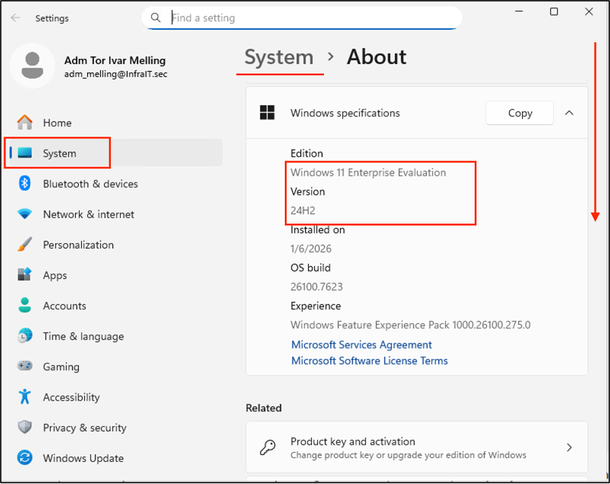
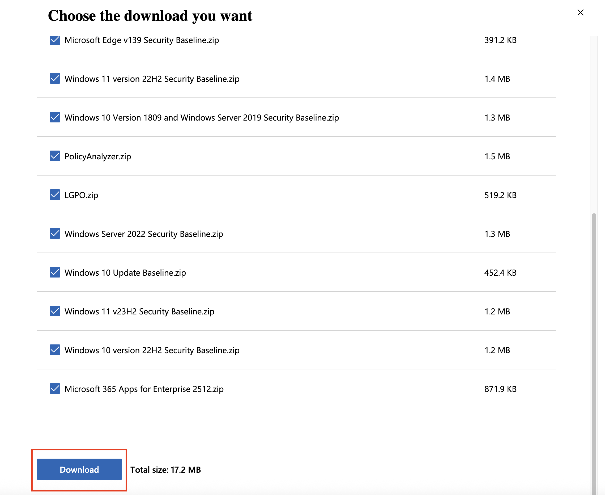
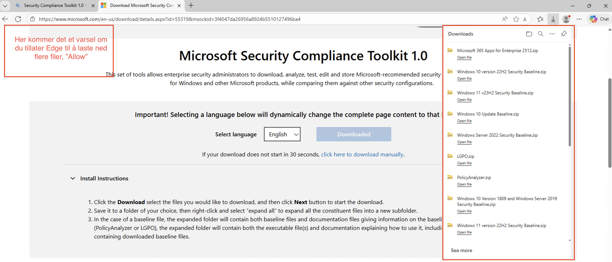
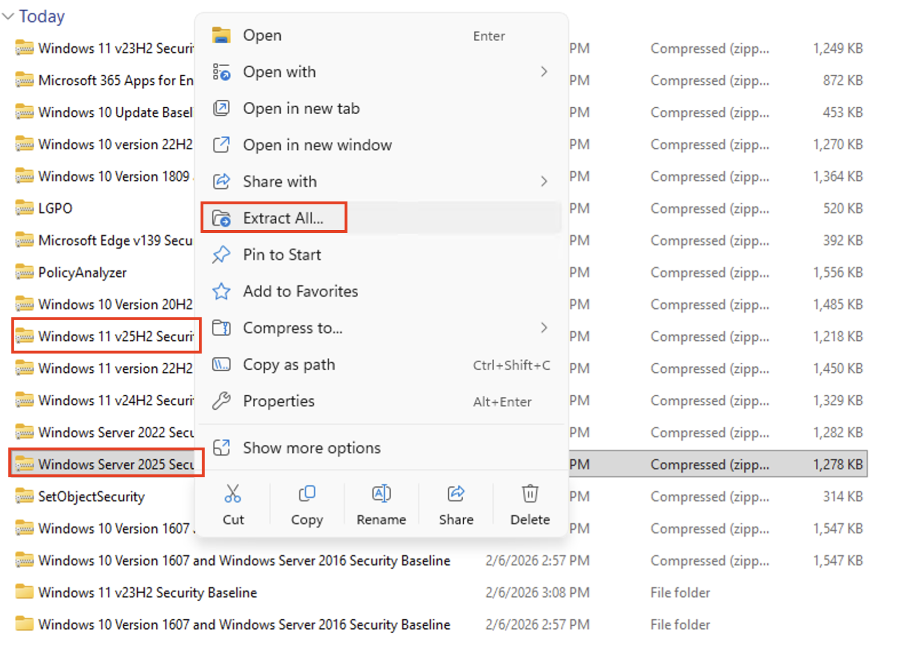
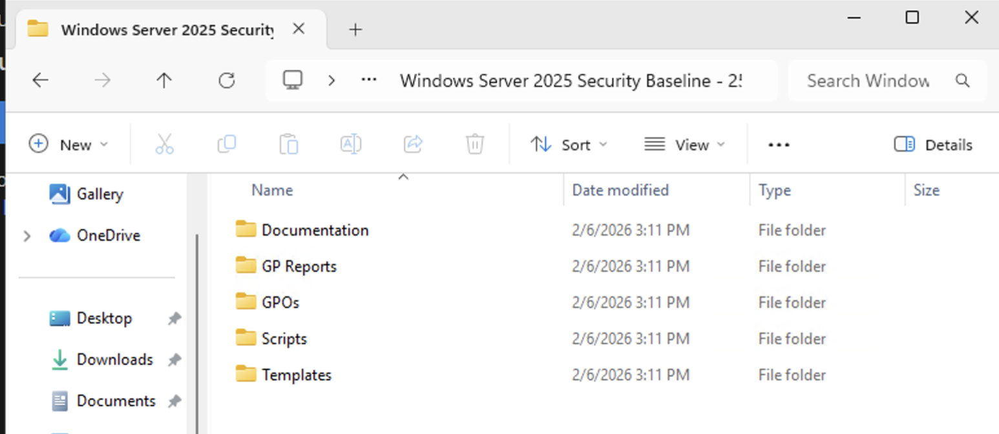
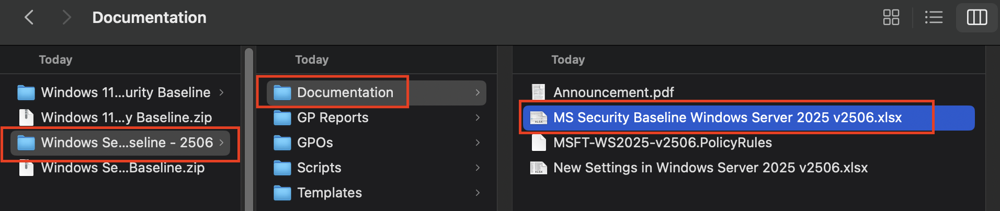
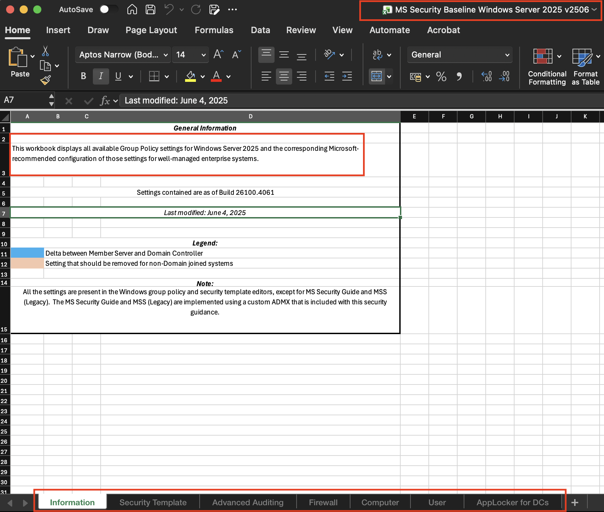

# Lab: Infrastructure Hardening med Microsoft Security Compliance Toolkit

## Læringsmål
Etter denne laben skal du kunne:
- Forstå hva Microsoft Security Compliance Toolkit (SCT) er og hvorfor det er viktig
- Laste ned og analysere security baselines for ulike OS-versjoner
- Importere og implementere security baselines via Group Policy
- Verifisere at hardening-tiltak er korrekt implementert
- Forstå trade-offs mellom sikkerhet og funksjonalitet
- Utvide baselines med egne custom hardening-settings

---

## Forutsetninger

**Påkrevde administrative rettigheter:**
- Innlogget som `adm_<brukernavn>` på **mgr.infrait.sec**
- Medlemskap i gruppen `Domain Admins` eller `Group Policy Creator Owners`

**Lab-miljø:**
- **dc1.infrait.sec** - Domain Controller (Windows Server 2025)
- **srv1.infrait.sec** - File Server med DFS (Windows Server 2025)
- **cl1.infrait.sec** - Klient-maskin (Windows 11)
- **mgr.infrait.sec** - IT Admin workstation (Windows 11)

**Verktøy som skal være installert på mgr:**
- Group Policy Management Console (GPMC)
- PowerShell 5.1 eller nyere
- Remote Server Administration Tools (RSAT)
- Internett-tilgang (for nedlasting av toolkit)

---

## Teorigrunnlag

### Hva er Microsoft Security Compliance Toolkit?

Microsoft Security Compliance Toolkit (SCT) er en samling av **security baselines** - forhåndskonfigurerte Group Policy Objects som implementerer Microsofts anbefalte sikkerhetskonfigurasjoner.

**Baselines er utviklet av:**
- Microsoft Security Response Center (MSRC)
- National Security Agency (NSA)
- Defense Information Systems Agency (DISA)
- Center for Internet Security (CIS)

### Hva dekker baselines?

Security baselines konfigurerer:

| Kategori | Eksempler på Settings |
|----------|----------------------|
| **Account Policies** | Passordkompleksitet, account lockout, Kerberos policies |
| **Audit Policies** | Hva som logges i Security Event Log |
| **User Rights** | Hvem kan logge på lokalt, starte services, ta backup |
| **Security Options** | SMB signing, LDAP signing, anonymous access |
| **Windows Defender** | Real-time protection, cloud protection, PUA blocking |
| **PowerShell Logging** | Script block logging, transcription, constrained language mode |
| **Network Security** | Disable SMBv1, TLS 1.0/1.1, NetBIOS |
| **Service Hardening** | Disable Print Spooler, Remote Registry, unnecessary services |

### Viktige prinsipper:

**Defense in Depth:** Baselines implementerer multiple lag av sikkerhet, slik at en enkelt feil ikke kompromitterer hele systemet.

**Least Privilege:** Settings reduserer rettigheter til minimum nødvendig for normal drift.

**Audit & Accountability:** Økt logging slik at angrep kan oppdages og analyseres.

### Baseline-versjoner du må kjenne til:



```
Windows 11 24H2 Security Baseline
├── Workstation baseline (for klienter som CL1 og MGR)
└── Ikke for servere!

Windows Server 2025 Security Baseline
├── Member Server baseline (for SRV1)
└── Domain Controller baseline (for DC1)

Microsoft 365 Apps Security Baseline
└── Hardening for Office-applikasjoner
```

**VIKTIG:** Du kan IKKE bruke Windows 11 baseline på servere eller Server baseline på klienter!

---

## Del 1: Last ned Security Compliance Toolkit

### Steg 1.1: Download toolkit

På **mgr.infrait.sec**, åpne PowerShell som Administrator:

```powershell
# Opprett working directory
$ToolkitPath = "C:\SecurityBaseline"
New-Item -Path $ToolkitPath -ItemType Directory -Force

# Naviger til mappen
Set-Location $ToolkitPath

# Download URL (oppdateres jevnlig av Microsoft)
$DownloadUrl = "https://www.microsoft.com/en-us/download/details.aspx?id=55319"

Write-Host @"
Microsoft Security Compliance Toolkit må lastes ned manuelt.

1. Åpne Edge/Chrome
2. Gå til: $DownloadUrl
3. Last ned nyeste versjon (f.eks. 'Security Compliance Toolkit 1.0')
4. Huk av for alle filene og velg last ned
5. Pakk ut .zip-filene og kopier mappene over til: $ToolkitPath

Trykk Enter når nedlastingen er fullført...
"@

Read-Host
```





**Du skal se mapper som:**
```
Name
----
Windows 11 24H2 Security Baseline
Windows Server 2025 Security Baseline
Microsoft Edge Security Baseline
Microsoft 365 Apps for Enterprise
Policy Analyzer
LGPO Tool
```

---

## Del 2: Analyser Security Baselines

### Steg 2.1: Utforsk Windows Server 2025 Baseline



```powershell
# Naviger til Server 2025 baseline
# List innhold
Get-ChildItem -Recurse | Select-Object FullName
```


**Viktige filer:**

```
GPOs\
├── {GUID}-DomainSecurity\      # Domain-wide policies
├── {GUID}-MemberServer\        # For member servers (SRV1)
└── {GUID}-DomainController\    # For DC (DC1)

Scripts\
├── Baseline-LocalInstall.ps1   # Installerer baseline lokalt (IKKE for domain!)
└── Baseline-ADImport.ps1       # Importerer til Active Directory

Documentation\
└── Windows Server 2025 Security Baseline.xlsx  # Forklarer hver setting
```

### Steg 2.2: Les dokumentasjonen (VIKTIG i produksjonssammenheng!)
- Ligger i mappen Documentation
  - 
- MERK! Vi har ikke Excel på MGR, last ned filen fra Microsoft på egen PC for å lese.
  - 


**Nøkkelinformasjon i dokumentasjonen:**

- **Policy Setting Name:** Hva policyen heter i GPO
- **Help text:** Hva denne innstillingen gjør

---

## Del 3: Implementer Security Baselines via GPO

### Steg 3.1: Importer Baselines til Active Directory

På **mgr.infrait.sec**, kjør PowerShell som Administrator:

- Naviger til Scripts-mappen for Server 2025 - I mitt eksempel er det C:\SecurityBaseline\Windows Server 2025 Security Baseline\Windows Server 2025 Security Baseline - 2506\Scripts


**Hva gjør Baseline-ADImport.ps1?**

1. Kopierer GPO-backups til SYSVOL på Domain Controller
2. Importerer GPO-er til Active Directory via `Import-GPO` cmdlet
3. Oppretter GPO-er med navnene:
   - `MSFT Windows Server 2025 - Domain Security`
   - `MSFT Windows Server 2025 - Member Server`
   - `MSFT Windows Server 2025 - Domain Controller`

**Kjør import-scriptet:**

```powershell
# Kjør AD import (krever Domain Admin rettigheter!)
.\Baseline-ADImport.ps1

<#
FORVENTET OUTPUT:

Importing the following GPOs:

MSFT Internet Explorer 11 - Computer
MSFT Internet Explorer 11 - User
MSFT Windows Server 2025 v2506 - Defender Antivirus
MSFT Windows Server 2025 v2506 - Domain Controller
MSFT Windows Server 2025 v2506 - Domain Controller Virtualization Based Security
MSFT Windows Server 2025 v2506 - Domain Security
MSFT Windows Server 2025 v2506 - Member Server
MSFT Windows Server 2025 v2506 - Member Server Credential Guard


{4A17861B-5A04-4C85-9D2C-39941A77FCBF}: MSFT Internet Explorer 11 - Computer

DisplayName      : MSFT Internet Explorer 11 - Computer
DomainName       : InfraIT.sec
Owner            : InfraIT\Domain Admins
Id               : 16e64b61-c56f-4866-9e6b-8bdf5cc8bb01
GpoStatus        : UserSettingsDisabled
Description      : 
CreationTime     : 2/8/2026 3:46:50 PM
ModificationTime : 2/8/2026 3:46:52 PM
UserVersion      : 
ComputerVersion  : 
WmiFilter        : 

{6825461D-6DE3-4E24-A982-14D56D4AF997}: MSFT Internet Explorer 11 - User
DisplayName      : MSFT Internet Explorer 11 - User
DomainName       : InfraIT.sec
Owner            : InfraIT\Domain Admins
Id               : c5d8c015-4728-414a-b6bc-8a9e094f9c59
GpoStatus        : ComputerSettingsDisabled
Description      : 
CreationTime     : 2/8/2026 3:46:52 PM
ModificationTime : 2/8/2026 3:46:53 PM
UserVersion      : 
ComputerVersion  : 
WmiFilter        : 

{AA5E941F-A7C5-4D42-AB6C-6873614DBF72}: MSFT Windows Server 2025 v2506 - Defender Antivirus
DisplayName      : MSFT Windows Server 2025 v2506 - Defender Antivirus
DomainName       : InfraIT.sec
Owner            : InfraIT\Domain Admins
Id               : 32dc6d0a-d474-43f9-bec3-84efb8fb9094
GpoStatus        : UserSettingsDisabled
Description      : 
CreationTime     : 2/8/2026 3:46:53 PM
ModificationTime : 2/8/2026 3:46:54 PM
..
..
..
..
..
#>
```
I Group Policy Manager kan en nå se alle de nyopprettede Group Policy objektene som er opprettet:

**Hvis feil:** Se [Troubleshooting](#troubleshooting-1) nedenfor.

---

### Steg 3.2: Importer Windows 11 Baseline

Gjenta prosessen for Windows 11:


# Kjør import
.\Baseline-ADImport.ps1

```Powershell
<#
FORVENTET OUTPUT:

Importing the following GPOs:

MSFT Internet Explorer 11 - Computer
MSFT Internet Explorer 11 - User
MSFT Windows 11 24H2 - BitLocker
MSFT Windows 11 24H2 - Computer
MSFT Windows 11 24H2 - Credential Guard
MSFT Windows 11 24H2 - Defender Antivirus
MSFT Windows 11 24H2 - Domain Security
MSFT Windows 11 24H2 - User


{BB10D67B-FBEA-4CD0-8E5F-09AC67C07670}: MSFT Internet Explorer 11 - Computer

DisplayName      : MSFT Internet Explorer 11 - Computer
DomainName       : InfraIT.sec
Owner            : InfraIT\Domain Admins
Id               : 16e64b61-c56f-4866-9e6b-8bdf5cc8bb01
GpoStatus        : UserSettingsDisabled
Description      : 
CreationTime     : 2/8/2026 3:46:50 PM
ModificationTime : 2/8/2026 3:54:34 PM
UserVersion      : 
ComputerVersion  : 
WmiFilter        : 

{BF76B495-48DD-4A15-AFFF-E9E20A6C9AAB}: MSFT Internet Explorer 11 - User
DisplayName      : MSFT Internet Explorer 11 - User
DomainName       : InfraIT.sec
Owner            : InfraIT\Domain Admins
Id               : c5d8c015-4728-414a-b6bc-8a9e094f9c59
GpoStatus        : ComputerSettingsDisabled
Description      : 
CreationTime     : 2/8/2026 3:46:52 PM
ModificationTime : 2/8/2026 3:54:36 PM
..
..
..
..
..
..
```

---

### Steg 3.3: Verifiser at GPO-er er importert

```powershell
# List alle MSFT baseline GPO-er
Get-GPO -All | Where-Object { $_.DisplayName -like "MSFT*" } | 
    Select-Object DisplayName, CreationTime, ModificationTime |
    Format-Table -AutoSize
```

**Du skal se:**
```
DisplayName                                                                      CreationTime        ModificationTime
-----------                                                                      ------------        ----------------
MSFT Internet Explorer 11 - Computer                                             2/8/2026 3:46:50 PM 2/8/2026 3:54:34 PM
MSFT Windows 11 24H2 - Credential Guard                                          2/8/2026 3:54:39 PM 2/8/2026 3:54:40 PM
MSFT Windows Server 2025 v2506 - Defender Antivirus                              2/8/2026 3:46:53 PM 2/8/2026 3:46:54 PM
MSFT Windows Server 2025 v2506 - Member Server                                   2/8/2026 3:46:59 PM 2/8/2026 3:47:02 PM
MSFT Windows 11 24H2 - BitLocker                                                 2/8/2026 3:54:36 PM 2/8/2026 3:54:36 PM
MSFT Windows 11 24H2 - Domain Security                                           2/8/2026 3:54:43 PM 2/8/2026 3:54:44 PM
MSFT Windows 11 24H2 - Computer                                                  2/8/2026 3:54:37 PM 2/8/2026 3:54:38 PM
MSFT Windows 11 24H2 - User                                                      2/8/2026 3:54:45 PM 2/8/2026 3:54:46 PM
MSFT Windows Server 2025 v2506 - Domain Controller Virtualization Based Security 2/8/2026 3:46:57 PM 2/8/2026 3:46:58 PM
MSFT Windows Server 2025 v2506 - Member Server Credential Guard                  2/8/2026 3:47:02 PM 2/8/2026 3:47:02 PM
MSFT Windows 11 24H2 - Defender Antivirus                                        2/8/2026 3:54:42 PM 2/8/2026 3:54:42 PM
MSFT Windows Server 2025 v2506 - Domain Security                                 2/8/2026 3:46:58 PM 2/8/2026 3:46:58 PM
MSFT Windows Server 2025 v2506 - Domain Controller                               2/8/2026 3:46:54 PM 2/8/2026 3:46:56 PM
MSFT Internet Explorer 11 - User                                                 2/8/2026 3:46:52 PM 2/8/2026 3:54:36 PM
```

---

### Steg 3.4 Dobbeltsjekk at maskiner ligger i riktige OUer:**

```powershell
# Flytt Domain Controller
Get-ADComputer -Identity DC1 | Move-ADObject -TargetPath "OU=Domain Controllers,DC=infrait,DC=sec"

# Flytt Member Server
Get-ADComputer -Identity SRV1 | Move-ADObject -TargetPath "OU=Servers,OU=InfraIT_Computers,DC=infrait,DC=sec"

# Flytt Workstations (MGR-NEW er mest trolig navnet etter at en har opprettet ny MGR maskin for større diskplass)
Get-ADComputer -Identity CL1 | Move-ADObject -TargetPath "OU=HR,OU=Workstations,OU=InfraIT_Computers,DC=infrait,DC=sec"
Get-ADComputer -Identity MGR-new | Move-ADObject -TargetPath "OU=IT,OU=Workstations,OU=InfraIT_Computers,DC=infrait,DC=sec"

# Verifiser plassering
Get-ADComputer -Filter * | Select-Object Name, DistinguishedName
```


---

### Steg 3.5: Link Baselines til riktige OUer

**‼️KRITISK‼️: Husk at når en linker en GPO med en OU påvirker det maskinen/brukerne i denne OU-en.**
> **1. Det er viktig å linke riktig baseline til riktig maskintype!**
>
> **2. Det er viktg å husk at i produksjon kan en ikke linke GPO med OU uten å først gjennomføre tester og undersøke at systemene fungerer som tiltenkt**
>
> **3. Husk å ha riktig target om en ikke har samme oppsett som i gjennomgang / MarkDowns / videoer**
>
> **4. En vet ikke alt hvordan dette påvirker maskiner / brukere før en har gått igjennom Group Policy innstillingene som settes. Se eksempel fra Excel-filen under:**
> 

```powershell
# Link Domain Controller baseline
New-GPLink -Name "MSFT Windows Server 2025 v2506 - Domain Controller" `
           -Target "OU=Domain Controllers,DC=infrait,DC=sec" `
           -LinkEnabled Yes `
           -Order 1

Write-Host "✓ Linket DC baseline til Domain Controllers OU" -ForegroundColor Green
```

```powershell
# Link Member Server baseline
New-GPLink -Name "MSFT Windows Server 2025 v2506 - Member Server" `
           -Target "OU=Servers,OU=InfraIT_Computers,DC=infrait,DC=sec" `
           -LinkEnabled Yes `
           -Order 1

Write-Host "✓ Linket Member Server baseline til Servers OU" -ForegroundColor Green
```

```powershell
# Link Windows 11 Computer baseline ‼️MERK‼️ Om en har MGR maskinen i IT OU-en, vil denne Group Policy-innstillingen det påvirke MRG-maskinen.
New-GPLink -Name "MSFT Windows 11 24H2 - Computer" `
           -Target "OU=Workstations,OU=InfraIT_Computers,DC=infrait,DC=sec" `
           -LinkEnabled Yes `
           -Order 1

Write-Host "✓ Linket Windows 11 baseline til Workstations OU" -ForegroundColor Green
```

```powershell
# Link Windows 11 User baseline (gjelder brukere som logger på workstations)
New-GPLink -Name "MSFT Windows 11 24H2 - User" `
           -Target "OU=Workstations,OU=InfraIT_Computers,DC=infrait,DC=sec" `
           -LinkEnabled Yes `
           -Order 2

Write-Host "✓ Linket Windows 11 User baseline til Workstations OU" -ForegroundColor Green
````

```powershell
# Link Domain Security (gjelder alle maskiner i domenet)
New-GPLink -Name "MSFT Windows Server 2025 v2506 - Domain Security" `
           -Target "DC=infrait,DC=sec" `
           -LinkEnabled Yes `
           -Order 10

Write-Host "✓ Linket Domain Security til root domain" -ForegroundColor Green
```

**Hva gjør Order?**
- **Order 1** = Høyest prioritet (appliseres sist, overskriver andre GPO-er)
- **Order 10** = Lavest prioritet (appliseres først)

---

### Steg 3.6: Tvinge GPO-oppdatering

```powershell
# Tving Group Policy oppdatering på alle maskiner
$Computers = @('dc1', 'srv1', 'cl1', 'mgr')

foreach ($Computer in $Computers) {
    Write-Host "`nOppdaterer Group Policy på $Computer.infrait.sec..." -ForegroundColor Cyan
    
    Invoke-Command -ComputerName "$Computer.infrait.sec" -ScriptBlock {
        gpupdate /force
    } -ErrorAction Continue
}

Write-Host "`n⚠️  VIKTIG: Noen settings krever reboot for å tre i kraft!" -ForegroundColor Yellow
Write-Host "Plan en reboot av alle maskiner i maintenance window." -ForegroundColor Yellow
```

---

## Del 4: Verifiser Hardening Implementation

### Steg 4.1: Sjekk appliserte GPO-er

```powershell
# Lagre som C:\Scripts\Verify-HardeningGPO.ps1
$VerifyScript = @'
param([string]$ComputerName)

Invoke-Command -ComputerName $ComputerName -ScriptBlock {
    # Generer GPResult rapport
    gpresult /r /scope:computer | Select-String "Applied Group Policy Objects" -Context 0,10
}
'@

$VerifyScript | Out-File C:\Scripts\Verify-HardeningGPO.ps1

# Kjør på alle maskiner
@('dc1', 'srv1', 'cl1', 'mgr') | ForEach-Object {
    Write-Host "`n=== $_.infrait.sec ===" -ForegroundColor Yellow
    & C:\Scripts\Verify-HardeningGPO.ps1 -ComputerName "$_.infrait.sec"
}
```

**Forventet output for SRV1:**
```
Applied Group Policy Objects
-----------------------------
    MSFT Windows Server 2025 - Member Server
    MSFT Windows Server 2025 - Domain Security
    Default Domain Policy
```

---

### Steg 4.2: Test spesifikke hardening-settings

#### Test 1: Er SMBv1 deaktivert?

```powershell
# SMBv1 er en KRITISK sårbarhet (EternalBlue/WannaCry)
$Computers = @('dc1', 'srv1', 'cl1', 'mgr')

foreach ($Computer in $Computers) {
    $SMBv1Status = Invoke-Command -ComputerName "$Computer.infrait.sec" -ScriptBlock {
        Get-WindowsOptionalFeature -Online -FeatureName SMB1Protocol -ErrorAction SilentlyContinue |
            Select-Object FeatureName, State
    }
    
    if ($SMBv1Status.State -eq 'Disabled') {
        Write-Host "✓ $Computer : SMBv1 er DEAKTIVERT (sikker)" -ForegroundColor Green
    } else {
        Write-Host "✗ $Computer : SMBv1 er AKTIVERT (SÅRBAR!)" -ForegroundColor Red
    }
}
```

---

#### Test 2: Er PowerShell Script Block Logging aktivert?

```powershell
# PowerShell logging er kritisk for å oppdage angrep
foreach ($Computer in $Computers) {
    $PSLogging = Invoke-Command -ComputerName "$Computer.infrait.sec" -ScriptBlock {
        $RegPath = 'HKLM:\Software\Policies\Microsoft\Windows\PowerShell\ScriptBlockLogging'
        
        if (Test-Path $RegPath) {
            Get-ItemProperty -Path $RegPath | Select-Object EnableScriptBlockLogging
        } else {
            [PSCustomObject]@{ EnableScriptBlockLogging = "NOT CONFIGURED" }
        }
    }
    
    if ($PSLogging.EnableScriptBlockLogging -eq 1) {
        Write-Host "✓ $Computer : PowerShell logging AKTIVERT" -ForegroundColor Green
    } else {
        Write-Host "✗ $Computer : PowerShell logging IKKE aktivert" -ForegroundColor Red
    }
}
```

---

#### Test 3: Er Windows Defender real-time protection aktivert?

```powershell
foreach ($Computer in $Computers) {
    $DefenderStatus = Invoke-Command -ComputerName "$Computer.infrait.sec" -ScriptBlock {
        Get-MpPreference | Select-Object DisableRealtimeMonitoring, DisableBehaviorMonitoring
    }
    
    if ($DefenderStatus.DisableRealtimeMonitoring -eq $false) {
        Write-Host "✓ $Computer : Defender Real-time Protection AKTIVERT" -ForegroundColor Green
    } else {
        Write-Host "✗ $Computer : Defender Real-time Protection DEAKTIVERT" -ForegroundColor Red
    }
}
```

---

#### Test 4: Sjekk Audit Policies

```powershell
# Advanced Audit Policies er kritisk for å oppdage innbrudd
Invoke-Command -ComputerName dc1.infrait.sec -ScriptBlock {
    # Sjekk kritiske audit kategorier
    auditpol /get /category:"Logon/Logoff" | Select-String "Success and Failure"
    auditpol /get /category:"Account Logon" | Select-String "Success and Failure"
}
```

**Forventet:** Success and Failure logging for kritiske events.

---

### Steg 4.3: Komplett Hardening Verification Script

Lagre som `C:\Scripts\Test-SecurityHardening.ps1`:

```powershell
<#
.SYNOPSIS
    Komplett security hardening verification script
    
.DESCRIPTION
    Verifiserer at Microsoft Security Baseline er korrekt implementert
    på alle maskiner i InfraIT.sec domenet.
    
.EXAMPLE
    .\Test-SecurityHardening.ps1 -GenerateReport
#>

[CmdletBinding()]
param(
    [string[]]$ComputerName = @('dc1.infrait.sec', 'srv1.infrait.sec', 'cl1.infrait.sec', 'mgr.infrait.sec'),
    [switch]$GenerateReport
)

# Definer security checks
$SecurityChecks = @{
    'SMBv1 Disabled' = {
        $Feature = Get-WindowsOptionalFeature -Online -FeatureName SMB1Protocol -ErrorAction SilentlyContinue
        $Feature.State -eq 'Disabled'
    }
    
    'PowerShell Script Block Logging' = {
        $RegPath = 'HKLM:\Software\Policies\Microsoft\Windows\PowerShell\ScriptBlockLogging'
        if (Test-Path $RegPath) {
            (Get-ItemProperty -Path $RegPath).EnableScriptBlockLogging -eq 1
        } else {
            $false
        }
    }
    
    'Windows Defender Real-time' = {
        $Pref = Get-MpPreference
        $Pref.DisableRealtimeMonitoring -eq $false
    }
    
    'Windows Defender Cloud Protection' = {
        $Pref = Get-MpPreference
        $Pref.MAPSReporting -ge 1
    }
    
    'LDAP Signing Required' = {
        $RegPath = 'HKLM:\SYSTEM\CurrentControlSet\Services\LDAP'
        if (Test-Path $RegPath) {
            (Get-ItemProperty -Path $RegPath -Name LDAPClientIntegrity -ErrorAction SilentlyContinue).LDAPClientIntegrity -eq 2
        } else {
            $false
        }
    }
    
    'Anonymous SID Enumeration Disabled' = {
        $RegPath = 'HKLM:\SYSTEM\CurrentControlSet\Control\Lsa'
        if (Test-Path $RegPath) {
            (Get-ItemProperty -Path $RegPath -Name RestrictAnonymousSAM -ErrorAction SilentlyContinue).RestrictAnonymousSAM -eq 1
        } else {
            $false
        }
    }
    
    'Print Spooler Service Disabled' = {
        $Service = Get-Service -Name Spooler -ErrorAction SilentlyContinue
        if ($Service) {
            $Service.StartType -eq 'Disabled'
        } else {
            $true  # Service ikke installert = bra
        }
    }
    
    'Remote Registry Disabled' = {
        $Service = Get-Service -Name RemoteRegistry -ErrorAction SilentlyContinue
        if ($Service) {
            $Service.StartType -eq 'Disabled'
        } else {
            $true
        }
    }
}

# Kjør checks på alle maskiner
$Results = foreach ($Computer in $ComputerName) {
    Write-Host "`nSjekker $Computer..." -ForegroundColor Cyan
    
    try {
        $CheckResults = Invoke-Command -ComputerName $Computer -ErrorAction Stop -ScriptBlock {
            param($Checks)
            
            $Output = @{}
            foreach ($CheckName in $Checks.Keys) {
                try {
                    $Result = & $Checks[$CheckName]
                    $Output[$CheckName] = $Result
                } catch {
                    $Output[$CheckName] = "ERROR: $_"
                }
            }
            
            return $Output
            
        } -ArgumentList (,$SecurityChecks)
        
        # Bygg result object
        $ResultObj = [PSCustomObject]@{
            Computer = $Computer
        }
        
        foreach ($CheckName in $SecurityChecks.Keys) {
            $Value = $CheckResults[$CheckName]
            
            # Formater output
            if ($Value -eq $true) {
                $Status = "✓ PASS"
                Write-Host "  ✓ $CheckName" -ForegroundColor Green
            } elseif ($Value -eq $false) {
                $Status = "✗ FAIL"
                Write-Host "  ✗ $CheckName" -ForegroundColor Red
            } else {
                $Status = "⚠ ERROR"
                Write-Host "  ⚠ $CheckName : $Value" -ForegroundColor Yellow
            }
            
            $ResultObj | Add-Member -NotePropertyName $CheckName -NotePropertyValue $Status
        }
        
        $ResultObj
        
    } catch {
        Write-Warning "Kunne ikke kontakte $Computer : $_"
    }
}

# Vis oppsummering
Write-Host "`n========================================" -ForegroundColor Yellow
Write-Host "SECURITY HARDENING COMPLIANCE REPORT" -ForegroundColor Yellow
Write-Host "========================================`n" -ForegroundColor Yellow

$Results | Format-Table -AutoSize

# Generer HTML rapport hvis ønsket
if ($GenerateReport) {
    $ReportPath = "C:\Reports\SecurityHardening_$(Get-Date -Format 'yyyyMMdd_HHmm').html"
    New-Item -Path C:\Reports -ItemType Directory -Force | Out-Null
    
    $HTML = @"
<!DOCTYPE html>
<html>
<head>
    <title>Security Hardening Report - InfraIT.sec</title>
    <style>
        body { font-family: Arial, sans-serif; margin: 20px; }
        h1 { color: #333; }
        table { border-collapse: collapse; width: 100%; margin-top: 20px; }
        th { background-color: #4CAF50; color: white; padding: 12px; text-align: left; }
        td { border: 1px solid #ddd; padding: 8px; }
        tr:nth-child(even) { background-color: #f2f2f2; }
        .pass { color: green; font-weight: bold; }
        .fail { color: red; font-weight: bold; }
        .error { color: orange; font-weight: bold; }
    </style>
</head>
<body>
    <h1>Security Hardening Compliance Report</h1>
    <p><strong>Generated:</strong> $(Get-Date)</p>
    <p><strong>Domain:</strong> infrait.sec</p>
    
    $(
        $Results | ConvertTo-Html -Fragment | 
        ForEach-Object {
            $_ -replace '✓ PASS', '<span class="pass">✓ PASS</span>' `
               -replace '✗ FAIL', '<span class="fail">✗ FAIL</span>' `
               -replace '⚠ ERROR', '<span class="error">⚠ ERROR</span>'
        }
    )
</body>
</html>
"@
    
    $HTML | Out-File -FilePath $ReportPath -Encoding UTF8
    Write-Host "`n✓ HTML rapport generert: $ReportPath" -ForegroundColor Green
    
    # Åpne rapporten
    Start-Process $ReportPath
}
```

**Kjør verification:**

```powershell
# Opprett Reports-mappe
New-Item -Path C:\Reports -ItemType Directory -Force

# Kjør komplett hardening test
C:\Scripts\Test-SecurityHardening.ps1 -GenerateReport
```

---

## Del 5: Custom Hardening Utover Baselines

Baselines dekker mye, men noen ting må du konfigurere selv basert på ditt miljø.

### Steg 5.1: Opprett Custom Hardening GPO

```powershell
# Opprett ny GPO for custom hardening
New-GPO -Name "Corporate - Custom Security Settings" -Comment "Additional hardening beyond Microsoft baselines"

# Link til domenet (lavere prioritet enn baselines)
New-GPLink -Name "Corporate - Custom Security Settings" `
           -Target "DC=infrait,DC=sec" `
           -LinkEnabled Yes `
           -Order 20
```

### Steg 5.2: Konfigurer Additional Hardening

I GPMC, edit `Corporate - Custom Security Settings`:

#### A) Deaktiver Legacy Protocols

**Computer Configuration → Policies → Windows Settings → Security Settings → Local Policies → Security Options**

```
Network security: LAN Manager authentication level
→ Send NTLMv2 response only. Refuse LM & NTLM

Network security: Minimum session security for NTLM SSP
→ Require NTLMv2 session security + Require 128-bit encryption
```

**Hvorfor?** LM og NTLM er gammelt og lett å cracke. NTLMv2 er minimum for sikkerhet.

---

#### B) Disable NetBIOS over TCP/IP

Dette krever PowerShell-script via GPO startup:

**Computer Configuration → Policies → Windows Settings → Scripts → Startup**

Legg til script: `C:\Windows\SYSVOL\domain\scripts\Disable-NetBIOS.ps1`

**Script innhold:**

```powershell
# Disable NetBIOS på alle nettverksadaptere
Get-WmiObject -Class Win32_NetworkAdapterConfiguration -Filter "IPEnabled=TRUE" | ForEach-Object {
    $_.SetTcpipNetbios(2)  # 2 = Disable NetBIOS
}
```

**Hvorfor?** NetBIOS er legacy protocol som kan brukes i angrep (LLMNR/NetBIOS poisoning).

---

#### C) Windows Defender ASR Rules (Attack Surface Reduction)

**Computer Configuration → Policies → Administrative Templates → Windows Components → Microsoft Defender Antivirus → Microsoft Defender Exploit Guard → Attack Surface Reduction**

Aktiver følgende ASR rules:

```
Enable Attack Surface Reduction rules: Enabled

ASR Rules (sett til "Block"):
- Block executable content from email client and webmail
- Block Office applications from creating child processes
- Block Office applications from injecting into other processes
- Block credential stealing from LSASS (lsass.exe)
- Block untrusted and unsigned processes from USB
```

**Hvorfor?** ASR rules blokkerer vanlige angrepsmetoder som malware bruker.

---

#### D) Enable Windows Firewall Logging

**Computer Configuration → Policies → Windows Settings → Security Settings → Windows Defender Firewall with Advanced Security**

For hver profil (Domain, Private, Public):

```
Firewall state: On
Inbound connections: Block (default)
Outbound connections: Allow (default)

Logging:
- Log dropped packets: Yes
- Log successful connections: Yes
- Log file path: %SystemRoot%\System32\LogFiles\Firewall\pfirewall.log
- Size limit: 16384 KB
```

---

### Steg 5.3: Deploy Custom Hardening

```powershell
# Tving GPO oppdatering
gpupdate /force /target:computer

# Verifiser at custom GPO er applisert
gpresult /r | Select-String "Corporate - Custom Security Settings"
```

---

## Del 6: Test Scenarios & Attack Simulation

### Scenario 1: Pass-the-Hash Attack Test

**Mål:** Verifiser at NTLM-restrictions fungerer.

**Setup:** Prøv å kjøre `mimikatz` for å dumpe credentials.

```powershell
# ADVARSEL: Ikke kjør dette i produksjon!
# Dette er kun for pedagogisk testing i lab-miljø

# Last ned mimikatz (kun for testing!)
# Prøv å kjøre: sekurlsa::logonpasswords
# Med riktig hardening skal dette feile eller gi begrenset info
```

**Forventet resultat:** Credential Guard (hvis aktivert) blokkerer access til LSASS. Audit logs viser forsøket.

---

### Scenario 2: SMB Relay Attack Test

**Test om SMB signing er konfigurert:**

```powershell
# Sjekk SMB signing settings
Invoke-Command -ComputerName srv1.infrait.sec -ScriptBlock {
    Get-SmbServerConfiguration | Select-Object RequireSecuritySignature, EnableSecuritySignature
}
```

**Forventet:**
```
RequireSecuritySignature : True
EnableSecuritySignature  : True
```

**Hvis True:** SMB relay attacks er blokkert.

---

### Scenario 3: PowerShell Execution Monitoring

**Test at Script Block Logging fungerer:**

```powershell
# Kjør et PowerShell-script på cl1
Invoke-Command -ComputerName cl1.infrait.sec -ScriptBlock {
    # Dette skal logges i Event Log
    Write-Host "Testing PowerShell logging"
    Get-Process | Select-Object -First 5
}

# Sjekk at script ble logget
Invoke-Command -ComputerName cl1.infrait.sec -ScriptBlock {
    Get-WinEvent -LogName "Microsoft-Windows-PowerShell/Operational" -FilterXPath "*[System[EventID=4104]]" -MaxEvents 5 |
        Select-Object TimeCreated, Message
}
```

**Forventet:** Event ID 4104 viser hele scriptet som ble kjørt.

---

## Troubleshooting

### Problem 1: Import-GPO feiler med "Access Denied"

**Symptom:**
```
Import-GPO : Access is denied
```

**Årsak:** Du har ikke Domain Admin rettigheter.

**Løsning:**
```powershell
# Verifiser group membership
whoami /groups | Select-String "Domain Admins"

# Hvis ikke medlem, legg til:
Add-ADGroupMember -Identity "Domain Admins" -Members "adm_<brukernavn>"

# Logg ut og inn igjen for at membership skal tre i kraft
```

---

### Problem 2: Baseline gjør at applikasjoner slutter å fungere

**Symptom:** Etter baseline-implementering fungerer ikke en legacy applikasjon.

**Diagnose:**

```powershell
# Generer detaljert GPResult
gpresult /h C:\GPOReport.html

# Åpne i browser og se hvilke settings som er endret
Start-Process C:\GPOReport.html
```

**Løsning:**

1. **Identifiser problematisk setting** i dokumentasjonen
2. **Opprett Security Filtering eller WMI Filter** for å ekskludere maskiner som trenger legacy-funksjonalitet
3. **Eller:** Opprett en separat GPO som overstyrer kun den spesifikke settingen

**Eksempel:** Hvis legacy app trenger SMBv1:

```powershell
# Opprett GPO som re-enabler SMBv1 (UNNGÅ DETTE!)
New-GPO -Name "Exception - Legacy App Server"

# Edit GPO manuelt og enable SMBv1
# Link kun til serveren som trenger det
```

**Bedre løsning:** Oppgrader applikasjonen!

---

### Problem 3: BitLocker blokkerer oppstart

**Symptom:** Etter baseline-implementering krever maskiner BitLocker recovery key.

**Årsak:** Baseline endrer TPM-settings eller boot configuration.

**Midlertidig løsning:**

```powershell
# Suspend BitLocker midlertidig
Suspend-BitLocker -MountPoint "C:" -RebootCount 1

# Eller disable helt (IKKE ANBEFALT!)
Disable-BitLocker -MountPoint "C:"
```

**Permanent løsning:** Unlink BitLocker GPO eller konfigurer unntak for test-maskiner.

---

### Problem 4: PowerShell Constrained Language Mode blokkerer scripts

**Symptom:**
```
Cannot invoke method. Method invocation is supported only on core types in this language mode.
```

**Årsak:** Baseline aktiverer PowerShell Constrained Language Mode for å blokkere malware.

**Diagnose:**
```powershell
$ExecutionContext.SessionState.LanguageMode
# Output: ConstrainedLanguage
```

**Løsning:**

- **Permanent:** Sign dine PowerShell scripts med code signing certificate
- **Midlertidig (testing):** Deaktiver via GPO eller kjør fra Trusted Publisher

---

## Refleksjonsspørsmål

1. **Hva er forskjellen mellom "Member Server" og "Domain Controller" baselines?**
   - Hvorfor kan du ikke bruke samme baseline for begge?
   - Hva skjer hvis du linker feil baseline til feil maskintype?

2. **Hvorfor er SMBv1 så farlig at Microsoft disable-r det i baselines?**
   - Hvilke angrep bruker SMBv1?
   - Hva er trade-off ved å disable SMBv1?

3. **Hvorfor er PowerShell Script Block Logging viktig?**
   - Hva kan en angriper gjøre uten logging?
   - Hva er ytelsespåvirkningen av å logge ALT PowerShell kjører?

4. **Når ville du IKKE implementert Microsoft Security Baselines?**
   - Gi eksempler på miljøer hvor baselines er for restriktive
   - Hvordan kan du tilpasse baselines til ditt miljø?

5. **Hva er "Defense in Depth" og hvordan implementerer baselines dette?**
   - Gi eksempler på multiple lag av sikkerhet fra baselines
   - Hva skjer hvis ett lag feiler?

6. **Hvordan ville du testet baselines før produksjons-deployment?**
   - Lag en rollout-strategi for 1000 maskiner
   - Hvordan oppdager du problemer tidlig?

---

## Oppsummering

Du har nå lært:
- ✅ Hva Microsoft Security Compliance Toolkit er og hvorfor det er viktig
- ✅ Hvordan laste ned, installere og analysere security baselines
- ✅ Importere og implementere baselines via Group Policy
- ✅ Verifisere at hardening er korrekt applisert via PowerShell
- ✅ Utvide baselines med custom security settings
- ✅ Teste security controls mot simulated attacks
- ✅ Feilsøke vanlige problemer med security baselines

**Dette er fundamentet for enterprise infrastructure hardening!**

---

## Neste Steg

1. **Kombiner med Windows Update Management** (forrige lab)
2. **Implementer Centralized Logging** (Windows Event Forwarding)
3. **Deploy LAPS** (Local Administrator Password Solution)
4. **Configure Just-In-Time Admin Access**

**Du har nå bygget en robust, hardened enterprise infrastruktur! 🎉**

---

## Referanser

- [Microsoft Security Compliance Toolkit Download](https://www.microsoft.com/en-us/download/details.aspx?id=55319)
- [Windows Security Baselines Documentation](https://learn.microsoft.com/en-us/windows/security/operating-system-security/device-management/windows-security-configuration-framework/windows-security-baselines)
- [CIS Benchmarks](https://www.cisecurity.org/cis-benchmarks)
- [DISA STIGs](https://public.cyber.mil/stigs/)
- [NSA Cybersecurity Guidance](https://www.nsa.gov/Press-Room/Cybersecurity-Advisories-Guidance/)