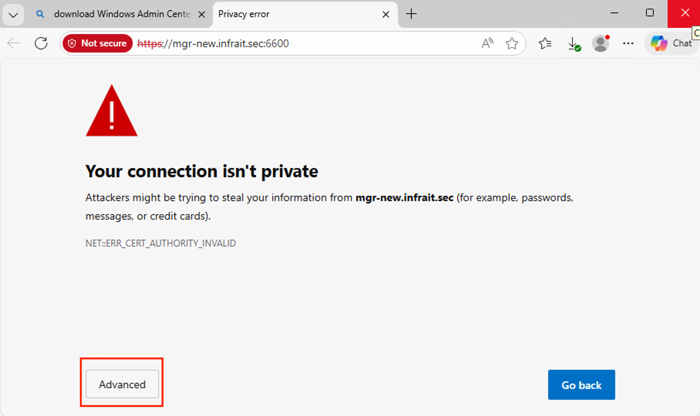
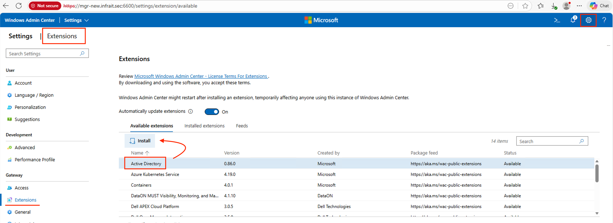
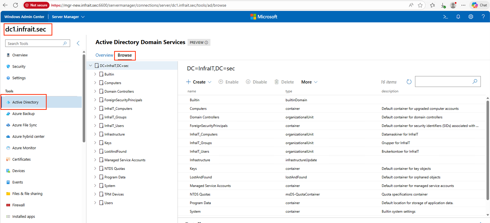
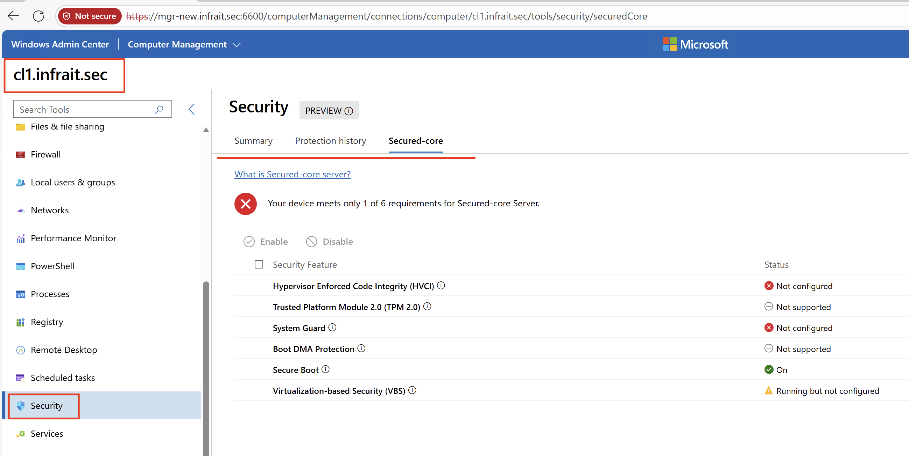

# Lab: Windows Admin Center og OSConfig - Moderne Domene-administrasjon

## Læringsmål
Etter denne laben skal du kunne:
- Installere og konfigurere Windows Admin Center (WAC) (om ikke alt installert i tidligere gjennomgang)
- Administrere domene-maskiner via web-basert GUI
- Forstå forskjellen mellom tradisjonell (GPO) og moderne (OSConfig) administrasjon
- Implementere configuration management med OSConfig
- Evaluere når du skal bruke GPO vs OSConfig vs hybrid approach

---

## Forutsetninger

**Lab-miljø:**
- **mgr.infrait.sec** - IT Admin workstation (Windows 11)
- **dc1.infrait.sec** - Domain Controller (Windows Server 2025)
- **srv1.infrait.sec** - Member Server (Windows Server 2025)
- **cl1.infrait.sec** - Client workstation (Windows 11)

**Påkrevd:**
- Innlogget som `adm_<brukernavn>` med Domain Admin rettigheter

---

## Teorigrunnlag

### Hva er Windows Admin Center?

**Windows Admin Center (WAC)** er Microsofts moderne, web-baserte administrasjonsverktøy for Windows Server og Windows 10/11.

**Erstatter:**
- ❌ Server Manager (GUI)
- ❌ MMC snap-ins (spredt over mange verktøy)
- ❌ Remote Desktop for server-administrasjon

**Fordeler:**
- ✅ **Web-basert** - Tilgang fra enhver moderne browser
- ✅ **Sentralisert** - Én konsoll for alle servere
- ✅ **Modern UI** - Rask, responsiv, intuitive
- ✅ **Sikker** - HTTPS, certificate-based authentication
- ✅ **Extensible** - Supports extensions/plugins

---

### Hva er OSConfig?

**OSConfig (OS Configuration)** er Microsofts **nye generasjon configuration management** for Windows.

**Moderne alternativ til:**
- Group Policy (GPO) - 1990-tallet teknologi
- PowerShell DSC - Kompleks, tungrodd

**OSConfig kjennetegn:**
- 📄 **Deklarativ** - Beskriv ønsket tilstand, ikke hvordan
- 🔄 **Continuous enforcement** - Automatisk drift correction
- 🌐 **Cloud-native** - Integrert med Azure Arc
- 📊 **JSON/YAML-basert** - DevOps-friendly configuration
- 🔍 **Built-in compliance** - Reporting og drift detection

---

### Group Policy vs OSConfig - Når skal du bruke hva?

| Scenario | Best Choice | Hvorfor |
|----------|-------------|---------|
| **Etablert enterprise med AD** | GPO | Mature, støttet overalt, mange policies |
| **Hybrid/Cloud environment** | OSConfig | Cloud-native, Azure Arc integration |
| **DevOps/Infrastructure as Code** | OSConfig | Version control, automated deployment |
| **Security baselines** | GPO | Microsoft baselines er GPO-basert |
| **Modern workloads (containers, etc.)** | OSConfig | Designed for modern infrastructure |
| **Legacy compatibility** | GPO | OSConfig krever nyere OS-versjoner |

**Beste praksis:** **Hybrid approach** - Bruk begge!
- GPO for domain-wide policies og security baselines
- OSConfig for granular, modern configuration management

---

## Del 1: Installer Windows Admin Center

### Steg 1.1: Last ned Windows Admin Center

På **mgr.infrait.sec**:
- https://go.microsoft.com/fwlink/?linkid=2220149&clcid=0x409&culture=en-us&country=us
- Kjør filen WindowsAdminCenter2511.exe i mappen Downloads
    - Velg følgende i Wizarden:
      - Accept these therms.....
      - Express setup
      - Generate a self-signed certificate
      - Install updates automatically
      - next, next, next....Install
```
Select installation mode
      Express setup

Login Authentication/Authorization Selection
      HTML Form Login

Network access
      Localhost access only

Port Numbers
      External Port:      6600
      Internal Port Range Start (Inclusive):      6601
      Internal Port Range End (Exclusive):      6610

Select TLS certificate
      Generate a self-signed certificate (expires in 60 days)

Fully qualified domain name
      mgr-new.InfraIT.sec

Trusted Hosts 
      Allow access to any computer

WinRM over HTTPS
      HTTP. Default communication mechanism.

Automatic updates
      Install updates automatically (recommended)

Send diagnostic data to Microsoft
      Required diagnostic data

Log File
      C:\Users\ADM_ME~1\AppData\Local\Temp\Setup Log 2026-02-09 #001.txt
```


---

### Steg 1.3: Verifiser Installasjon og Åpne WAC

**Ved første åpning:**

1. **Certificate Warning** → Klikk "Advanced" → "Continue to localhost (unsafe)"
2. **Windows Security prompt** → Autentiser med `infrait\adm_<brukernavn>`



---

## Del 2: Legg til Domene-maskiner i Windows Admin Center

### Steg 2.1: Manuell Metode - Legg til Enkeltmaskiner

**I Windows Admin Center:**

1. Klikk **"+ Add"** øverst til venstre
2. Velg **"Servers"**
3. Velg Search Active Directory
4. Huk av for DC1 og SRV1
5. Klikk **"Add"**
6. For `cl1.infrait.sec` velger en `Windows PCs` i stedet for `Servers`


**Forventet resultat:**
```
All Connections:
  ✓ dc1.infrait.sec (Windows Server 2025)
  ✓ srv1.infrait.sec (Windows Server 2025)
  ✓ cl1.infrait.sec (Windows 11)
  ✓ mgr.infrait.sec (Windows 11) - Local
```


---

### Steg 2.3: Verifiser Tilkobling til Maskiner

**I Windows Admin Center:**

1. Klikk på **dc1.infrait.sec** i connection listen
2. WAC vil koble til serveren og vise dashboard
3. Verifiser at du ser:
   - **Overview** - CPU, Memory, Disk usage
   - **Tools menu** - Events, Performance, Processes, etc.

Installer Active Directory for å få tilgang til Users And Computers i Web GUI:


Etterpå vil du kunne se AD Users and Computers i Web GUI:


---

## Del 3: Utforsk Windows Admin Center

### Steg 3.1: Kjør Basic Server Management Tasks

**Oppgave:** Utforsk hver maskin og kjør vanlige admin-oppgaver.

#### Task 1: Sjekk System Health på SRV1

1. I WAC, koble til **srv1.infrait.sec**
2. Gå til **Overview**
3. Observer:
   - CPU utilization
   - Memory usage
   - Disk space
   - Network activity

**Sammenlign med tradisjonell metode:**
```powershell
# Tradisjonell måte (PowerShell Remoting)
Invoke-Command -ComputerName srv1.infrait.sec -ScriptBlock {
    Get-CimInstance Win32_Processor | Select-Object LoadPercentage
    Get-CimInstance Win32_OperatingSystem | Select-Object @{
        Name='MemoryUsagePercent'
        Expression={[math]::Round((($_.TotalVisibleMemorySize - $_.FreePhysicalMemory) / $_.TotalVisibleMemorySize) * 100, 2)}
    }
    Get-PSDrive C | Select-Object Used, Free
}
```

**Refleksjon:** Hva er enklere? GUI eller PowerShell?

---

#### Task 3: Sjekk Event Logs

1. Gå til **Events**
2. Filtrer på:
   - **Log:** System
   - **Level:** Error, Warning
   - **Time range:** Last 24 hours

3. Klikk på et event for detaljer

**Sammenlign med:**
```powershell
# Tradisjonell måte
Get-WinEvent -ComputerName srv1.infrait.sec -FilterHashtable @{
    LogName = 'System'
    Level = 2,3  # Error, Warning
    StartTime = (Get-Date).AddDays(-1)
} -MaxEvents 50
```

---

#### Task 4: Performance Monitoring

1. Gå til **Performance Monitor**
2. Legg til counters:
   - Processor: % Processor Time
   - Memory: Available MBytes
   - Network Interface: Bytes Total/sec

3. Observer real-time performance

---

## Del 4: Introduksjon til OSConfig

### Steg 4.1: Hva er OSConfig og Hvorfor Bruke Det?

**OSConfig** (OS Configuration) er Microsofts moderne configuration engine.

```

╔══════════════════════════════════════════════════════════════╗
║                    OSCONFIG OVERVIEW                         ║
╚══════════════════════════════════════════════════════════════╝

TRADISJONELL APPROACH (Group Policy):
  ┌─────────────┐
  │ GPMC Editor │ → GPO → Registry/Files
  └─────────────┘
  
  Problemer:
    ✗ Ikke cloud-native
    ✗ Complex troubleshooting
    ✗ Ingen native version control
    ✗ Krever domain membership

MODERNE APPROACH (OSConfig):
  ┌──────────────┐
  │ JSON/YAML    │ → OSConfig Agent → Desired State
  │ Config File  │
  └──────────────┘
  
  Fordeler:
    ✓ Deklarativ configuration
    ✓ Version control (Git)
    ✓ Cloud og on-prem
    ✓ Continuous compliance enforcement
    ✓ Works with or without domain

```

---

### Steg 4.2: Åpne Web GUI for Security Baseline - OSConfig på Domene-maskiner

> OSConfig er **innebygd** i Windows Server 2025 og Windows 11 24H2+
>
> Etter `Ensuring the required module is installed` vil den fortsette med `loading`
> 
> Klikk gjerne på lenken `What is Security Baseline?`


Som vi ser, er grensesnittet noe mer moderne og lettere å tolke hva som er konfigurert og hva som eventuelt ikke er konfigurert i henhold til Secuirty Baselines. En annen fordel er at OSConfig kan brukes direkte mot servere / arbeidsstasjoner uten Active Directory og Group Policy.

> It is designed as a modern, local configuration tool for Windows Server 2025 that operates independently of AD Group Policy Objects (GPO). 

### ‼️Se video for praktisk bruk og implementasjon av sikkerhetsinnstillinger:
https://youtu.be/oGScE8pDP3g

---
**Merk:** OSConfig ikke er tilgjengelig Windows 11 OS.


**Merk:** Full OSConfig integration i WAC kan variere avhengig av versjon.

---

## Steg 6: Alternativer - Azure Arc for Cloud Management

Dette er ikke noe vi skal gjøre i denne leksjonen, men er til informasjon:

```

╔══════════════════════════════════════════════════════════════╗
║           NEXT LEVEL: AZURE ARC INTEGRATION                  ║
╚══════════════════════════════════════════════════════════════╝

OSConfig + Azure Arc = Cloud-native Configuration Management

Med Azure Arc kan du:
  ✓ Manage on-prem servers fra Azure Portal
  ✓ Deploy OSConfig via Azure Policy
  ✓ Centralized compliance dashboard
  ✓ Integration med Azure Security Center
  ✓ Hybrid cloud management

Installation (krever Azure subscription):
  
  1. Install Azure Connected Machine agent  
  2. Deploy configurations via Azure Policy
  3. Monitor compliance i Azure Portal

For lab purposes uten Azure:
  → Bruk lokal OSConfig deployment (som vi har gjort)

```

---

## Del 7: GPO vs OSConfig - Sammenligning

### Steg 7.1: Samme Configuration, To Metoder

**Oppgave:** Implementer 

#### Metode 1: Group Policy


#### Metode 2: OSConfig


**Sammenligning:**

| Aspekt | Group Policy | OSConfig |
|--------|-------------|----------|
| **Configuration method** | GUI (GPMC) | Code (JSON/YAML) |
| **Version control** | Vanskelig | Enkelt (Git) |
| **Deployment** | Link til OU | Script deployment |
| **Scope** | Domain-bound | Domain eller standalone |
| **Testing** | Complex (separate OU) | Simple (JSON file) |
| **Documentation** | Manual | Self-documenting (code) |
| **Cloud support** | Nei | Ja (Azure Arc) |

---

## Del 8: Refleksjonsspørsmål og Best Practices

### Diskuter i Grupper

**1. Windows Admin Center vs Traditional Tools**

- Når ville du brukt WAC over Remote Desktop?
- Er WAC egnet for alle administrative oppgaver?
- Hva er security implikasjonene av web-based management?

**2. OSConfig vs Group Policy**

- I hvilke scenarioer er OSConfig bedre enn GPO?
- Når bør du fortsatt bruke GPO?
- Kan de brukes sammen? (Hint: Ja!)

**3. Infrastructure as Code**

- Hva er fordelene med å lagre configurations som JSON/YAML?
- Hvordan ville du implementert versjonskontroll for OSConfig?
- Hvordan tester du en configuration før production deployment?

**4. Hybrid Approach**

Design en strategi som bruker både GPO og OSConfig:

```
GPO for:
  - Domain-wide security policies
  - User policies
  - Microsoft Security Baselines

OSConfig for:
  - Server-specific configurations
  - Application settings
  - Cloud-hybrid scenarios
  - Rapid deployment / testing
```

---

## Del 9: Praktisk Oppgave - Bygg din Egen Solution

### Oppgave: Implementer "Nightly Security Scan" via OSConfig

**Mål:** Opprett en OSConfig configuration som:

1. Aktiverer Windows Defender scheduled scan
2. Konfigurerer scanning time til 02:00
3. Enable real-time protection
4. Deploy til alle servere
5. Verifiser compliance

**Starter-kode:**

```json
{
  "name": "WindowsDefenderScheduledScan",
  "version": "1.0",
  "description": "Configure Windows Defender nightly security scan",
  "modules": [
    {
      "name": "Registry",
      "settings": {
        "registryValues": [
          {
            "keyPath": "HKLM\\SOFTWARE\\Policies\\Microsoft\\Windows Defender\\Scan",
            "valueName": "ScheduleDay",
            "valueType": "DWord",
            "valueData": 0,
            "ensure": "Present"
          },
          {
            "keyPath": "HKLM\\SOFTWARE\\Policies\\Microsoft\\Windows Defender\\Scan",
            "valueName": "ScheduleTime",
            "valueType": "DWord",
            "valueData": 120,
            "ensure": "Present"
          }
        ]
      }
    }
  ]
}
```

**Din oppgave:**
1. Fullfør configuration (legg til real-time protection settings)
2. Deploy til alle servere
3. Verifiser med PowerShell at settings er applisert
4. Lag en compliance report

---

## Oppsummering

Du har nå lært:

- ✅ Installere og konfigurere Windows Admin Center
- ✅ Administrere domene-maskiner via web GUI
- ✅ Forstå OSConfig og moderne configuration management
- ✅ Implementere configurations via JSON
- ✅ Deploy og verifisere configurations på tvers av domenet
- ✅ Sammenligne tradisjonelle (GPO) og moderne (OSConfig) approaches
- ✅ Designe hybrid management strategier

**Nøkkelinnsikt:**

> "The future of Windows management is hybrid: Group Policy for domain-wide security policies, OSConfig for granular, code-driven configuration management, and cloud integration via Azure Arc."

---

## Referanser

- [Windows Admin Center Documentation](https://learn.microsoft.com/en-us/windows-server/manage/windows-admin-center/overview)
- [OSConfig on GitHub](https://github.com/microsoft/osconfig)
- [Azure Arc Overview](https://azure.microsoft.com/en-us/services/azure-arc/)
- [Infrastructure as Code Best Practices](https://learn.microsoft.com/en-us/devops/deliver/what-is-infrastructure-as-code)
- [Modern Management for Windows](https://learn.microsoft.com/en-us/mem/configmgr/core/understand/introduction)